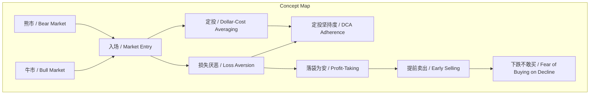
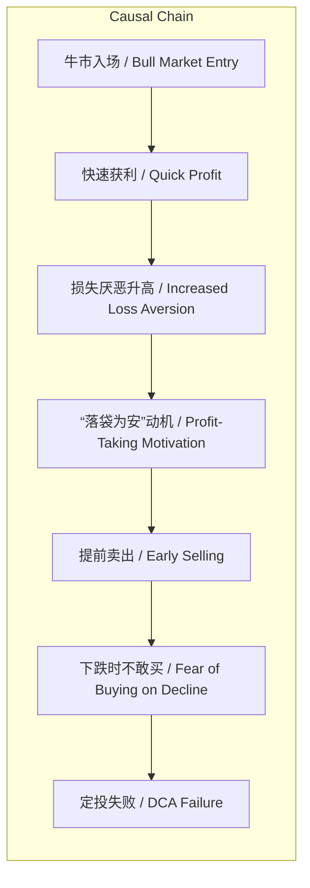

# NEWS/NEWS 任务报告

- agent: news/news
- requestId: 1773184660797-oezo7d
- 生成时间(UTC): 2026-03-10T23:18:16.626Z

## 文本总结

# 熊市入场更利于坚持定投

## 整体结构化文档表达
### 文档卡片
- 主题（中文/English）：投资心理与定投策略 / Investment Psychology and Dollar-Cost Averaging
- 一句话摘要：熊市入场者因初始浮亏而将下跌视为积累机会，故比牛市入场者更易坚持定投；后者因快速获利产生损失厌恶，易提前卖出且下跌时不敢买回。
- 目标读者：个人投资者，尤其是定期定额投资（定投）实践者
- 核心结论（3条）：
  1. 熊市入场者更易坚持定投，因其对账目损失不敏感，视下跌为获取更便宜筹码的机会。
  2. 牛市入场者因快速获利产生强烈的损失厌恶，有极大动力“落袋为安”，导致定投中断。
  3. “先卖再买”的策略是幻觉，下跌时投资者通常不敢买入，导致无法回补仓位。

### 内容结构树
1. 背景与问题定义：探讨不同市场入场时机对定投坚持度的影响，指出牛市入场者面临特殊心理陷阱。
2. 核心观点与关键证据：核心观点为入场时机通过损失厌恶影响定投行为；证据包括熊市/牛市入场者的心理对比、损失厌恶的表现及“卖了再买”的不可行性。
3. 方法/机制/路径：定投策略本身通过定期投入平滑成本，但行为偏差（损失厌恶）会干扰执行；机制为心理认知对投资决策的驱动。
4. 风险与边界条件：风险在于牛市追高后因损失厌恶提前退出，且下跌时无法按计划买入；边界条件为结论基于文本讨论，未考虑其他市场因素或投资者类型。
5. 结论与行动建议：结论为熊市入场更利于定投坚持；建议投资者避免牛市追高，坚持纪律，克服“落袋为安”冲动。

### 结构化元数据（JSON）
```json
{
  "title": "熊市入场更利于坚持定投",
  "topic_zh": "投资心理与定投策略",
  "topic_en": "Investment Psychology and Dollar-Cost Averaging",
  "audience": "个人投资者，尤其是定期定额投资（定投）实践者",
  "claims": [
    "熊市入场者更易坚持定投，因其视下跌为获取便宜筹码的机会",
    "牛市入场者因快速获利产生损失厌恶，易提前卖出",
    "“先卖再买”是幻觉，下跌时不敢买入"
  ],
  "evidence": [
    "在熊市入场的人比在牛市入场的人更容易坚持定投",
    "由于恐高所以没有定投结果涨得更高",
    "由于在上涨阶段当前的收益不如当初all in赚得多",
    "由于一进场就赚钱更害怕失去这部分收益",
    "上升阶段的入场的人最容易面对“陷阱”损失厌恶",
    "采取定投策略的人不怕账目损失因为损失意味着更便宜的筹码",
    "牛市入场的人由于获利太快产生的损失厌恶有极大的动力想要“落袋为安”",
    "很多人认为可以先卖了再买回来100%是一种幻觉",
    "当下跌时你不敢再买"
  ],
  "risks": [
    "牛市入场者因损失厌恶提前卖出，中断定投",
    "下跌时因恐惧不敢买入，无法实现定投摊薄成本的目的",
    "“卖了再买”的幻觉导致操作失误，错失低位积累机会"
  ],
  "actions": [
    "避免在牛市追高入场，选择熊市或市场低迷期开始定投",
    "坚持定投纪律，将下跌视为正常过程与机会",
    "克服“落袋为安”心理，避免因短期波动中断长期计划"
  ]
}
```

## 处理流程
1. 输入识别：文本讨论投资入场时机（熊市/牛市）对定投坚持行为的影响，核心概念为损失厌恶。
2. 信息抽取：实体包括熊市、牛市、定投、损失厌恶；关键事实为熊市入场者更坚持；观点为“卖了再买”是幻觉。
3. 结构化归纳：定义损失厌恶，分类入场类型，比较心理差异，建立因果链（快速获利→损失厌恶→提前卖出）。
4. 关系建模：入场时机与损失厌恶程度负相关；损失厌恶与定投坚持度负相关；快速获利与“落袋为安”动机正相关。
5. 可视化表达：使用Mermaid绘制概念结构与因果链图。

## 概念清单（中英文）
- 熊市 / Bear Market
- 牛市 / Bull Market
- 入场 / Market Entry
- 定投 / Dollar-Cost Averaging (DCA)
- 恐高 / Fear of High Prices
- 收益 / Profit/Return
- all in / 全仓投入
- 损失厌恶 / Loss Aversion
- 账目损失 / Paper Loss
- 筹码 / Chips (投资份额)
- 落袋为安 / Profit-Taking
- 幻觉 / Illusion
- 下跌 / Market Decline

## 概念定义（中英文）
- 熊市 / Bear Market：证券市场价格持续下跌的市场状态，投资者普遍悲观。
- 牛市 / Bull Market：证券市场价格持续上涨的市场状态，投资者普遍乐观。
- 入场 / Market Entry：投资者首次或开始购买资产的行为时机。
- 定投 / Dollar-Cost Averaging (DCA)：定期投入固定金额购买资产，无论价格高低，以平滑成本、分散风险的投资策略。
- 恐高 / Fear of High Prices：在价格上涨时因担心追高而不敢买入的心理。
- 收益 / Profit/Return：投资产生的利润或回报。
- all in / 全仓投入：将全部资金一次性投入某一资产的激进策略。
- 损失厌恶 / Loss Aversion：行为经济学概念，指人们对损失的敏感度远高于对同等金额收益的敏感度，导致风险规避行为。
- 账目损失 / Paper Loss：未实现的浮动亏损，资产市值低于买入成本但未卖出。
- 筹码 / Chips：投资中的份额或单位，比喻可积累的资产数量。
- 落袋为安 / Profit-Taking：为锁定已实现利润而卖出资产的行为。
- 幻觉 / Illusion：对现实情况的错误认知或过度乐观估计。
- 下跌 / Market Decline：证券市场价格从近期高点回落的过程。

## 概念关联与逻辑关系（中英文）
1. 入场时机（熊市 / Bear Market）与损失厌恶程度（Loss Aversion Level）呈负相关：熊市入场者初始浮亏，损失厌恶较低；牛市入场者快速获利，损失厌恶较高。
   - 形式化：Loss Aversion ∝ 1 / (初始浮亏程度)
2. 损失厌恶程度（Loss Aversion Level）与定投坚持度（DCA Adherence）呈负相关：损失厌恶越高，越易提前卖出，定投坚持度越低。
   - 形式化：DCA Adherence ∝ 1 / Loss Aversion
3. 快速获利（Quick Profit）与“落袋为安”动机（Profit-Taking Motivation）呈正相关：牛市入场者因短期收益高，锁定利润的动机更强。
   - 形式化：Profit-Taking Motivation ∝ Quick Profit

## COT逻辑梳理（定义/分类/比较/因果/科学方法论）
- Step 1 (定义)：明确核心概念。入场时机分为熊市（价格下跌）与牛市（价格上涨）；定投为定期定额投资；损失厌恶为对损失的过度敏感心理。
- Step 2 (分类)：根据入场时机将投资者分为熊市入场者与牛市入场者，并分类其典型心理：熊市入场者视下跌为机会（低损失厌恶），牛市入场者恐惧失去利润（高损失厌恶）。
- Step 3 (比较)：比较两类投资者对定投的态度。熊市入场者因初始浮亏，对账目损失不敏感，更易坚持；牛市入场者因快速获利，损失厌恶高，易中断定投以“落袋为安”。
- Step 4 (因果)：建立因果链。牛市入场 → 快速获利 → 损失厌恶升高 → “落袋为安”动机增强 → 提前卖出 → 下跌时因恐惧不敢买回（“卖了再买”幻觉）→ 定投失败。
- Step 5 (科学方法论)：基于行为金融学，通过控制入场时机（选择熊市）或进行心理干预（认知重构，将下跌视为机会）来降低损失厌恶，从而提高定投坚持度；需实证检验不同市场环境下的投资者行为数据。

## 事实与看法（病毒）
### 事实
- 在熊市入场的人比在牛市入场的人更容易坚持定投。
- 由于恐高，牛市入场者可能没有定投，结果涨得更高。
- 由于在上涨阶段，牛市入场者的当前收益不如当初all in赚得多。
- 由于一进场就赚钱，牛市入场者更害怕失去这部分收益。
- 上升阶段入场的人最容易面对“陷阱”损失厌恶。
- 采取定投策略的人不怕账目损失，因为损失意味着更便宜的筹码。
- 牛市入场的人由于获利太快产生的损失厌恶，有极大的动力想要“落袋为安”。
- 很多人认为可以先卖了再买回来，100%是一种幻觉。
- 当下跌时，投资者不敢再买。

### 看法
- 损失厌恶是牛市入场者放弃定投的“陷阱”。
- “先卖再买”的策略是一种幻觉（基于经验判断，非绝对事实）。
- 下跌时不敢买入是普遍心理（主观概括）。

## FAQ（原文问题整理）
- 未发现明确提问（原文为陈述句，未直接提出问题）。

## Visualization
### Mermaid 图 1（概念结构图）


### Mermaid 图 2（逻辑/因果图）


## 文章中的类比
- 未发现明确类比。

## 10个金句
1. 在熊市入场的人比在牛市入场的人更容易坚持定投。
2. 由于恐高，所以没有定投，结果涨得更高。
3. 由于在上涨阶段，当前的收益不如当初all in赚得多。
4. 由于一进场就赚钱，更害怕失去这部分收益。
5. 上升阶段的入场的人最容易放弃，其中之一就是要面对一个“陷阱”损失厌恶。
6. 采取定投策略的人不怕账目损失，因为损失意味着更便宜的筹码。
7. 牛市入场的人，由于获利太快产生的损失厌恶，有极大的动力想要“落袋为安”。
8. 很多人认为可以先卖了再买回来，100%是一种幻觉。
9. 当下跌时，你不敢再买。
10. 原文未提供。
