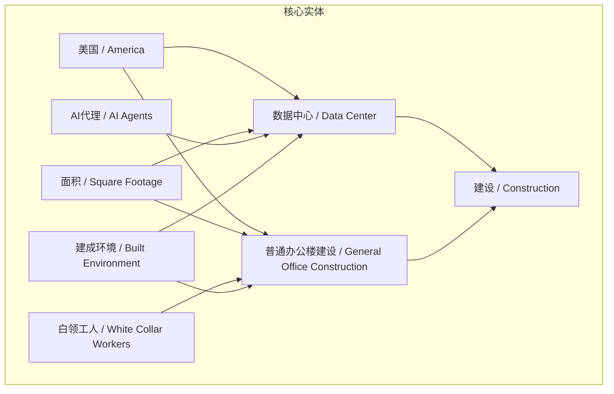
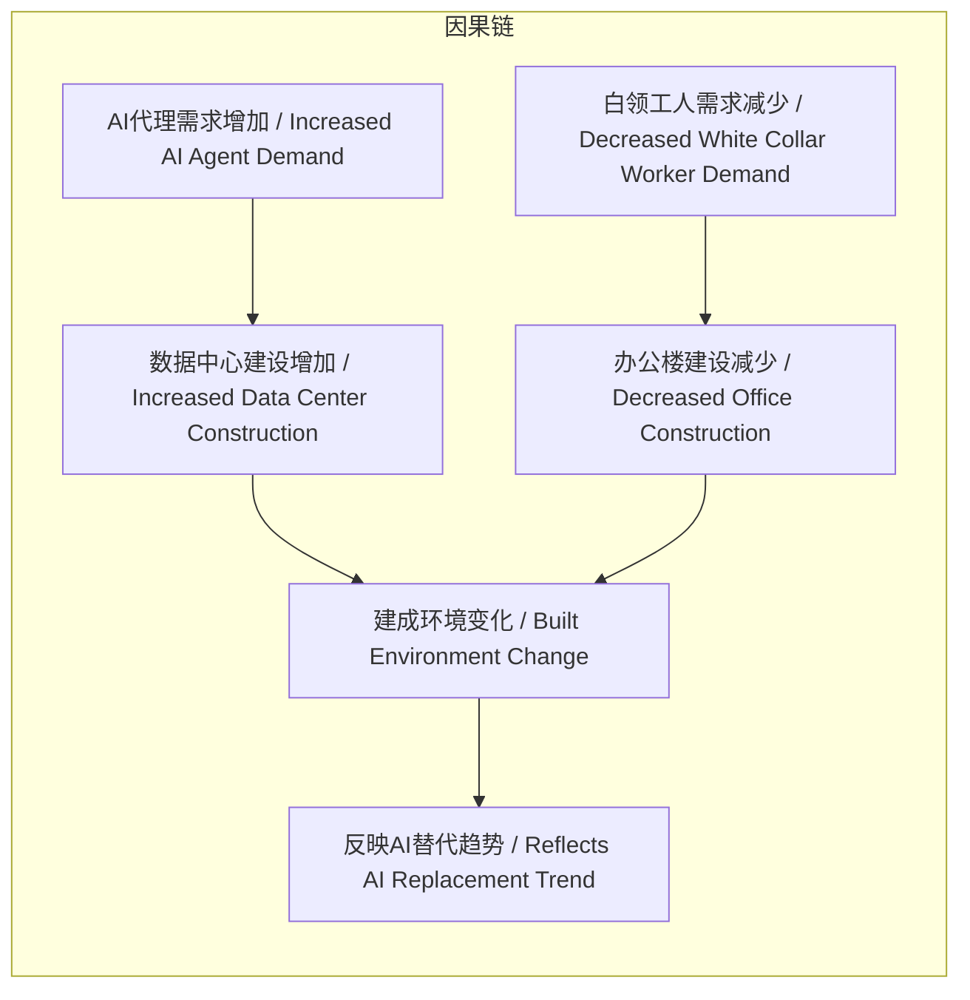

# NEWS/NEWS 任务报告

- agent: news/news
- requestId: 1773416742866-x6pj6k
- 生成时间(UTC): 2026-03-13T15:46:23.487Z

## 文本总结

# 数据中心建设首超办公楼，预示AI取代白领

## 整体结构化文档表达
### 文档卡片
- **主题（中文/English）**：数据中心建设与AI发展 / Data Center Construction and AI Development
- **一句话摘要**：美国数据中心建设面积首次超过办公楼建设，物理环境变化揭示AI代理正大规模取代白领工人。
- **目标读者**：政策制定者、投资者、科技行业分析师
- **核心结论（3条）**：
  1. 数据中心建设与办公楼建设的规模对比发生历史性逆转。
  2. 建成环境作为物理指标，直接反映经济结构中AI对白领工作的替代趋势。
  3. AI的部署已从概念阶段进入大规模实体基础设施建设阶段。

### 内容结构树
1. **背景与问题定义**：对比数据中心建设与办公楼建设的历史趋势，提出AI替代白领的宏观影响。
2. **核心观点与关键证据**：美国数据中心建设面积超过办公楼建设；为AI代理建造的面积超过为白领工人建造的面积。
3. **方法/机制/路径**：未提及
4. **风险与边界条件**：未提及
5. **结论与行动建议**：物理环境变化预示发展方向，但未提供具体行动建议。

### 结构化元数据（JSON）
```json
{
  "title": "数据中心建设首超办公楼，预示AI取代白领",
  "topic_zh": "数据中心建设与AI发展",
  "topic_en": "Data Center Construction and AI Development",
  "audience": "政策制定者、投资者、科技行业分析师",
  "claims": ["数据中心建设速度首次超过普通办公楼建设", "美国为AI代理建造的面积超过为白领工人建造的面积", "建成环境变化揭示AI替代白领的发展方向"],
  "evidence": ["America is now building more square footage for AI agents than for the white collar workers they're replacing", "Data center construction is on pace to surpass general office construction for the first time in history"],
  "risks": [],
  "actions": []
}
```

## 处理流程
1. 输入识别（来源：用户输入文本）
2. 信息抽取（实体、概念、问题、事实、观点）
3. 结构化归纳（定义/分类/比较/因果/方法论）
4. 关系建模（概念关系、等式/方程/逻辑链）
5. 可视化表达（Mermaid）

## 概念清单（中英文）
- 数据中心 / Data Center
- 建设 / Construction
- 普通办公楼建设 / General Office Construction
- 美国 / America
- 面积 / Square Footage
- AI代理 / AI Agents
- 白领工人 / White Collar Workers
- 建成环境 / Built Environment

## 概念定义（中英文）
- **数据中心**：集中部署计算、存储和网络设备的设施，用于处理大规模数据。/ A facility housing concentrated computing, storage, and networking equipment for large-scale data processing.
- **建设**：建筑活动的过程，包括设计和建造新结构。/ The process of building, including design and construction of new structures.
- **普通办公楼建设**：专门为办公室工作环境设计和建造的建筑活动。/ Construction activities specifically designed and built for office work environments.
- **美国**：北美洲国家，本文中特指其建筑市场。/ A North American country, specifically referring to its construction market in this context.
- **面积**：测量二维空间的大小，本文中指建筑面积。/ Measurement of two-dimensional space, referring to building floor area in this text.
- **AI代理**：能够自主感知、决策和执行任务的智能系统，代表AI应用。/ Intelligent systems capable of autonomous perception, decision-making, and task execution, representing AI applications.
- **白领工人**：从事非体力劳动的专业人员，如办公室职员。/ Professionals engaged in non-manual labor, such as office workers.
- **建成环境**：人类建造的物理环境，包括建筑、基础设施等。/ The physical environment constructed by humans, including buildings and infrastructure.

## 概念关联与逻辑关系（中英文）
1. **数据中心建设面积增加**与**办公楼建设面积减少**呈负相关关系。形式化：Δ(数据中心建设面积) > 0 且 Δ(办公楼建设面积) < 0。/ **Increased Data Center Construction Area** and **Decreased Office Construction Area** are negatively correlated. Formalization: Δ(Data Center Construction Area) > 0 and Δ(Office Construction Area) < 0.
2. **AI代理部署需求**与**白领工人需求**呈负相关关系。形式化：需求(AI代理) ↑ → 需求(白领工人) ↓。/ **AI Agent Deployment Demand** and **White Collar Worker Demand** are negatively correlated. Formalization: Demand(AI Agents) ↑ → Demand(White Collar Workers) ↓.
3. **物理环境变化**（数据中心建设增加）反映**经济结构转型**（AI替代白领）。形式化：建成环境变化 = f(AI替代程度)。/ **Built Environment Change** (increased data center construction) reflects **Economic Structural Transformation** (AI replacing white-collar jobs). Formalization: Built Environment Change = f(Degree of AI Replacement).

## COT逻辑梳理（定义/分类/比较/因果/科学方法论）
- **Step 1: 定义关键概念**。明确数据中心、建设、AI代理、白领工人、建成环境的含义，为分析奠定基础。
- **Step 2: 分类与比较**。比较数据中心建设与办公楼建设，识别出历史性逆转；比较AI代理与白领工人，识别出替代关系。
- **Step 3: 因果分析**。建立因果链：AI技术进步 → AI代理需求增加 → 数据中心建设需求增加 → 数据中心建设面积超过办公楼建设；同时，AI代理替代白领工作 → 白领工人需求减少 → 办公楼建设需求相对减少。
- **Step 4: 科学方法论**。通过物理环境指标（建设面积）作为代理变量，推断经济结构变化（AI替代趋势），体现实证观察与推断。

## 事实与看法（病毒）
### 事实
- 数据中心建设速度正史上首次超过普通办公楼建设。
- 美国现在为AI代理建造的面积超过了为它们所取代的白领工人建造的面积。
### 看法
- 建成环境告诉你一切需要知道的关于这件事走向的信息。
- 这暗示了AI替代白领的发展方向。

## FAQ（原文问题整理）
- 未发现明确提问。

## Visualization
### Mermaid 图 1（概念结构图）


### Mermaid 图 2（逻辑/因果图）


## 文章中的类比
- 未发现明确类比。

## 10个金句
1. 数据中心建设速度正史上首次超过普通办公楼建设。
2. 美国现在为AI代理建造的面积超过了为它们所取代的白领工人建造的面积。
3. 建成环境告诉你一切需要知道的关于这件事走向的信息。
4. 原文未提供
5. 原文未提供
6. 原文未提供
7. 原文未提供
8. 原文未提供
9. 原文未提供
10. 原文未提供
