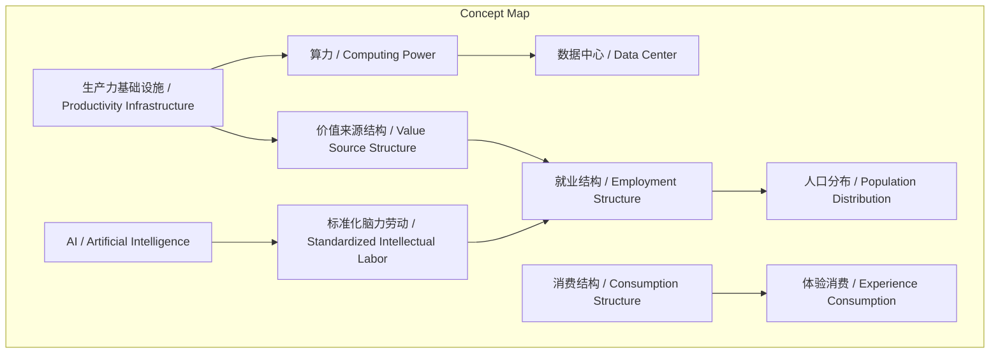
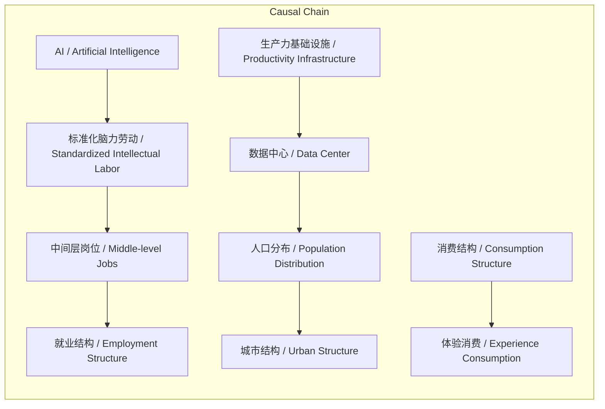

# NEWS/NEWS 任务报告

- agent: news/news
- requestId: 1773418076847-sfi591
- 生成时间(UTC): 2026-03-13T16:09:27.157Z

## 文本总结

# AI正重塑经济基础设施

## 整体结构化文档表达
### 文档卡片
- **主题（中文/English）**：经济结构转型 / Economic Structure Transformation  
- **一句话摘要**：本文论述AI时代算力成为新基础设施，引发生产力、价值来源、就业、人口及消费结构的连锁变革。  
- **目标读者**：政策制定者、城市规划者、企业战略部门  
- **核心结论（3条）**：  
  1. 生产力基础设施正从写字楼向数据中心迁移。  
  2. 就业结构将向高创造力岗位和线下服务岗位两极分化，中间层标准化脑力劳动减少。  
  3. 未来城市竞争关键资产转向算力、数据和人才密度，而非办公楼。  

### 内容结构树
1. **背景与问题定义**：传统经济依赖工厂、办公室和人力，CBD因金融、咨询、管理、商业决策成为价值中心，办公楼是最贵资产。  
2. **核心观点与关键证据**：AI和算力成为新生产力来源，数据中心取代办公楼成为生产中心；价值创造从人类脑力劳动转向机器计算能力。  
3. **方法/机制/路径**：AI替代标准化脑力劳动（如写报告、编程），机器负责计算、生成、自动化执行，人类转向创意、判断、创业、复杂决策。  
4. **风险与边界条件**：未提及  
5. **结论与行动建议**：城市资产需转向算力、电力、数据和人才密度，以重新定义未来竞争格局。  

### 结构化元数据（JSON）
```json
{
  "title": "AI正重塑经济基础设施",
  "topic_zh": "经济结构转型",
  "topic_en": "Economic Structure Transformation",
  "audience": "政策制定者、城市规划者、企业战略部门",
  "claims": [
    "生产力基础设施正从写字楼向数据中心迁移",
    "就业结构将向高创造力岗位和线下服务岗位两极分化",
    "未来城市竞争关键资产转向算力、数据和人才密度"
  ],
  "evidence": [
    "过去生产力来自工厂、办公室、人，CBD因金融咨询等成为中心",
    "新生产力来源：GPU、AI、算力、数据，价值创造来自机器计算能力",
    "AI替代标准化脑力劳动，如写报告、编程等",
    "未来岗位分两类：高创造力（AI研发、创业等）和线下服务（医疗、教育等）",
    "人口可能分散化，中小城市吸引力上升，城市中心转向创新生活文化",
    "消费从物质转向体验，如健康、娱乐、社交"
  ],
  "risks": [],
  "actions": [
    "城市应投资算力、数据和人才密度建设",
    "重新评估办公楼资产价值，转向支持创新和生活的设施"
  ]
}
```

## 处理流程
未提及

## 概念清单（中英文）
- 生产力基础设施 / Productivity Infrastructure
- 工厂 / Factory
- 办公室 / Office
- 人 / Human
- CBD / CBD (中央商务区)
- 写字楼 / Office Building
- 金融 / Finance
- 咨询 / Consulting
- 管理 / Management
- 商业决策 / Business Decision
- GPU / GPU (图形处理器)
- AI / AI (人工智能)
- 算力 / Computing Power
- 数据 / Data
- 机器计算能力 / Machine Computing Capability
- 人类脑力劳动 / Human Intellectual Labor
- 写报告 / Report Writing
- 做PPT / Presentation Making
- 编程 / Programming
- 内容生产 / Content Production
- 决策支持 / Decision Support
- 标准化脑力劳动 / Standardized Intellectual Labor
- 机器计算 / Machine Computation
- 人类创造 / Human Creativity
- 创意 / Creativity
- 判断 / Judgment
- 创业 / Entrepreneurship
- 复杂决策 / Complex Decision
- 中间层岗位 / Middle-level Jobs
- 行政 / Administration
- 数据处理 / Data Processing
- 高创造力岗位 / High-creativity Jobs
- AI研发 / AI Research and Development
- 设计 / Design
- 科研 / Scientific Research
- 产品创新 / Product Innovation
- 线下服务岗位 / Offline Service Jobs
- 医疗 / Healthcare
- 教育 / Education
- 养老 / Elderly Care
- 体验服务 / Experience Service
- 人口分布 / Population Distribution
- 城市结构 / Urban Structure
- 办公中心 / Office Center
- 创新 / Innovation
- 生活 / Living
- 文化中心 / Cultural Center
- 消费结构 / Consumption Structure
- 物质消费 / Material Consumption
- 体验消费 / Experience Consumption
- 电力 / Electricity
- 人才密度 / Talent Density
- 城市竞争格局 / Urban Competition Landscape

## 概念定义（中英文）
- **生产力基础设施 / Productivity Infrastructure**：指支撑经济价值创造的基础性设施，工业时代为工厂，信息时代为写字楼，AI时代为算力。  
- **工厂 / Factory**：工业时代生产力来源之一，指工业生产场所。  
- **办公室 / Office**：信息时代生产力来源之一，指脑力劳动工作场所。  
- **人 / Human**：传统生产力来源之一，指人类劳动力。  
- **CBD / CBD**：中央商务区，因金融、咨询、管理、商业决策等产业集中而成为城市价值中心。  
- **写字楼 / Office Building**：信息时代生产中心，集中金融、咨询、管理、商业决策等活动，是城市最贵资产。  
- **金融 / Finance**：过去价值创造的主要领域之一，集中在CBD写字楼。  
- **咨询 / Consulting**：过去价值创造的主要领域之一，集中在CBD写字楼。  
- **管理 / Management**：过去价值创造的主要领域之一，集中在CBD写字楼。  
- **商业决策 / Business Decision**：过去价值创造的主要领域之一，集中在CBD写字楼。  
- **GPU / GPU**：图形处理器，属于算力组成部分，是新生产力来源之一。  
- **AI / AI**：人工智能，是新生产力来源之一，能替代标准化脑力劳动。  
- **算力 / Computing Power**：新生产力来源之一，指机器计算能力，是AI时代基础设施核心。  
- **数据 / Data**：新生产力来源之一，是AI训练和运行的基础资源。  
- **机器计算能力 / Machine Computing Capability**：新价值创造的主要来源，来自GPU、AI、算力、数据。  
- **人类脑力劳动 / Human Intellectual Labor**：过去价值创造的主要形式，包括写报告、做PPT、编程等。  
- **写报告 / Report Writing**：人类脑力劳动的一种，过去集中在办公室。  
- **做PPT / Presentation Making**：人类脑力劳动的一种，过去集中在办公室。  
- **编程 / Programming**：人类脑力劳动的一种，过去集中在办公室。  
- **内容生产 / Content Production**：人类脑力劳动的一种，过去集中在办公室。  
- **决策支持 / Decision Support**：人类脑力劳动的一种，过去集中在办公室。  
- **标准化脑力劳动 / Standardized Intellectual Labor**：可被AI替代的重复性脑力工作，如写报告、编程等。  
- **机器计算 / Machine Computation**：AI时代机器负责的活动，包括计算、生成、自动化执行。  
- **人类创造 / Human Creativity**：AI时代人类更负责的活动，包括创意、判断、创业、复杂决策。  
- **创意 / Creativity**：人类在AI时代更侧重的能力。  
- **判断 / Judgment**：人类在AI时代更侧重的能力。  
- **创业 / Entrepreneurship**：人类在AI时代更侧重的能力，属于高创造力岗位。  
- **复杂决策 / Complex Decision**：人类在AI时代更侧重的能力。  
- **中间层岗位 / Middle-level Jobs**：过去集中在写字楼的岗位，如行政、咨询、数据处理、内容生产，易被AI替代。  
- **行政 / Administration**：中间层岗位的一种，易被AI替代。  
- **数据处理 / Data Processing**：中间层岗位的一种，易被AI替代。  
- **高创造力岗位 / High-creativity Jobs**：未来岗位类型之一，包括AI研发、创业、设计、科研、产品创新。  
- **AI研发 / AI Research and Development**：高创造力岗位的一种。  
- **设计 / Design**：高创造力岗位的一种。  
- **科研 / Scientific Research**：高创造力岗位的一种。  
- **产品创新 / Product Innovation**：高创造力岗位的一种。  
- **线下服务岗位 / Offline Service Jobs**：未来岗位类型之一，包括医疗、教育、养老、体验服务。  
- **医疗 / Healthcare**：线下服务岗位的一种，机器难以替代。  
- **教育 / Education**：线下服务岗位的一种，机器难以替代。  
- **养老 / Elderly Care**：线下服务岗位的一种，机器难以替代。  
- **体验服务 / Experience Service**：线下服务岗位的一种，机器难以替代。  
- **人口分布 / Population Distribution**：受生产中心迁移影响，可能从集中转向分散。  
- **城市结构 / Urban Structure**：过去是CBD→写字楼→白领集中，未来可能转向创新、生活、文化中心。  
- **办公中心 / Office Center**：过去城市中心功能，以写字楼为主。  
- **创新 / Innovation**：未来城市中心功能之一。  
- **生活 / Living**：未来城市中心功能之一。  
- **文化中心 / Cultural Center**：未来城市中心功能之一。  
- **消费结构 / Consumption Structure**：可能从物质消费转向体验消费。  
- **物质消费 / Material Consumption**：过去消费主要形式，AI提高效率后可能降价。  
- **体验消费 / Experience Consumption**：未来消费主要形式，集中在机器无法替代的领域。  
- **电力 / Electricity**：未来城市重要资产，支撑算力运行。  
- **人才密度 / Talent Density**：未来城市重要资产，指高端人才集中度。  
- **城市竞争格局 / Urban Competition Landscape**：可能因基础设施变化而重新定义。  

## 概念关联与逻辑关系（中英文）
1. **AI / Artificial Intelligence** 替代 **标准化脑力劳动 / Standardized Intellectual Labor** → 导致 **中间层岗位减少 / Reduction of Middle-level Jobs**  
2. **生产力基础设施迁移 / Productivity Infrastructure Migration**（从办公楼到数据中心）→ 引发 **人口分布分散化 / Population Decentralization**  
3. **价值来源结构改变 / Value Source Structure Change**（从人类脑力到机器计算）→ 导致 **就业结构两极化 / Employment Polarization**  

## COT逻辑梳理（定义/分类/比较/因果/科学方法论）
- **Step 1: 定义**：生产力基础设施是经济生产的基础载体，历史形态包括工厂（工业时代）、写字楼（信息时代），当前正转向算力（AI时代）。  
- **Step 2: 分类**：生产力来源分为过去（工厂、办公室、人）和现在（GPU、AI、算力、数据）；就业岗位分为中间层（行政、咨询等）和高创造力/线下服务两类。  
- **Step 3: 比较**：比较过去与现在的价值创造方式——过去依赖人类脑力劳动在办公室进行，现在机器计算能力成为主要来源，人类转向创意判断。  
- **Step 4: 因果**：AI发展→替代标准化脑力劳动→中间层岗位压缩→就业两极化；同时，生产中心迁移（办公楼→数据中心）→人口不再集中→城市功能转变（办公中心→创新生活文化中心）；效率提升→物质商品降价→消费转向体验。  
- **Step 5: 科学方法论**：采用系统动力学分析，将基础设施变化作为外生变量，观察其对就业、人口、消费等子系统的级联影响，并考虑AI发展速度、政策干预等边界条件。  

## 事实与看法（病毒）
### 事实
- 过去生产力来自工厂、办公室、人。  
- 城市最贵的地方是办公楼。  
- 新的生产力来源包括GPU、AI、算力、数据。  
- 价值创造越来越来自机器计算能力。  
- 生产中心从办公楼转向数据中心。  
- 过去价值创造主要是人类脑力劳动，如写报告、做PPT、编程、内容生产、决策支持。  
- AI可以替代一部分标准化脑力劳动。  
- 未来岗位可能分为高创造力岗位（AI研发、创业、设计、科研、产品创新）和线下服务岗位（医疗、教育、养老、体验服务）。  
- 中间层的标准化脑力劳动会减少。  
- 过去城市结构是CBD→写字楼→白领集中。  
- 未来工作可能不依赖固定办公地点，人口可能出现分散化。  
- 如果AI提高生产效率，很多商品可能变得更便宜。  
- 消费会越来越集中在机器无法替代的领域，如体验、健康、娱乐、社交、教育、文化。  
- 工业时代基础设施是工厂，信息时代是写字楼，AI时代是算力。  
- 未来最重要的城市资产可能是电力、算力、数据和人才密度。  

### 看法
- 这张图真正有价值的地方不是数据本身，而是它揭示的底层结构变化。  
- 它反映的是一件更底层的事情：生产力基础设施正在发生迁移。  
- 价值来源开始变化：机器计算，人类创造。  
- 未来就业结构很可能出现明显变化：中间层岗位被压缩。  
- 人口可能出现分散化，中小城市吸引力上升，生活质量成为重要因素。  
- 城市中心的功能也会变化：从办公中心变成创新、生活、文化中心。  
- 消费会从物质消费转向体验消费。  
- 这可能会重新定义未来几十年的城市竞争格局。  

## FAQ（原文问题整理）
未发现明确提问

## Visualization
### Mermaid 图 1（概念结构图）


### Mermaid 图 2（逻辑/因果图）


## 文章中的类比
未发现明确类比

## 10个金句
1. 这张图真正有价值的地方不是数据本身，而是它揭示的底层结构变化。  
2. 它反映的是一件更底层的事情：生产力基础设施正在发生迁移。  
3. 过去：生产力来自三个地方：工厂、办公室、人。  
4. 城市最贵的地方是：办公楼。  
5. 新的生产力来源正在出现：GPU、AI、算力、数据。  
6. 价值创造越来越来自：机器计算能力。  
7. 生产中心开始从：办公楼 → 数据中心。  
8. 未来岗位可能会分成两类：高创造力岗位和线下服务岗位。  
9. 未来最重要的城市资产可能不再是：办公楼，而是：电力、算力、数据和人才密度。  
10. 这可能会重新定义未来几十年的城市竞争格局。
