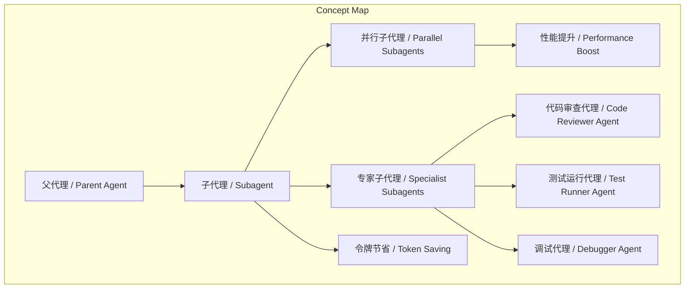
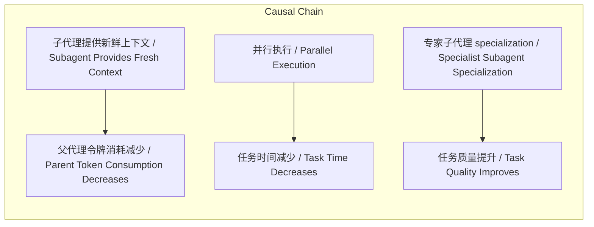

# NEWS/NEWS 任务报告

- agent: news/news
- requestId: 1773791496353-zx030r
- 生成时间(UTC): 2026-03-17T23:52:48.334Z

## 文本总结

# 编码代理中子代理的应用与优势

## 整体结构化文档表达
### 文档卡片
- 主题（中文/English）：子代理机制 / Subagent Mechanism
- 一句话摘要：本文通过Django博客章节差异视图的实现案例，阐述子代理如何通过并行执行和专家 specialization 提升编码代理的效率和能力。
- 目标读者：软件开发人员、AI编码工具用户、技术管理者
- 核心结论（3条）：
  1. 子代理能提供新鲜上下文，节省父代理令牌并提升性能。
  2. 专家子代理可定制为代码审查、测试运行、调试等角色，增强专项能力。
  3. 子代理适用于多文件非依赖任务，但过度拆分可能削弱根上下文价值。

### 内容结构树
1. 背景与问题定义：编码代理处理复杂任务时面临令牌限制和效率挑战。
2. 核心观点与关键证据：子代理提供新鲜上下文、节省令牌、并行加速；专家子代理 specialization。
3. 方法/机制/路径：使用difflib.unified_diff()生成差异；子代理通过自定义系统提示或工具实现专家角色。
4. 风险与边界条件：过度拆分子代理可能失去根上下文价值；子代理适用于非依赖文件任务。
5. 结论与行动建议：在适当场景使用子代理，如多文件编辑，并定制专家子代理。

### 结构化元数据（JSON）
```json
{
  "title": "编码代理中子代理的应用与优势",
  "topic_zh": "子代理机制",
  "topic_en": "Subagent Mechanism",
  "audience": "软件开发人员、AI编码工具用户、技术管理者",
  "claims": [
    "子代理能提供新鲜上下文，节省父代理令牌并提升性能",
    "专家子代理可定制为代码审查、测试运行、调试等角色",
    "子代理适用于多文件非依赖任务，但过度拆分可能削弱根上下文价值"
  ],
  "evidence": [
    "chapter_changes()视图使用difflib.unified_diff()生成差异",
    "子代理允许父代理暂停，使用新鲜上下文工作",
    "并行子代理可使用更便宜模型如Claude Haiku加速任务",
    "专家子代理通过自定义系统提示或工具实现 specialization"
  ],
  "risks": [
    "过度拆分子代理可能失去根上下文价值",
    "子代理不适用于文件间有依赖的任务"
  ],
  "actions": [
    "对于多文件非依赖编辑任务，使用子代理并行处理",
    "根据任务需求定制专家子代理，如代码审查或测试运行"
  ]
}
```

## 处理流程
未提及

## 概念清单（中英文）
- 子代理 / Subagent
- 父代理 / Parent Agent
- 编码代理 / Coding Agent
- 章节差异视图 / Chapter Diff View
- difflib.unified_diff() / difflib.unified_diff()
- 并行子代理 / Parallel Subagents
- 专家子代理 / Specialist Subagents
- 代码审查代理 / Code Reviewer Agent
- 测试运行代理 / Test Runner Agent
- 调试代理 / Debugger Agent
- 令牌限制 / Token Limit
- 根上下文 / Root Context
- 多文件编辑 / Multi-file Editing
- 非依赖任务 / Independent Tasks

## 概念定义（中英文）
- 子代理 / Subagent：在编码代理中，子代理是父代理派生的辅助代理，可独立运行任务，提供新鲜上下文，节省父代理令牌。
- 父代理 / Parent Agent：主编码代理，可暂停并委托子代理执行任务。
- 编码代理 / Coding Agent：能够执行编码任务的AI代理。
- 章节差异视图 / Chapter Diff View：在Django博客中显示章节内容差异的视图功能。
- difflib.unified_diff()：Python标准库difflib中的函数，用于生成统一格式的差异。
- 并行子代理 / Parallel Subagents：父代理同时运行多个子代理以加速任务。
- 专家子代理 / Specialist Subagents：通过自定义系统提示或工具， specialization 于特定角色如代码审查、测试运行、调试的子代理。
- 代码审查代理 / Code Reviewer Agent：专家子代理的一种，用于审查代码、识别bug、功能缺口或设计弱点。
- 测试运行代理 / Test Runner Agent：专家子代理的一种，用于运行测试套件，隐藏详细输出，仅报告失败。
- 调试代理 / Debugger Agent：专家子代理的一种，用于调试问题，推理代码库并运行代码片段以隔离复现步骤和确定根本原因。
- 令牌限制 / Token Limit：AI模型处理文本的令牌数量限制。
- 根上下文 / Root Context：父代理的初始上下文，子代理通过新鲜上下文避免消耗其令牌。
- 多文件编辑 / Multi-file Editing：涉及多个文件的编辑任务。
- 非依赖任务 / Independent Tasks：文件间没有依赖关系的任务，适合并行子代理。

## 概念关联与逻辑关系（中英文）
1. 子代理 / Subagent 通过提供新鲜上下文 → 减少 父代理令牌消耗 / Parent Agent Token Consumption
2. 并行子代理 / Parallel Subagents 与 任务并行度 / Task Parallelism 共同影响 总执行时间 / Total Execution Time（总执行时间 ∝ 1 / 并行子代理数量）
3. 专家子代理 / Specialist Subagents 的 specialization 程度 → 提升 特定任务质量 / Specific Task Quality

## COT逻辑梳理（定义/分类/比较/因果/科学方法论）
Step 1: 定义问题 – 编码代理处理复杂多文件任务时面临令牌限制和效率问题。
Step 2: 分类解决方案 – 引入子代理：并行子代理用于加速，专家子代理用于 specialization。
Step 3: 比较子代理类型 – 并行子代理侧重性能，专家子代理侧重能力；两者都节省父代理令牌。
Step 4: 因果分析 – 子代理提供新鲜上下文 → 父代理令牌节省 → 可处理更复杂任务；并行执行 → 时间减少。
Step 5: 科学方法论 – 通过案例（Django diff视图）验证子代理有效性；实验对比使用子代理前后性能。

## 事实与看法（病毒）
### 事实
- chapter_changes()视图使用difflib.unified_diff()生成差异。
- 子代理允许父代理暂停运行。
- 并行子代理可使用更便宜模型如Claude Haiku。
- 专家子代理角色包括代码审查、测试运行、调试。
- 子代理适用于文件间无依赖的任务。
### 看法
- 子代理的主要优势是节省令牌和提升性能。
- 过度拆分子代理可能削弱根上下文价值。
- 子代理能提供显著性能提升。
- 使用专家子代理是 worthwhile 的，尤其对于大型测试套件。

## FAQ（原文问题整理）
未发现明确提问

## Visualization
### Mermaid 图 1（概念结构图）


### Mermaid 图 2（逻辑/因果图）


## 文章中的类比
未发现明确类比

## 10个金句
1. "The principle advantage of this kind of subagent is that it can work with a fresh context in a way that avoids spending tokens from the parent’s available limit."
2. "Subagents can also provide a significant performance boost by having the parent agent run multiple subagents at the same time potentially also using faster and cheaper models such as Claude Haiku to accelerate those tasks."
3. "While it can be tempting to go overboard breaking up tasks across dozens of different specialist subagents it's important to remember that the main value of subagents is in preserving that valuable root context and managing token-heavy operations."
4. "A code reviewer agent can review code and identify bugs feature gaps or weaknesses in the design."
5. "A test runner agent can run the test. This is particularly worthwhile if your test suite is large and verbose as the subagent can hide the full test output from the main coding agent and report back with just details of any failures."
6. "A debugger agent can specialize in debugging problems spending its token allowance reasoning though the codebase and running snippets of code to help isolate steps to reproduce and determine the root cause of a bug."
7. "Your root coding agent is perfectly capable of debugging or reviewing its own output provided it has the tokens to spare."
8. "For tasks that involve editing several files - and where those files are not dependent on each other - this can offer a significant speed boost."
9. "Use subagents to find and update all of the templates that are affected by this change."
10. "I found the complete implementation of the diff view for chapters in this Django blog."
