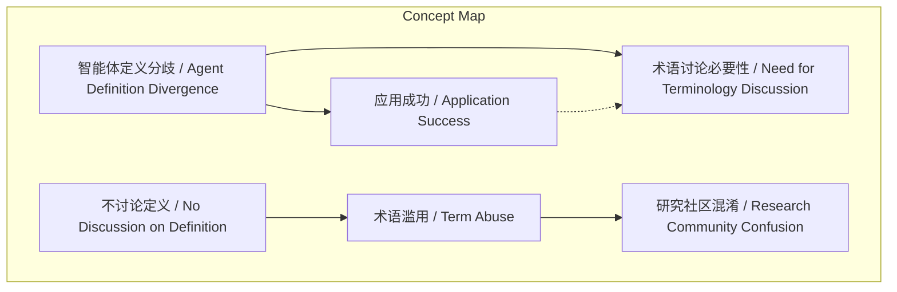
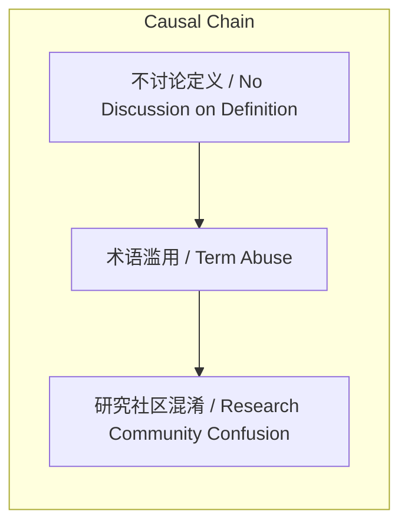

# NEWS/NEWS 任务报告

- agent: news/news
- requestId: 1773791813157-c4ziwg
- 生成时间(UTC): 2026-03-17T23:57:23.696Z

## 文本总结

# 智能体定义困境：实用与术语风险

## 整体结构化文档表达
### 文档卡片
- 主题（中文/English）：智能体定义问题 / Agent Definition Problem
- 一句话摘要：智能体术语虽在相关领域广泛使用但缺乏统一定义，其应用成功可能暂时掩盖分歧，但若不讨论则存在被滥用导致研究社区混淆的风险。
- 目标读者：智能体计算研究者、人工智能社区成员、科技政策制定者
- 核心结论（3条）：
  1. 智能体（agent）术语在紧密相关领域被广泛使用，但无法产生单一普遍接受的定义。
  2. 若应用开发成功，定义分歧可能被视为不重要的术语细节。
  3. 若不主动讨论定义，智能体可能成为“噪音”词，面临滥用和误用，进而混淆研究社区。

### 内容结构树
1. 背景与问题定义：智能体术语的普遍使用与定义缺失的尴尬现状，类比AI社区对“智能”定义的尴尬。
2. 核心观点与关键证据：定义分歧不一定阻碍应用成功，但存在不讨论则导致术语滥用的危险。
3. 方法/机制/路径：未提及具体方法或机制。
4. 风险与边界条件：术语成为“噪音”词，被滥用和误用，潜在后果是研究社区混淆。
5. 结论与行动建议：隐含需要讨论定义问题，但未明确给出具体行动建议。

### 结构化元数据（JSON）
```json
{
  "title": "智能体定义困境：实用与术语风险",
  "topic_zh": "智能体定义问题",
  "topic_en": "Agent Definition Problem",
  "audience": "智能体计算研究者、人工智能社区成员、科技政策制定者",
  "claims": [
    "智能体术语广泛使用但无统一定义",
    "应用成功可能使定义分歧显得不重要",
    "不讨论定义可能导致术语滥用和社区混淆"
  ],
  "evidence": [
    "术语被许多紧密相关领域工作者使用",
    "无法产生单一普遍接受的定义",
    "类比：'什么是智能？'对主流AI社区同样尴尬",
    "许多人成功开发有趣且有用的应用",
    "若不讨论，'agent'可能成为'噪音'词",
    "术语可能被滥用和误用，导致研究社区混淆"
  ],
  "risks": [
    "术语成为'噪音'词",
    "术语被滥用和误用",
    "研究社区产生混淆"
  ],
  "actions": []
}
```

## 处理流程
1. 输入识别：来源为用户提供的Michael Wooldridge于1994年关于智能体定义问题的引述文本。
2. 信息抽取：实体包括Carl Hewitt、Michael Wooldridge、智能体/agent、AI社区；概念包括定义、术语、应用、噪音词、滥用、混淆；问题为定义尴尬；事实为引述内容及1994年背景；观点为对定义分歧影响的判断。
3. 结构化归纳：定义问题（术语无统一定义）、分类风险（滥用与混淆）、比较（类比AI智能定义）、因果链（不讨论→滥用→混淆）。
4. 关系建模：概念间关系如“定义分歧”与“应用成功”共同影响“讨论必要性”；“不讨论定义”导致“术语滥用”；“术语滥用”引起“社区混淆”。
5. 可视化表达：使用Mermaid绘制概念结构图与因果链图。

## 概念清单（中英文）
- agent / 智能体
- agent-based computing community / 基于智能体的计算社区
- intelligence / 智能
- mainstream AI community / 主流AI社区
- term / 术语
- definition / 定义
- universally accepted definition / 普遍接受的定义
- applications / 应用
- interesting and useful applications / 有趣且有用的应用
- noise term / 噪音词
- abuse and misuse / 滥用和误用
- research community / 研究社区
- confusion / 混淆

## 概念定义（中英文）
- agent / 智能体：在基于智能体的计算领域中广泛使用但缺乏统一定义的术语。
- agent-based computing community / 基于智能体的计算社区：从事智能体相关研究的学术或技术群体。
- intelligence / 智能：主流AI社区中同样缺乏统一定义的核心术语。
- mainstream AI community / 主流AI社区：传统人工智能研究领域的主要学术群体。
- term / 术语：在特定领域内使用的词语或表达。
- definition / 定义：对术语含义的精确描述。
- universally accepted definition / 普遍接受的定义：被大多数相关领域工作者共同认可的定义。
- applications / 应用：基于智能体技术开发的实际系统或解决方案。
- interesting and useful applications / 有趣且有用的应用：具有实际价值或新颖性的智能体应用实例。
- noise term / 噪音词：因滥用或误用而失去明确意义、仅引起混乱的术语。
- abuse and misuse / 滥用和误用：不恰当或错误地使用术语的行为。
- research community / 研究社区：从事某一科学或技术领域研究的学者和从业者群体。
- confusion / 混淆：因术语不明确导致的理解障碍或意见分歧。

## 概念关联与逻辑关系（中英文）
1. 智能体定义分歧 (Agent Definition Divergence) 与 应用成功 (Application Success) 共同影响 术语讨论必要性 (Need for Terminology Discussion)。形式化：Divergence + Success → ¬Necessity（分歧与成功可能降低讨论必要性）。
2. 不讨论定义 (No Discussion on Definition) 导致 术语滥用 (Term Abuse)。形式化：¬Discussion → Abuse。
3. 术语滥用 (Term Abuse) 引起 研究社区混淆 (Research Community Confusion)。形式化：Abuse → Confusion。

## COT逻辑梳理（定义/分类/比较/因果/科学方法论）
- Step 1（定义）：明确核心问题为“智能体”术语缺乏统一定义，导致社区尴尬。
- Step 2（分类）：将风险归类为术语层面（噪音词、滥用）和社区层面（混淆）。
- Step 3（比较）：类比“智能”在AI社区的定义问题，突出跨领域相似性。
- Step 4（因果）：建立因果链：不讨论定义 → 术语滥用/误用 → 研究社区混淆。
- Step 5（科学方法论）：建议通过社区公开讨论、实证应用分析来厘清定义，避免术语污染。

## 事实与看法（病毒）
### 事实
- Carl Hewitt曾提出“什么是智能体？”的问题。
- Michael Wooldridge在1994年的文章中引述并评论了该问题。
- 智能体术语被许多紧密相关领域的工作者使用。
- 目前无法产生单一普遍接受的智能体定义。
- 许多人已成功开发出有趣且有用的智能体应用。
- 若不讨论定义，“agent”可能成为“噪音”词。
- 术语滥用和误用可能混淆研究社区。

### 看法
- “什么是智能体？”对基于智能体的计算社区是尴尬的。
- 定义分歧可能是不重要的 terminological details（术语细节）。
- 存在“危险”即术语可能被滥用和误用。
- 不讨论定义可能导致潜在混淆。

## FAQ（原文问题整理）
- 问题：什么是智能体？回答：原文未给出定义，仅指出该问题尴尬且无统一定义，但应用已成功。
- 问题：什么是智能？回答：原文类比指出，该问题对主流AI社区同样尴尬，暗示定义困难是跨领域现象。

## Visualization
### Mermaid 图 1（概念结构图）


### Mermaid 图 2（逻辑/因果图）


## 文章中的类比
- 智能体定义问题 类比 智能定义问题（Agent Definition Predicament is analogous to Intelligence Definition Issue）。

## 10个金句
1. “what is an agent? is embarrassing for the agent-based computing community”
2. “the question what is intelligence? is embarrassing for the mainstream AI community”
3. “although the term is widely used by many people working in closely related areas it defies attempts to produce a single universally accepted definition”
4. “if many people are successfully developing interesting and useful applications then it hardly matters that they do not agree on potentially trivial terminological details”
5. “unless the issue is discussed 'agent' might become a 'noise' term”
6. “subject to both abuse and misuse to the potential confusion of the research community”
7. 原文未提供
8. 原文未提供
9. 原文未提供
10. 原文未提供
