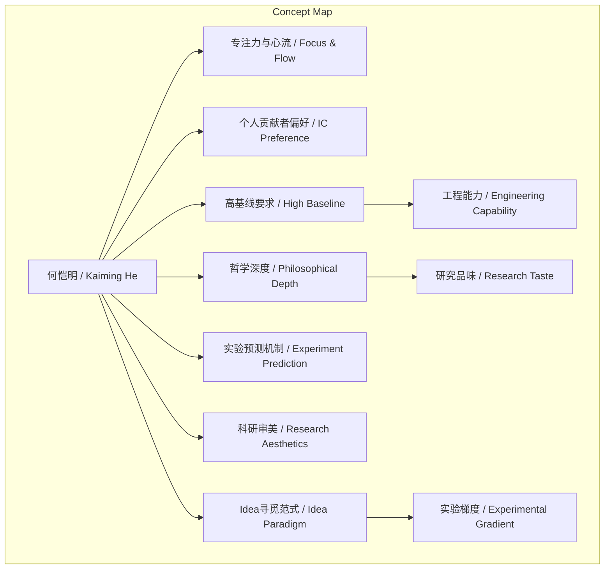
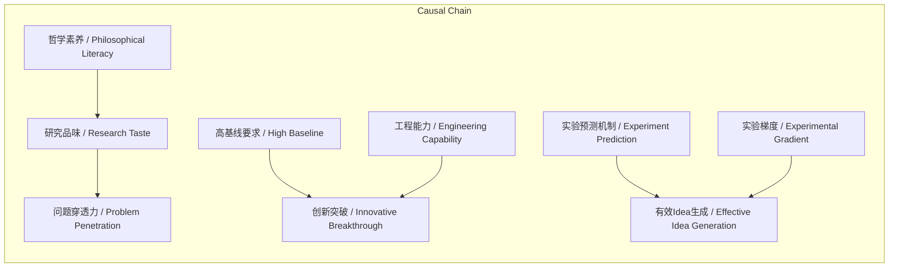

# NEWS/NEWS 任务报告

- agent: news/news
- requestId: 1773834351273-gkl5r3
- 生成时间(UTC): 2026-03-18T11:46:57.492Z

## 文本总结

# 何恺明研究特点深度剖析

## 整体结构化文档表达
### 文档卡片
- 主题（中文/English）：研究特点分析 / Research Characteristic Analysis
- 一句话摘要：本文基于谢赛宁观察，系统阐述何恺明在AI研究中融合哲学深度与工程极致的具体表现。
- 目标读者：AI研究者、科研管理者、技术爱好者
- 核心结论（3条）：
  1. 极致专注与心流状态是其研究高效的核心驱动力。
  2. 个人贡献者角色与高基线要求确保了从理论到落地的工程严谨性。
  3. 哲学思维与实验预测机制共同构成了其识别真问题的独特方法论。

### 内容结构树
1. 背景与问题定义：未提及（原文未明确研究背景或问题定义）
2. 核心观点与关键证据：
   - 极致的专注力与“心流”状态：屏蔽外界，每日心智周期集中于单一问题。
   - 亲力亲为的“个人贡献者（IC）”偏好：在MoCo、MAE中承担80%-90%第一作者工作。
   - 极高的基线要求与底层工程能力：信奉“科研上限取决于基线好坏”，单人搭建TPU基础设施。
   - 独特的Idea寻觅范式：反对凭空想Idea，主张在探索中寻找“实验的梯度”。
   - 严密的实验管理与“预测反馈”机制：用Excel追踪实验，要求跑实验前预测结果。
   - 极高的科研审美与论文写作：截稿前一个月打磨论文，追求排版“赏心悦目”。
   - 具备哲学深度的认知穿透力：哲学素养帮助看透问题本质，早提规模化趋势。
3. 方法/机制/路径：实验预测机制、探索中寻找梯度、Excel精细管理、个人贡献者一线工作。
4. 风险与边界条件：未提及（原文未讨论风险或边界）
5. 结论与行动建议：研究者应培养专注力、重视基线建设、采用预测实验、提升论文审美、借鉴哲学思维。

### 结构化元数据（JSON）
```json
{
  "title": "何恺明研究特点深度剖析",
  "topic_zh": "研究特点分析",
  "topic_en": "Research Characteristic Analysis",
  "audience": "AI研究者、科研管理者、技术爱好者",
  "claims": [
    "极致专注与心流状态是核心驱动力",
    "个人贡献者角色与高基线要求确保工程落地",
    "哲学思维与实验预测机制塑造独特研究范式"
  ],
  "evidence": [
    "每天思考特定问题，屏蔽外界，处于心流",
    "在MoCo、MAE中承担80%-90%第一作者工作",
    "信奉科研上限取决于基线好坏",
    "单人从头在TPU平台搭建基础设施",
    "反对凭空想Idea，主张探索中寻找实验梯度",
    "用Excel精细管理实验，要求预测结果",
    "截稿前一个月完成工作，打磨论文排版",
    "哲学素养帮助看透问题本质，早提规模化"
  ],
  "risks": [],
  "actions": [
    "研究者应培养深度专注能力",
    "重视基线建设，避免在差基线上提升",
    "采用实验预测机制以验证思路",
    "提升科研审美，注重论文呈现",
    "借鉴哲学思维以穿透问题表象"
  ]
}
```

## 处理流程
未提及（原文未描述分析处理流程）

## 概念清单（中英文）
- 何恺明 / Kaiming He（输入为“Kaiming”，指代何恺明）
- 谢赛宁 / XIE Sai-ning（未提英文名）
- 心流 / Flow
- 个人贡献者 / Individual Contributor (IC)
- MoCo / MoCo（专有项目名）
- MAE / MAE（专有项目名）
- 基线 / Baseline
- 灌水 / Salami Slicing（低质量发表）
- 基础设施 / Infrastructure
- Idea / Idea（研究想法）
- 实验的梯度 / Experimental Gradient
- 预测反馈 / Predictive Feedback
- Excel表格 / Excel Spreadsheet
- Deadline / Deadline
- 科研审美 / Research Aesthetics
- 论文写作 / Paper Writing
- 研究品味 / Research Taste
- 哲学素养 / Philosophical Literacy
- 《金刚经》 / Diamond Sutra
- 凡所有相 皆是虚妄 / All forms are illusory（引用）
- 规模化 / Scalability
- 心智周期 / Mental Cycle

## 概念定义（中英文）
- 心流 / Flow：完全沉浸在思考问题中，屏蔽外界干扰的心理状态。
- 个人贡献者 / Individual Contributor (IC)：不从事管理，直接在一线执行技术工作的角色。
- 基线 / Baseline：研究或实验的初始性能参考点，用于衡量改进。
- 灌水 / Salami Slicing：在低质量基线上微小提升以发表低价值论文的行为。
- 基础设施 / Infrastructure：支持研究或系统运行的基础平台与工具。
- 实验的梯度 / Experimental Gradient：在探索过程中，从实验结果的性能变化或意外现象中提取的信号，用于指导Idea生成。
- 预测反馈 / Predictive Feedback：跑实验前先预测结果，通过预测正确与否验证思路的机制。
- 研究品味 / Research Taste：判断研究问题价值与创新性的审美与直觉。
- 哲学素养 / Philosophical Literacy：通过哲学思维（如《金刚经》思想）洞察问题本质的能力。
- 规模化 / Scalability：模型或系统随规模扩大而性能提升的特性。

## 概念关联与逻辑关系（中英文）
1. 何恺明 / Kaiming He 的 哲学素养 / Philosophical Literacy 与 研究品味 / Research Taste 共同影响 问题本质穿透力 / Penetration of Problem Essence。
2. 高基线要求 / High Baseline Requirement 与 工程能力 / Engineering Capability 共同导致 创新突破 / Innovative Breakthrough。
3. 实验预测机制 / Predictive Experiment Mechanism 与 探索中寻找梯度 / Seeking Gradient in Exploration 共同促进 有效Idea生成 / Effective Idea Generation。

## COT逻辑梳理（定义/分类/比较/因果/科学方法论）
Step 1: 定义——从输入提取何恺明研究特点的七个方面定义。
Step 2: 分类——将特点分为认知类（专注、哲学）、角色类（IC）、方法类（实验、Idea）、产出类（论文）。
Step 3: 比较——对比传统“凭空想Idea”与何恺明“探索中找梯度”的范式差异。
Step 4: 因果——高基线要求是因，真正突破是果；哲学思维是因，穿透力是果。
Step 5: 科学方法论——实验预测机制体现“假设-验证”循环，探索中试错符合科学试错原则。

## 事实与看法（病毒）
### 事实
- 何恺明在MoCo、MAE项目中承担80%到90%的第一作者工作。
- 他单人从头在TPU平台上搭建了一整套基础设施。
- 他用Excel表格精细设计行列以追踪实验记录。
- 他在截稿日期前一个月完成所有工作，随后打磨论文。
- 他送给组员《金刚经》以探讨哲学思想。
- 他早向团队提出必须把模型做得“大大大”。

### 看法
- 他拥有极强的专注力，能屏蔽外界，处于“心流”状态。
- 他信奉“科研的上限取决于基线的好坏”。
- 他认为在差基线上提升是“灌水”。
- 他反对凭空想Idea，主张把研究当游戏动手破解。
- 他认为论文必须提供“赏心悦目的沟通界面”。
- 他的研究品味建立在哲学素养之上。
- 他通过哲学思维看透问题“本体与真理”。

## FAQ（原文问题整理）
未发现明确提问（原文为陈述性描述，无提问句）

## Visualization
### Mermaid 图 1（概念结构图）


### Mermaid 图 2（逻辑/因果图）


## 文章中的类比
- 把研究当成游戏去动手破解（hack）
- 论文是“赏心悦目的沟通界面”
- “凡所有相，皆是虚妄”用于比喻看透问题表象与本质

## 10个金句
1. “科研的上限取决于基线的好坏”
2. “在很差的基线上取得性能提升，往往只是自欺欺人的‘灌水’”
3. “必须把基线和系统搭建到极高、极稳的水平”
4. “反对坐在房间里凭空想 Idea”
5. “把研究当成游戏去动手破解（hack）”
6. “在探索的过程中试错，从而寻找‘实验的梯度（信号）’”
7. “在跑每一个实验之前，必须先预测实验结果应该是什么样”
8. “论文是写给别人看的，必须极度在乎读者的观感，提供‘赏心悦目的沟通界面’”
9. “他的‘研究品味’建立在深厚的哲学素养之上”
10. “凡所有相，皆是虚妄”用于抽丝剥茧看透问题本体与真理
