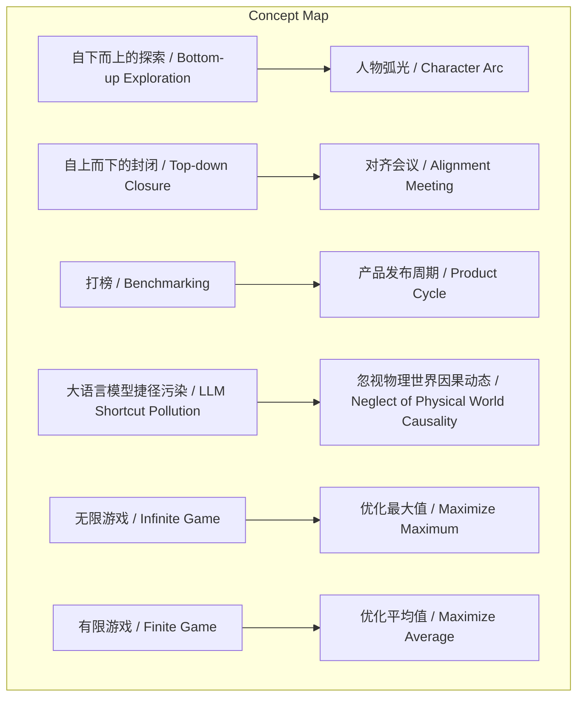
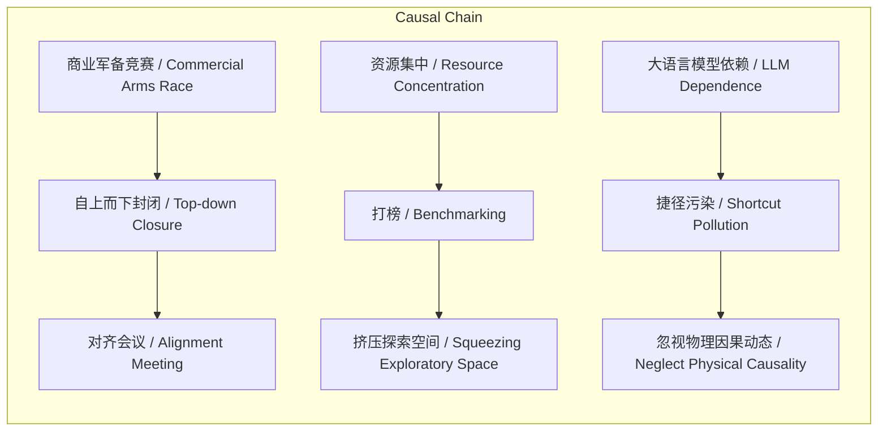

# NEWS/NEWS 任务报告

- agent: news/news
- requestId: 1773834664905-lonv95
- 生成时间(UTC): 2026-03-18T11:52:15.545Z

## 文本总结

# AI研究范式从开放探索转向封闭竞争

## 整体结构化文档表达
### 文档卡片
- 主题（中文/English）：AI研究生态变迁 / AI Research Ecosystem Shift
- 一句话摘要：本文通过谢赛宁的视角，对比了过去自下而上、开放探索的AI研究与当前自上而下、商业驱动的封闭模式，指出后者压制了创新与个人贡献。
- 目标读者：AI研究者、科技政策制定者、行业管理者
- 核心结论（3条）：
  1. 组织模式从学术式自下而上变为工业式自上而下，研究员失去个人贡献归因和可见度。
  2. 资源分配从定义问题转向打榜和产品驱动，纯粹探索性研究空间被严重挤压。
  3. 研究游戏从优化最大值的无限游戏变为优化平均值的有限游戏，容错率极低。

### 内容结构树
1. 背景与问题定义：AI研究环境从开放转向封闭，以谢赛宁观点为主线，批判当前工业界模式。
2. 核心观点与关键证据：分四点对比过去与现在（组织模式、资源分配、游戏本质、认知视角），每点配具体例证。
3. 方法/机制/路径：谢赛宁创立AMI Labs，试图重构世界模型，逃离有限游戏。
4. 风险与边界条件：纯粹探索性研究空间被压榨，研究员沦为螺丝钉，学术界资源匮乏。
5. 结论与行动建议：需寻找新平衡点，支持底层物理世界建模和长期探索。

### 结构化元数据（JSON）
```json
{
  "title": "AI研究范式从开放探索转向封闭竞争",
  "topic_zh": "AI研究生态变迁",
  "topic_en": "AI Research Ecosystem Shift",
  "audience": "AI研究者、科技政策制定者、行业管理者",
  "claims": [
    "组织模式从自下而上探索变为自上而下封闭，研究员失去个人贡献归因和可见度",
    "资源分配从定义问题转向打榜和产品驱动，探索性研究空间被挤压",
    "研究游戏从优化最大值的无限游戏变为优化平均值的有限游戏，容错率极低"
  ],
  "evidence": [
    "过去FAIR模式：研究员自由探索，重视个人署名和可见度",
    "现在工业界：需开对齐会议决定方向，论文署名变为团队名如OpenAI Team",
    "过去：李飞飞定义ImageNet问题，驱动力是好奇心",
    "现在：资源由打榜决定，被LLM、Scaling Law等宏大叙事统治",
    "过去：允许失败，优化职业生涯最大值",
    "现在：商业博弈，每一步都不能出错，学术界资源匮乏如'花生米'",
    "过去：CV从MNIST到ImageNet，建立层次化表征",
    "现在：多模态依赖LLM，将视频帧拉平成Token，忽视物理因果动态"
  ],
  "risks": [
    "纯粹探索性研究的空间和氧气被严重压榨",
    "研究员沦为可替换的螺丝钉，失去人物弧光",
    "学术界被迫卷入有限游戏，资源不足难以追赶大厂"
  ],
  "actions": [
    "谢赛宁离开大厂创立AMI Labs，试图重构世界模型",
    "寻找新的平衡点，支持底层物理世界建模"
  ]
}
```

## 处理流程
1. 输入识别：识别文本为评论性文章，以谢赛宁观点为主线，对比AI研究范式变迁。
2. 信息抽取：抽取实体（谢赛宁、FAIR、OpenAI、Gemini、李飞飞、ImageNet、AMI Labs），概念（自下而上、自上而下、无限游戏、有限游戏等），问题（研究环境封闭化），事实（历史模式），观点（当前问题）。
3. 结构化归纳：将内容归纳为背景、核心观点（四点）、方法（AMI Labs）、风险、结论。定义关键概念如“对齐会议”。
4. 关系建模：建立概念间因果与影响关系，如“自上而下封闭”导致“对齐会议”，“大语言模型捷径污染”导致“忽视物理因果动态”。
5. 可视化表达：设计Mermaid图展示概念结构和因果链，使用真实概念节点。

## 概念清单（中英文）
- 自下而上的探索 / Bottom-up Exploration
- 自上而下的封闭 / Top-down Closure
- 对齐会议 / Alignment Meeting
- 人物弧光 / Character Arc
- 定义问题 / Problem Definition
- 打榜 / Benchmarking
- 产品发布周期 / Product Cycle
- 无限游戏 / Infinite Game
- 有限游戏 / Finite Game
- 层次化表征 / Hierarchical Representation
- 大语言模型捷径污染 / LLM Shortcut Pollution
- 世界模型 / World Model
- AMI Labs / AMI Labs

## 概念定义（中英文）
- 自下而上的探索：研究员自由定义问题并探索的研究模式 / Bottom-up Exploration: Research mode where researchers freely define problems and explore autonomously.
- 自上而下的封闭：组织高层决定方向，研究员执行，过程封闭 / Top-down Closure: Organizational mode where top management decides research directions, with closed processes.
- 对齐会议：耗费数周决定研究方向的高层会议 / Alignment Meeting: High-level meetings taking weeks to decide research directions.
- 人物弧光：研究员通过个人贡献建立声望和可见度的机会 / Character Arc: Opportunity for researchers to build reputation and visibility through personal contributions.
- 定义问题：识别和提出关键研究问题的能力 / Problem Definition: Ability to identify and formulate key research problems.
- 打榜：在基准测试上竞争排名以分配资源 / Benchmarking: Competing on benchmark rankings to allocate resources.
- 产品发布周期：商业产品开发的时间压力 / Product Cycle: Time pressure of commercial product development.
- 无限游戏：以职业生涯最大值为优化目标，允许失败的研究游戏 / Infinite Game: Research game optimizing for career maximum, allowing failures.
- 有限游戏：以不犯错和追赶为优化目标，低容错的研究游戏 / Finite Game: Research game optimizing for not making mistakes and catching up, with low tolerance for failure.
- 层次化表征：从简单到复杂建立连续、有噪音信号的表示 / Hierarchical Representation: Building representations from simple to complex on continuous, noisy signals.
- 大语言模型捷径污染：过度依赖LLM导致忽视物理世界因果动态的缺陷 / LLM Shortcut Pollution: Over-reliance on LLMs leading to neglect of physical world causality.
- 世界模型：对物理世界进行建模的智能系统 / World Model: Intelligent system that models the physical world.
- AMI Labs：谢赛宁创立的研究实验室，旨在重构世界模型 / AMI Labs: Research lab founded by Saining Xie to rebuild world models.

## 概念关联与逻辑关系（中英文）
1. 自上而下封闭 / Top-down Closure 导致 对齐会议 / Alignment Meeting 的出现。
2. 大语言模型捷径污染 / LLM Shortcut Pollution 与 忽视物理世界因果动态 / Neglect of Physical World Causality 具有因果关系。
3. 打榜 / Benchmarking 与 产品发布周期 / Product Cycle 共同挤压 纯粹探索性研究空间 / Pure Exploratory Research Space。

## COT逻辑梳理（定义/分类/比较/因果/科学方法论）
Step 1: 定义研究范式。研究范式指AI研究中的组织模式、驱动力和评价标准。
Step 2: 分类。分为过去（自下而上、开放）和现在（自上而下、封闭）两类。
Step 3: 比较。对比组织模式（学术机构 vs 工业流水线）、资源分配（定义问题 vs 打榜）、游戏性质（无限 vs 有限）、认知路径（层次化表征 vs LLM捷径）。
Step 4: 因果分析。商业竞争和规模法则导致资源集中，迫使研究转向短期打榜，压制长期探索。
Step 5: 科学方法论。健康的研究生态需要允许失败、奖励个人贡献、支持底层问题定义，而非仅优化排行榜。

## 事实与看法（病毒）
### 事实
- 过去FAIR研究环境是自下而上的，研究员有自由度。
- 现在工业界研究需要开对齐会议，论文署名变为团队名如OpenAI Team。
- 李飞飞定义了ImageNet问题。
- 现在资源分配由打榜决定。
- 研究员可能沦为螺丝钉。
- 计算机视觉从MNIST发展到ImageNet。
- 多模态研究将视频帧拉平成Token喂给LLM。
### 看法
- 谢赛宁认为对齐会议是反研究规律的。
- 发表论文变得困难。
- 大语言模型是污染视觉智能的捷径。
- 当前建模方式具有根本缺陷。
- 谢赛宁创立AMI Labs是为了逃离有限游戏。

## FAQ（原文问题整理）
未发现明确提问。

## Visualization
### Mermaid 图 1（概念结构图）

### Mermaid 图 2（逻辑/因果图）


## 文章中的类比
- “螺丝钉”：研究员沦为可替换的部件。
- “花生米一样少的资源”：学术界资源匮乏。
- “无限游戏”与“有限游戏”：引用游戏理论比喻研究目标。
- “像下棋或参加冬奥会”：商业博弈每一步都不能出错。
- “污染视觉智能的捷径”：大语言模型作为捷径的负面比喻。

## 10个金句
1. 研究员逐渐沦为巨大机器中可以轻易被替换的“螺丝钉”。
2. 优化的目标是职业生涯的“最大值”。
3. 一次非线性的突破（如ResNet、Transformer）就能改变AI历史进程。
4. 现在的工业界研究变得越来越封闭，陷入了同质化的商业军备竞赛。
5. 需要耗费数周时间开“对齐会议”来决定研究方向，这在谢赛宁看来是反研究规律的。
6. 即使发布博客也不再署名具体研究员的名字，只标明“OpenAI Team”或“Gemini Team”。
7. 资源分配完全由“打榜”决定，所有人都在现有的范式下疯狂内卷。
8. 纯粹探索性研究的空间和氧气被严重压榨。
9. 在大厂主导的军备竞赛中，容错率极低，优化的目标变成了“不犯错”和“追赶先机”。
10. 当前很多模型将连续的视频帧强行拉平成一长串离散的Token去喂给语言模型，这在谢赛宁看来完全忽视了物理世界的因果动态，是一种具有根本缺陷的建模方式。
