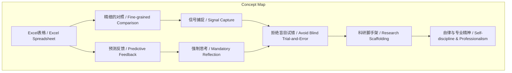
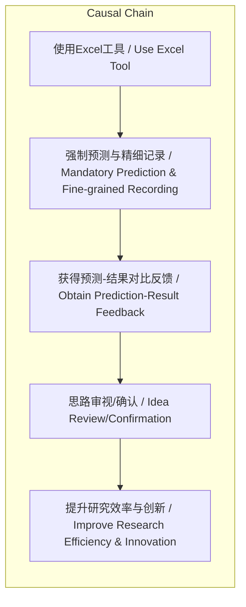

# NEWS/NEWS 任务报告

- agent: news/news
- requestId: 1773834741396-t2m5a7
- 生成时间(UTC): 2026-03-18T11:53:09.174Z

## 文本总结

# FAIR团队的“Excel老梗”与科研方法论

## 整体结构化文档表达
### 文档卡片
- 主题（中文/English）：科研管理方法论 / Research Management Methodology
- 一句话摘要：通过Excel表格工具体现的精细实验对照与强制预测反馈机制，反映顶尖AI团队拒绝盲目试错的高度自律研究文化。
- 目标读者：科研管理者、人工智能研究者、实验科学方法论爱好者
- 核心结论（3条）：
  1. Excel表格是FAIR团队实现精细实验对照与信号捕捉的核心工具。
  2. “预测实验结果”的强制要求构建了思考-反馈循环，有效避免盲目实验。
  3. 该“老梗”实质是顶尖机构通过底层工具化实现研究“脚手架”的专业精神体现。

### 内容结构树
1. 背景与问题定义：介绍“running joke”背景，点明其反映严谨实验管理方法论的核心问题。
2. 核心观点与关键证据：提出两大核心逻辑（精细对照、强制预测），并引用具体操作作为证据。
3. 方法/机制/路径：阐述Excel系统如何通过模板构建、指标决策、预测前置来运作。
4. 风险与边界条件：未提及明确风险，但隐含过度依赖形式或预测偏差的可能性。
5. 结论与行动建议：总结该模式代表的自律与专业精神，未提供具体外部行动建议。

### 结构化元数据（JSON）
```json
{
  "title": "FAIR团队的“Excel老梗”与科研方法论",
  "topic_zh": "科研管理方法论",
  "topic_en": "Research Management Methodology",
  "audience": "科研管理者、人工智能研究者",
  "claims": [
    "Excel表格是精细实验对照与信号捕捉的核心工具",
    "强制预测反馈机制能避免盲目试错并促进思路审视",
    "该实践体现了顶尖机构的高度自律与专业精神"
  ],
  "evidence": [
    "实习生第一课是学习使用Excel表格",
    "研究员需精细构建表格模板并决策记录指标",
    "跑实验前必须在表格系统中预测结果"
  ],
  "risks": [
    "未提及明确风险"
  ],
  "actions": [
    "未提及明确行动建议"
  ]
}
```

## 处理流程
1. 输入识别：来源为用户提供的访谈文本片段。
2. 信息抽取：抽取实体（谢赛宁、FAIR、何恺明）、概念（Excel表格、实验管理、预测反馈）、观点（严谨方法论、拒绝盲目试错）。
3. 结构化归纳：将内容归纳为“工具-机制-精神”三层结构，定义实验管理的方法论分类。
4. 关系建模：建立“Excel工具 → 精细对照/预测要求 → 信号捕捉/思路审视 → 避免盲目试错”的逻辑链。
5. 可视化表达：使用Mermaid绘制概念关联与因果流程图。

## 概念清单（中英文）
- running joke / 老梗
- 谢赛宁
- FAIR / Facebook AI Research
- 实习生
- Excel表格 / Excel Spreadsheet
- 实验管理 / Experiment Management
- 科研习惯 / Research Habit
- 精细的对照 / Fine-grained Comparison
- 信号捕捉 / Signal Capture
- 梯度信号 / Gradient Signal
- 强制思考 / Mandatory Reflection
- 预测反馈 / Predictive Feedback
- 盲目试错 / Blind Trial-and-Error
- 脚手架 / Scaffolding
- 自律 / Self-discipline
- 专业精神 / Professionalism

## 概念定义（中英文）
- running joke / 老梗：团队内部长期流传的玩笑，实则承载严肃工作方法。
- FAIR / Facebook AI Research：脸书人工智能研究部门，顶尖AI研究机构。
- Excel表格 / Excel Spreadsheet：用于系统化记录、对比和分析实验数据的电子表格工具。
- 实验管理 / Experiment Management：对科学实验的设计、执行、记录和对比进行系统化控制的过程。
- 精细的对照 / Fine-grained Comparison：通过 meticulously 设计的表格列与行，最大化实验间对比信息量的方法。
- 信号捕捉 / Signal Capture：从复杂或意外实验数据中识别出有指导意义的模式或线索。
- 强制思考 / Mandatory Reflection：在行动前强制进行预设与推理，以避免无脑执行。
- 预测反馈 / Predictive Feedback：将实验前的预测结果与实际结果对比，以驱动认知更新。
- 盲目试错 / Blind Trial-and-Error：无明确假设或预测，仅通过大量随机实验探索的方式。
- 脚手架 / Scaffolding：为研究过程提供结构化支持的基础框架或工具系统。

## 概念关联与逻辑关系（中英文）
1. **Excel表格 / Excel Spreadsheet** 是实施 **精细的对照 / Fine-grained Comparison** 与 **预测反馈 / Predictive Feedback** 机制的物质载体。
2. **强制思考 / Mandatory Reflection**（通过预测要求）与 **精细的对照 / Fine-grained Comparison** 共同作用，实现 **信号捕捉 / Signal Capture** 并 **拒绝盲目试错 / Avoid Blind Trial-and-Error**。
3. **实验管理 / Experiment Management** 方法论（以Excel为核心）旨在构建研究 **脚手架 / Scaffolding**，从而培育 **自律 / Self-discipline** 与 **专业精神 / Professionalism**。

## COT逻辑梳理（定义/分类/比较/因果/科学方法论）
- **Step 1 (定义问题)**：如何避免在复杂研究中陷入低效的盲目实验？
- **Step 2 (分类方法)**：提出两种核心机制——a) 事后精细对照（信息最大化）；b) 事前强制预测（思维驱动）。
- **Step 3 (比较)**：对比“随意倾倒数据”的差习惯与“预测-对照”的好习惯，凸显后者对认知的强制升级作用。
- **Step 4 (因果)**：使用Excel工具 → 强制预测与精细记录 → 产生“猜对/猜错”反馈 → 促使思路审视或确认思维链条 → 提升研究效率与创新点发现概率。
- **Step 5 (科学方法论)**：体现了“假设（预测）→ 实验（运行）→ 验证（对比表格）→ 修正（重新审视）”的闭环科学循环，将工具深度嵌入方法论。

## 事实与看法（病毒）
### 事实
- 谢赛宁在FAIR工作时，团队有“running joke”。
- 该玩笑内容：新实习生第一课是学习使用Excel表格。
- 研究员日常需要构建Excel表格模板，决策记录指标（列）与展示数据（行）。
- 系统要求：在跑每一个实验之前，必须先在表格里预测实验结果。
- 该实践被描述为“建立极致的底层研究‘脚手架’”。
### 看法
- 这个玩笑“蕴含着何恺明及其团队极其严密的实验管理方法论与科研习惯”。
- 精细对照是为了“最大化实验对比的信息量”，帮助“精准捕捉‘梯度信号’”。
- 预测机制中，“猜对了说明研究思维链条成立”，“猜错了这种Surprise能促使重新审视思路，寻找更有价值的创新点”。
- 该“老梗”代表了“为了拒绝盲目试错……的高度自律与专业精神”。

## FAQ（原文问题整理）
- 未发现文中直接提出的疑问句或设问。

## Visualization
### Mermaid 图 1（概念结构图）

### Mermaid 图 2（逻辑/因果图）


## 文章中的类比
- 未发现明确类比（“running joke”本身是内部玩笑，非类比修辞）。

## 10个金句
1. 每一个新进到FAIR实习的实习生要上的第一课就是学习使用一个工具——Excel表格。
2. 这体现了何恺明及其团队极其严密的实验管理方法论与科研习惯。
3. 研究员在日常中并不是满屏幕写满花哨的代码，而是常常盯着Excel电子表格。
4. 这种对照式的管理是为了最大化实验对比的信息量。
5. 帮助研究者从失败或意外的结果中精准捕捉“梯度信号”。
6. 最差的科研习惯是盲目分配资源去瞎跑大量的实验，然后把数据随意倾倒进表格里。
7. 在跑每一个实验之前，研究者必须先在表格系统里预测实验结果应该是什么样。
8. 如果猜对了，说明研究思维链条成立。
9. 如果猜错了，这种意外（Surprise）也能促使研究者重新审视思路，寻找更有价值的创新点。
10. 这个看似在开玩笑的“老梗”，实则代表了顶尖研究机构里为了拒绝盲目试错、建立极致的底层研究“脚手架”而秉持的高度自律与专业精神。
