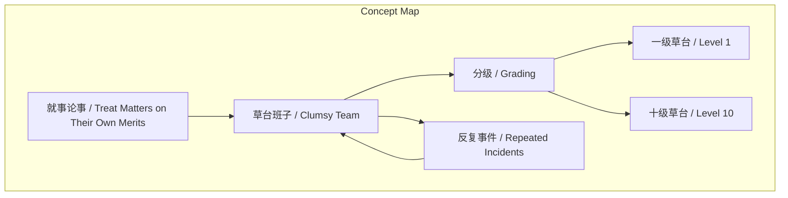
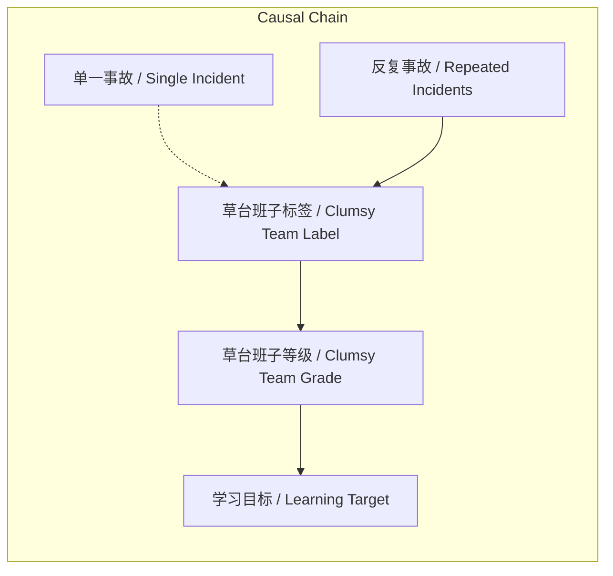

# NEWS/NEWS 任务报告

- agent: news/news
- requestId: 1773875987060-wm0ah6
- 生成时间(UTC): 2026-03-18T23:20:38.075Z

## 文本总结

# 草台班子分级论：避免以偏概全的团队评价

## 整体结构化文档表达
### 文档卡片
- 主题（团队评价方法论 / Team Evaluation Methodology）：
- 一句话摘要：通过“草台班子”分级和反复事件分析，避免以单一事故片面评价团队。
- 目标读者：组织管理者、质量分析师、决策者
- 核心结论（3条）：
  1. 单一事件不足以定义团队为“草台班子”，需观察反复发生的事件模式。
  2. “草台班子”概念需分级（如一级至十级）以保持区分度。
  3. 评价应基于长期、多事件证据，并参考更优等级团队。

### 内容结构树
1. 背景与问题定义： “草台班子”概念被滥用，缺乏区分度。
2. 核心观点与关键证据： 分级必要性；反复事件作为判断标准；以360为例质疑单一事件证明力。
3. 方法/机制/路径： 建立多级分类体系；基于事件频率/严重性进行评级；向高级别（更不草台）团队学习。
4. 风险与边界条件： 未明确提及风险；边界在于需足够多事件样本。
5. 结论与行动建议： 采用分级和模式识别进行团队评价；避免“就事论事”的片面扩展。

### 结构化元数据（JSON）
```json
{
  "title": "草台班子分级论：避免以偏概全的团队评价",
  "topic_zh": "团队评价方法论",
  "topic_en": "Team Evaluation Methodology",
  "audience": "组织管理者、质量分析师、决策者",
  "claims": [
    "单一事件不足以定义团队为草台班子",
    "草台班子概念需分级以保持区分度",
    "评价应基于反复发生的事件模式"
  ],
  "evidence": [
    "反复多次出事故才算团队糟糕",
    "如果全世界无差别都是草台班子，这个词就没用了",
    "就事论事，不随便将事例扩展到团队评价"
  ],
  "risks": ["未提及明确风险"],
  "actions": [
    "建立草台班子分级体系（如一级至十级）",
    "基于长期多事件观察进行团队评级",
    "向更高级别（更不草台）的团队学习"
  ]
}
```

## 处理流程
1. 输入识别：文本讨论“草台班子”概念在团队评价中的应用，强调分级和反复事件。
2. 信息抽取：实体（360、草台班子）；概念（分级、反复事件、就事论事）；问题（单一事件能否证明团队糟糕）；观点（需分级、避免以偏概全）。
3. 结构化归纳：定义“草台班子”为团队状态标签；分类为多级；比较单一事件与反复事件；因果：反复事件导致草台班子标签；方法论：基于模式归纳。
4. 关系建模：单一事件频率不充分导致草台班子标签；反复事件频率充分导致草台班子等级；等级决定学习目标。
5. 可视化表达：使用Mermaid展示概念结构与因果链。

## 概念清单（中英文）
- 草台班子 / Clumsy Team
- 草台班子分级 / Clumsy Team Grading
- 一级草台 / Level 1 Clumsy Team
- 二级草台 / Level 2 Clumsy Team
- 十级草台 / Level 10 Clumsy Team
- 反复多次出 / Repeated Occurrences
- 就事论事 / Treat Matters on Their Own Merits
- 无序的团队 / Disordered Team
- 360 / 360 (Company Name)
- 事故 / Incident
- 团队评价 / Team Evaluation

## 概念定义（中英文）
- 草台班子：指组织或团队在运作中表现出的系统性低效或混乱状态，可通过反复发生的问题事件识别。
- 草台班子分级：根据团队问题事件的频率或严重程度，将“草台班子”状态划分为不同等级（如一级至十级），以增强概念的区分度。
- 反复多次出：指同一类型的问题或事故在团队中多次发生，是判断“草台班子”等级的关键依据。
- 就事论事：评价时仅针对具体事件本身，避免将其泛化到对团队整体能力的判断。
- 无序的团队：指内部流程、沟通或协作缺乏秩序的团队，可能表现为“草台班子”特征。
- 360：文本中作为案例提及的公司名称，未提供全称或背景信息。
- 事故：团队运作中出现的非预期负面事件，可能反映系统性问题。
- 团队评价：对团队整体效能、协作或管理状态的判断过程。

## 概念关联与逻辑关系（中英文）
1. 单一事故频率（Single Incident Frequency） → 不充分（Insufficient） → 草台班子标签（Clumsy Team Label）
2. 反复事故频率（Repeated Incident Frequency） ∧ 高严重度（High Severity） → 充分（Sufficient） → 草台班子等级（Clumsy Team Grade）
3. 草台班子等级（Clumsy Team Grade） → 决定（Determines） → 学习目标等级（Learning Target Grade）

## COT逻辑梳理（定义/分类/比较/因果/科学方法论）
- Step 1（定义）：明确“草台班子”为描述团队糟糕状态的标签。
- Step 2（分类）：为增强区分度，提出将“草台班子”分为一级至十级。
- Step 3（比较）：对比单一事件与反复事件——前者不能定义团队，后者能。
- Step 4（因果）：反复事件的发生模式是导致草台班子标签及等级的根本原因。
- Step 5（科学方法论）：基于可重复观察的事件模式进行归纳，避免以偏概全，符合实证原则。

## 事实与看法（病毒）
### 事实
- 文本提到“我们经常说‘就事论事’”。
- 文本提出“反复多次出才算”团队糟糕。
- 文本以360为例提问单一事件能否证明内部无序。
### 看法
- “如果全世界无差别都是草台班子，这个词儿就没用了”是观点性陈述。
- “努力向不那么草台的草台学习”是建议性看法。
- “一个无序的团队当然完全可以成为草台班子”是推断性判断。

## FAQ（原文问题整理）
- 问题1: 单一事故能否证明团队是草台班子？
  - 回答: 不能，需反复多次事故。
- 问题2: 如何避免“草台班子”概念失效？
  - 回答: 通过分级（一级至十级）保持区分度。
- 问题3: 评价团队时应遵循什么原则？
  - 回答: 就事论事，不将单一事件扩展到团队评价。
- 问题4: 360内部无序能否由单一事故证明？
  - 回答: 不能，需更多证据。

## Visualization
### Mermaid 图 1（概念结构图）

### Mermaid 图 2（逻辑/因果图）


## 文章中的类比
- 未发现明确类比

## 10个金句
1. “如果全世界无差别都是草台班子，这个词儿就没用了。”
2. “反复多次出才算……”
3. “就事论事”
4. “一个无序的团队当然完全可以成为草台班子”
5. “但这一件事能证明360内部无序吗？”
6. “努力向不那么草台的草台学习”
7. “我们要区分一级草台、二级草台、。。。十级草台”
8. “出这么一个事故不足以证明团队很糟糕”
9. “我们经常说‘就事论事’就是尽量别随便把一个事例扩展到对团队的评价”
10. 原文未提供
