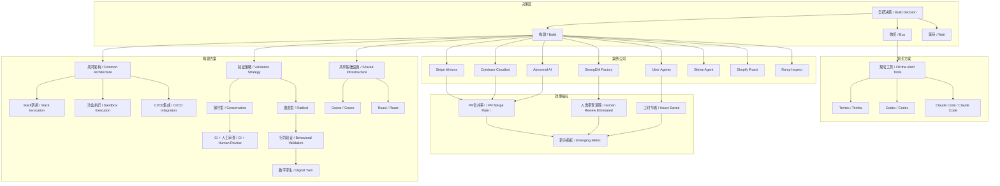
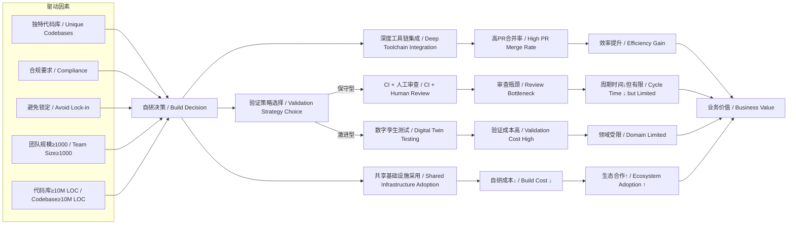

# NEWS/NEWS 任务报告

- agent: news/news
- requestId: 1773935436772-opdczr
- 生成时间(UTC): 2026-03-19T16:04:33.555Z

## 链接总结

- URL: https://rywalker.com/research/in-house-coding-agents

# 企业内部编码代理：构建、购买与实施策略

## 整体结构化文档表达
### 文档卡片
- **主题（中文/English）**：企业内部编码代理 / In-house Coding Agents  
- **一句话摘要**：综合多家科技公司案例，分析企业内部编码代理的架构、验证策略与效果，提出基于组织规模、代码库特征的构建、购买与等待决策框架。  
- **目标读者**：技术决策者、工程领导者、AI工具开发者  
- **核心结论（3条）**：
  1. 自研决策取决于工程团队规模（1000+工程师）、代码库大小（10M+ LOC）及合规需求，大型组织可自研，中小型应购买现成工具。
  2. 自研代理可显著提升开发效率（PR合并率5-13%，周期缩短10倍），但依赖深度工具链集成与验证策略选择（人类审查或行为验证）。
  3. 验证正从人类审查转向行为验证（数字孪生），共享基础设施（如Goose）降低自研门槛，未来“数字孪生”测试将成为标准。

### 内容结构树
1. **背景与问题定义**：企业面临开发效率瓶颈，现成编码代理（如Codex、Claude Code）无法满足定制化、深度集成与合规需求，驱动科技公司转向自建。同时，自建面临高门槛和验证挑战。
2. **核心观点与关键证据**：通过Stripe、Coinbase、Abnormal AI、Uber、StrongDM等案例，展示自研代理在PR合并率、周期缩短、工时节省方面的量化效果；决策框架基于规模、代码库、资源等条件。
3. **方法/机制/路径**：通用架构包括Slack触发、沙盒隔离执行、CI/CD集成、PR就绪输出；验证策略分保守（CI+人工审查）与激进（行为验证于数字孪生）；具体实现如Goose、Roast、MCP技能等。
4. **风险与边界条件**：自建需千人以上工程师、专属开发体验团队及千万行级代码库，小团队ROI不足；人类审查政策若过早消除有质量风险；无审查模式验证成本高且领域受限；供应商锁定担忧可能转为技术债务。
5. **结论与行动建议**：预测2027年30%大型企业将运营内部系统；建议大型企业投资自建并开发验证设施，小团队采用Tembo等现成方案；参与开源共享基础设施；根据风险偏好选择验证策略。

### 结构化元数据（JSON）
```json
{
  "title": "企业内部编码代理：构建、购买与实施策略",
  "topic_zh": "企业内部编码代理",
  "topic_en": "In-house Coding Agents",
  "audience": "技术决策者、工程领导者、AI工具开发者",
  "claims": [
    "自研决策取决于工程团队规模（1000+工程师）、代码库大小（10M+ LOC）及合规需求，大型组织可自研，中小型应购买现成工具。",
    "自研代理可显著提升开发效率（PR合并率5-13%，周期缩短10倍），但依赖深度工具链集成与验证策略选择（人类审查或行为验证）。",
    "验证正从人类审查转向行为验证（数字孪生），共享基础设施（如Goose）降低自研门槛，未来“数字孪生”测试将成为标准。"
  ],
  "evidence": [
    "Stripe Minions每周合并1000+ PR，完全无人值守，人类审查但无人工编写代码。",
    "Coinbase Cloudbot占合并PR的5%，PR周期从150小时减至15小时。",
    "Abnormal AI报告13%的合并PR来自代理，为最高公开数据。",
    "Uber使用LangGraph代理节省21,000开发者小时。",
    "StrongDM消除人类代码审查，代码视为通过行为验证的不透明权重。",
    "通用架构：Slack调用 → 隔离沙盒执行 → CI/CD集成 → PR就绪输出。",
    "自建ROI阈值：通常需1000+工程师、专属devex团队、代码库超1000万行。",
    "预测：2027年30%大型企业将运营内部系统；2028年“数字孪生”测试将成为标准。",
    "Block开源Goose，Stripe fork用于Minions，证明共享基础设施价值。",
    "Shopify Roast哲学：非确定性是可靠性的敌人。"
  ],
  "risks": [
    "自建门槛高，需大规模团队和代码库，小团队ROI不足。",
    "人类审查政策若过早消除，可能导致代码质量风险。",
    "无审查模式验证成本高昂，领域适用性受限。",
    "供应商锁定担忧驱动自建，但自建可能造成技术债务。",
    "基础设施成本高，依赖特定框架（如LangGraph）。"
  ],
  "actions": [
    "拥有1000+工程师的企业应评估自建编码代理，优先开发验证基础设施。",
    "小团队应购买现成工具如Tembo、Codex或Claude Code。",
    "参与开源共享基础设施（如Goose）以降低生态成本。",
    "根据风险承受能力选择验证策略（保守或激进）。",
    "投资内部工具集成以实现规模效应。"
  ]
}

## 处理流程
1. **输入识别**：接收多个分段摘要，均源自同一研究网页（https://rywalker.com/research/in-house-coding-agents）。
2. **信息抽取**：从各摘要中抽取实体、概念、问题、事实、观点，去重合并。
3. **结构化归纳**：整合为统一的文档卡片、内容结构树、元数据等。
4. **关系建模**：建立概念间关联，如规模与决策、验证策略与审查需求。
5. **可视化表达**：生成综合Mermaid图。

## 概念清单（中英文）
- 企业内部编码代理 / In-house Coding Agents
- Stripe Minions / Stripe Minions
- Shopify Roast / Shopify Roast
- Coinbase Cloudbot / Coinbase Cloudbot
- Block Goose / Block Goose
- Abnormal AI / Abnormal AI
- StrongDM Software Factory / StrongDM Software Factory
- Uber Validator / Uber Validator
- Uber Autocover agents / Uber Autocover agents
- Bitrise agent / Bitrise agent
- Ramp Inspect / Ramp Inspect
- Slack / Slack
- Sandbox / 沙盒
- CI/CD / 持续集成/持续部署
- Pull Request (PR) / 拉取请求
- MCP (Model Context Protocol) / 模型上下文协议
- Skills / 技能
- Digital twin / 数字孪生
- Non-determinism / 非确定性
- Human review / 人类审查
- Build vs Buy / 构建与购买决策
- Off-the-shelf / 现成产品
- Codebase / 代码库
- Workflow / 工作流
- 提供商无关架构 / Provider-Agnostic Architecture
- 结构化工作流 / Structured Workflow
- 背景执行 / Background Execution
- 混合架构 / Hybrid Architecture
- 领域专家代理 / Domain Expert Agents
- 数字孪生宇宙 / Digital Twin Universe
- 开发箱 / devboxes
- 验证方法 / Validation Approach
- 人类审查政策 / Human Review Policies
- 行为验证 / Behavioral Validation
- 新兴指标 / Emerging Metric
- 非确定性 / Non-determinism
- 可靠性 / Reliability
- LangGraph / LangGraph
- IDE嵌入 / IDE-Embedded
- 混合LLM+确定性 / Hybrid LLM + Deterministic
- PR周期时间 / PR Cycle Time
- 开发者小时节省 / Developer Hours Saved
- 令牌支出 / Token Spend
- 生产力指标 / Productivity Metric
- 成长软件哲学 / Grown Software Philosophy
- 参考架构 / Reference Architecture
- 中端市场 / Middle Market
- 验证创新 / Validation Innovation
- 预热环境 / Pre-warmed Environments
- 调用界面 / Invocation Surface
- 领域特定语言 / DSL
- 自定义工作流 / Custom Workflows
- 检查点 / Checkpoints
- 护城河 / Moat
- 早期采用者 / Early Adopters

## 概念定义（中英文）
- **企业内部编码代理 / In-house Coding Agents**：企业自主开发和部署的AI系统，用于自动化完成编码任务至代码合并阶段，区别于现成工具的辅助功能。
- **Stripe Minions / Stripe Minions**：未在原文中提供明确定义，但描述为“每周合并1000+ PR，完全无人值守，人类审查但无人工编写代码”。定义：Stripe公司基于Goose fork构建的内部编码代理，实现高PR合并率的全自动化流程。
- **Shopify Roast / Shopify Roast**：未在原文中提供明确定义，但描述为“Ruby DSL for structured AI workflows”。定义：Shopify开源的Ruby领域特定语言，用于编排结构化AI工作流，以降低非确定性。
- **Coinbase Cloudbot / Coinbase Cloudbot**：未在原文中提供明确定义，但描述为“占5%合并PR，PR周期从150h减至15h，多模型、Slack原生，有Skills和MCPs”。定义：Coinbase内部编码代理，通过多模型集成和工具链深度整合，显著缩短PR周期。
- **Block Goose / Block Goose**：未在原文中提供明确定义，但提及为Block开源、Stripe fork的共享基础设施。定义：Block开源的编码代理框架，被其他公司fork使用，体现共享基础设施价值。
- **Abnormal AI / Abnormal AI**：未在原文中提供明确定义，但描述为“占13%合并PR，服务开发者、安全分析师和MLEs”。定义：提供背景编码代理的公司，报告最高公开PR合并比例。
- **StrongDM Software Factory / StrongDM Software Factory**：未在原文中提供明确定义，但描述为“无人工代码、无人工审查，代码通过行为验证”。定义：StrongDM的激进编码代理系统，消除人类干预，依赖数字孪生进行行为验证。
- **Uber Validator / Uber Validator**：未在原文中提供明确定义，但描述为“LangGraph-powered agent，IDE-embedded，节省开发者工时”。定义：Uber用于测试生成的编码代理，基于LangGraph，嵌入IDE。
- **Uber Autocover agents / Uber Autocover agents**：未在原文中提供明确定义，但描述为与Validator一起节省工时的代理。定义：Uber的自动化测试覆盖代理，与Validator协同工作。
- **Bitrise agent / Bitrise agent**：未在原文中提供明确定义，但描述为“自定义Go代理，支持模型切换”。定义：Bitrise开发的提供商无关编码代理，基于Go语言，避免供应商锁定。
- **Ramp Inspect / Ramp Inspect**：未在原文中提供明确定义，但描述为“负责30%合并PRs，使用OpenCode在Modal沙盒运行”。定义：Ramp内部背景编码代理工具，基于OpenCode，实现高采纳率。
- **Slack / Slack**：团队协作工具，用作编码代理的触发和交互界面。
- **Sandbox / 沙盒**：隔离执行环境，确保AI代理生成的代码安全测试。
- **CI/CD / 持续集成/持续部署**：自动化代码集成和部署流程，集成代理输出以自动化代码合并。
- **Pull Request (PR) / 拉取请求**：代码合并请求，代理输出需符合PR格式。
- **MCP (Model Context Protocol) / 模型上下文协议**：用于扩展代理能力，连接外部工具和数据的协议。
- **Skills / 技能**：代理的可配置能力模块，如代码生成、测试执行。
- **Digital twin / 数字孪生**：克隆第三方服务的模拟环境，用于大规模测试代理行为。
- **Non-determinism / 非确定性**：AI模型输出不可预测的特性，影响可靠性。
- **Human review / 人类审查**：人类对代理生成代码的检查流程，政策从必需到可选不等。
- **Build vs Buy / 构建与购买决策**：企业选择自建系统或采购现成产品的决策框架。
- **Off-the-shelf / 现成产品**：即买即用的通用产品，如Codex、Claude Code。
- **Codebase / 代码库**：企业的源代码集合，自建代理需深度适配。
- **Workflow / 工作流**：开发流程，代理需集成至现有工具链。
- **提供商无关架构 / Provider-Agnostic Architecture**：设计允许在对话中切换不同LLM提供商的系统架构。
- **结构化工作流 / Structured Workflow**：通过固定流程和条件约束AI代理行为，减少非确定性。
- **背景执行 / Background Execution**：代理在后台异步运行，开发者可同时处理其他任务。
- **混合架构 / Hybrid Architecture**：结合LLM与确定性工具的系统设计，平衡灵活性与可靠性。
- **领域专家代理 / Domain Expert Agents**：针对特定领域（如测试、安全）优化的AI代理。
- **数字孪生宇宙 / Digital Twin Universe**：StrongDM构建的第三方服务行为克隆环境，用于超生产规模测试。
- **开发箱 / devboxes**：Stripe使用的隔离预热开发环境，启动时间10秒。
- **验证方法 / Validation Approach**：确保代理生成代码正确性的机制，如CI检查、数字孪生测试。
- **人类审查政策 / Human Review Policies**：代码合并前人类审查的要求，从必需到消除的谱系。
- **行为验证 / Behavioral Validation**：通过模拟环境测试代理代码行为，而非人工检查代码。
- **新兴指标 / Emerging Metric**：后台代理合并的PR百分比，衡量AI代理采纳效果。
- **可靠性 / Reliability**：系统一致产生正确结果的能力。
- **LangGraph / LangGraph**：LangChain框架，用于构建有状态代理。
- **IDE嵌入 / IDE-Embedded**：代理集成到集成开发环境中，提供上下文感知 assistance。
- **混合LLM+确定性 / Hybrid LLM + Deterministic**：结合大语言模型与确定性工具（如linter）的架构。
- **PR周期时间 / PR Cycle Time**：从PR创建到合并的平均时间。
- **开发者小时节省 / Developer Hours Saved**：代理自动化节省的开发者工作时间。
- **令牌支出 / Token Spend**：使用AI模型消耗的令牌数量，可作为生产力指标。
- **生产力指标 / Productivity Metric**：评估工程师工作效率的量化指标。
- **成长软件哲学 / Grown Software Philosophy**：强调通过结构化设计控制AI非确定性以提高可靠性的理念。
- **参考架构 / Reference Architecture**：领先公司定义的构建内部代理的标准化模式。
- **中端市场 / Middle Market**：规模中等、需要高级能力但资源有限的公司群体。
- **验证创新 / Validation Innovation**：在代码验证方法上的新颖实践，如数字孪生。
- **预热环境 / Pre-warmed Environments**：预先配置好依赖的沙盒环境，可立即运行代理任务。
- **调用界面 / Invocation Surface**：用户触发编码代理的接口，如Slack。
- **领域特定语言 / DSL**：为特定领域设计的专用编程语言，如Shopify Roast。
- **自定义工作流 / Custom Workflows**：根据公司特定流程定制的自动化序列。
- **检查点 / Checkpoints**：工作流中嵌入的验证点，确保中间结果正确。
- **护城河 / Moat**：可持续的竞争优势，难以被复制。
- **早期采用者 / Early Adopters**：最早尝试新技术或方法的组织。

## 概念关联与逻辑关系（中英文）
1. **工程团队规模 (Engineering Team Size) 与 自研决策 (Build Decision) 正相关**：  
   `EngineerCount ≥ 1000 ∧ CodebaseSize ≥ 10M LOC → BuildDecision = True`
2. **验证策略 (Validation Strategy) 与 人工审查需求 (Human Review Need) 负相关**：  
   `ValidationStrategy = 行为验证 → HumanReviewNeed = 消除`
3. **工具链集成深度 (Toolchain Integration Depth) 与 PR合并率 (PR Merge Rate) 正相关**：  
   `ToolchainIntegrationDepth ↑ → PRMergeRate ↑`

## COT逻辑梳理（定义/分类/比较/因果/科学方法论）
- **Step 1: 定义**  
  企业内部编码代理是企业自主开发的AI系统，用于自动化编码任务至PR合并，核心特征包括深度集成、定制化工作流和验证机制。
- **Step 2: 分类**  
  按验证策略分：保守型（依赖CI+人工审查）与激进型（行为验证无审查）；按架构分：提供商无关、结构化工作流、背景执行；按用例分：测试生成、全栈开发、安全分析。
- **Step 3: 比较**  
  比较案例：Stripe（高PR量、人工审查、MCP集成）、Coinbase（多模型、周期缩短）、Abnormal AI（高PR比例）、StrongDM（无审查、数字孪生）、Uber（混合架构、IDE嵌入）、Shopify（结构化DSL）、Bitrise（提供商无关）、Ramp（背景执行）。量化指标包括PR贡献率（5-13%）、周期时间（150h→15h）、工时节省（21,000小时）。
- **Step 4: 因果**  
  自研动因（独特代码库、合规、避免锁定）→ 深度工具链集成需求 → 架构选择（如Slack调用、沙盒执行）；验证策略选择受可靠性要求影响（如Shopify哲学）；共享基础设施（如Goose）→ 降低自研成本 → 促进生态合作；背景执行 → 提高采纳率 → 增加PR合并量。
- **Step 5: 科学方法论**  
  采用多案例比较研究，归纳模式；使用量化指标（PR百分比、周期时间、工时）评估效果；设定阈值（团队规模≥1000、代码库≥10M LOC）作为自研可行性边界；预测市场趋势（2027年30%大型企业自研，2028年数字孪生成标准）。

## 事实与看法（病毒）
### 事实
- Stripe Minions每周合并1000+ PR，完全无人值守，人类审查但无人工编写代码。
- Shopify Roast是Ruby DSL for structured AI workflows，哲学：非确定性是可靠性的敌人。
- Coinbase Cloudbot占合并PR的5%，PR周期从150小时减至15小时，采用多模型、Slack原生、Skills和MCPs。
- Block开源Goose，Stripe fork用于Minions。
- Uber使用LangGraph代理节省21,000开发者小时，IDE嵌入式，混合LLM与确定性。
- Abnormal AI报告13%的合并PR来自代理，为最高公开数据。
- StrongDM消除人类代码审查，代码视为通过行为验证的不透明权重。
- 通用架构：Slack调用 → 隔离沙盒执行 → CI/CD集成 → PR就绪输出。
- 自研ROI阈值：通常需1000+工程师、专属devex团队、代码库超1000万行。
- 预测：2027年30%大型企业将运营内部系统；2028年“数字孪生”测试将成为标准。
- Bitrise构建基于Go的自定义代理，支持模型切换。
- Ramp Inspect负责30%合并PRs，使用OpenCode在Modal沙盒运行。
- 共享基础设施（如Goose）降低自研门槛。
- 验证策略两极分化：保守派依赖CI+人工审查，激进派采用行为验证于数字孪生环境。

### 看法
- 自研代理是精英工程组织的新模式。
- 人类代码审查在成熟验证基础设施下将变为可选。
- 共享代理基础设施具有价值。
- 小团队应购买现成工具。
- 非确定性损害可靠性。
- 验证基础设施将成为护城河，而非代理本身。
- 领域专家代理优于通用工具。
- 封装设计促进跨团队重用。
- Slack是通用代理接口。
- 高管公开量化AI影响（如Spotify财报后股价上涨）。

## FAQ（原文问题整理）
- **Q: 为什么公司构建自己的编码代理而不是购买？**  
  A: 独特代码库、专有框架、合规要求、与内部工具紧密集成的需求，以及供应商锁定的担忧。
- **Q: 顶级公司的编码代理占多少PR？**  
  A: Abnormal AI报告13%，Coinbase 5%，Stripe每周1000+；Uber、Ramp等未公开具体比例但报告显著工时节省。
- **Q: 自研编码代理的ROI阈值是多少？**  
  A: 一般需要1000+工程师、专用devex团队、代码库超过10M LOC。更小团队应购买Tembo、Codex或Claude Code等现成工具。
- **Q: 自研编码代理的常见架构是什么？**  
  A: Slack调用、隔离沙盒执行、CI/CD集成、PR就绪输出。人工审查政策从必需（Stripe）到消除（StrongDM）不等。
- **Q: 如何验证AI编写的代码？**  
  A: 两种方法：传统CI + 人工审查（保守）或行为验证于“数字孪生”测试环境而无人工审查（激进）。
- **Q: AI原生工程团队的新兴指标是什么？**  
  A: 后台代理合并的PR百分比。领导者公开报告5-13%，这将成为标准工程生产力指标。
- **Q: 如何避免供应商锁定风险？**  
  A: 采用提供商无关架构，如Bitrise的Go代理，支持运行时切换模型。
- **Q: 如何提升AI代理的可靠性？**  
  A: 使用结构化工作流（如Shopify Roast的DSL）约束非确定性步骤，或采用行为验证于数字孪生环境。
- **Q: 如何提高开发者采纳率？**  
  A: 实现背景执行（如Ramp Inspect），让代理异步工作，支持多表面访问（Slack、移动端）。
- **Q: 自研编码代理的主要挑战是什么？**  
  A: 持续维护投入、可能仍依赖特定API、缺乏规模指标、生态限制（如Ruby-specific）、基础设施成本高。

## Visualization
### Mermaid 图 1（概念结构图）


### Mermaid 图 2（逻辑/因果图）


## 文章中的类比
- 非确定性是可靠性的敌人 / Non-determinism is the enemy of reliability
- 代码视为不透明权重（opaque weights），类比机器学习模型，正确性通过行为推断而非检查。

## 10个金句
1. "Stripe Minions ship 1000+ merged PRs per week — fully unattended, human-reviewed but no human-written code."
2. "Shopify open-sourced 'Roast' — a Ruby DSL for structured AI workflows; their philosophy: non-determinism is the enemy of reliability."
3. "Coinbase's 'Cloudbot' hit 5% of merged PRs and cut PR cycle time from 150h to 15h — multi-model, Slack-native, with Skills and MCPs."
4. "Block open-sourced Goose, which Stripe forked for Minions — proving the value of shared infrastructure."
5. "Uber saved 21,000 developer hours with LangGraph-powered Validator and Autocover agents — IDE-embedded, hybrid LLM + deterministic."
6. "Abnormal AI hit 13% of merged PRs — highest reported percentage, serving devs, security analysts, and MLEs."
7. "StrongDM goes further: no human code, no human review — code treated as opaque weights validated by behavior."
8. "Why do companies build their own coding agents instead of buying? Unique codebases, proprietary frameworks, compliance requirements, and the need for tight integration with internal tools."
9. "What's the ROI threshold for building in-house coding agents? Generally requires 1,000+ engineers, dedicated devex teams, and codebases exceeding 10M LOC."
10. "What is the emerging metric for AI-native engineering teams? Percentage of PRs merged from background agents."
