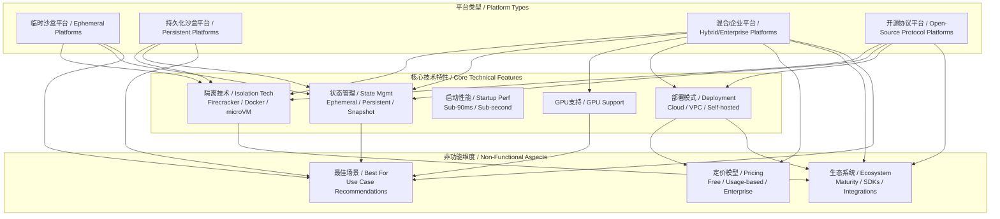
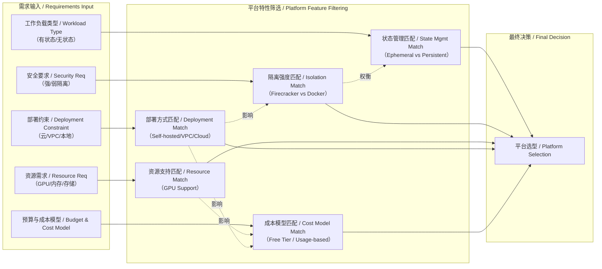

# NEWS/NEWS 任务报告

- agent: news/news
- requestId: 1773936648366-7bl932
- 生成时间(UTC): 2026-03-19T16:24:12.792Z

## 链接总结

- URL: https://rywalker.com/research/ai-agent-sandboxes

# AI Agent沙盒平台比较与选型分析

## 整体结构化文档表达
### 文档卡片
- **主题（中文/English）**：AI Agent沙盒平台比较 / AI Agent Sandbox Platforms Comparison  
- **一句话摘要**：本文综合比较多个AI Agent沙盒平台的技术特性、市场定位与选型策略，分析短暂型与持久型模型的分裂及未来趋势。  
- **目标读者**：AI开发者、技术决策者、基础设施研究者  
- **核心结论（3条）**：  
  1. 市场正分裂为短暂型（安全优先）和持久型（生产力优先）两大阵营，分别以E2B和Sprites/Daytona为代表。  
  2. 平台选择高度依赖工作负载特征，包括状态管理需求、GPU计算需求、部署环境及成本模型。  
  3. 长期趋势显示检查点/恢复和Computer Use将成标配，市场可能整合为2-3个领导者，胜出取决于模型适配与企业偏好。  

### 内容结构树
1. **背景与问题定义**：AI Agent需隔离、可重现的执行环境运行代码，沙盒平台作为基础设施解决安全执行问题。  
2. **核心观点与关键证据**：分析11个主流平台特性；识别市场分裂为短暂/持久两派；通过比较矩阵评估维度；引用采用数据（如E2B 200M+沙盒）和技术指标（如Daytona 90ms创建）。  
3. **方法/机制/路径**：采用多维度比较法，从隔离技术、状态管理、启动性能、GPU支持、定价、部署方式等横向评估；使用分类法区分沙盒模型；通过用例匹配推荐平台。  
4. **风险与边界条件**：隔离强度权衡（Firecracker vs Docker）；新产品生态不成熟（如Sprites）；GPU按小时计费的成本风险；语言限制（如Modal Python-centric）；提供商特定限制（如Vercel AI Gateway非执行沙盒）。  
5. **结论与行动建议**：结论为无通用最优解，需匹配用例；行动建议包括明确需求优先级、利用免费试用测试、评估长期成本、关注技术演进（如检查点标配）。  

### 结构化元数据（JSON）
```json
{
  "title": "AI Agent沙盒平台比较与选型分析",
  "topic_zh": "AI Agent沙盒平台比较",
  "topic_en": "AI Agent Sandbox Platforms Comparison",
  "audience": "AI开发者、技术决策者、基础设施研究者",
  "claims": [
    "市场正分裂为短暂型（安全优先）和持久型（生产力优先）两大阵营",
    "平台选择高度依赖工作负载特征（状态需求、GPU需求、部署要求）",
    "长期趋势：检查点/恢复和Computer Use将成标配，市场可能整合"
  ],
  "evidence": [
    "E2B已启动超过2亿个沙盒，并被财富100强企业采用",
    "Daytona的沙盒创建时间为90毫秒",
    "Modal是GPU工作负载的明确领导者",
    "Sprites提供持久虚拟机和即时检查点/恢复功能",
    "OpenSandbox是阿里巴巴推出的协议驱动开源方案，支持多语言SDK和Docker/Kubernetes运行时",
    "所有平台提供慷慨的免费层级（30-50美元额度）",
    "E2B和Sprites提供按秒计费；Modal按秒计费但GPU有溢价",
    "Vercel AI Gateway是API代理，不是执行沙盒",
    "Firecracker提供硬件级隔离，安全等级最高",
    "Docker-based隔离方案安全性弱于Firecracker"
  ],
  "risks": [
    "Docker-based隔离方案安全性弱于Firecracker",
    "新产品（如Sprites）生态系统仍在成熟，可能面临兼容性问题",
    "GPU按小时计费在长时间运行中成本高昂",
    "平台过度设计（如Northflank对简单用例）可能增加管理复杂度",
    "语言限制（如Modal的Python-centric）可能阻碍多语言代理集成"
  ],
  "actions": [
    "根据用例明确核心需求：隔离级别、状态持久性、GPU需求、部署位置",
    "利用免费试用层（如Modal $30额度、Northflank免费沙盒层）进行基准测试",
    "评估长期成本：使用平台定价计算器模拟预期负载（特别是GPU小时）",
    "若需强隔离与自托管，优先评估OpenSandbox或Northflank",
    "若需极速创建与Computer Use，评估Daytona；若需Python与GPU弹性，评估Modal"
  ]
}
```

## 处理流程
1. **输入识别**：来源为Ry Walker研究网页 (https://rywalker.com/research/ai-agent-sandboxes)，内容为AI Agent沙盒平台的比较分析。  
2. **信息抽取**：从输入中抽取实体（平台名称、技术组件）、概念（沙盒类型、隔离技术等）、问题（选型策略）、事实（性能数据、定价）、观点（市场趋势、推荐）。  
3. **结构化归纳**：将信息归纳为统一框架，包括定义沙盒、分类模型（短暂/持久）、比较维度、风险分析、选型建议。  
4. **关系建模**：建立概念间关系，如沙盒模型类型决定检查点功能可用性；隔离技术与安全等级相关；GPU支持与工作负载匹配。  
5. **可视化表达**：生成概念结构图和逻辑因果图，使用真实概念节点。  

## 概念清单（中英文）
- AI Agent沙盒 / AI Agent Sandbox
- 短暂型沙盒 / Ephemeral Sandbox
- 持久型虚拟机 / Persistent VM
- 检查点/恢复 / Checkpoint/Restore
- Firecracker微虚拟机 / Firecracker microVM
- Docker / Docker
- Kubernetes / Kubernetes
- GPU工作负载 / GPU Workload
- Computer Use / Computer Use
- 隔离 / Isolation
- 安全 / Security
- 可扩展性 / Scalability
- API/SDK / API/SDK
- 财富100强 / Fortune 100
- 免费层级 / Free Tier
- 按秒计费 / Per-second Billing
- 无服务器 / Serverless
- VPC部署 / VPC Deployment
- 多语言SDK / Multi-language SDK
- 协议驱动 / Protocol-driven
- 开源 / Open-source
- 微虚拟机 / microVM
- gVisor / gVisor
- 命名空间 / Namespace
- 自定义 / Custom
- API代理 / API Proxy
- 短暂执行 / Ephemeral Execution
- 状态维护 / State Maintenance
- 浏览器/桌面自动化 / Browser/Desktop Automation
- 沙盒协议 / Sandbox Protocol
- 硬件级隔离 / Hardware-level Isolation
- 基于Docker的隔离 / Docker-based Isolation
- 按需计费 / Usage-based Billing
- 冷启动 / Cold Start
- 弹性伸缩 / Autoscaling
- 虚拟桌面 / Virtual Desktop
- 基础设施即代码 / Infrastructure as Code
- 分布式文件系统 / Distributed Filesystem
- 命名空间/控制组 / Namespaces/cgroups
- Kubernetes运行时 / Kubernetes Runtime
- 网络策略 / Network Policy
- 入口网关 / Ingress Gateway
- 出口控制 / Egress Controls
- 命令行解释器 / Command Interpreter
- 代码解释器 / Code Interpreter
- 语言服务器协议 / LSP
- SSH访问 / SSH Access
- VS Code浏览器 / VS Code Browser
- Web终端 / Web Terminal
- 持续集成/持续部署 / CI/CD
- 成本控制 / Cost Controls
- 试用额度 / Trial Credits
- 每CPU小时 / per CPU-hour
- 每GB小时内存 / per GB-hour memory
- 每GPU小时 / per GPU-hour
- 持久化存储卷 / Persistent Volumes
- S3兼容存储 / S3-compatible Storage
- 对象存储 / Object Storage
- ext4文件系统 / ext4 filesystem
- 仓库连接 / Repo Connections
- 环境自动推断 / Automatic Environment Inference
- 协议驱动架构 / Protocol-driven Architecture
- 生命周期API / Lifecycle APIs
- 执行API / Execution APIs
- 内置实现 / Built-in Implementations
- 路由策略 / Routing Strategies
- 示例应用 / Examples
- 双许可 / Dual Licensing
- GitHub星标 / GitHub Stars
- Bare-metal hypervisor / Bare-metal hypervisor
- 命令执行 / Command Execution
- 隔离技术 / Isolation Technologies
- 持久沙盒 / Persistent Sandboxes
- SOC2
- 自托管 / Self-hosting
- 自定义模板 / Custom templates
- 团队功能 / Team features
- 容器网络 / Container networking
- Forking机制 / Forking mechanism
- 快照 / Snapshots
- 休眠 / Hibernation
- BYOK（自带密钥）/ BYOK (Bring Your Own Key)
- 热插拔提供商 / Hot-swappable providers
- 供应商锁定 / Vendor lock-in
- SWE-bench / SWE-bench
- 多提供商灵活性 / Multi-provider flexibility
- 临时性 / Ephemeral
- 持久性 / Persistent
- Kubernetes规模 / Kubernetes Scale
- 代理编排平台 / Agent Orchestration Platforms
- 市场整合 / Market Consolidation
- 专业化沙盒 / Specialized Sandboxes
- 采用率 / Adoption Rate
- CodeSandbox / CodeSandbox
- ComputeSDK / ComputeSDK
- Daytona / Daytona
- E2B / E2B
- Modal / Modal
- Northflank / Northflank
- OpenSandbox / OpenSandbox
- Quilt / Quilt
- Runloop / Runloop
- Sprites / Sprites

## 概念定义（中英文）
- **AI Agent沙盒 / AI Agent Sandbox**：为安全运行AI生成或任意代码而设计的隔离执行环境，提供隔离、API/SDK、安全性和可扩展性。  
- **短暂型沙盒 / Ephemeral Sandbox**：临时创建、执行后销毁的沙盒，强调快速启动和安全性，不保留状态。  
- **持久型虚拟机 / Persistent VM**：长期存在的虚拟机，支持状态保存、检查点/恢复，适用于需要连续上下文的Agent。  
- **检查点/恢复 / Checkpoint/Restore**：保存虚拟机状态并能在之后恢复的能力，实现快速重启和状态保持。  
- **Firecracker微虚拟机 / Firecracker microVM**：轻量级虚拟化技术，用于快速启动和安全隔离，如AWS Lambda所用。  
- **Docker / Docker**：容器化平台，提供操作系统级虚拟化。  
- **Kubernetes / Kubernetes**：容器编排系统，用于自动化部署、扩展和管理容器化应用。  
- **GPU工作负载 / GPU Workload**：需要图形处理器计算的任务，如机器学习训练。  
- **Computer Use / Computer Use**：控制浏览器或桌面环境的能力，用于自动化交互。  
- **隔离 / Isolation**：代码运行在独立环境中，与主机系统分离。  
- **安全 / Security**：保护系统免受恶意或错误代码危害。  
- **可扩展性 / Scalability**：支持同时运行大量沙盒的能力。  
- **API/SDK / API/SDK**：程序接口和软件开发工具包，用于管理沙盒。  
- **财富100强 / Fortune 100**：美国财富杂志评选的全球前100家公司。  
- **免费层级 / Free Tier**：平台提供的免费使用额度。  
- **按秒计费 / Per-second Billing**：根据实际使用时间计费的模式。  
- **无服务器 / Serverless**：无需管理服务器，按需运行代码的云服务模式。  
- **VPC部署 / VPC Deployment**：在虚拟私有云中部署，提供网络隔离。  
- **多语言SDK / Multi-language SDK**：支持多种编程语言的软件开发工具包。  
- **协议驱动 / Protocol-driven**：基于开放协议构建，促进互操作性。  
- **开源 / Open-source**：源代码公开，允许自由修改和分发。  
- **微虚拟机 / microVM**：轻量级虚拟机，启动速度快，资源开销小。  
- **gVisor / gVisor**：Google的容器沙盒运行时，提供内核级隔离。  
- **命名空间 / Namespace**：Linux内核特性，用于资源隔离。  
- **自定义 / Custom**：平台允许用户定制环境。  
- **API代理 / API Proxy**：作为API中继的服务，不执行代码。  
- **短暂执行 / Ephemeral Execution**：一次性代码执行，不保留状态。  
- **状态维护 / State Maintenance**：在多次执行间保持数据或环境状态。  
- **浏览器/桌面自动化 / Browser/Desktop Automation**：通过程序控制浏览器或桌面应用。  
- **沙盒协议 / Sandbox Protocol**：由OpenSandbox定义的一套标准化API，用于统一管理沙盒的生命周期和执行操作。  
- **硬件级隔离 / Hardware-level Isolation**：通过虚拟机监控器提供的强隔离，如Firecracker。  
- **基于Docker的隔离 / Docker-based Isolation**：利用Docker容器提供的进程级隔离，隔离性较弱。  
- **按需计费 / Usage-based Billing**：根据实际资源消耗计费，如按秒计费。  
- **冷启动 / Cold Start**：沙盒从零开始创建的时间，影响交互性能。  
- **弹性伸缩 / Autoscaling**：根据负载自动调整资源的能力。  
- **虚拟桌面 / Virtual Desktop**：提供完整桌面环境的沙盒，支持图形界面操作。  
- **基础设施即代码 / Infrastructure as Code**：使用代码定义和管理计算资源，如Modal的Python API。  
- **分布式文件系统 / Distributed Filesystem**：跨多节点共享的文件系统，如Sprites使用的对象存储后端。  
- **命名空间/控制组 / Namespaces/cgroups**：Linux内核特性，用于容器资源隔离。  
- **Kubernetes运行时 / Kubernetes Runtime**：在Kubernetes集群中运行沙盒的机制。  
- **网络策略 / Network Policy**：控制容器间网络流量的规则。  
- **入口网关 / Ingress Gateway**：管理外部访问集群内服务的入口点。  
- **出口控制 / Egress Controls**：控制从沙盒到外部网络的出站流量。  
- **命令行解释器 / Command Interpreter**：执行shell命令的组件，如沙盒中的终端。  
- **代码解释器 / Code Interpreter**：执行用户代码的组件，如Jupyter内核。  
- **语言服务器协议 / LSP**：为编辑器提供语言智能的协议，沙盒可能支持以增强开发体验。  
- **SSH访问 / SSH Access**：通过SSH协议远程登录沙盒进行管理。  
- **VS Code浏览器 / VS Code Browser**：在浏览器中运行VS Code，用于远程开发。  
- **Web终端 / Web Terminal**：通过网页访问的终端界面。  
- **持续集成/持续部署 / CI/CD**：自动化构建、测试和部署的流程，沙盒可能集成。  
- **成本控制 / Cost Controls**：管理云资源花费的策略和工具。  
- **试用额度 / Trial Credits**：新用户免费使用的信用额度。  
- **每CPU小时 / per CPU-hour**：按CPU使用时间计费的单位。  
- **每GB小时内存 / per GB-hour memory**：按内存使用时间计费的单位。  
- **每GPU小时 / per GPU-hour**：按GPU使用时间计费的单位。  
- **持久化存储卷 / Persistent Volumes**：在沙盒生命周期外保留数据的存储。  
- **S3兼容存储 / S3-compatible Storage**：兼容Amazon S3 API的对象存储服务。  
- **对象存储 / Object Storage**：用于存储非结构化数据的存储架构。  
- **ext4文件系统 / ext4 filesystem**：Linux常用的文件系统格式。  
- **仓库连接 / Repo Connections**：沙盒与代码仓库（如Git）的集成。  
- **环境自动推断 / Automatic Environment Inference**：根据代码自动配置依赖环境。  
- **协议驱动架构 / Protocol-driven Architecture**：基于开放协议设计系统，提高互操作性。  
- **生命周期API / Lifecycle APIs**：管理沙盒创建、销毁等生命周期的接口。  
- **执行API / Execution APIs**：在沙盒内运行命令或代码的接口。  
- **内置实现 / Built-in Implementations**：平台预置的常用环境或工具。  
- **路由策略 / Routing Strategies**：决定网络流量如何路由的规则。  
- **示例应用 / Examples**：平台提供的示例代码或模板。  
- **双许可 / Dual Licensing**：软件同时提供开源和商业许可。  
- **GitHub星标 / GitHub Stars**：GitHub上用户收藏项目的数量，反映流行度。  
- **Bare-metal hypervisor / Bare-metal hypervisor**：直接运行在硬件上的虚拟机监控器，如Xen。  
- **命令执行 / Command Execution**：在沙盒中运行shell命令的能力。  
- **隔离技术 / Isolation Technologies**：实现沙盒隔离的底层技术，包括硬件级、内核级、容器级等。  
- **持久沙盒 / Persistent Sandboxes**：状态在多次会话间得以保留的沙盒。  
- **SOC2**：未提及明确定义，文中指安全合规认证。  
- **自托管 / Self-hosting**：用户在自己的基础设施上部署沙盒环境。  
- **自定义模板 / Custom templates**：允许用户预配置沙盒环境模板。  
- **团队功能 / Team features**：支持多用户协作、权限管理等团队级功能。  
- **容器网络 / Container networking**：沙盒间或沙盒与外部网络的连接能力。  
- **Forking机制 / Forking mechanism**：基于现有沙盒创建副本，用于A/B测试或并行实验。  
- **快照 / Snapshots**：沙盒状态的即时保存点。  
- **休眠 / Hibernation**：暂停沙盒以节省资源，之后恢复。  
- **BYOK（自带密钥）/ BYOK (Bring Your Own Key)**：用户使用自己的加密密钥管理数据。  
- **热插拔提供商 / Hot-swappable providers**：通过配置切换底层沙盒提供商，无需代码重写。  
- **供应商锁定 / Vendor lock-in**：用户被特定提供商绑定，难以迁移。  
- **SWE-bench / SWE-bench**：软件工程基准测试套件，用于评估代理能力。  
- **多提供商灵活性 / Multi-provider flexibility**：支持在多个沙盒提供商间选择或切换。  
- **临时性 / Ephemeral**：未提及明确定义，文中用于描述沙盒执行生命周期短暂。  
- **持久性 / Persistent**：未提及明确定义，文中用于描述沙盒状态可持久化。  
- **Kubernetes规模 / Kubernetes Scale**：未提及明确定义，文中指可扩展至Kubernetes集群规模。  
- **代理编排平台 / Agent Orchestration Platforms**：未提及明确定义，文中指管理多个AI代理执行和协调的平台。  
- **市场整合 / Market Consolidation**：未提及明确定义，文中指市场可能收缩至少数主导者。  
- **专业化沙盒 / Specialized Sandboxes**：未提及明确定义，文中指为特定类型AI代理优化的沙盒。  
- **采用率 / Adoption Rate**：未提及明确定义，文中指平台被用户使用的广泛程度。  
- **CodeSandbox / CodeSandbox**：文中描述为专注于Web开发代理，优势在于代码分支和成熟生态系统。  
- **ComputeSDK / ComputeSDK**：统一抽象层，允许一次编写在多个沙盒提供商运行，免费开源。  
- **Daytona / Daytona**：强调计算机使用和速度，90毫秒创建，支持多操作系统桌面。  
- **E2B / E2B**：擅长大规模临时执行，拥有海量沙盒和财富100强采用。  
- **Modal / Modal**：专注于GPU工作负载，弹性GPU扩展，Python原生。  
- **Northflank / Northflank**：面向企业VPC和GPU，支持自带云部署，微VM/gVisor隔离。  
- **OpenSandbox / OpenSandbox**：自托管Kubernetes规模，协议驱动，多语言SDK，阿里支持。  
- **Quilt / Quilt**：支持多容器代理，开源，容器间网络。  
- **Runloop / Runloop**：用于代理开发和评估，集成SWE-bench，磁盘快照。  
- **Sprites / Sprites**：持久化状态与检查点，对象存储持久性，即时恢复。  

## 概念关联与逻辑关系（中英文）
1. **沙盒模型类型（短暂型/持久型） 决定 检查点/恢复功能可用性**：短暂型沙盒不提供检查点/恢复，持久型沙盒提供。  
   / Sandbox model type (ephemeral/persistent) determines checkpoint/restore availability: ephemeral sandboxes do not offer checkpoint/restore, persistent sandboxes do.  
2. **创建时间 与 隔离技术 相关**：使用Firecracker微虚拟机的平台（如E2B、Sprites）实现快速创建（~150ms或更快），而基于Docker的平台可能稍慢。  
   / Creation time correlates with isolation technology: Platforms using Firecracker microVMs (e.g., E2B, Sprites) achieve fast creation (~150ms or faster), while Docker-based platforms may be slower.  
3. **GPU支持 与 工作负载类型 相关**：需要GPU计算的工作负载应选择支持GPU的平台（如Modal），CPU密集型工作负载可选择任何平台。  
   / GPU support relates to workload type: GPU-intensive workloads require platforms with GPU support (e.g., Modal), while CPU-intensive workloads can use any platform.  

## COT逻辑梳理
- **Step 1: 定义核心问题**：如何为AI代理选择最合适的沙盒执行环境？关键维度包括隔离性、状态管理、性能、成本、部署与生态。  
- **Step 2: 分类沙盒平台**：  
  - 按状态管理：临时型（如E2B）、持久型（如Sprites）、混合型（如Northflank）。  
  - 按隔离技术：硬件级（Firecracker）、内核级（gVisor）、容器级（Docker）。  
  - 按部署模式：全托管云（Modal）、VPC私有部署（Northflank）、自托管开源（OpenSandbox）。  
  - 按核心优势：速度（Daytona）、持久化（Sprites）、GPU弹性（Modal）、企业级（Northflank）、协议开放（OpenSandbox）。  
- **Step 3: 比较关键维度**：  
  - 隔离性：Firecracker > gVisor > Docker。  
  - 启动速度：容器/微虚拟机（<100ms）> 传统VM（秒级）。  
  - 状态能力：持久化平台 > 临时平台。  
  - GPU支持：Modal、Northflank明确支持。  
  - 成本：开源免费 < 按需计费 < 企业合同。  
- **Step 4: 因果与权衡分析**：  
  - 因果链：工作负载需求（有状态/无状态、GPU需求） → 沙盒特性需求（持久性、GPU支持） → 平台筛选 → 比较隔离性、速度、成本 → 最终选型。  
  - 核心权衡：  
    1. 安全 vs 性能/成本：强隔离（Firecracker）通常成本更高；弱隔离（Docker）反之。  
    2. 功能 vs 复杂度：全功能平台（Northflank）可能“过重”；轻量方案（Quilt）需自行组合。  
    3. 开箱即用 vs 控制力：托管服务易用但受限于供应商；自托管可控但需运维投入。  
- **Step 5: 科学方法论指导选型**：  
  - 实证测试：利用免费层级对候选平台进行基准测试。  
  - 需求优先级排序：明确“必须有”与“最好有”的特性，加权评分。  
  - 考虑演进：评估平台路线图与自身技术栈发展是否匹配。  

## 事实与看法
### 事实
- E2B已启动超过2亿个沙盒，并被财富100强企业采用。  
- Daytona的沙盒创建时间为90毫秒。  
- Modal是GPU工作负载的明确领导者。  
- Sprites提供持久虚拟机和即时检查点/恢复功能。  
- OpenSandbox是阿里巴巴推出的协议驱动开源方案，支持多语言SDK和Docker/Kubernetes运行时。  
- 所有平台提供慷慨的免费层级（30-50美元额度）。  
- E2B和Sprites提供按秒计费；Modal按秒计费但GPU有溢价。  
- Vercel AI Gateway是API代理，不是执行沙盒。  
- Firecracker提供硬件级隔离，安全等级最高。  
- Docker-based隔离方案安全性弱于Firecracker。  
- Sprites的checkpoint/restore耗时约1秒。  
- Daytona支持Computer Use沙盒（控制虚拟桌面）。  
- Modal支持GPU（NVIDIA A100, H100）访问，无配额限制。  
- Modal允许用Python代码定义基础设施（无YAML）。  
- Northflank提供微虚拟机和gVisor隔离，支持VPC部署。  
- Northflank GPU价格（H100 $2.74/小时）比大云低约62%。  
- Northflank提供高达64TB的持久化存储卷。  
- OpenSandbox定义了“Sandbox Protocol”标准化API。  
- OpenSandbox提供Python, Java/Kotlin, JS/TS, C#/.NET SDK（Go在路线图）。  
- OpenSandbox运行时：本地开发用Docker，分布式调度用Kubernetes。  
- Quilt容器创建时间约200毫秒。  
- Quilt支持容器间通信（ICC）。  
- Quilt使用Linux命名空间+cgroups隔离。  
- Runloop vCPU速度比标准快2倍，命令执行100ms。  
- Runloop支持磁盘状态快照和分支。  
- Runloop内置SWE-bench集成。  
- CodeSandbox SDK被Together AI收购。  
- ComputeSDK是免费开源的TypeScript项目，支持E2B、Daytona、Modal、Vercel、CodeSandbox。  
- 隔离技术表格显示Firecracker提供硬件级隔离，安全等级最高。  
- 临时沙盒模型每次创建全新环境，无状态残留。  
- 持久沙盒模型支持状态保存和检查点/恢复。  
- 企业功能对比表格显示各提供商在SOC2、自托管等特性的具体支持情况。  

### 看法
- E2B在短暂沙盒市场占据主导地位。  
- Sprites挑战了短暂模型，引入持久VM。  
- Daytona提供最快创建和Computer Use支持。  
- Modal是GPU工作负载的明确领导者。  
- 市场正在分裂为短暂型（安全优先）和持久型（生产力优先）阵营。  
- 到2027年，检查点/恢复将成为所有平台的标配功能。  
- 到2028年，Computer Use将成为标准功能，而非差异化特性。  
- Fly.io认为“ephemeral sandboxes are obsolete” for AI agents。  
- E2B认为ephemerality是安全敏感企业部署的“feature, not a bug”。  
- 推荐高安全企业首选E2B，持久状态首选Sprites，GPU工作负载首选Modal。  
- 市场展望：Checkpoint/restore将 spreading，Computer Use becoming standard，GPU support expanding。  
- 无通用最优解，需根据用例选择。  
- 隔离性比较：Docker-based isolation weaker than Firecracker。  
- 产品阶段判断：Sprites生态系统仍在成熟，Quilt是早期阶段产品，Runloop聚焦agent benchmarking。  
- 价值判断：Northflank对简单用例可能过度设计，Modal less suitable for polyglot agents。  

## FAQ（原文问题整理）
1. **问：最好的AI Agent沙盒是什么？**  
   **答**：根据用例：短暂执行选E2B，持久状态选Sprites，Computer Use选Daytona，GPU工作负载选Modal，自托管K8s选OpenSandbox，多提供商灵活性选ComputeSDK。  
2. **问：应该使用短暂型还是持久型沙盒？**  
   **答**：短暂型适用于无状态代码执行和高安全性需求；持久型适用于需要维护状态、已安装包或运行间上下文的Agent。  
3. **问：哪个沙盒支持GPU？**  
   **答**：Modal是GPU工作负载的明确领导者。其他平台主要专注于CPU代码执行。  
4. **问：最便宜的选项是什么？**  
   **答**：所有平台都有慷慨的免费层级（30-50美元）。生产环境中，E2B和Sprites提供按秒计费；Modal按秒计费但GPU有额外费用。  
5. **问：如何选择沙盒平台？**  
   **答**：根据用例选择：短暂选E2B，持久选Sprites/Daytona，GPU选Modal，自托管选OpenSandbox，多提供商灵活性选ComputeSDK。  

## Visualization
### Mermaid 图 1（概念结构图）


### Mermaid 图 2（逻辑/因果图）


## 文章中的类比
- **检查点/恢复如Git**：Sprites的checkpoint/restore被描述为“like git for the whole system”。Runloop的snapshot and branch被描述为“like git for sandboxes”。  
- **ComputeSDK如Terraform**：ComputeSDK被描述为“Terraform for running other people's code”。  
- **Claude的渴望**：“Claude doesn't want a stateless container, it wants a computer.”（Claude不想要无状态容器，它想要一台计算机。）  

## 10个金句
1. "These platforms solve the problem of 'where should AI-generated code run?'"  
2. "E2B dominates with 200M+ sandboxes started and Fortune 100 adoption."  
3. "Sprites challenges the ephemeral model with persistent VMs and instant checkpoint/restore."  
4. "Daytona offers the fastest creation (90ms) and unique Computer Use support."  
5. "The market is splitting into ephemeral (security-first) vs persistent (productivity-first) camps."  
6. "By 2027, checkpoint/restore will become table stakes across all platforms."  
7. "By 2028, Computer Use (browser/desktop) will be a standard feature, not a differentiator."  
8. "AI agent sandboxes are isolated execution environments designed for running AI-generated or arbitrary code safely."  
9. "Modal is the clear leader for GPU workloads."  
10. "All have generous free tiers ($30-50)."
