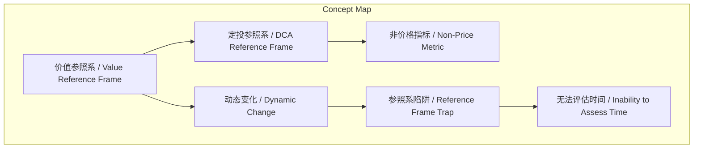
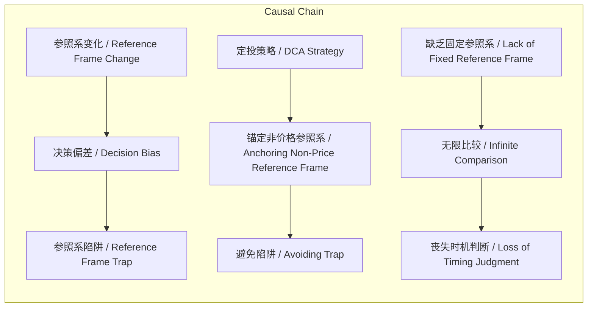

# NEWS/NEWS 任务报告

- agent: news/news
- requestId: 1773963782873-tkvj3h
- 生成时间(UTC): 2026-03-19T23:44:09.174Z

## 文本总结

# 投资中的参照系陷阱与定投策略

## 整体结构化文档表达
### 文档卡片
- 主题（中文/English）：投资心理与定投策略 / Investment Psychology and Dollar-Cost Averaging
- 一句话摘要：投资者常因动态变化的价值参照系而陷入决策陷阱，定投执行者应锚定非价格指标以避免无限比较。
- 目标读者：投资者，尤其是定期定额投资实践者
- 核心结论（3条）：
  1. 投资者的价值参照系会随时间动态变化，从本金到收益率再到他人比较。
  2. 定投策略要求执行者以非价格因素为参照系，而非市场价格。
  3. 缺乏固定参照系将导致投资者陷入无限参照系陷阱，无法评估当前时点。

### 内容结构树
1. 背景与问题定义：投资者在投资决策中依赖的价值参照系不断变化，导致行为偏差。
2. 核心观点与关键证据：参照系变化分为四个阶段；定投参照系非价格；无固定参照系则跌入陷阱。
3. 方法/机制/路径：定投执行者应明确并坚持非价格参照系，如投资目标、风险承受度。
4. 风险与边界条件：若参照系不固定，会持续与他人比较，丧失客观评估能力。
5. 结论与行动建议：投资者需识别并锚定适合自己的参照系，避免受市场波动和他人影响。

### 结构化元数据（JSON）
```json
{
  "title": "投资中的参照系陷阱与定投策略",
  "topic_zh": "投资心理与定投策略",
  "topic_en": "Investment Psychology and Dollar-Cost Averaging",
  "audience": "投资者，尤其是定期定额投资实践者",
  "claims": [
    "投资者的价值参照系会随时间动态变化",
    "定投策略要求执行者以非价格因素为参照系",
    "缺乏固定参照系将导致投资者陷入无限参照系陷阱"
  ],
  "evidence": [
    "参照系变换：从关注本金到收益率再到与他人比较",
    "定投执行者的参照系不是价格",
    "没有选择会跌入无数参照系陷阱，永远不知道现在的时间"
  ],
  "risks": [
    "参照系频繁变化导致决策偏差",
    "陷入与他人无休止的比较",
    "丧失对当前投资时机的客观判断"
  ],
  "actions": [
    "明确并坚持非价格参照系，如投资目标或风险承受度",
    "避免受市场价格波动和他人收益影响",
    "定期审视并调整参照系，但需保持核心稳定"
  ]
}
```

## 处理流程
1. 输入识别：识别用户输入文本为关于投资参照系与定投策略的讨论。
2. 信息抽取：抽取实体（如参照系、定投）、概念（价值参照系、本金）、问题（参照系陷阱）、事实（参照系变换）与观点（定投参照系非价格）。
3. 结构化归纳：将内容归纳为背景、观点、方法、风险、结论五部分。
4. 关系建模：建立参照系变化、定投策略、陷阱之间的因果逻辑链。
5. 可视化表达：生成概念结构图与因果图。

## 概念清单（中英文）
- 复现 / Review
- 上涨的价格 / Rising Price
- 价值参照系 / Value Reference Frame
- 本金 / Principal
- 收益率 / Rate of Return
- 别人的本金和收益 / Others' Principal and Returns
- 定投执行者 / Dollar-Cost Averaging Executor
- 参照系陷阱 / Reference Frame Trap
- 时间 / Time

## 概念定义（中英文）
- 复现 / Review：重新审视或回顾过去的投资课程或经验。
- 上涨的价格 / Rising Price：资产市场价格的上升趋势。
- 价值参照系 / Value Reference Frame：投资者评估资产价值时所使用的比较基准或参考点。
- 本金 / Principal：初始投资的资金总额。
- 收益率 / Rate of Return：投资回报与本金的比例。
- 别人的本金和收益 / Others' Principal and Returns：其他投资者的投资本金和获得的收益。
- 定投执行者 / Dollar-Cost Averaging Executor：定期定额执行投资策略的个体。
- 参照系陷阱 / Reference Frame Trap：因参照系不断变化而无法做出稳定决策的困境。
- 时间 / Time：投资中的当前时点或持有期。

## 概念关联与逻辑关系（中英文）
1. 价值参照系 / Value Reference Frame 的动态变化 → 决策偏差 / Decision Bias（形式化：Δ参照系 → 偏差）
2. 定投执行者 / Dollar-Cost Averaging Executor 锚定 非价格指标 / Non-Price Metric → 规避 参照系陷阱 / Reference Frame Trap（形式化：定投 ∧ 非价格参照系 → ¬陷阱）
3. 缺乏固定参照系 / Lack of Fixed Reference Frame → 无限比较 / Infinite Comparison → 无法评估时间 / Inability to Assess Time（形式化：¬固定参照系 → 比较 ∞ ∧ 时间评估失效）

## COT逻辑梳理（定义/分类/比较/因果/科学方法论）
Step 1: 定义参照系为投资者评估价值的动态基准，源自自我观察。
Step 2: 分类参照系类型：价格相关（本金、收益率）与非价格（定投目标），以及社会比较（他人收益）。
Step 3: 比较不同参照系：价格相关导致短期波动反应，非价格促进长期纪律；社会比较引发焦虑。
Step 4: 因果分析：参照系变化（因）→ 行为偏差（果）→ 陷阱；固定非价格参照系（因）→ 稳定决策（果）。
Step 5: 科学方法论：通过复现历史课程（实验观察）和自我观察（案例归纳），得出定投需非价格参照系的结论。

## 事实与看法（病毒）
### 事实
- 投资者的价值参照系一直在变换。
- 参照系变换包括：一开始关注本金，高收益率后关注收益率，与他人比较。
- 定投执行者的参照系不是价格。
- 没有选择会跌入无数参照系陷阱，永远不知道现在的时间。
### 看法
- 所有人都是因为上涨的价格吸引进来的（推测性归因）。
- 跌入参照系陷阱是负面结果（价值判断）。

## FAQ（原文问题整理）
- 未发现明确提问。原文以陈述和隐喻（“你到底戴了几块表？”）为主，无直接问题。

## Visualization
### Mermaid 图 1（概念结构图）

### Mermaid 图 2（逻辑/因果图）


## 文章中的类比
- “你到底戴了几块表？”：比喻投资者同时使用多个参照系，如同佩戴多块手表显示不同时间，导致混乱。

## 10个金句
1. 所有人都是因为上涨的价格吸引进来的。
2. 我们的价值参照系一直在变换。
3. 一开始是本金：过分关注价格。
4. 当有获得过高收益率之后，就会变成关注收益率。
5. 还有别人的本金和收益做比较（和其他人比）。
6. 作为定投执行者，我们的参照系不是价格。
7. 如果我们没有选择，就会跌入无数个参照系的陷阱中。
8. 永远都不知道现在的时间。
9. 复现下2019年7月的课。
10. 讲曾经的想做，却又没做的决策结果。
