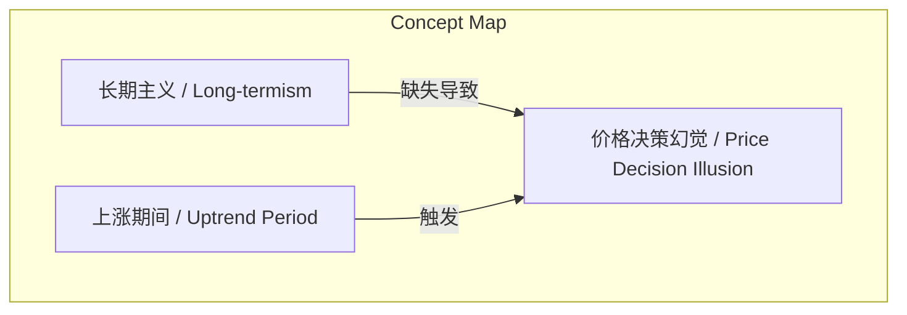
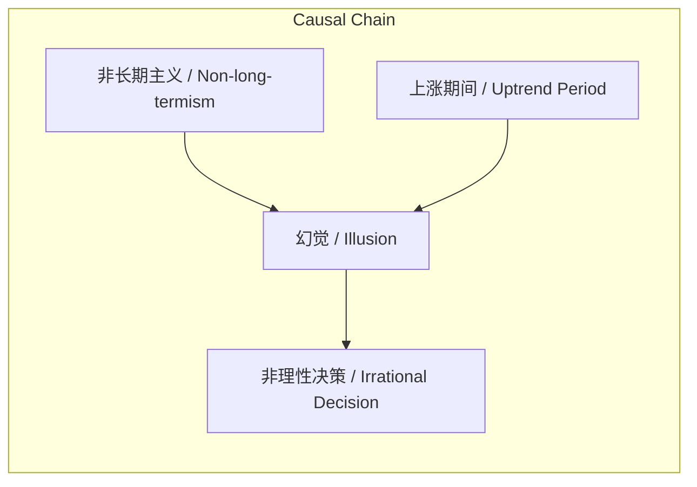

# NEWS/NEWS 任务报告

- agent: news/news
- requestId: 1773964967450-h6oxmj
- 生成时间(UTC): 2026-03-20T00:03:50.901Z

## 文本总结

# 价格决策幻觉与长期主义缺失

## 整体结构化文档表达
### 文档卡片
- 主题（价格决策幻觉 / Price Decision Illusion）：
- 一句话摘要：文章列举价格上涨期间常见的8种决策幻觉，并指出其根源在于参与者缺乏长期主义思维。
- 目标读者：投资者、交易员、行为经济学爱好者
- 核心结论（3条）：
  1. 价格上涨期间存在8种典型决策幻觉。
  2. 这些幻觉反映非理性决策模式。
  3. 幻觉的根源在于决策者非长期主义。

### 内容结构树
1. 背景与问题定义：在价格波动中，投资者常受认知偏差影响产生非理性判断。
2. 核心观点与关键证据：列出8个具体幻觉表述，并归因于“不是长期主义者”。
3. 方法/机制/路径：未明确提及具体方法或机制。
4. 风险与边界条件：未明确提及风险或边界条件。
5. 结论与行动建议：未明确给出行动建议，仅指出根源。

### 结构化元数据（JSON）
```json
{
  "title": "价格决策幻觉与长期主义缺失",
  "topic_zh": "价格决策幻觉",
  "topic_en": "Price Decision Illusion",
  "audience": "投资者、交易员、行为经济学爱好者",
  "claims": [
    "价格上涨期间存在8种典型决策幻觉",
    "这些幻觉反映非理性决策模式",
    "幻觉的根源在于决策者非长期主义"
  ],
  "evidence": [
    "幻觉1: 都这么贵了",
    "幻觉2: 之前买就好了",
    "幻觉3: 幸亏卖了",
    "幻觉4: 要是跌下去我肯定买！",
    "幻觉5: 这下子还得继续使劲跌！",
    "幻觉6: 为什么涨了这么多！？",
    "幻觉7: 我要是再这里卖出去 再在这里买回来的话",
    "幻觉8: 你看我说什么来着？"
  ],
  "risks": ["未提及"],
  "actions": ["未提及"]
}
```

## 处理流程
1. 输入识别：识别到用户提供的文本讨论价格决策幻觉及其根源。
2. 信息抽取：抽取出8个幻觉表述、上涨期间场景、长期主义概念。
3. 结构化归纳：定义幻觉，分类为8种表现，归因于长期主义缺失。
4. 关系建模：建立上涨期间、长期主义缺失与幻觉之间的因果逻辑。
5. 可视化表达：使用Mermaid绘制概念与因果图。

## 概念清单（中英文）
- 价格决策幻觉 / Price Decision Illusion
- 上涨期间 / Uptrend Period
- 长期主义 / Long-termism

## 概念定义（中英文）
- 价格决策幻觉：在价格波动过程中，投资者因认知偏差而产生的非理性决策倾向或错误判断。
- 上涨期间：价格处于上升趋势的时期。
- 长期主义：以长期价值创造为导向的决策理念，强调忽视短期波动。

## 概念关联与逻辑关系（中英文）
1. 长期主义缺失 → 价格决策幻觉（因果）：长期主义水平不足直接导致幻觉产生。
2. 上涨期间 → 触发价格决策幻觉（条件）：上涨场景是幻觉出现的触发条件。
3. 价格决策幻觉 → 非理性决策（结果）：幻觉必然引发非理性交易行为。

形式化表达：
- 设 L 为长期主义水平，I 为幻觉频率，则 I ∝ 1/L。
- 设 U 为上涨期间状态（U=1表示上涨，U=0否则），则 I = f(U) 且 U=1 时 I 显著增加。
- 幻觉产生条件：¬长期主义 ∧ 上涨期间 → 幻觉。

## COT逻辑梳理（定义/分类/比较/因果/科学方法论）
Step 1: 定义价格决策幻觉为价格变动中系统性非理性认知。
Step 2: 分类基于表现形式，将幻觉分为8种具体类型（如后悔、确认偏误等）。
Step 3: 比较发现所有幻觉均聚焦短期情绪，与长期价值评估脱节。
Step 4: 因果分析：非长期主义思维使决策者依赖直觉和情绪，在上涨期间易产生幻觉。
Step 5: 科学方法论：通过强化长期主义教育、建立决策清单，可识别并 mitigating 幻觉。

## 事实与看法（病毒）
### 事实
- 文章明确列出8个价格上涨期间可能出现的幻觉表述。
- 文章明确陈述“幻觉来源于他们不是长期主义者”。
### 看法
- 作者将上述表述定义为“幻觉”，即非理性认知偏差。
- 作者认为长期主义是解决幻觉的根本途径。

## FAQ（原文问题整理）
未发现明确提问。幻觉列表中的疑问句（如“为什么涨了这么多！？”）是作为幻觉内容呈现，非作者主动提问。

## Visualization
### Mermaid 图 1（概念结构图）


### Mermaid 图 2（逻辑/因果图）


## 文章中的类比
未发现明确类比。

## 10个金句
1. 都这么贵了
2. 之前买就好了
3. 幸亏卖了
4. 要是跌下去我肯定买！
5. 这下子还得继续使劲跌！
6. 为什么涨了这么多！？
7. 我要是再这里卖出去 再在这里买回来的话
8. 你看我说什么来着？
9. 幻觉来源于他们不是长期主义者
10. 原文未提供
