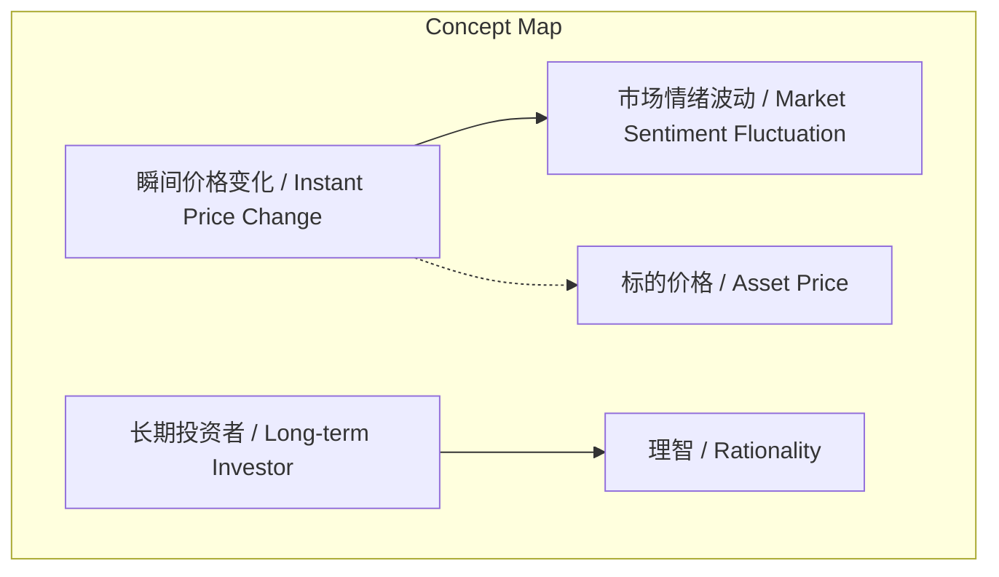
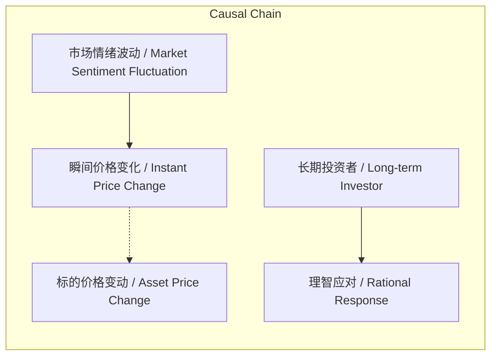

# NEWS/NEWS 任务报告

- agent: news/news
- requestId: 1773965036084-y64osn
- 生成时间(UTC): 2026-03-20T00:04:49.619Z

## 文本总结

# 瞬间价格波动反映情绪，长期投资方为理智

## 整体结构化文档表达
### 文档卡片
- 主题（中文/English）：定投策略与市场情绪 / Dollar-Cost Averaging and Market Sentiment
- 一句话摘要：瞬间价格变化仅反映市场情绪波动，不代表真实价值变动，非长期投资者难以保持理智。
- 目标读者：投资者，特别是定投实践者
- 核心结论（3条）：
  1. 瞬间价格变化不代表标的价格的真实变动。
  2. 瞬间价格变化本质是市场情绪的波动。
  3. 非长期投资者在瞬间价格波动面前缺乏理智。

### 内容结构树
1. 背景与问题定义：未提及明确背景，但隐含对“瞬间价格变化”意义的探讨。
2. 核心观点与关键证据：原文四点陈述。
3. 方法/机制/路径：未提及具体方法或机制。
4. 风险与边界条件：未提及。
5. 结论与行动建议：结论如上；行动建议未明确提及，但可推断为坚持长期定投。

### 结构化元数据（JSON）
```json
{
  "title": "瞬间价格波动反映情绪，长期投资方为理智",
  "topic_zh": "定投策略与市场情绪",
  "topic_en": "Dollar-Cost Averaging and Market Sentiment",
  "audience": "投资者，特别是定投实践者",
  "claims": [
    "瞬间价格变化不代表标的价格变动",
    "瞬间价格是市场情绪波动",
    "非长期投资者缺乏理智"
  ],
  "evidence": [
    "定投标的很多重要的定投策略本身",
    "瞬间价格变化并不是代表标的价格的变动",
    "任何时候瞬间价格只是市场情绪的波动",
    "如果不是长期投资者，是没有理智的"
  ],
  "risks": [],
  "actions": []
}
```

## 处理流程
1. 输入识别：识别文本为关于投资策略与价格波动的观点陈述。
2. 信息抽取：抽取实体（定投标的、瞬间价格变化、市场情绪、长期投资者）、概念、观点（瞬间价格=情绪波动）及事实（定投策略存在）。
3. 结构化归纳：将观点归纳为核心结论，区分事实与看法。
4. 关系建模：建立“瞬间价格变化”与“市场情绪波动”的等价关系，以及与“标的价格变动”的否定关系。
5. 可视化表达：使用Mermaid绘制概念与因果图。

## 概念清单（中英文）
- 定投标的 / Investment Target for DCA
- 定投策略 / Dollar-Cost Averaging Strategy
- 瞬间价格变化 / Instant Price Change
- 标的价格 / Asset Price
- 市场情绪波动 / Market Sentiment Fluctuation
- 长期投资者 / Long-term Investor

## 概念定义（中英文）
- 定投标的：用于执行定投策略的投资对象。
- 定投策略：原文提及的重要投资策略，核心为定期定额投入。
- 瞬间价格变化：短时间内发生的价格波动。
- 标的价格：资产在市场上的交易价格。
- 市场情绪波动：投资者情绪短期变化引起的市场波动。
- 长期投资者：以长期持有为目标的投资者。

## 概念关联与逻辑关系（中英文）
1. 瞬间价格变化 / Instant Price Change ≡ 市场情绪波动 / Market Sentiment Fluctuation（原文：瞬间价格只是市场情绪的波动）
2. 瞬间价格变化 / Instant Price Change ≠ 标的价格 / Asset Price 的变动（原文：瞬间价格变化并不是代表标的价格的变动）
3. 长期投资者 / Long-term Investor → 理智 / Rationality（原文：如果不是长期投资者，是没有理智的）

## COT逻辑梳理（定义/分类/比较/因果/科学方法论）
- Step 1（定义）：定义“瞬间价格变化”为短期价格波动。
- Step 2（分类）：将价格变化分为“瞬间价格变化”（情绪驱动）与“标的价格变动”（价值驱动），原文将前者归为后者。
- Step 3（比较）：比较瞬间价格变化与标的价格变动，指出前者不代表后者。
- Step 4（因果）：市场情绪波动导致瞬间价格变化。
- Step 5（科学方法论）：定投策略通过定期投入平滑短期波动，适合长期投资者，因其能忽略瞬间价格变化，保持理智。

## 事实与看法（病毒）
### 事实
- 定投标的很多。
- 存在重要的定投策略。
- 瞬间价格变化会发生。
- 存在长期投资者与非长期投资者的区分。
### 看法
- 瞬间价格变化不代表标的价格变动。
- 瞬间价格变化只是市场情绪波动。
- 非长期投资者没有理智。

## FAQ（原文问题整理）
- 未发现明确提问。

## Visualization
### Mermaid 图 1（概念结构图）

### Mermaid 图 2（逻辑/因果图）


## 文章中的类比
- 未发现明确类比。

## 10个金句
1. 定投标的很多重要的定投策略本身。
2. 瞬间价格变化并不是代表标的价格的变动。
3. 任何时候瞬间价格只是市场情绪的波动。
4. 如果不是长期投资者，是没有理智的。
5. 原文未提供
6. 原文未提供
7. 原文未提供
8. 原文未提供
9. 原文未提供
10. 原文未提供
