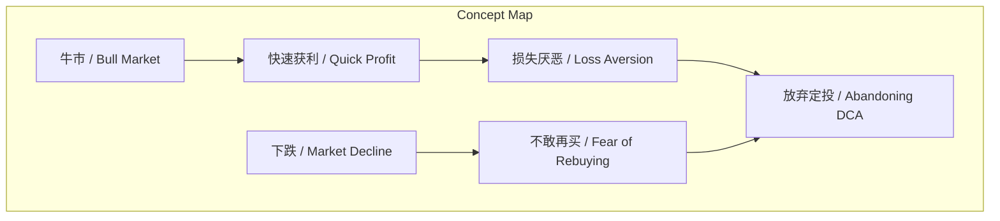
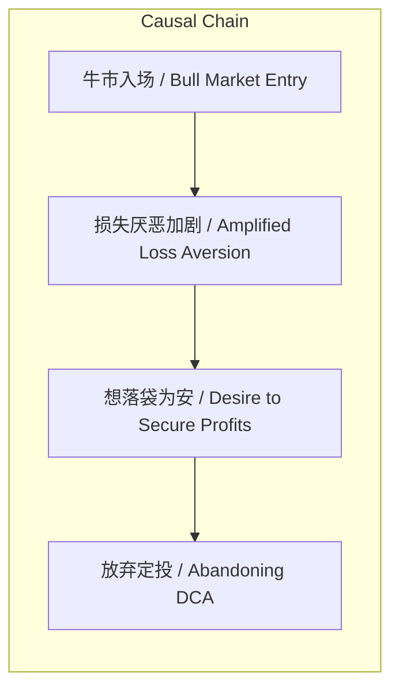

# NEWS/NEWS 任务报告

- agent: news/news
- requestId: 1773965092088-p4xjly
- 生成时间(UTC): 2026-03-20T00:05:47.511Z

## 文本总结

# 牛市入场者更易因损失厌恶放弃定投

## 整体结构化文档表达
### 文档卡片
- 主题（中文/English）：投资定投心理 / Investment DCA Psychology
- 一句话摘要：牛市入场者因快速获利产生的损失厌恶，比熊市入场者更容易放弃定投策略。
- 目标读者：投资者，尤其是定投实践者
- 核心结论（3条）：
  1. 熊市入场者更易坚持定投。
  2. 牛市入场者面临损失厌恶陷阱，易想“落袋为安”。
  3. “卖了再买”是幻觉，下跌时不敢再买。

### 内容结构树
1. 背景与问题定义：定投策略的坚持程度受入场时机影响，不同市场阶段引发不同心理反应。
2. 核心观点与关键证据：牛市入场者因恐高、收益对比、害怕失去收益而放弃；损失厌恶是核心陷阱；定投者视损失为机会。
3. 方法/机制/路径：定投通过平均成本降低风险，但心理偏差（如损失厌恶）干扰执行。
4. 风险与边界条件：主要风险是损失厌恶导致过早卖出；边界是文本未提及其他宏观因素或长期数据。
5. 结论与行动建议：坚持定投纪律，避免因短期波动或幻觉操作。

### 结构化元数据（JSON）
```json
{
  "title": "牛市入场者更易因损失厌恶放弃定投",
  "topic_zh": "投资定投心理",
  "topic_en": "Investment DCA Psychology",
  "audience": "投资者，尤其是定投实践者",
  "claims": [
    "熊市入场者更易坚持定投",
    "牛市入场者因损失厌恶易放弃定投",
    "'卖了再买'是幻觉"
  ],
  "evidence": [
    "在熊市入场的人比在牛市入场的人更容易坚持定投",
    "由于一进场就赚钱更害怕失去这部分收益",
    "当下跌时你不敢再买"
  ],
  "risks": [
    "损失厌恶导致过早卖出",
    "幻觉认为可卖了再买"
  ],
  "actions": [
    "坚持定投策略，忽略短期波动",
    "避免因损失厌恶而'落袋为安'"
  ]
}
```

## 处理流程
1. 输入识别：用户提供关于投资定投心理的文本，讨论入场时机对定投坚持的影响。
2. 信息抽取：实体（牛市、熊市、定投）、概念（损失厌恶、入场时机）、问题（为何牛市入场者易放弃）、事实（原文陈述的现象）、观点（作者对陷阱的判断）。
3. 结构化归纳：定义定投；分类入场阶段（牛市/熊市）；比较心理差异；因果分析（入场时机→心理→行为）；方法论建议（行为金融学视角）。
4. 关系建模：损失厌恶导致放弃定投；快速获利加剧损失厌恶；下跌与不敢再买相关。
5. 可视化表达：使用Mermaid绘制概念结构图和因果链图。

## 概念清单（中英文）
- 牛市 / Bull Market
- 熊市 / Bear Market
- 定投 / Dollar-Cost Averaging (DCA)
- 入场 / Market Entry
- 恐高 / Fear of High Prices
- 收益 / Profit
- all in / Full Investment
- 损失厌恶 / Loss Aversion
- 账目损失 / Paper Loss
- 筹码 / Chips (Investment Units)
- 落袋为安 / Secure Profits
- 幻觉 / Illusion
- 下跌 / Market Decline
- 不敢再买 / Fear of Rebuying

## 概念定义（中英文）
- 牛市：股票市场持续上涨的阶段。
- 熊市：股票市场持续下跌的阶段。
- 定投：定期定额投资策略，通过分散买入降低市场波动风险。
- 入场：投资者开始投资市场的时机。
- 恐高：担心价格过高而不敢买入的心理。
- 收益：投资获得的利润。
- all in：一次性投入全部资金。
- 损失厌恶：人们对损失的敏感度高于收益，导致过度规避风险。
- 账目损失：未实现的账面亏损。
- 筹码：比喻投资单位或份额。
- 落袋为安：实现利润后卖出以锁定收益、避免风险。
- 幻觉：不切实际的错觉或错误信念。
- 下跌：市场价格下降。
- 不敢再买：市场下跌时因恐惧而不敢买入。

## 概念关联与逻辑关系（中英文）
1. 牛市入场 / Bull Market Entry 与 快速获利 / Quick Profit 共同导致 损失厌恶加剧 / Amplified Loss Aversion。
2. 损失厌恶 / Loss Aversion 导致 放弃定投 / Abandoning DCA。
3. 下跌 / Market Decline 与 不敢再买 / Fear of Rebuying 相关，共同强化 幻觉 / Illusion。

## COT逻辑梳理（定义/分类/比较/因果/科学方法论）
Step 1: 定义定投策略为定期定额投资，旨在通过平均成本降低市场波动风险。
Step 2: 分类入场阶段为牛市（上涨市场）和熊市（下跌市场），基于市场趋势。
Step 3: 比较心理差异：熊市入场者成本低，视下跌为机会，易坚持；牛市入场者获利快，害怕失去收益，易恐惧。
Step 4: 因果分析：牛市入场→快速获利→损失厌恶→想落袋为安→放弃定投；同时，下跌时因损失厌恶不敢再买，验证“卖了再买”幻觉。
Step 5: 科学方法论：基于行为金融学，损失厌恶是认知偏差，建议通过纪律和长期视角克服。

## 事实与看法（病毒）
### 事实
- 在熊市入场的人比在牛市入场的人更容易坚持定投。
- 由于恐高所以没有定投结果涨得更高。
- 由于在上涨阶段当前的收益不如当初all in赚得多。
- 由于一进场就赚钱更害怕失去这部分收益。
- 采取定投策略的人不怕账目损失因为损失意味着更便宜的筹码。
- 当下跌时你不敢再买。
### 看法
- 上升阶段的入场的人最容易放弃其中之一就是要面对一个“陷阱”损失厌恶。
- 牛市入场的人由于获利太快产生的损失厌恶有极大的动力想要“落袋为安”。
- 很多人认为可以先卖了再买回来100%是一种幻觉。

## FAQ（原文问题整理）
- 问：为何牛市入场者更易放弃定投？
  答：因快速获利产生损失厌恶，害怕失去收益，动力想“落袋为安”。
- 问：“卖了再买”是否可行？
  答：是幻觉，下跌时因恐惧不敢再买。

## Visualization
### Mermaid 图 1（概念结构图）

### Mermaid 图 2（逻辑/因果图）


## 文章中的类比
未发现明确类比。

## 10个金句
1. 不要中途下车！
2. 在熊市入场的人比在牛市入场的人更容易坚持定投。
3. 由于恐高所以没有定投结果涨得更高。
4. 由于在上涨阶段当前的收益不如当初all in赚得多。
5. 由于一进场就赚钱更害怕失去这部分收益。
6. 上升阶段的入场的人最容易放弃其中之一就是要面对一个“陷阱”损失厌恶。
7. 采取定投策略的人不怕账目损失因为损失意味着更便宜的筹码。
8. 牛市入场的人由于获利太快产生的损失厌恶有极大的动力想要“落袋为安”。
9. 很多人认为可以先卖了再买回来100%是一种幻觉。
10. 当下跌时你不敢再买。
