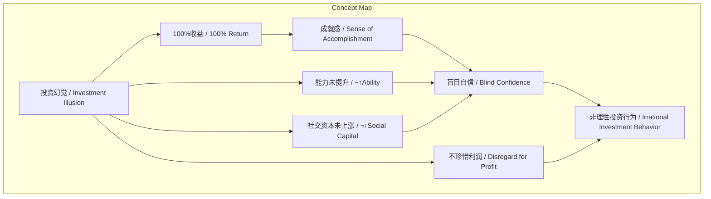
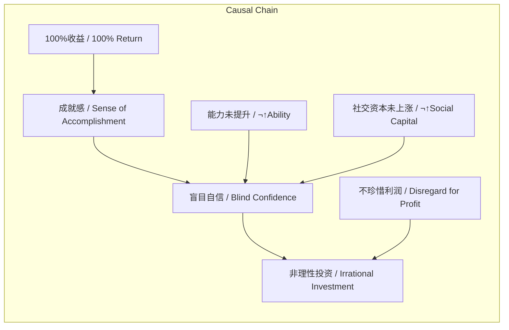

# NEWS/NEWS 任务报告

- agent: news/news
- requestId: 1773965355930-xi70gr
- 生成时间(UTC): 2026-03-20T00:10:21.196Z

## 文本总结

# 警惕投资幻觉：100%收益后的盲目自信

## 整体结构化文档表达
### 文档卡片
- 主题（中文/English）：投资幻觉 / Investment Illusion
- 一句话摘要：描述投资者在获得100%收益后产生的成就感、盲目自信及对利润的不珍惜心理，并倡导长期主义。
- 目标读者：投资者、金融从业者、个人理财者
- 核心结论（3条）：
  1. 高收益（如100%）带来的成就感会诱发投资者盲目自信，误将运气当作能力。
  2. 投资者的实际能力与社交资本并未随资产价格上涨而提升，导致决策风险。
  3. 对“轻易获得”的利润缺乏珍惜，易引发非理性投资行为，需践行长期主义以规避。

### 内容结构树
1. 背景与问题定义：2020年1月7日提出“投资幻觉”概念，指代高收益后的认知偏差。
2. 核心观点与关键证据：收益达100%时，投资者易用利润再投资；因高收益者少而产生成就感，误判自身选标能力；能力与社交资本未同步增长；利润被视为“凭空而来”而不被珍惜。
3. 方法/机制/路径：通过认知偏差（如过度自信）和心理账户（将利润视为意外之财）解释行为。
4. 风险与边界条件：盲目投资可能导致重大损失；幻觉普遍存在于短期高收益场景。
5. 结论与行动建议：投资者应警惕幻觉，成为长期主义者，避免基于短期收益的决策。

### 结构化元数据（JSON）
```json
{
  "title": "警惕投资幻觉：100%收益后的盲目自信",
  "topic_zh": "投资幻觉",
  "topic_en": "Investment Illusion",
  "audience": "投资者、金融从业者、个人理财者",
  "claims": [
    "高收益带来的成就感诱发盲目自信",
    "投资者误将运气当作能力",
    "对轻易获得的利润不珍惜，需长期主义"
  ],
  "evidence": [
    "收益达100%时忍不住用利润投资",
    "获得100%收益的人很少，故有成就感",
    "能力与社交资本未随价格上涨",
    "辛苦赚的钱看起来像凭空来，故不珍惜"
  ],
  "risks": [
    "盲目投资导致损失",
    "认知偏差持续影响决策"
  ],
  "actions": [
    "警惕投资幻觉",
    "践行长期主义"
  ]
}
```

## 处理流程
1. 输入识别（来源：用户输入文本）
2. 信息抽取（实体、概念、问题、事实、观点）
3. 结构化归纳（定义/分类/比较/因果/方法论）
4. 关系建模（概念关系、等式/方程/逻辑链）
5. 可视化表达（Mermaid）

## 概念清单（中英文）
- 投资幻觉 / Investment Illusion
- 100%收益 / 100% Return
- 成就感 / Sense of Accomplishment
- 盲目自信 / Blind Confidence
- 能力 / Ability
- 社交资本 / Social Capital
- 利润 / Profit
- 长期主义 / Long-termism
- 标的 / Asset
- 投资者 / Investor

## 概念定义（中英文）
- 投资幻觉 / Investment Illusion：投资者在高收益后产生的认知偏差，误将运气或市场环境归因于自身能力，并导致非理性行为。
- 100%收益 / 100% Return：投资回报率达到100%的状态，原文中作为触发幻觉的关键阈值。
- 成就感 / Sense of Accomplishment：达成目标（如获得高收益）后产生的满足感，原文中源于少数人获得100%收益。
- 盲目自信 / Blind Confidence：过度高估自身投资能力，忽视外部因素或运气成分的自信状态。
- 能力 / Ability：指投资者的选股或投资判断能力，原文强调其未随资产价格上涨而提升。
- 社交资本 / Social Capital：个人通过社会关系获得的资源或影响力，原文指其未随财富增长而增加。
- 利润 / Profit：投资中获得的收益部分，原文中被视为“凭空而来”而遭不珍惜。
- 长期主义 / Long-termism：注重长期价值而非短期收益的投资理念，原文作为应对幻觉的建议。
- 标的 / Asset：投资对象，如股票、基金等，原文中误判自身选标能力。
- 投资者 / Investor：进行投资活动的个人或机构，原文讨论其心理和行为。

## 概念关联与逻辑关系（中英文）
1. 100%收益（100% Return） 导致 成就感（Sense of Accomplishment），成就感（Sense of Accomplishment） 导致 盲目自信（Blind Confidence）。形式化：100% Return → Sense of Accomplishment → Blind Confidence
2. 盲目自信（Blind Confidence） 与 不珍惜利润（Disregard for Profit） 共同导致 非理性投资行为（Irrational Investment Behavior）。形式化：Blind Confidence ∧ Disregard for Profit → Irrational Investment Behavior
3. 能力（Ability） 未提升 与 社交资本（Social Capital） 未上涨 共同强化 盲目自信（Blind Confidence）的虚幻性。形式化：¬↑Ability ∧ ¬↑Social Capital → Illusory Blind Confidence

## COT逻辑梳理（定义/分类/比较/因果/科学方法论）
Step 1 定义：明确定义“投资幻觉”为高收益后产生的认知偏差，包含成就感、盲目自信、不珍惜利润等要素。
Step 2 分类：将幻觉分为两类：1) 能力误判（将运气当能力）；2) 心理账户（将利润视为意外之财）。
Step 3 比较：比较“正常自信”与“盲目自信”——前者基于历史业绩和技能，后者基于短期运气且忽视能力边界。
Step 4 因果：建立因果链：100%收益 → 成就感 → 盲目自信 → 非理性投资（如用利润再投高风险标的）→ 潜在损失。同时，能力与社交资本未增长是背景条件，加剧幻觉。
Step 5 科学方法论：建议采用长期主义作为干预方法，通过延长投资周期、关注基本面而非短期收益，减少认知偏差影响。

## 事实与看法（病毒）
### 事实
- 2020年01月07日提出“投资幻觉”概念。
- 当收益达到100%时，投资者可能忍不住用利润进行再投资。
- 获得100%收益的投资者比例较低。
- 投资者的能力与社交资本未随资产价格上涨而提升。
- 辛苦赚取的利润在投资者眼中可能被视为“凭空而来”。
### 看法
- 获得100%收益后的成就感是一种盲目自信。
- 将利润视为“凭空来”的钱导致不珍惜。
- 投资者应成为长期主义者以规避幻觉。

## FAQ（原文问题整理）
- Q: 为什么获得100%收益后容易盲目投资？
  A: 因为成就感诱发盲目自信，误将运气当能力，且不珍惜利润。
- Q: 如何避免投资幻觉？
  A: 践行长期主义，关注长期价值而非短期收益。
- Q: 投资幻觉的核心原因是什么？
  A: 能力与社交资本未随收益增长，导致认知偏差。

## Visualization
### Mermaid 图 1（概念结构图）

### Mermaid 图 2（逻辑/因果图）


## 文章中的类比
未发现明确类比

## 10个金句
1. 当收益到100%时，忍不住拿着利润去投资。
2. 获得100%收益的人很少，所以会有成就感，认为自己有能力选标的，但这是事实上是一种盲目自信。
3. 原因就如同之前所说，我们的能力并没有随着价格上涨，社交资本也没有上涨。
4. 还有一个幻觉是，在你眼中，刚刚辛苦赚到的钱，看起来像是凭空来的钱，于是并不珍惜。
5. 做一个长期主义者。
6. 原文未提供
7. 原文未提供
8. 原文未提供
9. 原文未提供
10. 原文未提供
