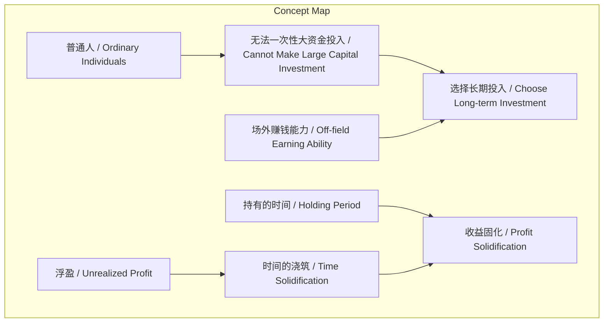
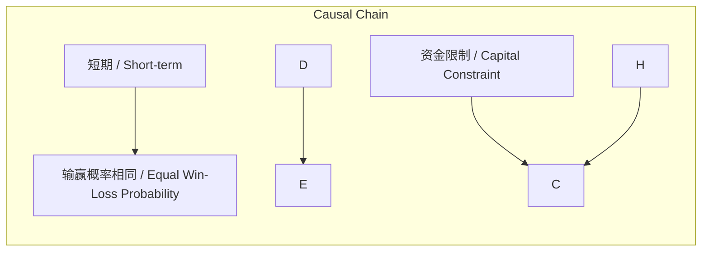

# NEWS/NEWS 任务报告

- agent: news/news
- requestId: 1773965526136-g2ii9x
- 生成时间(UTC): 2026-03-20T00:13:34.841Z

## 文本总结

# 长期投资：时间固化收益与场外能力

## 整体结构化文档表达
### 文档卡片
- 主题（中文/English）：长期投资策略 / Long-term Investment Strategy
- 一句话摘要：社群强调长期持有使浮盈固化，普通人需依赖场外赚钱能力进行持续投入。
- 目标读者：普通投资者、理财社群成员
- 核心结论（3条）：
  1. 短期输赢概率相同，长期持有决定最终收益。
  2. 收益需时间固化，持有时间越长，固化程度越高。
  3. 普通人因资金限制应选择长期定投，场外赚钱能力是持续投入的关键。

### 内容结构树
1. 背景与问题定义：普通投资者资金有限，无法一次性大额投入，需寻找适合的参与方式。
2. 核心观点与关键证据：观点1-5，证据为原文陈述。
3. 方法/机制/路径：选择长期投入，通过时间使浮盈固化，依赖场外收入支持持续投资。
4. 风险与边界条件：未提及具体风险与边界条件。
5. 结论与行动建议：结论为长期投入有效，建议提升场外赚钱能力以保障持续投入。

### 结构化元数据（JSON）
```json
{
  "title": "长期投资：时间固化收益与场外能力",
  "topic_zh": "长期投资策略",
  "topic_en": "Long-term Investment Strategy",
  "audience": "普通投资者、理财社群成员",
  "claims": [
    "短期输赢概率相同，长期持有决定最终收益",
    "收益需时间固化，持有时间越长，固化程度越高",
    "普通人因资金限制应选择长期定投，场外赚钱能力是持续投入的关键"
  ],
  "evidence": [
    "输赢的概率短期看是一样的",
    "我们的收益100%和你持有的时间有关系",
    "现在都是浮盈 只有通过时间的浇筑 才会被固定下来 时间越久 固定越多",
    "我们是普通人 没办法一次性大资金投入",
    "所以我们选择的是长期投入 于是场外赚钱能力很重要"
  ],
  "risks": [],
  "actions": [
    "选择长期投资策略",
    "提升个人场外赚钱能力以支持持续投入"
  ]
}
```

## 处理流程
1. 输入识别：识别到2021年1月5日发布的社群投资观点文本。
2. 信息抽取：抽取到日期、核心观点5条、关键概念12个。
3. 结构化归纳：将观点归纳为长期投资策略，突出时间与场外能力的作用。
4. 关系建模：建立持有时间与收益固化、资金限制与长期选择、场外能力与持续投入的逻辑关系。
5. 可视化表达：生成概念结构图和逻辑因果图。

## 概念清单（中英文）
- 历史社群 / Historical Community
- 输赢的概率 / Win-Loss Probability
- 短期 / Short-term
- 收益 / Returns
- 持有的时间 / Holding Period
- 浮盈 / Unrealized Profit
- 时间的浇筑 / Time Solidification
- 固定 / Solidification
- 普通人 / Ordinary Individuals
- 大资金投入 / Large Capital Investment
- 长期投入 / Long-term Investment
- 场外赚钱能力 / Off-field Earning Ability

## 概念定义（中英文）
- 历史社群：具有长期运营历史和社群共识的投资群体。
- 输赢的概率：在短期内，投资结果受随机因素影响的可能性。
- 短期：指持有资产时间较短的阶段，通常不足以让收益固化。
- 收益：投资产生的利润，包括已实现和未实现部分。
- 持有的时间：投资者持有资产的时间长度。
- 浮盈：当前未实现的盈利，资产市值高于成本但未卖出。
- 时间的浇筑：比喻时间对收益的固化作用，类似混凝土浇筑硬化。
- 固定：指浮盈转化为已实现、稳定的收益。
- 普通人：指资金量有限、无法一次性大额投资的个体。
- 大资金投入：一次性投入大量资本的投资方式。
- 长期投入：持续、分批投入资金并长期持有的投资策略。
- 场外赚钱能力：通过投资以外的途径获取收入的能力。

## 概念关联与逻辑关系（中英文）
1. 持有的时间 (Holding Period) 与 收益固化程度 (Profit Solidification) 正相关：Solidification ∝ Holding Period。
2. 资金规模 (Capital Scale) 与 投资方式选择 (Investment Choice) 相关：若 Capital Scale 小，则选择 Long-term Investment。
3. 场外赚钱能力 (Off-field Earning Ability) 支持 长期投入 (Long-term Investment) 的持续性：Long-term Sustainability = f(Off-field Earning Ability)。

## COT逻辑梳理（定义/分类/比较/因果/科学方法论）
Step 1: 定义问题：普通投资者如何应对资金限制参与投资？
Step 2: 分类：按持有时间分短期与长期投资。
Step 3: 比较：短期与长期对收益的影响，短期概率相同但长期决定最终收益。
Step 4: 因果：时间通过“浇筑”机制使浮盈固化，持有越久固化越多。
Step 5: 科学方法论：采用长期定投策略，并提升场外赚钱能力以保障资金持续投入。

## 事实与看法（病毒）
### 事实
- 文本发布日期为2021年01月05日。
- 社群自称为“有历史的社群”。
- 社群成员自认为“普通人”。
- 当前盈利状态为“浮盈”。
- 无法进行“一次性大资金投入”。

### 看法
- “输赢的概率短期看是一样的” — 对短期市场不确定性的判断。
- “我们的收益100%和你持有的时间有关系” — 强调时间对收益的决定性作用。
- “只有通过时间的浇筑 才会被固定下来” — 比喻时间固化收益。
- “时间越久 固定越多” — 时间与收益固化的正比关系。
- “所以我们选择的是长期投入” — 策略选择。
- “于是场外赚钱能力很重要” — 对场外能力的重视。

## FAQ（原文问题整理）
未发现明确提问。

## Visualization
### Mermaid 图 1（概念结构图）


### Mermaid 图 2（逻辑/因果图）


## 文章中的类比
- 时间的浇筑（Time as a Casting Process）— 将时间比作浇筑混凝土的过程，形象描述时间使浮盈固化的机制。

## 10个金句
1. 输赢的概率短期看是一样的
2. 我们的收益100%和你持有的时间有关系
3. 现在都是浮盈
4. 只有通过时间的浇筑 才会被固定下来
5. 时间越久 固定越多
6. 我们是普通人
7. 没办法一次性大资金投入
8. 所以我们选择的是长期投入
9. 于是场外赚钱能力很重要
10. 原文未提供
