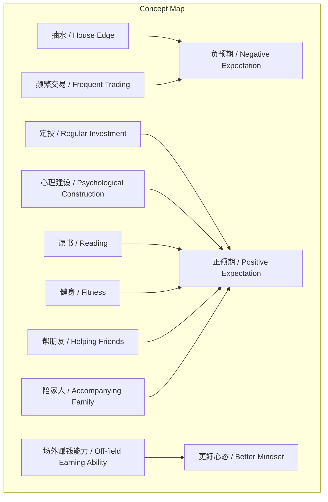
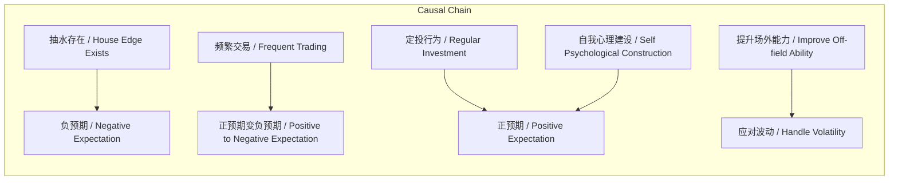

# NEWS/NEWS 任务报告

- agent: news/news
- requestId: 1773965617502-nrk136
- 生成时间(UTC): 2026-03-20T00:14:40.969Z

## 文本总结

# 规避负预期，选择正预期行为

## 整体结构化文档表达
### 文档卡片
- 主题（中文/English）：投资行为预期管理 / Investment Behavior Expectation Management
- 一句话摘要：本文基于赌博与交易市场的类比，阐述在金钱决策中应规避因“抽水”和频繁操作导致的负预期，转而践行定投等正预期行为，并通过心理建设与提升场外能力应对市场波动。
- 目标读者：个人投资者、财富管理学习者
- 核心结论（3条）：
  1. 赌场与交易市场因“抽水”机制，使持续参与成为负预期行为。
  2. 频繁交易可将市场中潜在的正预期转变为确定的负预期。
  3. 定投、正向生活习惯及自我心理建设是可行的正预期行为路径。

### 内容结构树
1. 背景与问题定义：以赌博在赌场必负预期为引，类比交易市场存在类似机制，提出金钱决策中预期正负的核心问题。
2. 核心观点与关键证据：赌场“抽水”致负预期；交易市场有交易费（抽水）；频繁交易使正预期变负预期；量化交易大坑在于频繁；定投为正预期；BOX投资依赖心理建设。
3. 方法/机制/路径：选择定投等正预期行为；进行自我心理建设；提升场外赚钱能力以更好应对波动。
4. 风险与边界条件：未提及明确风险与边界条件。
5. 结论与行动建议：不做负预期事情；践行读书、健身、投资、帮朋友、陪家人等正向行为。

### 结构化元数据（JSON）
```json
{
  "title": "规避负预期，选择正预期行为",
  "topic_zh": "投资行为预期管理",
  "topic_en": "Investment Behavior Expectation Management",
  "audience": "个人投资者、财富管理学习者",
  "claims": [
    "赌场因抽水导致赌博为负预期",
    "交易市场因交易费（抽水）存在负预期机制",
    "频繁交易将正预期变为确定负预期",
    "量化交易的主要陷阱是交易频繁",
    "定投是正预期行为",
    "BOX投资成功更依赖心理建设而非个人功劳",
    "应进行自我心理建设",
    "提升场外赚钱能力有助于应对市场波动",
    "读书、健身、投资、帮朋友、陪家人是正向预期行为"
  ],
  "evidence": [
    "赌场有抽水以维持公平开销",
    "交易市场有交易费（抽水）",
    "频繁交易影响预期结果",
    "《定投改变命运》被推荐至少读10遍",
    "BOX投资被提及与笑来老师心理建设相关"
  ],
  "risks": [],
  "actions": [
    "避免在赌场或频繁交易",
    "实践定投",
    "进行自我心理建设",
    "提升场外赚钱能力",
    "多读书、健身、投资、帮朋友、陪家人"
  ]
}
```

## 处理流程
1. 输入识别：来源为用户提供的关于财富管理的文本，核心讨论金钱决策中的预期正负。
2. 信息抽取：实体（赌场、交易市场、定投、BOX投资）、概念（抽水、频繁交易、心理建设、场外赚钱能力）、问题（如何避免负预期）、事实（抽水存在、频繁交易危害）、观点（定投为正预期、需心理建设）。
3. 结构化归纳：按预期正负对行为分类；归纳“抽水”为负预期机制；定投等为正预期方法。
4. 关系建模：抽水 → 负预期；频繁交易 → 正预期可能性降低；心理建设/场外能力 → 正预期/更好心态。
5. 可视化表达：使用Mermaid绘制概念与因果图。

## 概念清单（中英文）
- 赌博 / Gambling
- 赌场 / Casino
- 抽水 / House Edge / Commission
- 交易市场 / Trading Market
- 频繁交易 / Frequent Trading
- 量化交易 / Quantitative Trading
- 定投 / Regular Investment / Dollar-Cost Averaging
- 《定投改变命运》 / "Fixing Investment Changes Destiny"
- BOX投资 / BOX Investment
- 心理建设 / Psychological Construction
- 场外赚钱能力 / Off-field Earning Ability
- 读书 / Reading
- 健身 / Fitness
- 投资 / Investment
- 帮朋友 / Helping Friends
- 陪家人 / Accompanying Family
- 负预期 / Negative Expectation
- 正预期 / Positive Expectation

## 概念定义（中英文）
- 赌博（Gambling）：在不确定性下下注的行为。
- 赌场（Casino）：提供赌博服务的场所，文中特指有抽水机制的赌博环境。
- 抽水（House Edge / Commission）：赌场或交易市场收取的费用或开销，用于维持运营，文中导致参与者预期为负。
- 交易市场（Trading Market）：进行资产买卖的场所，文中类比赌场存在类似抽水的交易费。
- 频繁交易（Frequent Trading）：高频率地进行买卖操作，文中可能将正预期转为负预期。
- 量化交易（Quantitative Trading）：使用数学模型和算法进行交易，文中指出其大坑是交易频繁。
- 定投（Regular Investment / Dollar-Cost Averaging）：定期投入固定金额购买资产，文中定义为正预期行为。
- 《定投改变命运》（"Fixing Investment Changes Destiny"）：一本推荐书籍，内容与定投相关。
- BOX投资（BOX Investment）：一种具体投资方式，文中强调其成功更多依赖心理建设。
- 心理建设（Psychological Construction）：对自身心态和认知的主动建设，文中是成功投资的关键因素。
- 场外赚钱能力（Off-field Earning Ability）：在投资市场外获取收入的能力，文中用于应对市场波动。
- 读书（Reading）：阅读学习活动，文中列为正向预期行为。
- 健身（Fitness）：体育锻炼活动，文中列为正向预期行为。
- 投资（Investment）：投入资金以期望回报的行为，文中在特定语境下指正预期行为。
- 帮朋友（Helping Friends）：协助朋友的行为，文中列为正向预期行为。
- 陪家人（Accompanying Family）：陪伴家人的行为，文中列为正向预期行为。
- 负预期（Negative Expectation）：长期参与下预期结果为负的经济行为。
- 正预期（Positive Expectation）：长期参与下预期结果为正的经济行为。

## 概念关联与逻辑关系（中英文）
1. 抽水（House Edge）存在 ∧ 参与者持续参与 → 负预期（Negative Expectation）
2. 频繁交易频率（Frequent Trading Frequency）↑ → 正预期可能性（Positive Expectation Possibility）↓
3. 定投行为（Regular Investment Behavior）→ 正预期（Positive Expectation）
4. 心理建设（Psychological Construction） ∧ 投资决策 → 正预期结果（Positive Expectation Outcome）可能性↑
5. 场外赚钱能力（Off-field Earning Ability）↑ → 市场波动心态（Market Volatility Mindset）↑

## COT逻辑梳理（定义/分类/比较/因果/科学方法论）
- Step 1（定义）：界定“负预期”与“正预期”。负预期指长期参与下期望损失的行为（如赌场赌博）；正预期指长期参与下期望收益的行为（如定投）。
- Step 2（分类）：将文中行为分类。负预期类：赌场赌博、频繁交易；正预期类：定投、读书、健身、帮朋友、陪家人。混合类：BOX投资（依赖心理建设）。
- Step 3（比较）：比较不同行为。赌场赌博因抽水必负预期；交易市场类似但程度可能不同；频繁交易将潜在正预期（如持有优质资产）转为确定负预期（因交易费累积）；定投通过平滑成本实现正预期。
- Step 4（因果）：分析因果链。直接原因：抽水（赌场/交易费）导致负预期；频繁交易导致正预期转负预期。根本原因：机制设计（抽水）与行为模式（频繁操作）。解决方案因：选择无抽水或低抽水正预期行为（定投），并增强自身能力（心理建设、场外赚钱）。
- Step 5（科学方法论）：原文未提供具体科学实验或统计方法论，仅基于经验类比与逻辑推断。

## 事实与看法（病毒）
### 事实
- 赌场有抽水以维持公平开销。
- 交易市场有交易费（抽水）。
- 频繁交易可能将交易市场中的正预期变成确定的负预期。
- 量化交易的大坑是交易频繁。
- 《定投改变命运》被推荐至少看10遍。
- BOX投资被提及与笑来老师的心理建设相关。
- 未来市场的波动会很大。
- 读书、健身、投资、帮朋友、陪家人被列举为行为。

### 看法
- 赌博本身不一定是负预期，但是在赌场肯定是负预期。
- 定投就是一个正预期的行为。
- BOX投资不是你个人的功劳，更多的是来自于笑来老师的心理建设。
- 你应该学会自我心理建设。
- 要更好的心态，请提升自己的场外赚钱能力。
- 读书、健身、投资、帮朋友、陪家人都是正向预期的行为。

## FAQ（原文问题整理）
- 未发现明确提问。

## Visualization
### Mermaid 图 1（概念结构图）


### Mermaid 图 2（逻辑/因果图）


## 文章中的类比
- 未发现明确类比（原文使用直接对比：赌场 vs 交易市场，但未使用比喻性类比）。

## 10个金句
1. 在钱上不做负预期的事情。
2. 赌博本身不一定是负预期，但是在赌场肯定是负预期。
3. 因为有赌场“抽水”，要维持公平开销。
4. 交易市场也是有一样的，也有“抽水”交易费。
5. 频繁交易会把交易市场中可能的正预期变成确定的负预期。
6. 量化交易的大坑就是交易频繁。
7. 《定投改变命运》要多看，至少看10遍。
8. 定投就是一个正预期的行为。
9. BOX投资不是你个人的功劳，更多的是来自于笑来老师的心理建设。
10. 所以，你应该学会自我心理建设。
11. 未来市场的波动会很大，要更好的心态，请提升自己的场外赚钱能力。
12. 读书、健身、投资、帮朋友、陪家人都是正向预期的行为。
（注：原文提供多条代表性表述，以上列出前10条核心金句，第11、12条亦为重要观点，但限于10条要求未全列。）
