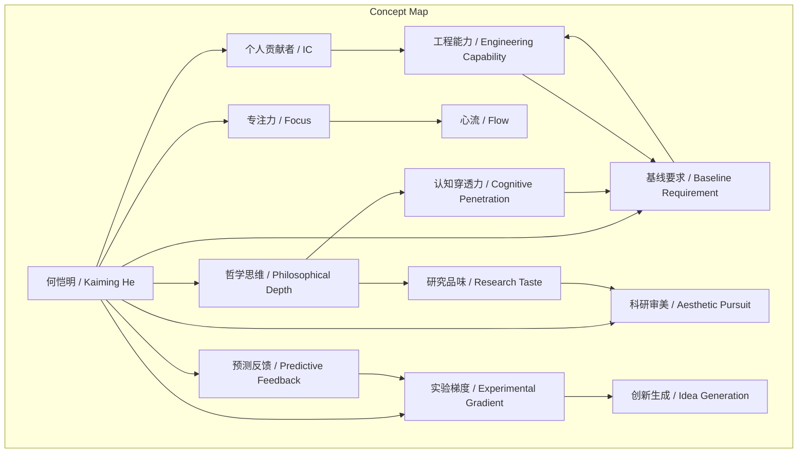
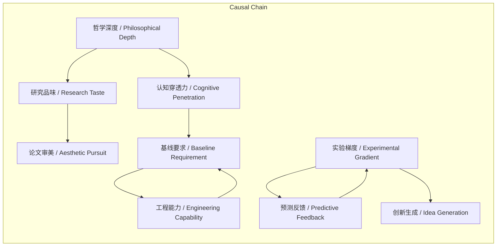

# NEWS/NEWS 任务报告

- agent: news/news
- requestId: 1773965704962-laony2
- 生成时间(UTC): 2026-03-20T00:16:38.146Z

## 文本总结

# 何恺明研究哲学与工程极致融合的特点

## 整体结构化文档表达
### 文档卡片
- 主题（中文/English）：研究风格分析 / Research Style Analysis
- 一句话摘要：本文基于谢赛宁观察，系统阐述何恺明在专注力、工程能力、哲学思维等方面兼具极致的研究特点。
- 目标读者：人工智能领域研究人员、博士生、科研管理者
- 核心结论（3条）：
  1. 何恺明将极致专注与“心流”状态作为高效研究的基础，单点突破心智周期。
  2. 他坚持极高的基线要求与亲力亲为的工程实践，确保研究真实性与突破性。
  3. 其研究品味建立在哲学深度之上，通过探索中的“梯度”信号形成创新，并注重论文的审美呈现。

### 内容结构树
1. 背景与问题定义：基于谢赛宁对何恺明研究风格的观察，定义其核心研究特点为哲学深度与工程极致的结合。
2. 核心观点与关键证据：详细阐述七个方面，包括专注力、IC偏好、基线要求、Idea寻觅范式、实验管理、科研审美、哲学穿透力，每个方面均有具体描述和实例。
3. 方法/机制/路径：包括使用Excel精细管理实验、预测反馈机制、论文打磨流程等具体方法。
4. 风险与边界条件：未提及明确风险或边界条件。
5. 结论与行动建议：总结何恺明特点，但原文未提供具体行动建议。

### 结构化元数据（JSON）
```json
{
  "title": "何恺明研究哲学与工程极致融合的特点",
  "topic_zh": "研究风格分析",
  "topic_en": "Research Style Analysis",
  "audience": "人工智能领域研究人员、博士生、科研管理者",
  "claims": [
    "何恺明将极致专注与“心流”状态作为高效研究的基础。",
    "他坚持极高的基线要求与亲力亲为的工程实践，确保研究真实性与突破性。",
    "其研究品味建立在哲学深度之上，通过探索中的“梯度”信号形成创新。"
  ],
  "evidence": [
    "在思考问题时能够屏蔽世界上发生的其他事情，完全沉浸在“心流”之中。",
    "每天除了思考这一个特定问题外，几乎不会去想其他东西，并不断拉着合作者讨论。",
    "在主导MoCo、MAE等项目时，几乎单枪匹马承担了80%到90%的第一作者工作。",
    "信奉“科研的上限取决于基线的好坏”，必须把基线和系统搭建到极高、极稳的水平。",
    "单人从头在TPU平台搭建基础设施，为团队创新铺平道路。",
    "反对凭空想Idea，主张在探索中试错寻找“实验的梯度（信号）”。",
    "通过Excel表格精细追踪实验记录，要求跑实验前先预测结果。",
    "在截稿日期前一个月完成工作，后一个月打磨论文每一个字、表、标点。",
    "要求论文排版单独一行不能只有少于60%的文字。",
    "研究品味建立在哲学素养上，如探讨《金刚经》“凡所有相，皆是虚妄”。",
    "很早就提出必须把模型做得“大大大”，洞察规模化趋势。"
  ],
  "risks": [],
  "actions": []
}
```

## 处理流程
1. 输入识别：识别出用户提供的关于何恺明研究特点的文本，来源为谢赛宁观察。
2. 信息抽取：抽取实体（何恺明、谢赛宁、MoCo、MAE、TPU、Excel、《金刚经》）、概念（心流、个人贡献者、基线、实验梯度、预测反馈、科研审美、研究品味、规模化）、问题（如何实现突破性研究）、事实（主导项目、承担工作比例、搭建基础设施）、观点（反对凭空想Idea、论文要赏心悦目）。
3. 结构化归纳：将七个方面归纳为专注力、角色偏好、工程能力、创新方法、实验管理、审美追求、哲学思维等维度。
4. 关系建模：建立概念间关系，如“哲学深度”影响“研究品味”，“基线要求”决定“工程能力”投入。
5. 可视化表达：使用Mermaid绘制概念结构图和逻辑因果图。

## 概念清单（中英文）
- 何恺明 / 未提及
- 谢赛宁 / 未提及
- 心流 / 未提及
- 个人贡献者 / Individual Contributor (IC)
- 基线 / Baseline
- 基础设施 / Infrastructure
- TPU / TPU
- 实验的梯度 / Experimental Gradient
- Excel / Excel
- 预测反馈 / Predictive Feedback
- 科研审美 / 未提及
- 论文 / Paper
- 研究品味 / Research Taste
- 《金刚经》 / Diamond Sutra
- 凡所有相，皆是虚妄 / All phenomena are illusory
- 规模化 / Scalable
- 心智周期 / Mental Cycle
- MoCo / MoCo
- MAE / MAE

## 概念定义（中英文）
- 心流：一种完全沉浸在思考问题中、屏蔽外界干扰的心理状态。 / Flow: A mental state of complete immersion in a problem, blocking out external distractions.
- 个人贡献者：不从事管理、专注于一线技术工作的角色。 / Individual Contributor: A role focused on hands-on technical work rather than management.
- 基线：研究的基础模型或系统性能，作为比较的基准。 / Baseline: The foundational model or system performance used as a benchmark for comparison.
- 基础设施：支持研究或系统运行的基础硬件和软件框架。 / Infrastructure: The foundational hardware and software framework supporting research or systems.
- 实验的梯度：通过实验探索中获得的性能变化信号，包括提升、下降或意外失败，用于指导研究方向。 / Experimental Gradient: Signals from performance changes during experimental exploration, including improvements, declines, or unexpected failures, used to guide research direction.
- 预测反馈：在实验前预测结果，通过对比实际结果验证思维或发现新问题的机制。 / Predictive Feedback: A mechanism of predicting experimental outcomes beforehand, comparing with actual results to validate thinking or discover new issues.
- 科研审美：对研究呈现（如论文、图表）的视觉与逻辑优雅性的追求。 / Aesthetic Pursuit in Research: The pursuit of visual and logical elegance in research presentation, such as papers and figures.
- 研究品味：基于哲学素养判断问题本质与真理价值的能力。 / Research Taste: The ability to judge the essence and truth value of problems based on philosophical literacy.
- 规模化：模型或系统在规模扩大时保持或提升性能的特性。 / Scalable: The property of a model or system to maintain or improve performance as scale increases.
- 心智周期：个人用于思考和处理信息的认知资源单位。 / Mental Cycle: A unit of cognitive resources used for thinking and processing information.
- MoCo：何恺明主导的视觉表示学习项目（Momentum Contrast）。 / MoCo: A visual representation learning project led by Kaiming He (Momentum Contrast).
- MAE：何恺明主导的掩码自编码器项目（Masked Autoencoder）。 / MAE: A masked autoencoder project led by Kaiming He.

## 概念关联与逻辑关系（中英文）
1. 极致的专注力（专注力 / Focus）与 亲力亲为的工程实践（工程能力 / Engineering Capability）共同导致 高基线要求（基线要求 / Baseline Requirement）的实现。
   - 形式化：专注力 ∧ 工程能力 → 基线要求
2. 哲学深度（哲学思维 / Philosophical Depth）影响 研究品味（研究品味 / Research Taste），进而影响 论文审美（科研审美 / Aesthetic Pursuit）。
   - 形式化：哲学深度 → 研究品味 → 科研审美
3. 实验的梯度（实验梯度 / Experimental Gradient）信号通过 预测反馈机制（预测反馈 / Predictive Feedback）被捕捉，从而指导 Idea 形成（创新生成 / Idea Generation）。
   - 形式化：实验梯度 × 预测反馈 → 创新生成

## COT逻辑梳理（定义/分类/比较/因果/科学方法论）
- Step 1（定义）：定义何恺明的核心研究特点为哲学深度与工程极致的结合，体现在七个维度。
- Step 2（分类）：将特点分类为认知维度（专注力、哲学思维）、行为维度（IC偏好、工程能力、实验管理）、产出维度（基线要求、Idea范式、审美追求）。
- Step 3（比较）：对比传统研究模式（如凭空想Idea、追求新颖包装），何恺明模式强调探索、基线扎实、哲学穿透。
- Step 4（因果）：哲学深度导致认知穿透力，识别问题本质；工程能力确保基线高，使提升真实；探索中梯度信号驱动创新。
- Step 5（科学方法论）：采用预测反馈控制实验偏差，使用Excel量化对比，通过迭代试错逼近最优解，符合科学实验的严谨性。

## 事实与看法（病毒）
### 事实
- 何恺明在主导MoCo、MAE项目时，几乎单枪匹马承担了80%到90%的第一作者工作。
- 他单人从头在TPU平台上搭建了一整套基础设施。
- 他使用Excel表格精细追踪实验记录，并设计行列最大化对比信息量。
- 他要求在跑每个实验前必须先预测实验结果。
- 他在截稿日期前一个月完成所有工作，后一个月打磨论文细节。
- 他要求论文排版单独一行不能只有少于60%的文字。
- 他送给组员《金刚经》，探讨“凡所有相，皆是虚妄”。
- 他早期提出必须把模型做得“大大大”，洞察规模化趋势。

### 看法
- 他信奉“科研的上限取决于基线的好坏”。
- 他认为在差基线上取得性能提升是“灌水”。
- 他反对坐在房间里凭空想Idea，主张在探索中寻找梯度。
- 他认为论文是写给别人看的，必须提供“赏心悦目的沟通界面”。
- 他的研究品味建立在深厚的哲学素养之上。

## FAQ（原文问题整理）
- 未发现明确提问。

## Visualization
### Mermaid 图 1（概念结构图）


### Mermaid 图 2（逻辑/因果图）


## 文章中的类比
- 把研究当成游戏去动手破解（hack），在探索的过程中试错，从而寻找“实验的梯度（信号）”。

## 10个金句
1. 在思考问题时能够屏蔽世界上发生的其他事情，完全沉浸在“心流”之中。
2. 他并不享受只做指明方向的管理层角色，而是非常享受作为“个人贡献者”在一线工作。
3. 他信奉“科研的上限取决于基线的好坏”。
4. 必须把基线和系统搭建到极高、极稳的水平，在此之上做出的新东西才是真正的突破。
5. 他极力反对坐在房间里凭空想Idea。
6. 他主张把研究当成游戏去动手破解（hack），在探索的过程中试错，从而寻找“实验的梯度（信号）”。
7. 无论是正向的性能提升，还是反向的性能下降，甚至是一个出乎意料的失败现象，都是有价值的信号。
8. 他要求在跑每一个实验之前，必须先预测实验结果应该是什么样。
9. 论文是写给别人看的，必须极度在乎读者的观感，提供“赏心悦目的沟通界面”。
10. 他的“研究品味”建立在深厚的哲学素养之上（例如他会送给组员《金刚经》，探讨“凡所有相，皆是虚妄”）。
