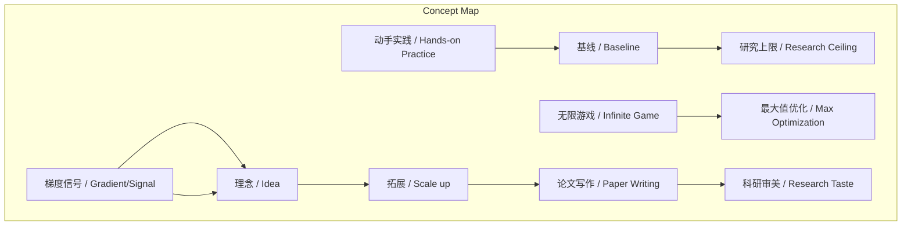
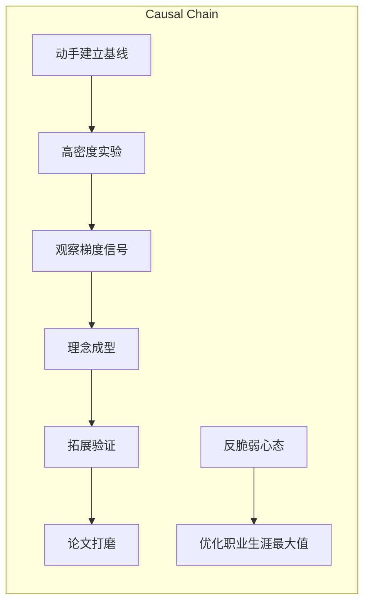

# NEWS/NEWS 任务报告

- agent: news/news
- requestId: 1773965873995-h15oza
- 生成时间(UTC): 2026-03-20T00:19:25.110Z

## 文本总结

# 非线性研究周期与无限游戏方法论

## 整体结构化文档表达
### 文档卡片
- 主题（中文/English）：科研方法论 / 未提及
- 一句话摘要：阐述非线性研究周期的四个阶段及“无限游戏”的职业生涯观，强调动手基线、实验信号与反脆弱心态。
- 目标读者：科研人员，特别是青年研究者、博士生及初级研究员。
- 核心结论（3条）：
  1. 研究是非线性探索，动手建立极致基线是突破上限的前提。
  2. 真正Idea源于实验梯度信号，需拥抱灵活转向。
  3. 职业生涯优化“最大值”而非平均值，需以无限游戏和反脆弱心态看待成败。

### 内容结构树
1. **背景与问题定义**：竞争激烈导致研究周期压缩至约6个月，研究本质为非线性探索。
2. **核心观点与关键证据**：分四阶段详述——动手基线、梯度信号、Idea成型与转向、拓展验证、论文打磨；辅以何恺明、谢赛宁经验。
3. **方法/机制/路径**：复现/拓展基线、高密度实验、精细记录预测、提前撰写并打磨论文。
4. **风险与边界条件**：未明确提及风险，但隐含死守初始想法、基线过低、截止日期赶工等陷阱。
5. **结论与行动建议**：总结阶段特性，提出职业生涯作为“无限游戏”，优化最大值，培养反脆弱心态。

### 结构化元数据（JSON）
```json
{
  "title": "非线性研究周期与无限游戏方法论",
  "topic_zh": "科研方法论",
  "topic_en": "未提及",
  "audience": "科研人员，特别是青年研究者",
  "claims": [
    "研究是非线性探索过程，需动手建立极致基线",
    "Idea源于实验信号，需灵活转向",
    "职业生涯优化最大值，需反脆弱心态"
  ],
  "evidence": [
    "研究周期约6个月",
    "基线好坏决定研究上限",
    "失败实验提供梯度信号",
    "好研究常在中后期方向收敛",
    "顶尖研究者提前一个月写初稿，用一个月打磨",
    "职业生涯优化最大值而非平均值"
  ],
  "risks": [
    "未提及"
  ],
  "actions": [
    "动手复现或拓展基线",
    "进行高密度实验寻找梯度信号",
    "精细记录实验并预测结果",
    "提前撰写论文并极致打磨",
    "以无限游戏心态看待职业生涯"
  ]
}
```

## 处理流程
1. 输入识别（来源：用户输入文本）
2. 信息抽取（实体、概念、问题、事实、观点）
3. 结构化归纳（定义/分类/比较/因果/方法论）
4. 关系建模（概念关系、等式/方程/逻辑链）
5. 可视化表达（Mermaid）

## 概念清单（中英文）
- 研究周期 / 未提及
- 非线性探索 / 未提及
- 基线 / Baseline
- 梯度信号 / Gradient/Signal
- 理念 / Idea
- 转向 / Pivot
- 拓展 / Scale up
- 实验验证 / 未提及
- 论文写作 / 未提及
- 科研审美 / Research Taste
- 无限游戏 / 未提及
- 最大值优化 / 未提及
- 反脆弱 / Anti-fragile
- 截止日期 / Deadline
- 黑客 / Hacker

## 概念定义（中英文）
- 研究周期：指从研究启动到论文完成的大致时间框架，文中特指约6个月。 / Research Cycle: Not explicitly defined in English.
- 非线性探索：研究过程充满变数和曲折，非直线发展。 / Non-linear Exploration: Not explicitly defined in English.
- 基线：研究中的基础模型或基准性能，用于比较和评估改进。 / Baseline: The foundational model or benchmark performance in research.
- 梯度信号：实验中观察到的性能变化或意外现象，用于指示研究方向。 / Gradient/Signal: Performance changes or unexpected phenomena in experiments indicating direction.
- 理念：从实验信号中生长出的核心研究想法。 / Idea: The core research notion emerging from experimental signals.
- 转向：根据实验反馈灵活调整研究方向。 / Pivot: Flexibly changing research direction based on experimental feedback.
- 拓展：将理念扩展至更大规模或更多实验以验证结论。 / Scale up: Scaling the idea to larger scale or more experiments for validation.
- 实验验证：通过实验证据支撑结论的阶段。 / Experiment Validation: Not explicitly defined in English.
- 论文写作：撰写并包装研究成果的过程。 / Paper Writing: Not explicitly defined in English.
- 科研审美：对论文呈现、逻辑叙述和细节打磨的追求，以清晰传达决策过程。 / Research Taste: The pursuit of clear presentation, logical narrative, and meticulous detailing in papers.
- 无限游戏：将职业生涯视为持续探索，不追求单次完美，而优化长期最大值。 / Infinite Game: Not explicitly defined in English.
- 最大值优化：职业生涯成功由少数巅峰突破决定，而非平均表现。 / Max Optimization: Career success determined by few peak breakthroughs, not average performance.
- 反脆弱：从短期失败中获益、适应不确定性的心态。 / Anti-fragile: Mindset that benefits from short-term failures and adapts to uncertainty.
- 截止日期：论文提交或项目完成的最后期限。 / Deadline: The final date for submission or completion.
- 黑客：指动手实践、快速构建系统的研究者。 / Hacker: A researcher who hands-on builds systems quickly.

## 概念关联与逻辑关系（中英文）
1. 基线质量 / Baseline Quality 与 实验密度 / Experiment Density 共同影响 研究突破 / Research Breakthrough：高质量基线提供可靠比较，高密度实验产生梯度信号，二者结合促进突破。
2. 梯度信号 / Gradient Signal 驱动 理念 / Idea 成型：实验中的意外现象（如性能下降）提供方向性信息，催生真正的研究理念。
3. 无限游戏心态 / Infinite Game Mindset 影响 职业生涯优化目标 / Career Optimization Goal：从追求单次成功（平均值）转向追求长期最大值，需反脆弱心态支撑。

## COT逻辑梳理（定义/分类/比较/因果/科学方法论）
- **Step 1 定义**：研究周期被定义为约6个月的非线性探索过程，区别于线性发展。
- **Step 2 分类**：将研究周期分为四阶段：方向确立与动手探索期、理念成型与转向期、拓展与验证期、论文写作与打磨期。
- **Step 3 比较**：比较线性研究（完全符合初始设想，为“无聊想法”）与非线性研究（中后期方向收敛，有惊喜），强调后者价值。
- **Step 4 因果**：基线质量因果决定研究上限；失败实验因果提供梯度信号，指引反向突破；提前打磨论文因果提升沟通效果。
- **Step 5 科学方法论**：通过“假设-实验-观察-修正”循环（类似随机梯度下降）迭代理念，体现实证科学方法。

## 事实与看法（病毒）
### 事实
- 一个典型的研究周期通常被压缩在6个月左右。
- 研究的上限取决于基线的好坏。
- 失败的实验往往能提供极大的信息量，给予明确“梯度”。
- 好的研究常在第5个月经历灵感迸发或方向重新收敛。
- 顶尖研究者会提前一个月写好初稿，用一个月打磨细节。
- 职业生涯优化的是“最大值”，而非平均值。
- 绝大多数平庸工作不会真正伤害职业生涯。

### 看法
- 优秀的科研是非线性探索过程。
- 凭空想出的点子要么已被广泛思考，要么已被验证行不通。
- 最差的研究是头到尾完全符合最初设想。
- 研究者需具备反脆弱心态，不过分在意单次成败。

## FAQ（原文问题整理）
- 未发现明确提问。

## Visualization
### Mermaid 图 1（概念结构图）

### Mermaid 图 2（逻辑/因果图）


## 文章中的类比
- 就像机器学习中的“随机梯度下降”一样，通过实验观察意料之外的现象。
- 把论文打磨得像拍电影一样呈现人物面临冲突时的选择。

## 10个金句
1. 优秀的科研从来不是从起点直线通达终点的线性发展，而是一个充满变数、极其曲折的非线性探索过程。
2. 拒绝凭空想象，从实践中找方向。
3. 研究的上限取决于基线的好坏。
4. 一个失败的、导致性能大幅下降的实验结果往往能提供极大的信息量。
5. 一开始设想的初始Idea并不真正属于你，只有在试错和探索过程中从实验信号里生长出来的Idea才是真正属于你的。
6. 最差的研究就是从头到尾都完全符合最初的设想。
7. 好的研究往往在进行到中后期（例如第5个月）时才会经历灵感的迸发或方向的重新收敛。
8. 顶尖的研究者绝不推崇在截止日期前通宵赶稿，而是会提前一个月写好具备发表质量的初稿。
9. 研究员终其一生不需要每次都成功，其职业生涯优化的是“最大值”。
10. 研究者需要具备反脆弱的心态，不要过分在意某一次论文被拒或短期的成败。
（原文未提供）
