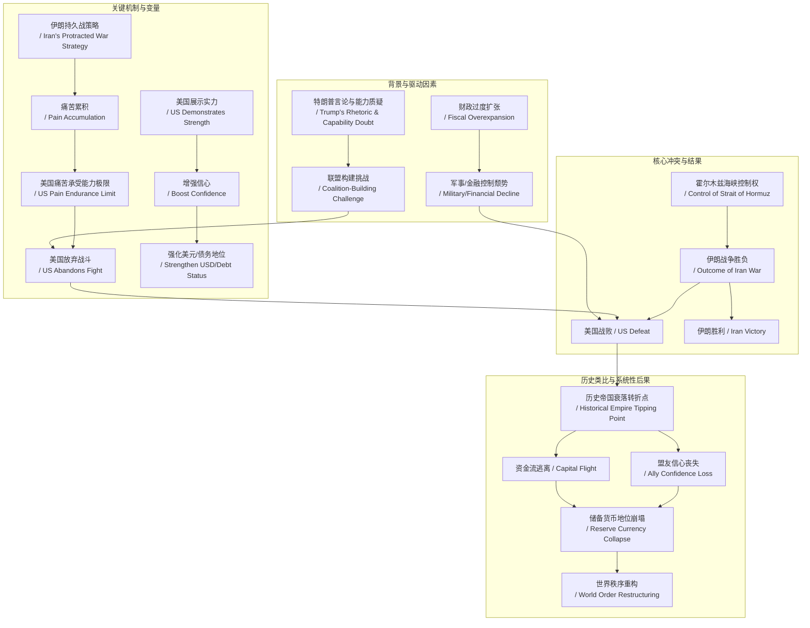
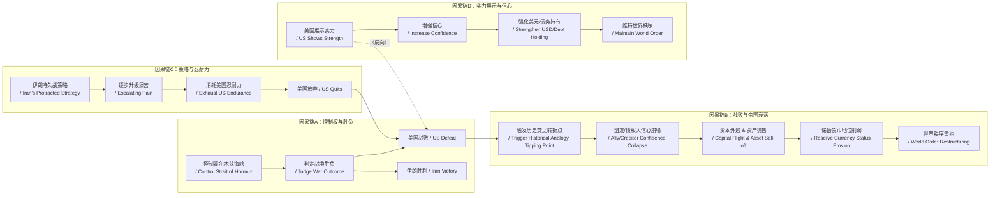

# NEWS/NEWS 任务报告

- agent: news/news
- requestId: 1773966044986-ly15os
- 生成时间(UTC): 2026-03-20T00:21:47.591Z

## 文本总结

# 霍尔木兹海峡控制权决定伊朗战争与帝国兴衰

## 整体结构化文档表达
### 文档卡片
- 主题（中文/English）：地缘政治风险与帝国兴衰规律 / Geopolitical Risk and Empire Cycle
- 一句话摘要：文章通过历史类比论证，伊朗战争的胜负及美国主导的世界秩序稳定性，完全取决于霍尔木兹海峡的控制权归属。
- 目标读者：政策制定者、投资者、国际关系学者
- 核心结论（3条）：
    1.  霍尔木兹海峡的控制权是判定伊朗战争胜负的唯一关键标准，失去控制即意味着美国战败、伊朗胜利。
    2.  美国若因失去海峡控制权而战败，将触发类似英国（苏伊士运河）、荷兰、西班牙的历史性帝国衰落转折点。
    3.  战争结果取决于双方“承受痛苦的能力”，伊朗通过持久战消耗美国公众与领导层的忍耐力是核心策略。

### 内容结构树
1.  **背景与问题定义**：当前伊朗战争的核心分歧与巨大意外性；普遍共识是胜负取决于霍尔木兹海峡控制权。
2.  **核心观点与关键证据**：
    -   观点1：控制海峡=战争胜利；证据：海峡是全球经济命脉，控制它即展示无力扭转局面的美国战败。
    -   观点2：美国战败=帝国衰落转折点；证据：类比苏伊士运河危机（英国）、荷兰、西班牙帝国衰落模式。
    -   观点3：胜负取决于承受痛苦能力；证据：伊朗计划通过持久战升级痛苦，利用美国公众与领导层忍耐力有限的弱点。
    -   观点4：展示实力能增强信心；证据：里根时期通过人质获释和油轮护航展示掌控力。
    -   观点5：特朗普言论与能力受质疑；证据：国际观察者私下质疑其“夸夸其谈”后能否取胜。
3.  **方法/机制/路径**：历史案例类比分析；资金流、人潮自然涌向赢家，重塑市场与地缘政治格局。
4.  **风险与边界条件**：
    -   风险：美国战败导致盟友与债权人信心丧失、储备货币地位崩塌、国债抛售、货币（相对黄金）贬值。
    -   边界：结果与原因无关（无论因政治畏惧、不愿付出代价、军事实力不足或无法结盟，败局已定）。
5.  **结论与行动建议**：美国必须确保霍尔木兹海峡自由通航以展示实力、维持世界秩序；特朗普需成功组建联盟作为重大胜利。

### 结构化元数据（JSON）
```json
{
  "title": "霍尔木兹海峡控制权决定伊朗战争与帝国兴衰",
  "topic_zh": "地缘政治风险与帝国兴衰规律",
  "topic_en": "Geopolitical Risk and Empire Cycle",
  "audience": "政策制定者、投资者、国际关系学者",
  "claims": [
    "霍尔木兹海峡的控制权是判定伊朗战争胜负的唯一关键标准。",
    "美国若失去海峡控制权而战败，将触发历史性的帝国衰落转折点。",
    "战争结果最终取决于双方承受痛苦的能力，伊朗的持久战策略针对美国忍耐力弱点。"
  ],
  "evidence": [
    "从各国政府官员、地缘政治专家及世界各地人们处了解到控制海峡的决定性作用。",
    "历史案例：1956年苏伊士运河危机之于英国、18世纪战败之于荷兰帝国、17世纪衰落之于西班牙帝国。",
    "里根总统通过促成伊朗人质获释和下令海军为油轮护航，展示了掌控力并增强了信心。",
    "伊朗计划拖延战事并逐步升级，利用美国公众与领导层对持久战痛苦承受能力有限的特点。",
    "国际观察者私下质疑特朗普‘夸夸其谈’后实际战斗并取胜的能力。"
  ],
  "risks": [
    "盟友与债权人信心流失，导致美国储备货币地位崩塌。",
    "国债资产遭抛售，货币（尤其是相对于黄金）持续贬值。",
    "美国与海湾盟友及其他全球盟友关系削弱，被视为不可靠的保护者。",
    "全球秩序因美国力量被质疑而动荡，资金流与人潮加速逃离败者。"
  ],
  "actions": [
    "特朗普总统应确保霍尔木兹海峡自由通行，消除伊朗威胁，以展示美国实力。",
    "成功组建国际联盟共同保障海峡通航，是检验并提升美国凝聚力的关键。",
    "美国需具备并展示夺取并维持海峡控制权的军事决心与能力。"
  ]
}
```

## 处理流程
1.  **输入识别**：来源为用户提供的关于伊朗战争、霍尔木兹海峡及历史帝国兴衰比较的论述文本。
2.  **信息抽取**：抽取实体（霍尔木兹海峡、伊朗、美国、特朗普、苏伊士运河危机、英国、荷兰帝国、西班牙帝国、里根）、概念（控制权、战争胜负、帝国衰落、资金流、痛苦承受能力）、问题（谁控制海峡？美国能否赢？）、事实（历史事件、人物言论）、观点（败局已定、类比成立、策略有效）。
3.  **结构化归纳**：将内容归纳为“背景-观点-方法-风险-结论”结构；对历史案例进行类比归类；将“承受痛苦能力”定义为关键变量。
4.  **关系建模**：建立“海峡控制权 → 战争胜负 → 资金流向 → 帝国兴衰”的因果链；建立“持久战 → 痛苦累积 → 忍耐力耗尽 → 美国放弃”的逻辑链。
5.  **可视化表达**：使用Mermaid绘制概念关联图与因果链图。

## 概念清单（中英文）
-  霍尔木兹海峡 / Strait of Hormuz
-  伊朗战争 / Iran War
-  美国 / United States
-  唐纳德·特朗普 / Donald Trump
-  苏伊士运河危机 / Suez Crisis
-  英国 / United Kingdom
-  荷兰帝国 / Dutch Empire
-  西班牙帝国 / Spanish Empire
-  世界储备货币 / World Reserve Currency
-  盟友 / Allies
-  资金流 / Capital Flow
-  债务 / Debt
-  货币 / Currency
-  黄金市场 / Gold Market
-  里根总统 / President Reagan
-  伊朗人质 / Iran Hostages
-  两伊战争 / Iran-Iraq War
-  以色列 / Israel
-  持久战 / Protracted War
-  痛苦承受能力 / Capacity to Endure Pain
-  世界秩序 / World Order
-  中期选举 / Midterm Elections
-  财政过度扩张 / Fiscal Overexpansion
-  军事控制权 / Military Control
-  金融控制权 / Financial Control
-  油价 / Oil Prices
-  水雷 / Naval Mines
-  联盟 / Coalition

## 概念定义（中英文）
-  **霍尔木兹海峡 / Strait of Hormuz**：连接波斯湾与阿曼湾的海峡，是全球石油运输最关键的咽喉要道，其通行权被视为必须“不惜一切代价保障”的战略资产。
-  **伊朗战争 / Iran War**：文中指代可能发生或正在进行的、以伊朗为对手的军事冲突，其胜负标准被简化为对霍尔木兹海峡的控制。
-  **苏伊士运河危机 / Suez Crisis**：1956年埃及将苏伊士运河国有化后，英国、法国、以色列联合军事干预失败的事件，被作者视为大英帝国全球主导地位衰落的关键转折点。
-  **帝国崩解模式 / Empire Collapse Pattern**：文中描述的历史规律，即世界主导强国在失去对关键贸易航道的控制后，会引发盟友信心崩溃、资本外逃、储备货币地位丧失，最终导致系统性衰落。
-  **痛苦承受能力 / Capacity to Endure Pain**：在战争中，民众与领导层对持续伤亡、经济代价及社会压力忍耐限度的能力，作者认为此能力比施加痛苦的能力更具决定性。
-  **世界储备货币 / World Reserve Currency**：指被全球广泛用于贸易结算、外汇储备和金融交易的货币（当前为美元），其地位依赖于对他国军事与金融实力的信任。
-  **财政过度扩张 / Fiscal Overexpansion**：主导国家为维持其全球地位而进行远超其财政承受能力的军事与社会支出，导致债务高企、货币信誉受损。
-  **联盟 / Coalition**：为共同目标（如此处保障海峡通航）而联合多个国家的政治军事集团，作者认为美国单凭自身难以达成目标。

## 概念关联与逻辑关系（中英文）
1.  **控制霍尔木兹海峡 / Control of Strait of Hormuz** 直接决定 **伊朗战争胜负 / Outcome of Iran War**。若伊朗控制，则美国战败、伊朗胜利。
2.  **美国战败 / US Defeat**（因失去海峡控制）触发 **历史帝国衰落类比 / Historical Empire Decline Analogy**，并导致 **资金流逃离 / Capital Flight** 与 **盟友信心丧失 / Ally Confidence Loss**。
3.  **持久战策略 / Protracted War Strategy**（伊朗）通过增加 **痛苦 / Pain** 来消耗 **美国痛苦承受能力 / US Capacity to Endure Pain**，其极限点决定 **美国是否放弃战斗 / US Abandonment of Fight**。
4.  **展示实力（如里根模式）/ Demonstration of Strength (Reagan Model)** 能增强 **外界对美国及美元的信心 / Confidence in US and USD**，反之则削弱。
5.  **财政过度扩张 / Fiscal Overexpansion** 与 **军事/金融控制权颓势 / Military/Financial Control Decline** 共同削弱 **世界储备货币地位 / World Reserve Currency Status**。

## COT逻辑梳理（定义/分类/比较/因果/科学方法论）
-   **Step 1 (定义核心问题)**：本文核心问题是判定伊朗战争胜负的标准及其对全球秩序的长期影响。作者定义：胜负完全取决于“谁控制霍尔木兹海峡”。
-   **Step 2 (分类历史案例)**：作者将历史案例分类为“主导强国失去关键航道控制”的类别，具体包括：1956年英国（苏伊士运河）、18世纪荷兰帝国、17世纪西班牙帝国。
-   **Step 3 (比较与求同)**：比较这些案例，发现共同模式：1) 次等力量挑战航道控制；2) 国际社会观察主导国反应；3) 资金与盟友迅速流向 perceived winner；4) 主导国货币与债务资产被抛售，最终导致帝国系统性衰落。
-   **Step 4 (建立因果链)**：建立“海峡控制权丧失 → 美国被判定战败 → 盟友/债权人信心崩塌 → 资本外逃 → 美元/国债贬值 → 世界秩序重构”的因果链。同时建立“伊朗持久战 → 痛苦累积 → 美国（公众/领导层）忍耐力耗尽 → 美国放弃 → 盟友视其为不可靠”的另一因果链。
-   **Step 5 (科学方法论应用)**：采用“历史类比法”作为主要预测方法论。前提假设：历史事件在关键结构（主导国 vs 挑战者、关键航道、信心机制）相似时，会重复相同模式。通过识别当前局势与历史案例的“结构相似性”（而非表面细节），推断未来可能路径。同时隐含“压力测试”思维：检验美国在政治（中期选举）、经济（油价）、军事（持久战代价）多重压力下的反应极限。

## 事实与看法（病毒）
### 事实
-  霍尔木兹海峡是全球最重要的石油运输通道之一。
-  1956年发生了苏伊士运河危机。
-  里根总统任内发生了伊朗人质危机，并在两伊战争期间下令美国海军为科威特油轮护航。
-  特朗普曾发表过关于伊朗的强硬言论（如“前所未有的军事后果”、“死亡、烈火与狂怒”）。
-  历史上存在荷兰帝国、西班牙帝国的衰落时期。
-  美国在越南、阿富汗、伊拉克曾卷入战争。
-  当前存在伊朗与美国之间的紧张局势。
### 看法
-  “一切归根结底取决于谁控制霍尔木兹海峡。”
-  “如果伊朗得以掌控谁能通过霍尔木兹海峡……美国将被判定为战败方，伊朗则将被视为胜利者。”
-  “美国失去对霍尔木兹海峡控制权的风险，很可能如同1956年苏伊士运河危机之于英国……那般具有转折意义。”
-  “帝国崩解的事件模式几乎总是如出一辙。”
-  “在战争中，承受痛苦的能力比施加痛苦的能力更为重要。”
-  “他（特朗普）夸夸其谈，但当真陷入困境时，他能战斗并取胜吗？”
-  “如果霍尔木兹海峡被留给伊朗人……所有人都将成为伊朗的人质。”
-  “资金流与人潮正迅速而自然地逃离败者。”

## FAQ（原文问题整理）
-  **Q：伊朗战争的胜负标准是什么？**
    A：能否保障霍尔木兹海峡的安全通航，即谁实际控制该海峡。
-  **Q：如果美国失去霍尔木兹海峡控制权，后果是什么？**
    A：美国将被判定为战败方，触发类似历史帝国（英、荷、西）的衰落转折点，导致盟友信心丧失、美元地位受损、资本外逃。
-  **Q：伊朗的战争策略核心是什么？**
    A：通过持久战和逐步升级，消耗美国公众及领导层对痛苦的承受能力，迫使其放弃。
-  **Q：美国如何能赢得战争并增强自身地位？**
    A：像里根时期那样，通过具体行动（确保海峡自由通行）展示实力，从而增强外界对其力量及美元的信心。
-  **Q：为什么美国战败的原因（如政治畏惧、不愿付出代价等）不重要？**
    A：因为无论原因如何，失去控制权的结果本身即定义为战败，并会引发相同的系统性后果。

## Visualization
### Mermaid 图 1（概念结构图）


### Mermaid 图 2（逻辑/因果图）


## 文章中的类比
-  将当前伊朗战争与**1956年苏伊士运河危机之于英国**进行类比。
-  将美国可能因失去海峡控制而衰落，类比于**18世纪战败之于荷兰帝国**。
-  将美国可能面临的处境，类比于**17世纪衰落之于西班牙帝国**。
-  将国际观察者 awaiting 战争结果，类比为**古罗马斗兽场的观众或等待终极对决的体育迷**。

## 10个金句
1.  一切归根结底取决于谁控制霍尔木兹海峡。
2.  如果伊朗得以掌控谁能通过霍尔木兹海峡……美国将被判定为战败方，伊朗则将被视为胜利者。
3.  美国失去对霍尔木兹海峡控制权的风险，很可能如同1956年苏伊士运河危机之于英国、18世纪战败之于荷兰帝国、17世纪衰落之于西班牙帝国那般具有转折意义。
4.  帝国崩解的事件模式几乎总是如出一辙。
5.  在战争中，承受痛苦的能力比施加痛苦的能力更为重要。
6.  资金流与人潮正迅速而自然地逃离败者。
7.  当世界主导力量展示其军事与金融实力时，这会增强人们对其的信心以及持有其债务与货币的意愿。
8.  他（特朗普）夸夸其谈，但当真陷入困境时，他能战斗并取胜吗？
9.  如果霍尔木兹海峡被留给伊朗人……所有人都将成为伊朗的人质。
10. 原文未提供。
