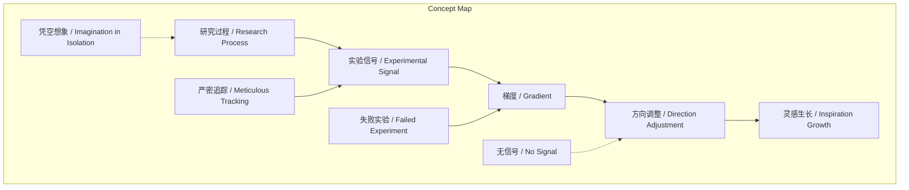
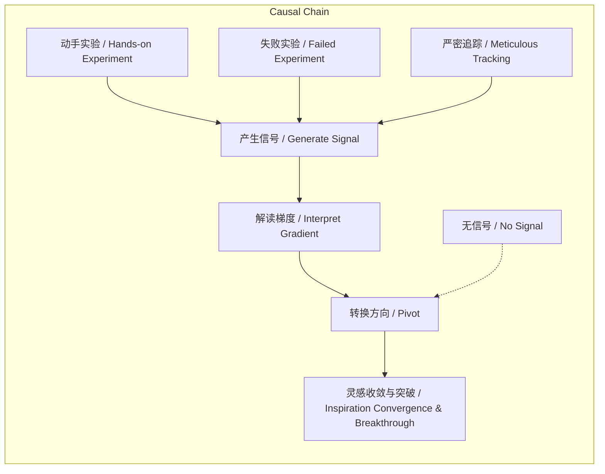

# NEWS/NEWS 任务报告

- agent: news/news
- requestId: 1773966323440-dbt73h
- 生成时间(UTC): 2026-03-20T00:26:08.103Z

## 文本总结

# 研究如随机梯度下降：探索中捕捉灵感

## 整体结构化文档表达
### 文档卡片
- 主题（中文/English）：研究方法论 / Research Methodology
- 一句话摘要：研究本质是探索过程，依赖高密度实验产生的“信号”与“梯度”指引方向，而非线性规划或凭空想象。
- 目标读者：科研人员、学生、对创新方法论感兴趣者
- 核心结论（3条）：
  1. 真正的研究必须通过动手实验与试错进行探索，而非凭空想象。
  2. 实验中的失败、意外或“没有信号”的结果分别提供强梯度或零梯度，直接决定研究方向。
  3. 有价值的灵感仅在严密追踪实验信号、并根据反馈动态调整（Pivot）的过程中生长。

### 内容结构树
1. 背景与问题定义：研究常被误认为从A到B的线性过程，但本质是探索。
2. 核心观点与关键证据：研究类比随机梯度下降；受何恺明影响，强调动手探索；失败提供强梯度，“没有信号”最糟。
3. 方法/机制/路径：像黑客一样写代码、复现基线；严密追踪实验（如用Excel对比）；跑实验前预测结果，依据偏差捕捉信号。
4. 风险与边界条件：最差研究是全程符合设想、无困难（Boring Idea）；无梯度信号导致方向迷失。
5. 结论与行动建议：拥抱非线性波折，随时准备转换方向，在试错中等待灵感收敛与突破。

### 结构化元数据（JSON）
```json
{
  "title": "研究如随机梯度下降：探索中捕捉灵感",
  "topic_zh": "研究方法论",
  "topic_en": "Research Methodology",
  "audience": "科研人员、学生、对创新方法论感兴趣者",
  "claims": [
    "研究必须通过动手实验与试错进行探索，而非凭空想象。",
    "实验失败或意外提供强梯度信号，指引优化方向。",
    "严密追踪实验信号并根据反馈动态调整是灵感生长的关键。"
  ],
  "evidence": [
    "受何恺明方法论影响，谢赛宁指出凭空想出的Idea往往不是好Idea。",
    "失败实验（如性能大幅下降）提供极大信息量，是明确的反向梯度。",
    "最糟糕的结果是‘不好也不差’，因无梯度信号。",
    "优秀研究充满非线性波折，需随时准备Pivot。"
  ],
  "risks": [
    "研究全程符合最初设想、无困难，说明是Boring Idea。",
    "实验无梯度信号，导致无法确定下一步方向。"
  ],
  "actions": [
    "像黑客一样动手写代码、复现基线模型。",
    "极其严密地追踪实验（如用Excel精细对比特征）。",
    "跑实验前提前预测结果，依据预测偏差捕捉信号。"
  ]
}
```

## 处理流程
1. 输入识别：识别输入文本为关于研究本质与方法论的论述，核心类比随机梯度下降。
2. 信息抽取：抽取实体（随机梯度下降、信号、梯度、何恺明、谢赛宁）、概念（探索、试错、失败、Boring Idea）、观点（研究需动手、失败是强梯度）及逻辑链（实验→信号→方向调整→灵感）。
3. 结构化归纳：将内容归纳为“背景—观点—方法—风险—结论”结构；定义关键概念；建立概念间因果关系。
4. 关系建模：建立“研究过程依赖实验信号”“失败实验产生强梯度”“严密追踪增强信号捕捉”等逻辑关系。
5. 可视化表达：生成概念结构图与因果链图。

## 概念清单（中英文）
- 研究的本质 / Essence of Research
- 随机梯度下降 / Stochastic Gradient Descent (SGD)
- 探索 / Exploration
- 灵感 / Inspiration
- 方向 / Direction
- 线性过程 / Linear Process
- 高密度实验 / High-density Experimentation
- 信号 / Signal
- 梯度 / Gradient
- 何恺明方法论 / He Kaiming's Methodology
- 谢赛宁 / Xie Saining
- 凭空想象 / Imagination in Isolation
- Idea
- 黑客 / Hacker
- 基线模型 / Baseline Model
- 玩具 / Toy
- 破解 / Hacking
- 试错 / Trial and Error
- 失败 / Failure
- 意外 / Surprise
- 性能下降 / Performance Drop
- 反向梯度 / Negative Gradient
- 算法 / Algorithm
- 没有信号 / No Signal
- 无聊想法 / Boring Idea
- 非线性波折 / Non-linear Twists and Turns
- 转换方向 / Pivot
- 收敛 / Convergence
- 突破 / Breakthrough
- 追踪实验 / Experiment Tracking
- Excel表格 / Excel Sheet
- 对比特征 / Comparative Features
- 预测结果 / Predicted Result

## 概念定义（中英文）
- 研究的本质 / Essence of Research：通过高密度实验不断寻找信号与梯度的探索过程，而非预设路径的线性执行。
- 随机梯度下降 / Stochastic Gradient Descent (SGD)：机器学习优化算法，通过迭代计算梯度调整参数；文中比喻研究通过实验反馈（梯度）寻找最优方向。
- 探索 / Exploration：研究者动手实验、复现基线、试错以发现新信号的非线性过程。
- 信号 / Signal：实验反馈的可观测信息（如性能变化），指示研究方向或潜在创新点。
- 梯度 / Gradient：在研究中比喻为实验信号的方向性信息，指引算法或思路的调整（如反向梯度提示改进方向）。
- 凭空想象 / Imagination in Isolation：脱离实验、在房间内闭门造车产生想法，被认为往往非好想法或已被验证。
- 黑客 / Hacker：比喻研究者应像黑客一样动手写代码、破解问题，将研究视为玩具。
- 基线模型 / Baseline Model：研究中用于对比的现有模型或方法，复现它是探索起点。
- 失败 / Failure：实验性能大幅下降或出现意外现象，提供强梯度信号。
- 没有信号 / No Signal：实验结果“不好也不差”，无显著反馈，无法提供方向指引。
- 无聊想法 / Boring Idea：研究全程无意外、完全符合预设，缺乏惊喜，通常价值低。
- 转换方向 / Pivot：根据实验信号动态调整研究思路或算法设计。
- 追踪实验 / Experiment Tracking：严密记录与对比实验细节（如用Excel），以捕捉细微信号。

## 概念关联与逻辑关系（中英文）
1. 研究过程 (Research Process) 依赖 实验信号 (Experimental Signal) 提供 梯度 (Gradient) 以指引方向：  
   `Research Process ∝ Experimental Signal → Gradient`
2. 失败实验 (Failed Experiment) 产生 强梯度信号 (Strong Gradient Signal)，促使 反向设计 (Reverse Design)：  
   `Failed Experiment → Strong Gradient Signal → Reverse Algorithm Design`
3. 严密追踪实验 (Meticulous Experiment Tracking) 增强 信号捕捉能力 (Signal Capture Ability)，从而生长 真正灵感 (Authentic Inspiration)：  
   `Meticulous Tracking → Enhanced Signal Capture → Authentic Inspiration`

## COT逻辑梳理（定义/分类/比较/因果/科学方法论）
- **Step 1 (定义)**：界定研究本质为类比随机梯度下降的探索过程，核心是获取实验信号（梯度）而非线性执行。
- **Step 2 (分类)**：区分研究类型——线性规划（凭空想象）vs 探索式（动手实验）；实验结果类型——强梯度（失败/意外）、零梯度（无信号）、弱梯度（小幅波动）。
- **Step 3 (比较)**：比较“凭空想象”与“动手探索”：前者易产出平庸或已淘汰想法，后者通过试错产生真实信号；比较“失败实验”与“无信号结果”：前者提供明确反向梯度，后者导致方向迷失。
- **Step 4 (因果)**：因果链：动手实验 → 产生信号/梯度 → 研究者解读并调整方向（Pivot） → 灵感生长 → 突破；失败实验（因）→ 强梯度信号（果）→ 反向设计（因）→ 性能提升（果）。
- **Step 5 (科学方法论)**：强调可重复性（复现基线）、可观测性（严密追踪实验）、可预测性（跑实验前预测结果）与迭代优化（根据偏差调整），形成“预测-实验-信号-调整”闭环。

## 事实与看法（病毒）
### 事实
- 研究的本质被描述为类似“随机梯度下降”的探索。
- 谢赛宁指出，受何恺明方法论影响，凭空想象往往产生非好Idea。
- 失败实验（如性能掉10点）提供极大信息量，是反向梯度。
- “不好也不差”的结果最糟糕，因无梯度信号。
- 优秀研究充满非线性波折，需随时准备转换方向（Pivot）。
- 研究者需严密追踪实验（如用Excel对比特征），并在跑实验前预测结果。
### 看法
- “真正的研究必须经历动手探索期。”
- “失败和意外是最强的梯度。”
- “最差的研究就是从头到尾都完全符合最初的设想、没有遇到任何困难。”
- “一开始设想的最初期Idea并不真正属于你……才是真正属于你自己的灵感。”
- “为了精准地捕捉这些带来灵感的梯度信号，研究者必须极其严密地追踪实验。”

## FAQ（原文问题整理）
- **为什么研究必须是探索而不是“凭空想象”？**  
  因为凭空想出的Idea要么已被多人思考，要么是糟糕想法；真正研究需动手探索，在试错中找方向。
- **“信号”与“梯度”如何带来灵感？**  
  实验反馈提供梯度信号：失败/意外是强梯度，指引反向设计；无信号则无法行动。
- **真正的Idea生长于捕捉信号的过程之中？**  
  是，初期Idea不属己，只有从实验信号衍生出的灵感才是自己的；全程无波折的研究是Boring Idea。

## Visualization
### Mermaid 图 1（概念结构图）

### Mermaid 图 2（逻辑/因果图）


## 文章中的类比
- 研究过程类比于“随机梯度下降”优化过程。
- 研究者应像“黑客”一样将研究当“玩具”去破解。

## 10个金句
1. 研究的本质是一场类似“随机梯度下降”的探索。
2. 坐在房间里凭空想出来的Idea往往不是好Idea。
3. 真正的研究必须经历动手探索期。
4. 失败和意外是最强的梯度。
5. 最怕“没有信号”。
6. 最差的研究就是从头到尾都完全符合最初的设想、没有遇到任何困难。
7. 优秀的研究充满了非线性的波折。
8. 研究者需要像黑客一样去写代码、复现基线模型。
9. 为了精准地捕捉这些带来灵感的梯度信号，研究者必须极其严密地追踪实验。
10. 如果预测错了，这种预期之外的信号就会促使研究者重新审视思路。
