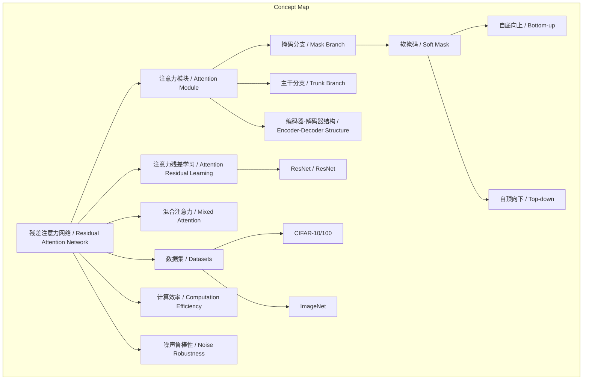
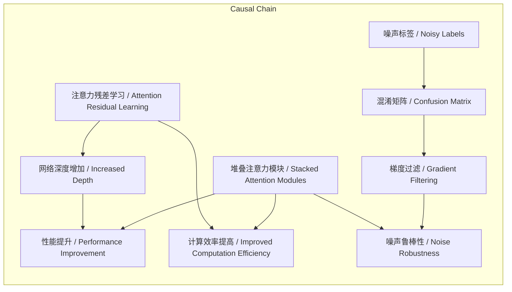

# NEWS/NEWS 任务报告

- agent: news/news
- requestId: 1773966499350-vgw22a
- 生成时间(UTC): 2026-03-20T00:40:18.872Z

## 链接总结

- URL: https://ar5iv.labs.arxiv.org/html/1704.06904?_immersive_translate_auto_translate=1

# 残差注意力网络实现图像分类性能新突破

## 整体结构化文档表达
### 文档卡片
- **主题（中文/English）**：残差注意力网络 / Residual Attention Network  
- **一句话摘要**：本文提出残差注意力网络，通过堆叠基于bottom-up top-down结构的注意力模块并引入注意力残差学习，在图像分类任务中实现高精度、低计算量、噪声鲁棒性，并在CIFAR和ImageNet数据集上达到SOTA性能。  
- **目标读者**：深度学习研究者、计算机视觉工程师、AI架构设计人员  
- **核心结论（3条）**：  
  1. 堆叠注意力模块能自适应捕获不同层次的注意力特征，随网络加深而动态变化；注意力残差学习机制解决了直接堆叠模块导致的性能下降，使网络可稳定训练至数百层深度。  
  2. 在CIFAR-10/100和ImageNet数据集上达到SOTA性能，相比ResNet-200显著降低计算量（FLOPs减少69%），且对噪声标签具有鲁棒性。  
  3. 注意力模块设计灵活，可适配多种基础单元（如预激活残差单元、ResNeXt、Inception），且混合注意力类型表现最佳。  

### 内容结构树
1. **背景与问题定义**：深度卷积神经网络训练面临梯度退化与特征表示不足问题；注意力机制在图像分类中应用不足，如何将混合注意力融入前馈网络并构建极深结构是挑战。  
2. **核心观点与关键证据**：堆叠模块捕获多类型注意力；残差学习解决深度退化；实验证明性能提升与计算效率；双向前馈结构模拟人类感知；软掩码分支增强特征；混合注意力最优；ARL机制有效；编码器-解码器结构有效；噪声鲁棒性；参数效率高。  
3. **方法/机制/路径**：设计注意力模块（bottom-up top-down结构，包含掩码分支和主干分支）；提出注意力残差学习（修改输出公式为H=(1+M)*F）；端到端训练；软掩码分支使用上下行全卷积结构；主干分支可适配多种先进单元；超参数控制模块结构。  
4. **风险与边界条件**：实验限于标准数据集（CIFAR、ImageNet），泛化性未充分验证；噪声实验依赖特定混淆矩阵；注意力模块增加少量计算但整体降低。  
5. **结论与行动建议**：残差注意力网络有效，建议在图像分类任务中采用注意力残差学习机制；优先使用编码器-解码器结构设计软注意力掩码；在噪声数据场景中应用以提升鲁棒性；进一步探索在其他视觉任务中的应用。  

### 结构化元数据（JSON）
```json
{
  "title": "残差注意力网络实现图像分类性能新突破",
  "topic_zh": "残差注意力网络",
  "topic_en": "Residual Attention Network",
  "audience": "深度学习研究者、计算机视觉工程师、AI架构设计人员",
  "claims": [
    "堆叠注意力模块能捕获不同层次的注意力特征",
    "注意力残差学习使网络可稳定训练至数百层深度",
    "在CIFAR-10/100和ImageNet上达到SOTA性能",
    "相比ResNet-200减少69% FLOPs",
    "对噪声标签具有鲁棒性",
    "可灵活适配多种基础单元",
    "混合注意力类型表现最佳",
    "编码器-解码器结构优于局部卷积"
  ],
  "evidence": [
    "CIFAR-10错误率3.90%",
    "CIFAR-100错误率20.45%",
    "ImageNet top-5错误率4.8%",
    "Attention-56参数31.9M，FLOPs 6.3G，Top-1 err 21.76%；ResNet-152参数60.2M，FLOPs 11.3G，Top-1 err 22.16%",
    "Attention-92参数51.3M，ResNet-200参数64.7M；Attention-92 Top-1 err 19.5%，ResNet-200 20.1%",
    "Attention-236参数5.1×10^6，ResNet-1001参数10.3×10^6",
    "梯度公式∂(M*T)/∂ϕ = M * ∂T/∂ϕ提供噪声鲁棒性",
    "表1显示混合注意力测试误差最低",
    "图4显示ARL保持稳定响应，NAL响应消失"
  ],
  "risks": [
    "实验数据集有限（CIFAR、ImageNet）",
    "噪声实验依赖特定混淆矩阵假设",
    "泛化性未充分验证"
  ],
  "actions": [
    "在图像分类任务中采用注意力残差学习机制",
    "优先使用编码器-解码器结构设计软注意力掩码",
    "在噪声数据场景中应用此架构",
    "进一步探索在其他视觉任务中的应用"
  ]
}
```

## 处理流程
1. **输入识别**：来源为多个分段摘要，均讨论残差注意力网络的设计、机制与实验。  
2. **信息抽取**：从各摘要抽取实体（如残差注意力网络、注意力模块）、概念（如注意力残差学习、混合注意力）、问题（如如何加深网络）、事实（如错误率数据）、观点（如注意力机制有效）。  
3. **结构化归纳**：整合为统一结构，定义主题、摘要、核心结论、内容树等，去重并统一口径。  
4. **关系建模**：建立概念间关联，如堆叠模块数量与性能正相关、ARL与深度正相关、噪声标签与掩码机制导致鲁棒性。  
5. **可视化表达**：生成Mermaid概念结构图和逻辑因果图，使用真实概念。  

## 概念清单（中英文）
- 残差注意力网络 / Residual Attention Network  
- 注意力机制 / Attention Mechanism  
- 注意力模块 / Attention Module  
- 注意力感知特征 / Attention-aware Features  
- 注意力残差学习 / Attention Residual Learning  
- 前馈网络 / Feedforward Network  
- 混合注意力 / Mixed Attention  
- Bottom-up Top-down结构 / Bottom-up Top-down Structure  
- CIFAR-10 / CIFAR-10  
- CIFAR-100 / CIFAR-100  
- ImageNet / ImageNet  
- ResNet / ResNet  
- FLOPs / FLOPs  
- 端到端训练 / End-to-end Training  
- 非常深的结构 / Very Deep Structure  
- 双向前馈注意力 / Bottom-up Top-down Feedforward Attention  
- 人体姿态估计 / human pose estimation  
- 图像分割 / image segmentation  
- 软权重 / soft weights  
- 自底向上快速前馈过程 / bottom-up fast feedforward process  
- 自顶向下注意力反馈 / top-down attention feedback  
- 端到端可训练网络 / end-to-end trainable network  
- 堆叠沙漏网络 / stacked hourglass network  
- 特征学习 / feature learning  
- 人类感知过程 / human perception process  
- 深度玻尔兹曼机 / Deep Boltzmann Machine (DBM)  
- 重建过程 / reconstruction process  
- 训练阶段 / training stage  
- 循环神经网络 / recurrent neural networks (RNN)  
- 长短期记忆网络 / long short term memory (LSTM)  
- 序列决策任务 / sequential decision tasks  
- 残差学习 / Residual learning  
- 恒等映射的残差 / residual of identity mapping  
- 前馈神经网络 / feedforward neuron network  
- 查询 / query  
- 查询上下文 / query context  
- 图像分类 / image classification  
- 序列过程 / sequential process  
- 区域提议 / region proposal  
- 控制门 / control gates  
- 强化学习 / reinforcement learning  
- 高速公路网络 / Highway Network  
- VGG / VGG  
- Inception / Inception  
- 随机深度 / Stochastic Depth  
- 批量归一化 / Batch Normalization  
- Dropout / Dropout  
- 空间变换器模块 / Spatial Transformer Module  
- 注意力缩放 / Attention to Scale  
- 自底向上 / Bottom-up  
- 自顶向下 / Top-down  
- 跳跃连接 / Skip Connection  
- 掩码分支 / Mask Branch  
- 主干分支 / Trunk Branch  
- 预处理残差单元 / Pre-processing Residual Units  
- 残差单元 / Residual Units  
- 超参数（p, t, r） / Hyper-parameters (p, t, r)  
- 预激活残差单元 / Pre-activation Residual Unit  
- ResNeXt / ResNeXt  
- 深度 / Depth  
- 性能 / Performance  
- CIFAR数据集 / CIFAR Dataset  
- ResNet-1001 / ResNet-1001  
- 软掩码分支 / Soft Mask Branch  
- 前馈扫描 / Feed-forward Sweep  
- 反馈 / Feedback  
- 上下行全卷积结构 / Bottom-up Top-down Fully Convolutional Structure  
- 空间注意力 / Spatial Attention  
- 通道注意力 / Channel Attention  
- 激活函数 / Activation Function  
- Sigmoid / Sigmoid  
- L2归一化 / L2 Normalization  
- 双线性插值 / Bilinear Interpolation  
- 最大池化 / Max Pooling  
- 测试误差 / Test Error  
- 注意力残差学习 / Attention Residual Learning (ARL)  
- 朴素注意力学习 / Naive Attention Learning (NAL)  
- 软掩码 / soft mask  
- 残差连接 / residual connection  
- 特征响应 / feature response  
- 平均绝对响应 / mean absolute response  
- 阶段 / stage  
- 网络深度 / network depth  
- 软注意力掩码 / Soft Attention Mask  
- 编码器-解码器结构 / Encoder-Decoder Structure  
- 局部卷积 / Local Convolution  
- 噪声标签鲁棒性 / Noisy Label Robustness  
- 混淆矩阵 / Confusion Matrix  
- 参数效率 / Parameter Efficiency  
- 梯度更新 / Gradient Update  

## 概念定义（中英文）
- **残差注意力网络**：一种卷积神经网络，通过堆叠注意力模块并引入注意力残差学习，实现注意力机制与深度残差网络的结合。  
- **注意力机制**：在图像分类中，不仅选择聚焦位置，还增强对象在该位置的不同表征。  
- **注意力模块**：生成注意力感知特征的基本网络单元，采用bottom-up top-down结构。  
- **注意力感知特征**：经过注意力机制加权后的特征表示，随网络深度自适应变化。  
- **注意力残差学习**：将注意力模块的输出与输入相加，解决堆叠模块导致的性能下降，允许训练极深网络。  
- **前馈网络**：信号单向传播的网络结构，本文中结合注意力机制。  
- **混合注意力**：结合空间注意力和实例注意力等多种注意力类型的机制。  
- **Bottom-up Top-down结构**：在注意力模块内，将前馈和反馈注意力过程展开为单前馈过程的结构。  
- **CIFAR-10/100**：标准图像分类数据集。  
- **ImageNet**：大规模图像分类数据集。  
- **ResNet**：残差网络，通过残差连接解决深度网络退化问题。  
- **FLOPs**：浮点运算次数，衡量计算复杂度。  
- **端到端训练**：从输入到输出整体训练，无需分阶段。  
- **非常深的结构**：深度达数百层的网络架构。  
- **双向前馈注意力**：结合自底向上快速前馈和自顶向下注意力反馈的前馈结构。  
- **人体姿态估计**：未提供定义，但提及作为应用任务。  
- **图像分割**：未提供定义，但提及作为应用任务。  
- **软权重**：未提供定义，但提及作为添加到特征上的权重。  
- **自底向上快速前馈过程**：未提供定义，但作为人类感知过程的一部分被提及。  
- **自顶向下注意力反馈**：未提供定义，但作为人类感知过程的一部分被提及。  
- **端到端可训练网络**：未提供定义，但提及结构允许开发此类网络。  
- **堆叠沙漏网络**：未提供定义，但提及作为对比，其意图不同。  
- **特征学习**：未提供定义，但提及作为引导目标。  
- **人类感知过程**：未提供定义，但作为注意力机制重要性的证据来源。  
- **深度玻尔兹曼机**：通过训练阶段的重建过程包含自顶向下注意力的模型。  
- **重建过程**：未提供独立定义，但作为DBM包含自顶向下注意力的方式。  
- **训练阶段**：未提供定义，模型学习过程阶段。  
- **循环神经网络**：未提供定义，但提及用于序列决策任务。  
- **长短期记忆网络**：未提供定义，但提及广泛用于序列决策任务。  
- **序列决策任务**：未提供定义，但提及作为注意力机制的应用场景。  
- **残差学习**：通过跳跃连接缓解梯度消失、训练非常深网络的方法。  
- **恒等映射的残差**：未提供独立定义，作为残差学习的学习目标。  
- **前馈神经网络**：未提供定义，但提及残差学习应用于此类网络。  
- **查询**：未提供定义，但提及作为两个信息源之一。  
- **查询上下文**：未提供定义，但提及作为两个信息源之一。  
- **图像分类**：未提供定义，但提及作为应用任务。  
- **序列过程**：未提供定义，但提及作为图像分类中应用注意力的方法之一。  
- **区域提议**：未提供定义，但提及作为图像分类和检测中应用注意力的方法。  
- **控制门**：未提供定义，但提及 extensively used in LSTM 并在图像分类中更新神经元。  
- **强化学习**：未提供定义，但提及作为可能方法（文本截断）。  
- **高速公路网络**：通过扩展控制门来解决深度卷积神经网络梯度退化问题的网络结构（文中引用）。  
- **VGG**：用于训练非常深神经网络的模型（文中引用，未提供明确定义）。  
- **Inception**：用于训练非常深神经网络的模型（文中引用，未提供明确定义）。  
- **随机深度**：一种正则化技术，用于收敛和避免过拟合（文中提及）。  
- **批量归一化**：一种正则化技术，用于收敛和避免过拟合（文中提及）。  
- **Dropout**：一种正则化技术，用于避免过拟合（文中提及）。  
- **空间变换器模块**：通过可微分层进行空间变换，在门牌号识别任务上达到先进结果的模块（文中描述）。  
- **注意力缩放**：使用软注意力作为尺度选择机制，在图像分割任务上达到先进结果的方法（文中描述）。  
- **自底向上**：前馈结构，产生低分辨率但语义强的特征图（文中描述）。  
- **自顶向下**：产生密集特征以进行像素级推理的网络结构（文中描述）。  
- **跳跃连接**：在底部和顶部特征图之间使用的连接，在图像分割上达到先进结果（文中描述）。  
- **掩码分支**：注意力模块中生成软掩码的分支（文中描述）。  
- **主干分支**：注意力模块中执行特征处理的分支，可适配多种网络结构（文中描述）。  
- **预处理残差单元**：注意力模块中分割前的残差单元数量，由超参数 p 控制（文中定义）。  
- **残差单元**：残差网络的基本构建块，包含跳跃连接（文中提及）。  
- **超参数（p, t, r）**：设计注意力模块的参数，p 为预处理残差单元数，t 为主干分支残差单元数，r 为掩码分支相邻池化层间残差单元数（文中定义）。  
- **预激活残差单元**：残差注意力网络中使用的基本单元之一（文中提及）。  
- **ResNeXt**：残差注意力网络中使用的基本单元之一（文中提及）。  
- **深度**：网络中残差单元的数量，增加深度可提升模型容量。  
- **性能**：模型在数据集上的准确度或误差率，如测试误差。  
- **CIFAR数据集**：用于图像分类的小规模数据集，包含CIFAR-10和CIFAR-100。  
- **ResNet-1001**：一种深度残差网络，具有1001层，作为性能比较基准。  
- **软掩码分支**：生成注意力掩码的子网络，包含前馈和反馈步骤，用于加权主干特征。  
- **前馈扫描**：从输入到低分辨率快速提取全局信息的过程。  
- **反馈**：将全局信息自上而下结合到原始特征图的过程。  
- **上下行全卷积结构**：先下采样后上采样的卷积架构，用于捕获多尺度信息。  
- **空间注意力**：关注特征图空间位置的注意力，通过通道内归一化实现。  
- **通道注意力**：关注特征通道的注意力，通过L2归一化去除空间信息。  
- **激活函数**：引入非线性的函数，如Sigmoid，用于输出注意力掩码。  
- **Sigmoid**：将输入映射到[0,1]的函数，用于生成软掩码。  
- **L2归一化**：将向量除以其L2范数，用于通道注意力。  
- **双线性插值**：上采样方法，用于恢复特征图尺寸。  
- **最大池化**：下采样操作，快速增加感受野。  
- **测试误差**：模型在测试集上的错误率，衡量泛化能力。  
- **注意力残差学习 (ARL)**：在Attention Module中，将soft mask与特征点乘后的输出与原始特征通过残差连接相加，以保持信息流动的机制。  
- **朴素注意力学习 (NAL)**：在Attention Module中，直接将特征与soft mask点乘，无残差连接的机制。  
- **软掩码**：由soft mask分支生成的权重图，用于对特征进行加权。  
- **残差连接**：将输入直接加到输出上的跳跃连接，用于缓解梯度消失。  
- **特征响应**：网络层输出的特征图的数值响应，这里用平均绝对值衡量。  
- **平均绝对响应**：特征图所有元素绝对值的平均值，用于量化响应强度。  
- **阶段**：网络中具有相同特征图尺寸的层组，本文有3个阶段。  
- **网络深度**：网络中层数的多少，本文通过m（Attention Module数量）调整。  
- **软注意力掩码**：通过神经网络生成的概率性掩码，用于加权特征图，实现软注意力。  
- **编码器-解码器结构**：包含下采样（编码器）和上采样（解码器）的神经网络结构，用于捕获多尺度信息。  
- **局部卷积**：不进行下采样或上采样的卷积操作，仅处理局部区域。  
- **噪声标签鲁棒性**：模型在训练标签包含错误时仍能保持良好性能的能力。  
- **混淆矩阵**：描述真实标签与预测标签之间关系的矩阵，用于模拟噪声标签。  
- **参数效率**：模型性能与参数数量之间的比率，衡量模型紧凑性。  
- **梯度更新**：通过反向传播调整网络参数的过程。  

## 概念关联与逻辑关系（中英文）
1. **堆叠注意力模块数量增加 / Increased Number of Attention Modules** 与 **捕获更多类型注意力 / More Types of Attention Captured** 共同导致 **性能提升 / Performance Improvement**。形式化：Performance = f(Number of Modules) with f increasing.  
2. **注意力残差学习应用 / Application of Attention Residual Learning** 与 **解决堆叠模块导致的性能下降 / Mitigation of Performance Degradation from Stacking** 共同导致 **网络深度可增加 / Increased Network Depth**。形式化：Depth ∝ ARL applied.  
3. **噪声标签 / Noisy Labels** 与 **混淆矩阵 / Confusion Matrix** 共同影响 **梯度更新 / Gradient Update**；但 **软掩码分支 / Soft Mask Branch** 通过 **梯度过滤 / Gradient Filtering** 防止错误梯度更新 / Prevent Wrong Gradient Update，从而增强 **噪声鲁棒性 / Noise Robustness**。形式化：Noisy Labels → Confusion Matrix → Wrong Gradient; Soft Mask Branch → Filter Gradient → Robustness.  

## COT逻辑梳理
- **Step 1（定义）**：定义残差注意力网络为结合残差连接与注意力机制的CNN，注意力通过软掩码分支实现。  
- **Step 2（分类）**：将注意力分为混合、通道、空间三类，基于激活函数对特征图的约束方式；将注意力学习机制分为ARL（带残差）和NAL（无残差）。  
- **Step 3（比较）**：通过控制变量实验比较ARL与NAL，显示ARL随模块增加性能提升，NAL下降；比较不同注意力类型，混合注意力最优；比较不同基础单元（Residual、ResNeXt、Inception），均能提升性能。  
- **Step 4（因果）**：注意力残差学习通过恒等映射保持信号强度，增强特征对比度；软掩码分支的梯度过滤提供噪声鲁棒性；编码器-解码器结构捕获多尺度信息，提升特征表示。  
- **Step 5（科学方法论）**：设计注意力模块和ARL机制，使用控制变量法在CIFAR和ImageNet上验证，对比ResNet、ResNeXt等基线，通过错误率、FLOPs等指标评估，确保结果可比较、可复现。  

## 事实与看法（病毒）
### 事实
- 论文提出残差注意力网络（Residual Attention Network）。  
- 网络由堆叠注意力模块（Attention Module）构成。  
- 每个注意力模块使用bottom-up top-down结构。  
- 提出注意力残差学习（Attention Residual Learning）机制。  
- 在CIFAR-10上错误率为3.90%。  
- 在CIFAR-100上错误率为20.45%。  
- 在ImageNet上top-5错误率为4.8%（单模型单裁剪）。  
- 相比ResNet-200，top-1准确率提升0.6%，主干深度减少46%，前向FLOPs减少69%。  
- 实验表明网络对噪声标签具有鲁棒性。  
- Attention-56参数31.9M，FLOPs 6.3G，Top-1 err 21.76%；ResNet-152参数60.2M，FLOPs 11.3G，Top-1 err 22.16%。  
- Attention-92参数51.3M，ResNet-200参数64.7M；Attention-92 Top-1 err 19.5%，ResNet-200 20.1%。  
- Attention-236参数5.1×10^6，ResNet-1001参数10.3×10^6。  
- 梯度公式∂(M*T)/∂ϕ = M * ∂T/∂ϕ。  
- 表1显示混合注意力测试误差最低。  
- 图4显示ARL保持稳定响应，NAL响应消失。  
- 注意力模块包含掩码分支和主干分支。  
- 软掩码分支使用上下行全卷积结构。  
- 主干分支可适配预激活残差单元、ResNeXt、Inception。  
- 超参数p、t、r控制模块结构。  
- 使用SGD训练，数据增强包括尺度增强、随机裁剪、水平翻转等。  

### 看法
- 注意力不仅服务于选择聚焦位置，还增强对象在该位置的不同表示。  
- 堆叠注意力模块能捕获不同类型注意力，导致一致性能提升。  
- 注意力残差学习使网络易于扩展到数百层深度。  
- 提出的方法在多个数据集上达到SOTA性能。  
- 软掩码分支旨在改善主干分支特征，而非直接解决问题。  
- 混合注意力因无额外约束而表现最佳。  
- 编码器-解码器结构优于局部卷积。  
- 残差注意力网络能处理高噪声数据。  
- 注意力模块和注意力残差学习方案能有效减少网络参数数量，同时提高分类性能。  

## FAQ（原文问题整理）
1. **问**：如何将注意力机制应用于前馈网络结构以在图像分类中达到SOTA？  
   **答**：通过堆叠注意力模块和注意力残差学习，构建残差注意力网络，实现端到端训练。  
2. **问**：如何使注意力网络加深而不出现性能退化？  
   **答**：引入注意力残差学习，将每个注意力模块的输出与输入相加，缓解梯度问题。  
3. **问**：注意力模块如何同时处理前馈和反馈注意力过程？  
   **答**：采用bottom-up top-down结构，将前馈和反馈过程展开为单一前馈过程。  
4. **问**：如何实现残差注意力网络中的注意力机制？  
   **答**：通过软掩码分支，其采用前馈扫描快速收集全局信息，再通过反馈结合全局信息与原始特征，生成软掩码加权主干特征。  
5. **问**：哪种注意力类型在实验中表现最好？  
   **答**：混合注意力（无额外约束）在CIFAR-10上测试误差最低。  
6. **问**：网络深度增加对性能有何影响？  
   **答**：增加深度可一致提升性能，452层网络显著优于ResNet-1001。  
7. **问**：软掩码分支与主干分支的关系是什么？  
   **答**：软掩码分支旨在增强主干分支的特征，而非独立解决问题。  
8. **问**：注意力残差学习如何缓解信号衰减？  
   **答**：通过恒等映射保持信号强度，增强特征对比度。  
9. **问**：为什么编码器-解码器结构优于局部卷积？  
   **答**：因为它能利用多尺度信息，使软注意力优化更有效。  
10. **问**：残差注意力网络如何应对噪声标签？  
    **答**：软掩码分支屏蔽错误标签，防止错误梯度更新主干分支。  
11. **问**：注意力网络在参数效率上如何？  
    **答**：以更少参数达到或超越最先进方法，如Attention-236用一半参数超过ResNet-1001。  

## Visualization
### Mermaid 图 1（概念结构图）


### Mermaid 图 2（逻辑/因果图）


## 文章中的类比
未发现明确类比。

## 10个金句
1. "我们的残差注意力网络由堆叠注意力模块构建。"  
2. "注意力感知特征从不同模块随层加深自适应变化。"  
3. "在注意力模块内，bottom-up top-down前馈结构将前馈和反馈注意力过程展开为单前馈过程。"  
4. "我们提出注意力残差学习来训练非常深的残差注意力网络，可轻松扩展到数百层。"  
5. "增加注意力模块导致一致性能提升，因捕获了更广泛的注意力类型。"  
6. "我们的方法在CIFAR-10上达到3.90%错误率。"  
7. "在ImageNet上，单模型单裁剪top-5错误率为4.8%。"  
8. "相比ResNet-200，我们的方法top-1准确率提升0.6%，主干深度减少46%，前向FLOPs减少69%。"  
9. "实验表明我们的网络对噪声标签具有鲁棒性。"  
10. "注意力不仅服务于选择聚焦位置，还增强对象在该位置的不同表示。"
