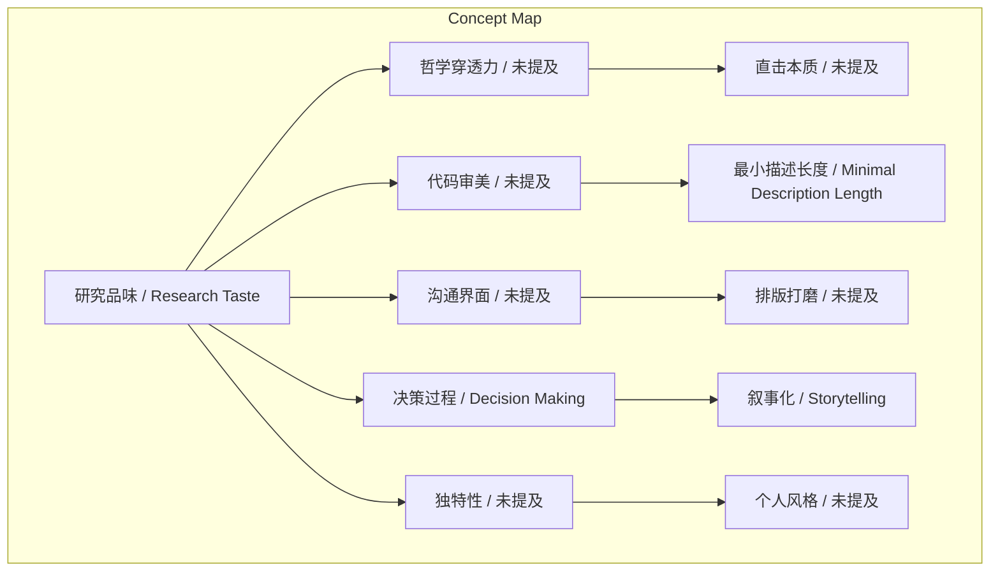
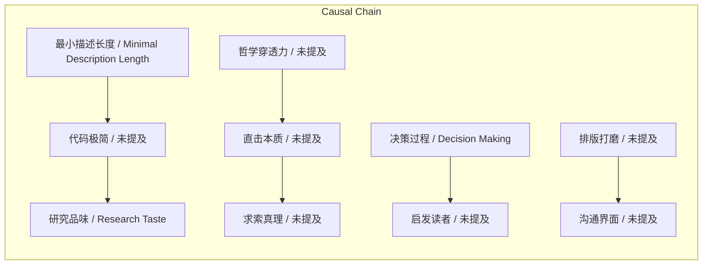

# NEWS/NEWS 任务报告

- agent: news/news
- requestId: 1774011861664-74bnem
- 生成时间(UTC): 2026-03-20T13:06:07.019Z

## 文本总结

# 研究品味：五维度解析学术审美与哲学

## 整体结构化文档表达
### 文档卡片
- 主题（中文/English）：研究品味 / Research Taste
- 一句话摘要：谢赛宁阐述研究品味是超越方法论的哲学审美，体现在哲学穿透力、代码审美、沟通界面、决策呈现与独特性五个核心维度。
- 目标读者：科研人员、学术研究者、学生
- 核心结论（3条）：
  1. 研究品味本质是融合哲学思考与审美判断的高维度研究能力。
  2. 追求极简（MDL）、优雅沟通和独特叙事是实践研究品味的关键路径。
  3. 避免迷失于表象（如acceptance、fame），直击本质与真理是研究品味的根本。

### 内容结构树
1. 背景与问题定义：研究品味的定义及其在学术研究中的重要性，区别于具体方法论。
2. 核心观点与关键证据：五个维度的具体内容，包括哲学穿透力（受《金刚经》影响）、代码审美（MDL原则）、沟通界面（排版强迫症）、决策呈现（拍电影类比）、独特性（个人风格）。
3. 方法/机制/路径：通过代码极简、提前完成研究打磨排版、叙事化决策过程、融入个人风格等方式培养研究品味。
4. 风险与边界条件：未提及明确风险，但反面行为包括沉迷acceptance/fame、赶工、排版粗糙、缺乏独特性。
5. 结论与行动建议：追求真理、采用MDL优化代码、极致打磨论文、像拍电影一样呈现决策、保持个人风格。

### 结构化元数据（JSON）
```json
{
  "title": "研究品味：五维度解析学术审美与哲学",
  "topic_zh": "研究品味",
  "topic_en": "Research Taste",
  "audience": "科研人员、学术研究者、学生",
  "claims": [
    "研究品味是超越方法论的哲学审美",
    "代码极简（MDL）与优雅沟通是重要体现",
    "独特性与决策叙事能提升研究影响力"
  ],
  "evidence": [
    "何恺明送《金刚经》影响研究品味定义",
    "DiT模型研发中追求极短代码（MDL）",
    "何恺明提前一个月完成研究以打磨排版",
    "论文排版要求单行文字不少于60%",
    "将研究决策过程类比为拍电影叙事"
  ],
  "risks": [
    "未提及明确风险，但隐含迷失于表象、赶工等反面行为"
  ],
  "actions": [
    "追求真理而非短暂名声",
    "采用最小描述长度（MDL）优化代码",
    "提前完成研究，极致打磨排版",
    "像拍电影一样呈现决策过程",
    "融入个人风格与独特性"
  ]
}
```

## 处理流程
1. 输入识别：识别文本为谢赛宁关于研究品味（Research Taste）的访谈内容摘录。
2. 信息抽取：抽取了研究品味定义、五个核心维度、关键人物（谢赛宁、何恺明）、证据（《金刚经》、DiT模型、排版要求）及类比（拍电影）。
3. 结构化归纳：将内容归纳为背景定义、核心观点、方法路径、风险条件、结论建议五部分。
4. 关系建模：建立研究品味与五个维度的包含关系，以及各维度间的因果链（如MDL→代码极简→研究品味）。
5. 可视化表达：生成概念结构图与逻辑因果图，使用真实概念节点。

## 概念清单（中英文）
- 研究品味 / Research Taste
- 哲学穿透力 / 未提及
- 虚相 / 未提及
- 本质 / 未提及
- 何恺明 / 未提及
- 谢赛宁 / 未提及
- 《金刚经》 / 未提及
- acceptance / acceptance
- fame / fame
- 短平快成果 / 未提及
- 真理 / 未提及
- 代码审美 / 未提及
- 最小描述长度 / Minimal Description Length
- MDL / MDL
- DiT模型 / DiT model
- 底层架构 / 未提及
- 工程 / 未提及
- 优雅 / 未提及
- 简单 / 未提及
- 解决方案 / 未提及
- 庞杂冗余 / 未提及
- 沟通界面 / 未提及
- 读者 / 未提及
- 观感 / 未提及
- Deadline / Deadline
- 通宵赶工 / 未提及
- 排版强迫症 / 未提及
- 孤词 / 未提及
- 拍电影 / 未提及
- Storytelling / Storytelling
- 决策过程 / Decision Making
- Decision Making / Decision Making
- 独特性 / 未提及
- 个人风格 / 未提及
- ResNeXt / ResNeXt
- 项目网页 / 未提及
- 研究视频 / 未提及

## 概念定义（中英文）
- 研究品味 / Research Taste：本质上是一种“研究的审美”，不仅涵盖具体做事的方法论，更涉及高维度的哲学考量。
- 哲学穿透力 / 未提及：打破“虚相”，直击本质的能力，使研究者能透过表象探寻实质与真理。
- 代码审美 / 未提及：对底层架构和工程的审美，追求极简与高效，体现为用最短代码达成目标。
- 最小描述长度 / Minimal Description Length：用极短、极简单的代码达成同样目的的原则，是优雅解决方案的体现。
- 沟通界面 / 未提及：论文为读者提供的传递知识的界面，要求排版优雅、统一，以提升读者观感。
- 决策过程 / Decision Making：研究中面临困难时的决策叙事，展示如何做决定，以启发读者。
- 独特性 / 未提及：研究中融入个人风格与审美，如巧妙命名、设计项目网页或制作研究视频。

## 概念关联与逻辑关系（中英文）
1. 研究品味 / Research Taste 包含 哲学穿透力 / 未提及、代码审美 / 未提及、沟通界面 / 未提及、决策过程 / Decision Making、独特性 / 未提及 五个维度。
2. 代码审美 / 未提及 ∧ 最小描述长度 / Minimal Description Length → 研究品味 / Research Taste（追求代码极简直接体现研究品味）。
3. 哲学穿透力 / 未提及 → 直击本质 / Essence → 求索真理 / 未提及（哲学穿透力驱动对真理的追求）。

## COT逻辑梳理（定义/分类/比较/因果/科学方法论）
- Step 1（定义）：研究品味是超越方法论的“研究的审美”，融合哲学与工程判断。
- Step 2（分类）：分为哲学穿透力、代码审美、沟通界面、决策呈现、独特性五个维度。
- Step 3（比较）：品味好的研究者直击本质、追求真理；品味不好的研究者沉迷acceptance/fame、追求短平快成果。
- Step 4（因果）：高研究品味导致优雅解决方案（通过MDL）、有效沟通（通过排版打磨）、启发读者（通过决策叙事）。
- Step 5（科学方法论）：实践研究品味需具体方法，如采用MDL优化代码、提前完成研究以打磨排版、将决策过程故事化、注入个人风格。

## 事实与看法
### 事实
- 谢赛宁认为研究品味本质上是一种“研究的审美”。
- 何恺明送给谢赛宁一本《金刚经》。
- 《金刚经》中“凡所有相，皆是虚妄”影响他们对研究品味的定义。
- 谢赛宁在研发DiT模型时追求用极短代码达成目的。
- 何恺明提前一个月完成研究，将最后一个月用于打磨论文。
- 论文排版要求单行不能只有少于60%的文字（避免孤词）。
- 谢赛宁将做研究比作拍电影（Storytelling）。
- 何恺明将网络命名为ResNeXt以致敬谢赛宁。
### 看法
- 品味不够好的研究者容易沉迷于虚无的“相”（如acceptance、fame）或短平快成果。
- 真正极高的研究品味能透过表象探寻实质与真理。
- 用极短代码的优雅解决方案优于庞杂冗余系统。
- 论文应提供“赏心悦目的沟通界面”，在乎读者观感。
- 好的论文应展示决策过程，让读者受启发。
- 有品味的研究带有强烈个人色彩，如命名、网页设计。

## FAQ（原文问题整理）
未发现明确提问。

## Visualization
### Mermaid 图 1（概念结构图）


### Mermaid 图 2（逻辑/因果图）


## 文章中的类比
- 研究决策过程类比于拍电影（Storytelling）：好的论文应像电影一样展示人物面临困难时的决策过程。

## 10个金句
1. 研究品味本质上是一种“研究的审美”。
2. 凡所有相，皆是虚妄。
3. 不迷失于表象。
4. 求索真理。
5. 追求代码和架构的极简与高效。
6. 论文不是写给自己看的，而是写给读者看的。
7. 在乎读者的观感是绝佳研究品味的体现。
8. 像拍电影一样呈现决策的过程。
9. 好的论文应当展示人物面临困难时的决策过程。
10. 有品味的研究往往带有强烈的个人色彩。
