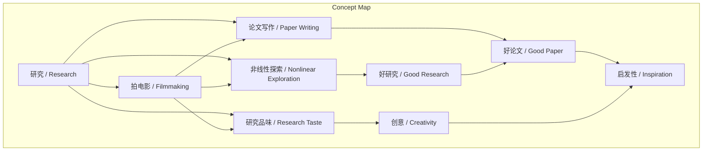
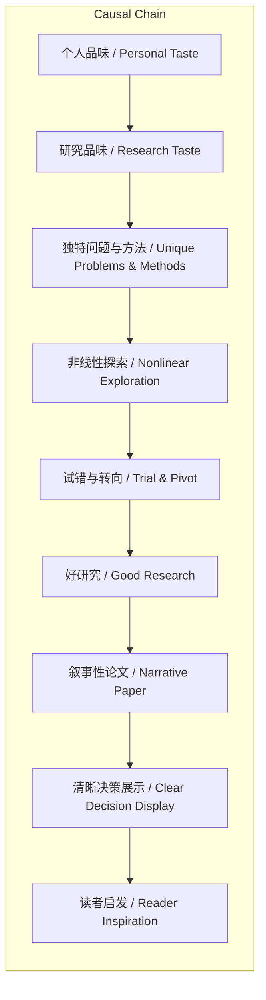

# NEWS/NEWS 任务报告

- agent: news/news
- requestId: 1774011972687-ieqcmd
- 生成时间(UTC): 2026-03-20T13:07:10.819Z

## 文本总结

# 研究如拍电影：非线性探索与个人品味

## 整体结构化文档表达
### 文档卡片
- 主题（中文/English）：研究方法论 / Research Methodology
- 一句话摘要：谢赛宁将研究过程类比为拍电影，提出非线性探索、叙事性决策展示与个人品味驱动三个核心维度。
- 目标读者：科研工作者、研究生、对创新方法论感兴趣者。
- 核心结论（3条）：
  1. 优秀研究应是非线性、充满试错与转向的探索过程，而非预设的直线路径。
  2. 论文写作的本质是“讲故事”与清晰展示研究者的关键决策过程。
  3. 强烈的个人审美与“研究品味”是驱动科学创新的核心要素。

### 内容结构树
1. 背景与问题定义：谢赛宁提出研究过程与拍电影在本质上相似，旨在揭示优秀研究的核心特征。
2. 核心观点与关键证据：
   - 观点1：拒绝线性，拥抱非线性探索。证据：拍电影需不断发现与探索，直线路径导致“流水账”；研究若毫无障碍实现，通常是“无聊的想法”。
   - 观点2：论文是“讲故事”与展示“决策过程”。证据：引用《故事》理论，好故事内核是人物在冲突中的选择；好论文需清晰展现“如何做决定”。
   - 观点3：个人审美与品味驱动创新。证据：引用马丁·斯科塞斯“最有创意的东西是最个人化的”；研究需发掘内心独特性以指导“研究品味”。
3. 方法/机制/路径：通过电影制作的艺术类比，将研究中的探索、写作与审美三个环节进行映射与重构。
4. 风险与边界条件：未提及明确风险。
5. 结论与行动建议：研究者应主动实践非线性探索，在论文中强化叙事与决策逻辑，并积极培育个人化的研究品味。

### 结构化元数据（JSON）
```json
{
  "title": "研究如拍电影：非线性探索与个人品味",
  "topic_zh": "研究方法论",
  "topic_en": "Research Methodology",
  "audience": "科研工作者、研究生",
  "claims": [
    "优秀研究应是非线性、充满试错与转向的探索过程。",
    "论文写作的本质是“讲故事”与清晰展示研究者的关键决策过程。",
    "强烈的个人审美与“研究品味”是驱动科学创新的核心要素。"
  ],
  "evidence": [
    "拍电影需要发现主题并经过不断探索，绝不能是直线到达终点。",
    "如果一开始的想法毫无障碍地实现了，那通常说明这是一个“无聊的想法”。",
    "引用《故事》：真正的故事内核是人物在特定时刻面临冲突时所做出的选择。",
    "写论文完全等同于此：要像拍电影一样，清晰地展现研究者“到底是怎么做决定的”。",
    "引用马丁·斯科塞斯：“最有创意的东西其实是最个人化的”。",
    "研究者需要发掘出自己内心“那团火”和与众不同的特质，用个人风格指导“研究品味”。"
  ],
  "risks": [],
  "actions": [
    "在研究中主动拥抱非线性路径，允许试错与转向。",
    "在论文写作中，将技术成果置于决策叙事的框架下展示。",
    "有意识地反思与培育个人的研究审美与品味。"
  ]
}
```

## 处理流程
1. 输入识别：用户提供了一段关于谢赛宁将研究类比为拍电影的论述文本。
2. 信息抽取：实体（谢赛宁、马丁·斯科塞斯、《故事》）、概念（研究、拍电影、非线性探索、Storytelling、决策过程、Research Taste、审美、品味）、观点（三个核心维度）、事实（类比关系、引用语句）。
3. 结构化归纳：将论述归纳为“探索方式”、“成果呈现”、“驱动力”三个并列的核心维度，并分析其间的支撑与递进关系。
4. 关系建模：建立“非线性探索”与“好研究”、“讲故事/决策展示”与“论文启发性”、“个人品味”与“创意”之间的正向关联。
5. 可视化表达：使用Mermaid绘制概念关联与逻辑因果图。

## 概念清单（中英文）
- 研究 / Research
- 拍电影 / Filmmaking
- 非线性探索 / Nonlinear Exploration
- 线性发展 / Linear Development
- 试错 / Trial and Error
- 转向 / Pivot
- 论文写作 / Paper Writing
- 讲故事 / Storytelling
- 决策过程 / Decision-Making Process
- 审美 / Aesthetic
- 品味 / Taste
- 研究品味 / Research Taste
- 马丁·斯科塞斯 / Martin Scorsese
- 《故事》 / Story (Book)
- 创意 / Creativity
- 个人化 / Personalization

## 概念定义（中英文）
- 研究 / Research：为增进知识而进行的系统性、创造性的探究过程。
- 拍电影 / Filmmaking：涉及发现主题、持续探索、拍摄与剪辑，最终呈现叙事作品的艺术与技术过程。
- 非线性探索 / Nonlinear Exploration：不遵循预设直线路径，而是在过程中根据反馈进行试错、调整和转向的探索方式。
- 线性发展 / Linear Development：从起点到终点预设固定路径、无重大波折的直线式进展。
- 试错 / Trial and Error：通过尝试不同方案并从中学习错误来逼近解决方案的方法。
- 转向 / Pivot：在探索过程中基于新认知或结果，对原定方向或方法做出重大改变。
- 论文写作 / Paper Writing：将研究成果系统化、书面化，并以特定格式与逻辑进行呈现的学术活动。
- 讲故事 / Storytelling：通过叙述事件、冲突与选择来传递信息、情感或观点的沟通方式。
- 决策过程 / Decision-Making Process：在面临多个选项或不确定性时，进行分析、判断并做出选择的一系列思考与行动。
- 审美 / Aesthetic：对美、风格或形式的感知、判断与偏好能力。
- 品味 / Taste：个人对事物（如艺术、风格）的鉴赏力与选择倾向。
- 研究品味 / Research Taste：研究者在选择问题、方法、理论框架及呈现方式时所体现的独特审美判断与偏好。
- 马丁·斯科塞斯 / Martin Scorsese：美国著名电影导演，以强烈的个人风格和对电影艺术的深度探索闻名。
- 《故事》 / Story (Book)：悉德·菲尔德（Syd Field）所著经典编剧理论书籍，系统阐述电影叙事结构。
- 创意 / Creativity：产生新颖且有价值想法或成果的能力。
- 个人化 / Personalization：将个人特质、经历、情感或视角融入事物之中，使其具有独特性。

## 概念关联与逻辑关系（中英文）
1. 非线性探索 / Nonlinear Exploration 与 决策过程 / Decision-Making Process 共同影响 研究质量 / Research Quality。  
   （形式化：研究质量 = f(非线性探索, 决策过程)）
2. 个人品味 / Taste 与 研究品味 / Research Taste 共同驱动 创意 / Creativity。  
   （形式化：创意 ∝ 个人品味 × 研究品味）
3. 讲故事 / Storytelling 与 决策过程 / Decision-Making Process 共同决定 论文启发性 / Paper Inspiration。  
   （形式化：论文启发性 = g(讲故事, 决策过程)）

## COT逻辑梳理（定义/分类/比较/因果/科学方法论）
- **Step 1 (定义核心概念)**：界定“研究”为系统性探究，“拍电影”为叙事性艺术创作过程。谢赛宁的核心操作是将两者进行跨领域类比。
- **Step 2 (分类核心维度)**：将类比关系分解为三个可独立论述的维度：1) 探索路径（非线性 vs 线性）；2) 成果表达（叙事决策 vs 技术罗列）；3) 内在驱动力（个人品味 vs 纯粹客观）。
- **Step 3 (比较与映射)**：比较电影制作中“发现主题、不断探索、呈现人物选择”与研究活动中“提出假设、实验试错、展示推理”的相似性，指出直线思维在两者中均导致平庸。
- **Step 4 (因果分析)**：建立因果链：个人化的研究品味 → 选择独特问题与方法 → 经历非线性探索 → 在论文中通过叙事展示关键决策 → 最终产出有创意、能启发他人的研究。
- **Step 5 (科学方法论反思)**：此类比并非否定科学的严谨性，而是强调在严谨的框架内，研究者的主观能动性（审美、决策、叙事）是连接客观事实与科学进步的关键桥梁，符合“科学发现常源于个人洞察”的历史方法论。

## 事实与看法（病毒）
### 事实
- 谢赛宁从小梦想成为导演。
- 谢赛宁将研究过程与拍电影进行类比。
- 他提出了三个核心维度。
- 他引用了编剧理论书籍《故事》的观点。
- 他引用了导演马丁·斯科塞斯的话。
- 原文表述了拍电影与研究在探索路径、叙事决策、个人风格上的相似性描述。
### 看法
- “那只会拍出毫无生气的‘流水账’电影。”
- “如果一开始的想法毫无障碍地实现了，那通常说明这是一个‘无聊的想法’。”
- “一篇好的论文不仅要展示技术成果，更要……清晰地展现研究者在面临困难时‘到底是怎么做决定的’。”
- “在这种探索中融入个人的独特性，是科学道路上极其重要的一环。”
- “最有创意的东西其实是最个人化的”（此为斯科塞斯看法，谢赛宁引用并认同）。

## FAQ（原文问题整理）
- 原文未提出明确的直接疑问句，其核心是阐述性论述。隐含的核心问题可归纳为：“如何理解并实践一个优秀的研究过程？” 回答基于三个类比维度：1) 路径上拥抱非线性；2) 写作上讲好决策故事；3) 内驱上培育个人品味。

## Visualization
### Mermaid 图 1（概念结构图）


### Mermaid 图 2（逻辑/因果图）


## 文章中的类比
- 研究过程与拍电影在本质上非常相似。

## 10个金句
1. 拍电影需要发现主题并经过不断探索，绝不能是站在起点就设定好一切然后毫无波折地直线到达终点。
2. 那只会拍出毫无生气的“流水账”电影。
3. 好的研究永远不是从起点直达终点的线性发展，而是在曲折中不断试错与转向。
4. 如果一开始的想法毫无障碍地实现了，那通常说明这是一个“无聊的想法”。
5. 论文写作本质上是“讲故事”与展示“决策过程”。
6. 真正的故事内核不是人物的背景，而是人物在特定时刻面临冲突时所做出的选择。
7. 一篇好的论文不仅要展示技术成果，更要像拍电影一样，清晰地展现研究者在面临困难时“到底是怎么做决定的”。
8. 把这些决策过程和背后的逻辑讲清楚，才能让读者读完后受到真正的启发。
9. 最有创意的东西其实是最个人化的。
10. 研究者需要像导演一样，发掘出自己内心“那团火”和自己与众不同的特质。
