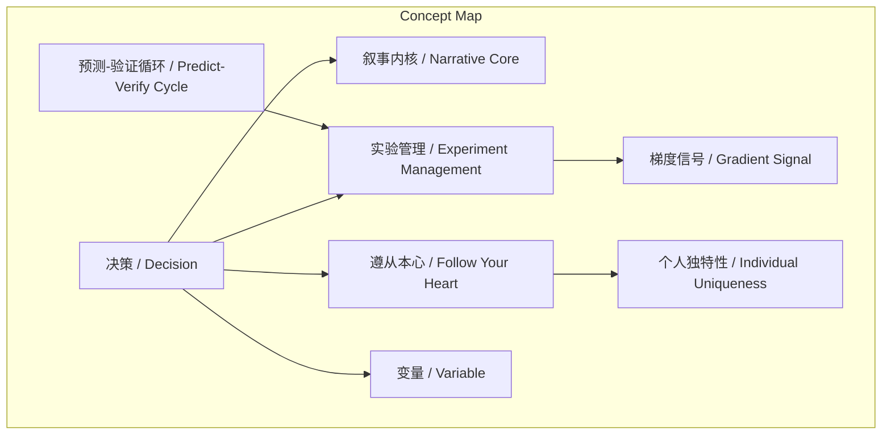
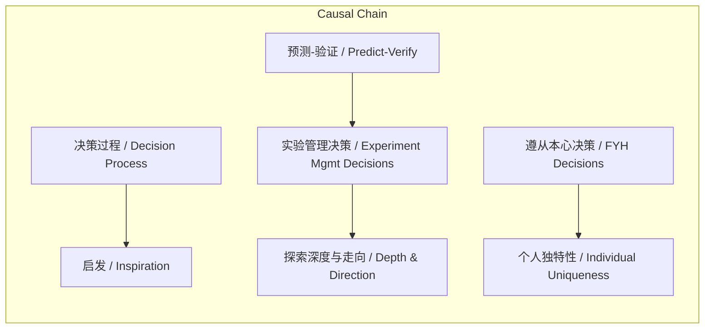

# NEWS/NEWS 任务报告

- agent: news/news
- requestId: 1774012066399-30dtk1
- 生成时间(UTC): 2026-03-20T13:08:48.550Z

## 文本总结

# 决策：科研叙事与人生变量的核心

## 整体结构化文档表达
### 文档卡片
- **主题（中文/English）**：科研与人生决策哲学 / Decision Philosophy in Research and Life
- **一句话摘要**：谢赛宁在访谈中阐述决策是科研叙事内核、实验管理关键及塑造个人独特性的根本。
- **目标读者**：科研工作者、学生、对决策科学感兴趣者
- **核心结论（3条）**：
  1. 决策过程是科研叙事带来真正启发的内核。
  2. 决策能力决定了科研探索的深度与走向。
  3. 遵从本心的决策塑造了个体的独特性与世界的变量。

### 内容结构树
1. **背景与问题定义**：基于谢赛宁访谈，探讨“做决定（选择）”在科研与人生中的核心重要性。
2. **核心观点与关键证据**：提出三个核心维度，并分别以编剧理论、实验管理、人生经历为证据。
3. **方法/机制/路径**：包括叙事化呈现决策、对照式实验管理、预测-验证循环、follow your heart。
4. **风险与边界条件**：未提及明确风险或边界条件。
5. **结论与行动建议**：结论即三条核心观点；行动建议隐含为在科研与人生中主动、清晰地进行决策。

### 结构化元数据（JSON）
```json
{
  "title": "决策：科研叙事与人生变量的核心",
  "topic_zh": "科研与人生决策哲学",
  "topic_en": "Decision Philosophy in Research and Life",
  "audience": "科研工作者、学生、对决策科学感兴趣者",
  "claims": [
    "决策过程是科研叙事带来真正启发的内核",
    "决策能力决定了科研探索的深度与走向",
    "遵从本心的决策塑造了个体的独特性与世界的变量"
  ],
  "evidence": [
    "引用《故事》理论：故事内核在于人物面临冲突时的选择",
    "写论文需像拍电影一样展现研究者做决定的过程与逻辑",
    "使用Excel追踪实验时，需决策关注指标（列）与展示/隐藏结果（行）",
    "何恺明教导：做实验前必须先预测实验结果，通过验证对错修正思维链条",
    "谢赛宁人生选择：大三主动联系新加坡实习、拒绝OpenAI选择FAIR"
  ],
  "risks": [],
  "actions": [
    "在科研写作中清晰阐述决策过程与逻辑",
    "在实验管理中实施对照式决策以捕捉梯度信号",
    "在人生关键节点遵从内心做出主动选择"
  ]
}
```

## 处理流程
1. **输入识别**：来源为用户提供的谢赛宁访谈文本片段。
2. **信息抽取**：抽取实体（谢赛宁、何恺明、《故事》）、概念（决策、叙事内核、实验管理、遵从本心）、问题（决策的重要性）、事实（经历、方法）、观点（三个维度）。
3. **结构化归纳**：将观点归纳为三个并列维度，分别对应科研叙事、实验方法、人生哲学。
4. **关系建模**：建立“决策”与“启发/深度/独特性”的因果关系；建立“预测-验证”循环的方法论关系。
5. **可视化表达**：准备Mermaid图展示概念结构与因果链。

## 概念清单（中英文）
- 决策 / Decision
- 叙事内核 / Narrative Core
- 实验管理 / Experiment Management
- 遵从本心 / Follow Your Heart
- 个人独特性 / Individual Uniqueness
- 变量 / Variable
- 脚手架 / Scaffolding（比喻）
- 梯度信号 / Gradient Signal
- 预测-验证循环 / Predict-Verify Cycle

## 概念定义（中英文）
- **决策 / Decision**：在科研或人生特定情境下，面对选项时做出选择的行为过程。
- **叙事内核 / Narrative Core**：在故事或论文中，由人物/研究者面临冲突时的关键选择构成的推动力与核心。
- **实验管理 / Experiment Management**：通过设计指标、筛选结果等决策来优化实验对比与信息获取的系统性过程。
- **遵从本心 / Follow Your Heart**：基于内在价值观与兴趣做出选择，而非外部优化。
- **个人独特性 / Individual Uniqueness**：通过主动决策所发掘并形成的个体特质与研究/人生品味。
- **变量 / Variable**：比喻个人作为能主动影响世界进程的能动因素。
- **脚手架 / Scaffolding**：比喻实验管理中决策所起的支撑与引导结构作用（源自“实验管理的‘脚手架’”）。
- **梯度信号 / Gradient Signal**：在实验失败或意外中，通过决策管理所精准捕捉的细微改进或方向线索。
- **预测-验证循环 / Predict-Verify Cycle**：先预测实验结果，再通过实验验证预测对错，并据此修正思维的方法论循环。

## 概念关联与逻辑关系（中英文）
1. **决策过程 → 叙事内核**：决策过程（Decision Process）直接构成叙事内核（Narrative Core），没有选择就没有故事/论文的启发。
2. **实验管理决策 → 梯度信号捕捉**：实验管理中的决策（Experiment Management Decisions）通过对照式设计，导致（leads to）对梯度信号（Gradient Signal）的精准捕捉。
3. **遵从本心的决策 → 个人独特性**：遵从本心的决策（Follow-Your-Heart Decisions）塑造（shapes）个人独特性（Individual Uniqueness）与世界变量（Variable）。
4. **预测-验证循环 → 科研探索深度**：预测-验证循环（Predict-Verify Cycle）作为方法，决定（determines）科研探索的深度与走向（Depth and Direction of Research Exploration）。

## COT逻辑梳理（定义/分类/比较/因果/科学方法论）
- **Step 1 (定义)**：界定核心概念“决策”为在冲突或不确定性下做出选择的行为，是谢赛宁访谈讨论的焦点。
- **Step 2 (分类)**：将决策分为三类：1) 科研叙事决策（关于如何呈现研究过程）；2) 实验操作决策（关于实验设计与管理）；3) 人生路径决策（关于职业与生活选择）。
- **Step 3 (比较)**：比较三类决策的异同——科研叙事决策注重逻辑清晰与启发；实验操作决策注重信息最大化与信号捕捉；人生路径决策注重内心契合与长期独特性。前两者具方法论色彩，后者具哲学色彩。
- **Step 4 (因果)**：分析因果链：a) 清晰的决策过程 → 读者获得启发；b) 精细的实验决策 → 提升探索效率与深度；c) 主动的本心决策 → 形成个人独特性并影响世界。
- **Step 5 (科学方法论)**：提炼“预测-验证循环”作为科学决策的方法论核心，体现假设驱动与实证修正的迭代过程，由何恺明教导引入。

## 事实与看法（病毒）
### 事实
- 谢赛宁在访谈中讨论了做决定（选择）的极端重要性。
- 谢赛宁引用《故事》一书，指出故事内核在于人物面临冲突时的选择。
- 谢赛宁认为写论文应像拍电影一样展现研究者做决定的过程。
- 谢赛宁提到使用Excel追踪实验时需决策关注指标（列）与展示/隐藏结果（行）。
- 何恺明教导谢赛宁：做实验前必须先预测实验结果。
- 谢赛宁在大三时主动联系去新加坡实习。
- 谢赛宁拒绝了OpenAI的邀请，选择了FAIR。
- 谢赛宁认为每个人都是世界的一个变量。

### 看法
- 决策过程是带来真正启发的内核。
- 把研究者面临困境时做决定的过程和背后的逻辑讲清楚，远比呈现直线结果重要。
- 对照式决策管理能最大化实验对比的信息量，帮助捕捉梯度信号。
- 通过验证决策与预想的对错来修正思维链条，能指引研究通往真正有价值的创新。
- 遵从内心（follow your heart）的决定能发掘个人的独特特质，指导出属于自己的研究品味与人生道路。
- 保有勇气的选择（即使短期看似“傻”或有风险）是重要的。

## FAQ（原文问题整理）
- 未发现明确提问。原文为陈述性观点阐述，未包含直接提问句式。

## Visualization
### Mermaid 图 1（概念结构图）


### Mermaid 图 2（逻辑/因果图）


## 文章中的类比
- **拍电影**：比喻写论文应清晰展现研究者做决定的过程与逻辑。
- **脚手架**：比喻实验管理中决策所起的支撑与引导结构作用（“实验管理的‘脚手架’”）。
- **变量**：比喻个人作为能主动影响世界进程的能动因素。

## 10个金句
1. 一个故事真正的内核并不在于人物的背景，而是人物在特定时刻面临冲突时所做出的选择。
2. 做研究和写论文完全等同于此。
3. 只有把研究者面临困境时做决定的过程和背后的逻辑讲清楚，读者读完后才能受到真正的启发。
4. 决策过程是带来真正启发的内核。
5. 这种基于对照式的决策管理能够最大化实验对比的信息量，帮助你在面对失败或意外时精准捕捉“梯度信号”。
6. 在做实验前必须先预测（决策）实验结果应该是什么样。
7. 通过验证自己决策与预想的对错，来修正思维链条，从而指引研究通往真正有价值的创新。
8. 每个人都是这个世界的一个变量。
9. 如果你不去主动做决定、不去推进你想做的事，这件事在这个世界上就永远不会发生。
10. 保有勇气的选择，最终能发掘出个人的独特特质，并指导出属于自己的研究品味与人生道路。
