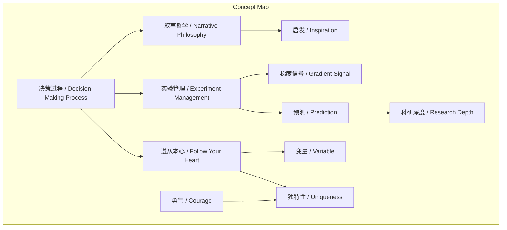
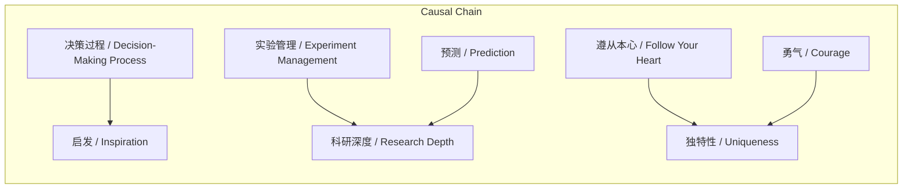

# NEWS/NEWS 任务报告

- agent: news/news
- requestId: 1774012134705-474zty
- 生成时间(UTC): 2026-03-20T13:10:56.936Z

## 文本总结

# 决策：科研启发与人生路径的核心

## 整体结构化文档表达
- **主题（中文/English）**：决策的重要性 / The Importance of Decision-Making  
- **一句话摘要**：谢赛宁访谈指出，决策过程是科研启发的内核，通过实验管理决定科研深度，并遵从本心塑造个人独特性与世界变量。  
- **目标读者**：科研人员、学生、对决策科学感兴趣者  
- **核心结论（3条）**：
  1. 决策过程是展现研究叙事、带来真正启发的核心。
  2. 决策能力通过实验管理机制影响科研探索的深度与走向。
  3. 遵从本心的决策塑造个人独特性，推动世界变量。

### 内容结构树
1. **背景与问题定义**：科研中做决定的重要性常被忽视，谢赛宁从三个核心维度阐述其关键作用。
2. **核心观点与关键证据**：
   - 维度1：决策过程是启发的内核，引用《故事》理论，以“拍电影”类比写论文。
   - 维度2：决策能力决定科研深度，通过Excel实验管理和何恺明的预测教导。
   - 维度3：遵从本心决策塑造独特性，以个人经历（实习、职业选择）为例。
3. **方法/机制/路径**：
   - 叙事展现：在论文中清晰呈现决策过程与逻辑。
   - 实验管理：使用工具（如Excel）进行对照式决策，预测并验证结果。
   - 人生选择：follow your heart，保有勇气做决定。
4. **风险与边界条件**：未提及明确风险，但隐含短期“傻”决定可能带来的不确定性。
5. **结论与行动建议**：强调决策在科研和人生中的核心地位，建议注重决策过程、实验前预测、遵从内心。

### 结构化元数据（JSON）
```json
{
  "title": "决策：科研启发与人生路径的核心",
  "topic_zh": "决策的重要性",
  "topic_en": "The Importance of Decision-Making",
  "audience": "科研人员、学生、决策科学爱好者",
  "claims": [
    "决策过程是科研启发的内核",
    "决策能力决定科研探索深度",
    "遵从本心的决策塑造独特性"
  ],
  "evidence": [
    "引用《故事》理论，选择推进故事发展",
    "Excel实验管理，关注指标和隐藏行，预测结果",
    "大三实习、拒绝OpenAI选择FAIR等人生决策"
  ],
  "risks": [],
  "actions": [
    "在论文中清晰展现决策过程",
    "实验前预测结果并验证",
    "遵从内心做决定"
  ]
}
```

## 处理流程
1. **输入识别**：用户提供谢赛宁访谈文本，讨论决策在科研与人生中的三个核心维度。
2. **信息抽取**：抽取实体（谢赛宁、FAIR、OpenAI）、概念（决策过程、实验管理）、观点（三个维度）。
3. **结构化归纳**：将内容归纳为三个核心维度，并定义每个维度的内涵与方法。
4. **关系建模**：建立决策与启发、科研深度、个人独特性之间的因果关系。
5. **可视化表达**：使用Mermaid绘制概念结构图和因果链图。

## 概念清单（中英文）
- 决策过程 / Decision-Making Process
- 叙事哲学 / Narrative Philosophy
- 《故事》/ 《Story》
- 实验管理 / Experiment Management
- 脚手架 / Scaffolding
- 梯度信号 / Gradient Signal
- 预测 / Prediction
- 遵从本心 / Follow Your Heart
- 变量 / Variable
- 勇气 / Courage
- 独特性 / Uniqueness
- 研究品味 / Research Taste
- 人生道路 / Life Path
- 谢赛宁 / Xie Saining
- 何恺明 / Kaiming He
- FAIR / FAIR
- OpenAI / OpenAI
- Excel / Excel

## 概念定义（中英文）
- **决策过程**：在面临冲突时做出选择的过程，是推进故事或研究发展的核心。
- **叙事哲学**：通过故事叙述展现决策过程以带来启发的哲学方法。
- **《故事》**：经典编剧理论书，强调人物选择而非背景推动叙事。
- **实验管理**：使用工具（如Excel）通过决策关注指标和展示结果来优化实验对比。
- **脚手架**：比喻实验管理中决策机制对研究构建的支撑作用。
- **梯度信号**：在实验失败或意外时，通过决策捕捉的细微变化信息，用于修正方向。
- **预测**：在实验前对结果的预判，是决策的关键环节。
- **遵从本心**：基于内心意愿而非外部优化做决定。
- **变量**：个人作为世界中可主动影响事件发生的因素。
- **勇气**：在决策中承担风险的心理品质。
- **独特性**：通过个人决策形成的区别于他人的特质。
- **研究品味**：由独特决策塑造的个人研究风格和方向。
- **人生道路**：由一系列遵从本心的决策构成的生活轨迹。
- **谢赛宁**：访谈对象，研究者，分享决策经验。
- **何恺明**：指导者，强调实验前预测的重要性。
- **FAIR**：谢赛宁选择的research机构。
- **OpenAI**：谢赛宁拒绝的AI研究机构。
- **Excel**：用于实验管理的电子表格工具。

## 概念关联与逻辑关系（中英文）
1. 决策过程 / Decision-Making Process 与 叙事哲学 / Narrative Philosophy 共同导致 启发 / Inspiration。逻辑表达式：决策过程 ∧ 叙事哲学 → 启发  
2. 实验管理 / Experiment Management 与 预测 / Prediction 共同影响 科研探索深度 / Research Depth。逻辑表达式：实验管理 × 预测 → 深度  
3. 遵从本心 / Follow Your Heart 与 勇气 / Courage 共同塑造 个人独特性 / Individual Uniqueness。逻辑表达式：遵从本心 ∧ 勇气 → 独特性  

## COT逻辑梳理（定义/分类/比较/因果/科学方法论）
- **Step 1: 定义**：决策过程是人物在冲突中做出选择，推动叙事或研究发展（源自《故事》理论）。
- **Step 2: 分类**：决策在科研中分为三类——叙事决策（写论文）、实验决策（管理）、人生决策（职业选择）。
- **Step 3: 比较**：叙事决策注重启发性和逻辑展现；实验决策注重精度和信号捕捉；人生决策注重内心遵从和风险承担。
- **Step 4: 因果**：决策过程通过叙事带来启发；决策能力（实验管理+预测）决定科研深度；遵从本心+勇气塑造独特性。
- **Step 5: 科学方法论**：实验前预测结果（假设），验证决策对错（检验），修正思维链条（迭代），符合科学方法中的假设-验证循环。

## 事实与看法（病毒）
### 事实
- 谢赛宁借用《故事》理论阐述决策重要性。
- 使用Excel追踪实验，通过决策关注指标和隐藏行。
- 何恺明教导实验前必须预测结果。
- 谢赛宁大三时去新加坡实习，拒绝OpenAI选择FAIR。
### 看法
- 决策过程是带来真正启发的内核。
- 只有清晰展现决策过程，读者才能受启发。
- 遵从本心的决定能发掘个人特质。
- 每个人是世界变量，不做决定则事不发生。

## FAQ（原文问题整理）
未发现明确提问。

## Visualization
### Mermaid 图 1（概念结构图）


### Mermaid 图 2（逻辑/因果图）


## 文章中的类比
- “拍电影”与写论文：类比决策过程在叙事中的重要性。
- 实验管理的“脚手架”：比喻决策机制像脚手架一样支撑实验构建。

## 10个金句
1. 一个故事真正的内核并不在于人物的背景，而是人物在特定时刻面临冲突时所做出的选择。
2. 一篇好的论文不仅要展示技术成果，更要像拍电影一样，清晰地展现研究者在面临困难时“到底是怎么做决定的”。
3. 只有把研究者面临困境时做决定的过程和背后的逻辑讲清楚，读者读完后才能受到真正的启发。
4. 在科研的日常操作中，做决策体现在精密的实验管理和预测机制上。
5. 这种基于对照式的决策管理能够最大化实验对比的信息量，帮助你在面对失败或意外时精准捕捉“梯度信号”。
6. 何恺明教导他在做实验前必须先预测（决策）实验结果应该是什么样。
7. 通过验证自己决策与预想的对错，来修正思维链条，从而指引研究通往真正有价值的创新。
8. 他坚信每个人都是这个世界的一个变量，如果你不去主动做决定、不去推进你想做的事，这件事在这个世界上就永远不会发生。
9. 即使有些决定在短期看来有些“傻”或具有风险，但保有勇气的选择，最终能发掘出个人的独特特质。
10. 并指导出属于自己的研究品味与人生道路。
