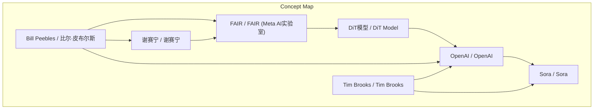
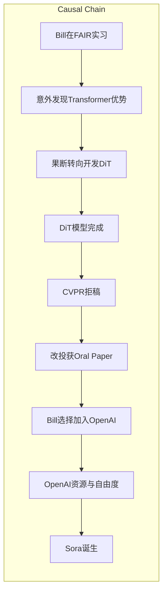

# NEWS/NEWS 任务报告

- agent: news/news
- requestId: 1774012448147-2favqg
- 生成时间(UTC): 2026-03-20T13:16:00.056Z

## 文本总结

# 从实习生到Sora核心：Bill Peebles与DiT的诞生

## 整体结构化文档表达
### 文档卡片
- 主题（中文/English）：Bill Peebles的职业轨迹与DiT/Sora模型发展 / Bill Peebles' Career Trajectory and the Development of DiT/Sora Models
- 一句话摘要：本文通过Bill Peebles的经历，阐述了DiT模型的诞生过程及其在OpenAI发展为Sora的关键转折。
- 目标读者：AI研究人员、科技行业从业者及对生成式AI发展感兴趣的读者
- 核心结论（3条）：
  1. Bill Peebles在DiT开发中扮演核心角色，其敏锐决策推动技术从试错中诞生。
  2. DiT模型初期遭遇冷遇但最终获认可，体现研究环境对创新接纳的影响。
  3. OpenAI的资源与自由度是Sora诞生的关键外部条件，凸显机构差异。

### 内容结构树
1. 背景与问题定义：介绍Bill身份及故事主线，串联DiT诞生与Sora发迹。
2. 核心观点与关键证据：分阶段详述Bill在DiT开发、发表、职业选择中的作用。
3. 方法/机制/路径：DiT从误打误撞到果断转向的技术路径，体现试错与机遇。
4. 风险与边界条件：FAIR内部质疑、CVPR拒稿、合规限制等外部挑战。
5. 结论与行动建议：总结个人才华与机构差异的影响（行动建议未提及）。

### 结构化元数据（JSON）
```json
{
  "title": "从实习生到Sora核心：Bill Peebles与DiT的诞生",
  "topic_zh": "Bill Peebles的职业轨迹与DiT/Sora模型发展",
  "topic_en": "Bill Peebles' Career Trajectory and the Development of DiT/Sora Models",
  "audience": "AI研究人员、科技行业从业者及对生成式AI发展感兴趣的读者",
  "claims": [
    "Bill Peebles在DiT开发中扮演核心角色，其敏锐决策推动技术从试错中诞生。",
    "DiT模型初期遭遇冷遇但最终获认可，体现研究环境对创新接纳的影响。",
    "OpenAI的资源与自由度是Sora诞生的关键外部条件，凸显机构差异。"
  ],
  "evidence": [
    "Bill是谢赛宁在FAIR招募的实习生，现为OpenAI Sora核心负责人。",
    "DiT源于对扩散模型表征的研究，意外发现Transformer架构更优。",
    "DiT被CVPR以缺乏新颖性拒稿，但改投后获Oral Paper。",
    "Bill在博士三年级选择加入OpenAI，利用其资源发展DiT为Sora。"
  ],
  "risks": [
    "FAIR内部因资源对齐质疑DiT项目。",
    "CVPR审稿人认为DiT设计简单、缺乏数学公式而拒稿。",
    "FAIR因合规问题不允许DiT论文署名。"
  ],
  "actions": []
}
```

## 处理流程
1. 输入识别：识别出访谈文本关于Bill Peebles与DiT/Sora的发展历程。
2. 信息抽取：抽取实体包括Bill Peebles、谢赛宁、FAIR、OpenAI、DiT、Sora、CVPR等；事实包括DiT开发过程、拒稿事件、职业选择；观点包括谢赛宁对Bill的评价。
3. 结构化归纳：按时间阶段（实习、DiT诞生、发表、职业选择）组织内容，定义关键概念。
4. 关系建模：建立Bill的决策、DiT技术、机构环境与Sora诞生之间的因果链。
5. 可视化表达：生成概念结构图和逻辑因果图。

## 概念清单（中英文）
- Bill Peebles / 比尔·皮布尔斯
- 谢赛宁 / 谢赛宁 (Xie Sai-ning)
- FAIR / FAIR (Meta AI实验室)
- OpenAI / OpenAI
- Sora / Sora
- DiT模型 / DiT Model
- 扩散模型 / Diffusion Model
- Transformer / Transformer
- U-Net / U-Net
- CVPR / CVPR (计算机视觉与模式识别会议)
- Oral Paper / Oral Paper (口头报告论文)
- 资源对齐 / Resource Alignment
- 合规 / Compliance
- 博士生 / PhD Student
- offer / Offer (工作录用通知)
- Tim Brooks / Tim Brooks

## 概念定义（中英文）
- Bill Peebles / 比尔·皮布尔斯：谢赛宁在FAIR招募的实习生，后成为OpenAI Sora的核心负责人。
- 谢赛宁 / 谢赛宁：FAIR研究员，Bill的导师，DiT模型的共同开发者。
- FAIR / FAIR (Meta AI实验室)：Meta旗下的AI研究实验室，Bill实习和DiT开发的地方。
- OpenAI / OpenAI：AI研究公司，Bill加入后开发了Sora模型。
- Sora / Sora：OpenAI开发的现象级视频生成模型。
- DiT模型 / DiT Model：基于Transformer的扩散模型架构，由Bill和谢赛宁开发，具有高效、简洁、可扩展的特点。
- 扩散模型 / Diffusion Model：文中提及的一种生成模型，用于研究表征学习，但未提供明确定义。
- Transformer / Transformer：一种神经网络架构，DiT基于此构建，文中未详细定义。
- U-Net / U-Net：传统扩散模型中常用的架构，DiT相比更高效，文中未详细定义。
- CVPR / CVPR：计算机视觉顶级会议，DiT论文曾被拒稿。
- Oral Paper / Oral Paper：会议中口头报告的论文，DiT最终获得此荣誉。
- 资源对齐 / Resource Alignment：FAIR内部因资源分配问题质疑DiT项目。
- 合规 / Compliance：FAIR因合规问题不允许论文署名。
- 博士生 / PhD Student：Bill当时身份，博士三年级。
- offer / Offer：工作录用邀请，Bill面临多家选择。
- Tim Brooks / Tim Brooks：OpenAI研究员，与Bill共同推动DiT发展为Sora。

## 概念关联与逻辑关系（中英文）
1. Bill Peebles 与 谢赛宁 共同开发了 DiT模型。形式化：Collaboration(Bill Peebles, 谢赛宁) → Development(DiT模型)
2. DiT模型 的 高效性 与 可扩展性 导致 其在 OpenAI 被采用。形式化：Property(DiT模型, 高效性) ∧ Property(DiT模型, 可扩展性) → Adoption(OpenAI, DiT模型)
3. OpenAI 的 资源自由度 与 Bill Peebles 的 职业直觉 共同促成 Sora 的诞生。形式化：Condition(OpenAI, 资源自由度) ∧ Condition(Bill Peebles, 职业直觉) → Outcome(Sora)

## COT逻辑梳理（定义/分类/比较/因果/科学方法论）
Step 1: 定义关键概念。例如，DiT模型是一种基于Transformer的扩散模型架构，用于视频生成，具有高效、简洁、可扩展的特点。
Step 2: 分类。将模型架构分类：传统扩散模型使用U-Net，而DiT使用Transformer，属于架构创新。
Step 3: 比较。比较DiT与U-Net：DiT更高效、稳定、代码简短，更具可扩展性，但设计简单。
Step 4: 因果分析。Bill在实习中意外发现Transformer架构的优势，果断放弃原方向，导致DiT诞生；Bill选择加入OpenAI，利用其资源，导致Sora诞生。
Step 5: 科学方法论。从试错研究中捕捉意外信号，体现科学发现中的机遇与决策重要性；研究环境（FAIR vs OpenAI）对创新成果的影响，反映机构文化对科学产出的作用，如资源支持与自由度。

## 事实与看法（部分）
### 事实
- Bill Peebles是谢赛宁在FAIR招募的实习生，现为OpenAI Sora核心负责人。
- 2022年夏天Bill到FAIR实习，最初研究扩散模型表征，后转向开发DiT。
- DiT基于Transformer架构，比U-Net更高效、稳定、可扩展，代码简短。
- DiT被CVPR拒稿，理由为缺乏新颖性，后改投获Oral Paper。
- FAIR因合规问题不允许DiT论文署名。
- Bill在博士三年级选择加入OpenAI，与Tim Brooks共同开发Sora。
- 谢赛宁认为Bill是“六边形战士”般的完美博士生。

### 看法
- 谢赛宁对Bill的评价极高，认为他敏锐、全面出色。
- Bill展现出极强的人生预测与决策能力。
- Bill的职业选择体现了对机遇的敏锐洞察。
- 不同机构在研究基因和资源支持上有巨大差异。

## FAQ（原文问题整理）
未发现明确提问。

## Visualization
### Mermaid 图 1（概念结构图）


### Mermaid 图 2（逻辑/因果图）


## 文章中的类比
- 六边形战士：比喻Bill在各方面都极其出色，如同游戏中属性全面的角色。

## 10个金句
1. “六边形战士”般的完美博士生。
2. 在迷茫与试错中果断转向。
3. 捕捉到了一个意外的信号。
4. 代码也极其简短优雅。
5. 因为设计太简单、缺乏复杂的数学公式被审稿人以“缺乏新颖性”为由拒稿。
6. 原封不动地改投了另一个会议，直接斩获了极高荣誉的Oral Paper。
7. 极强的人生预测与决策能力。
8. 在OpenAI更加自下而上、资源充沛且愿意给予极大自由度的研究环境中。
9. 做了在FAIR想都不敢想的事情。
10. 不同机构在研究基因和资源支持上的巨大差异。
