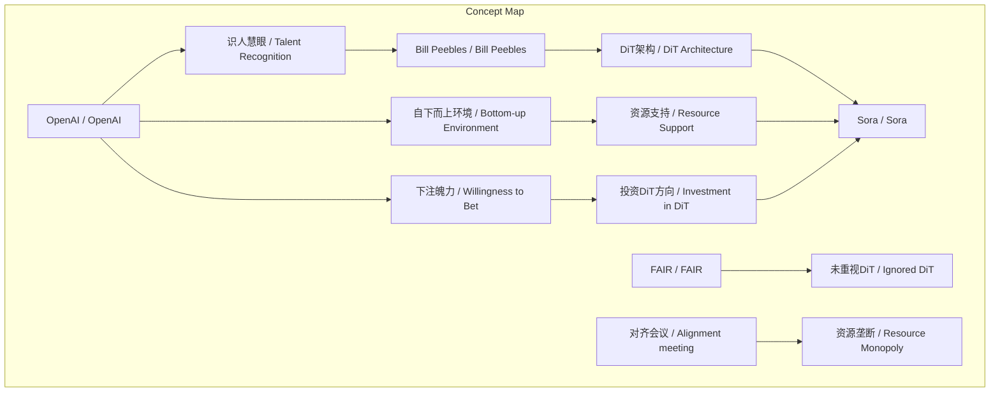
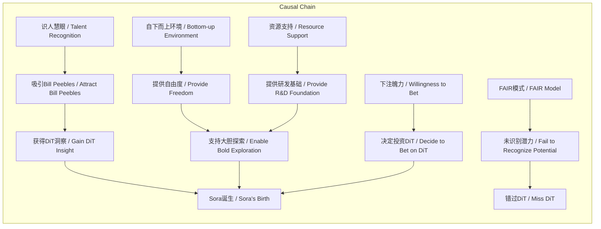

# NEWS/NEWS 任务报告

- agent: news/news
- requestId: 1774012562942-mf6d68
- 生成时间(UTC): 2026-03-20T13:17:00.579Z

## 文本总结

# OpenAI促成Sora诞生的三大核心优势

## 整体结构化文档表达
### 文档卡片
- 主题（中文/English）：OpenAI创新机制 / OpenAI's Innovation Mechanism
- 一句话摘要：谢赛宁评价OpenAI通过识人慧眼、赋予年轻研究员极大自由度与资源、以及敢于下重注的魄力，促成了Sora的诞生。
- 目标读者：科技行业从业者、企业管理者、AI研究者
- 核心结论（3条）：
  1. OpenAI具备极强的识人慧眼与技术前瞻性，能识别并重用如Bill Peebles这样的年轻人才及其洞察的DiT架构潜力。
  2. OpenAI提供自下而上、资源充足的纯粹科研环境，给予年轻研究员极大自由度，使其能探索“想都不敢想”的项目。
  3. OpenAI拥有敢于向未知领域下注的远见与魄力，这是其区别于FAIR等传统大厂的关键创新基因。

### 内容结构树
1. 背景与问题定义：DiT架构曾被顶会拒稿且未被FAIR重视，但最终成为Sora的基础。
2. 核心观点与关键证据：OpenAI在识人、赋权、下注三个维度表现突出，具体案例为Bill Peebles的加入与Sora研发。
3. 方法/机制/路径：通过“自下而上”的科研氛围、充足资源支持、以及对技术方向的果断投资来实现创新。
4. 风险与边界条件：未提及
5. 结论与行动建议：未提及

### 结构化元数据（JSON）
```json
{
  "title": "OpenAI促成Sora诞生的三大核心优势",
  "topic_zh": "OpenAI创新机制",
  "topic_en": "OpenAI's Innovation Mechanism",
  "audience": "科技行业从业者、企业管理者、AI研究者",
  "claims": [
    "OpenAI具备极强的识人慧眼与技术前瞻性",
    "OpenAI提供自下而上、资源充足的纯粹科研环境",
    "OpenAI拥有敢于向未知领域下注的远见与魄力"
  ],
  "evidence": [
    "DiT架构因'设计过于简单'被顶会拒稿，未被FAIR重视",
    "Bill Peebles作为实习生洞察机遇并加入OpenAI",
    "OpenAI为Bill Peebles和Tim Brooks提供极大自由度与庞大资源",
    "OpenAI支持年轻人做'之前大家想都不敢想的事情'",
    "谢赛宁认为这种创新基因在FAIR等传统大厂中不存在"
  ],
  "risks": [],
  "actions": []
}
```

## 处理流程
1. 输入识别：来源为用户提供的谢赛宁访谈文本，内容聚焦于OpenAI促成Sora诞生的原因分析。
2. 信息抽取：抽取实体（谢赛宁、OpenAI、Bill Peebles、Sora、DiT、FAIR、Tim Brooks）、概念（识人慧眼、技术前瞻性、自下而上、对齐会议、资源支持、下注/赌）、问题（为何OpenAI能成功促成Sora）、事实（DiT被拒稿、Bill为实习生、OpenAI提供环境）、观点（OpenAI厉害、有魄力、FAIR无创新基因）。
3. 结构化归纳：将内容归纳为背景、核心观点、方法、风险、结论五部分；核心观点进一步分类为识人、赋权、下注三个维度。
4. 关系建模：建立概念间逻辑关系，如“识人慧眼”导致“人才加入”，“资源支持”与“技术洞察”共同导致“Sora诞生”，“下注魄力”驱动“方向投资”。
5. 可视化表达：使用Mermaid绘制概念结构图与因果链图。

## 概念清单（中英文）
- 谢赛宁 / Xiening Xie
- OpenAI / OpenAI
- Bill Peebles / Bill Peebles
- Sora / Sora
- DiT / Diffusion Transformer
- FAIR / FAIR (Meta AI实验室)
- Meta AI实验室 / Meta AI Research
- 对齐会议 / Alignment meeting
- Tim Brooks / Tim Brooks
- 自下而上 / Bottom-up
- 下注（Bet） / Bet
- 技术前瞻性 / Technological Foresight
- 识人慧眼 / Talent Recognition
- 纯粹科研氛围 / Pure Research Atmosphere
- 资源支持 / Resource Support
- 创新基因 / Innovation Gene

## 概念定义（中英文）
- **谢赛宁 / Xiening Xie**：访谈中的评价者，曾就职于FAIR，观察OpenAI与Sora研发过程。
- **OpenAI / OpenAI**：一家人工智能研究公司，促成视频生成模型Sora的诞生。
- **Bill Peebles / Bill Peebles**：OpenAI实习生，Sora核心研发者之一，敏锐洞察DiT架构潜力。
- **Sora / Sora**：OpenAI开发的轰动世界的视频生成模型。
- **DiT / Diffusion Transformer**：一种扩散模型与Transformer结合的架构，最初被顶会拒稿。
- **FAIR / FAIR (Meta AI实验室)**：Meta公司的AI研究实验室，谢赛宁曾就职处，未重视DiT架构。
- **Meta AI实验室 / Meta AI Research**：即FAIR，Meta的AI研究部门。
- **对齐会议 / Alignment meeting**：传统大厂中自上而下的讨论AI对齐问题的会议，可能消耗资源。
- **Tim Brooks / Tim Brooks**：Sora另一位核心研发者。
- **自下而上 / Bottom-up**：科研组织方式，由底层研究员驱动方向，而非自上而下指派。
- **下注（Bet） / Bet**：指对技术方向做出高风险投资决策并坚信其成功。
- **技术前瞻性 / Technological Foresight**：预见技术未来潜力的能力。
- **识人慧眼 / Talent Recognition**：识别并重用卓越人才的能力。
- **纯粹科研氛围 / Pure Research Atmosphere**：以科研本身为导向，不受过多行政或对齐会议干扰的环境。
- **资源支持 / Resource Support**：提供充足的算力、数据、资金等研发资源。
- **创新基因 / Innovation Gene**：组织内部鼓励冒险、支持突破性创新的文化特质。

## 概念关联与逻辑关系（中英文）
1. **识人慧眼（Talent Recognition）** 与 **Bill Peebles的洞察力（Bill Peebles' Insight）** 共同导致 **Bill Peebles加入OpenAI（Bill Peebles Joining OpenAI）**。
   - 形式化：识人慧眼(OpenAI) ∧ 洞察力(Bill) → 加入(OpenAI, Bill)
2. **自下而上的环境（Bottom-up Environment）** 与 **资源支持（Resource Support）** 共同影响 **Sora诞生（Sora's Birth）**。
   - 形式化：环境(自下而上) ∧ 资源(充足) → 成果(Sora)
3. **敢于下注的魄力（Willingness to Bet）** 与 **DiT架构潜力（DiT Potential）** 共同驱动 **OpenAI的投资决策（OpenAI's Investment Decision）**。
   - 形式化：魄力(下注) ∧ 潜力(DiT) → 决策(投资DiT)

## COT逻辑梳理（定义/分类/比较/因果/科学方法论）
- **Step 1 定义问题**：为何OpenAI能成功促成Sora诞生，而FAIR等传统大厂未能做到？
- **Step 2 分类因素**：将成功因素分为三类——识人（人才识别与吸引）、赋权（环境与资源）、下注（决策魄力）。
- **Step 3 比较分析**：对比OpenAI的“自下而上”模式与传统大厂的“自上而下对齐会议”及资源垄断，指出前者更利于突破性创新。
- **Step 4 因果推导**：因OpenAI具备识人慧眼，故吸引Bill Peebles；因提供自由度与资源，故支持其探索；因敢于下注，故投资DiT方向；三者共同导致Sora诞生。
- **Step 5 科学方法论**：基于案例观察（谢赛宁的访谈）进行归纳，强调实践中的组织行为与创新文化对技术突破的关键作用，而非仅依赖技术架构本身。

## 事实与看法（病毒）
### 事实
- DiT架构最初因“设计过于简单”被顶会拒稿。
- DiT架构未引起FAIR的重视和实际应用。
- Bill Peebles当时是实习生。
- OpenAI为Bill Peebles和Tim Brooks提供极大自由度与庞大资源。
- OpenAI支持年轻人做“之前大家想都不敢想的事情”。
- 谢赛宁认为这种创新基因在FAIR及传统大厂中不存在。

### 看法
- OpenAI是一家非常“厉害”的公司。
- OpenAI具备极强的识人慧眼与技术前瞻性。
- OpenAI提供“自下而上”、充满纯粹科研氛围的环境。
- OpenAI具备敢于向未知领域下注的远见与魄力。
- 真正困难的是决定去“赌”这个方向并相信能做成。

## FAQ（原文问题整理）
- 未发现明确提问。原文为谢赛宁的评价陈述，未包含直接提问句。

## Visualization
### Mermaid 图 1（概念结构图）


### Mermaid 图 2（逻辑/因果图）


## 文章中的类比
- 未发现明确类比。

## 10个金句
1. 极强的识人慧眼与技术前瞻性。
2. 设计过于简单被顶会拒稿。
3. 自下而上、充满纯粹科研氛围的环境。
4. 给予年轻人足够多的自由度与庞大的资源支持。
5. 放手去做“之前大家想都不敢想的事情”。
6. 真正困难的是决定去“赌（bet）”这个方向。
7. 发自内心地相信这件事情能够做成。
8. 敢于向未知领域下注的远见与魄力。
9. 这种创新基因在当时的FAIR以及其他传统大厂中是不存在的。
10. 原文未提供。
