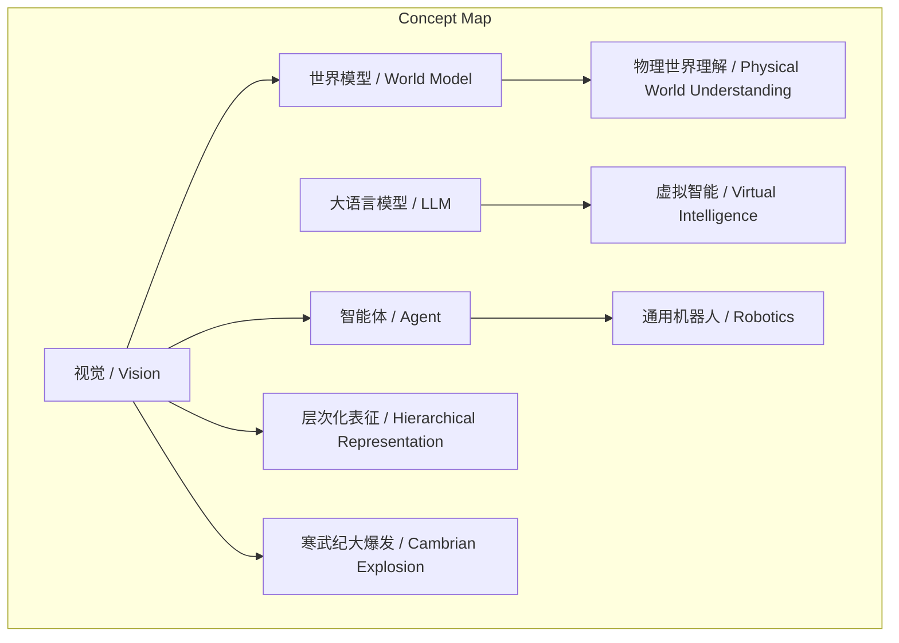
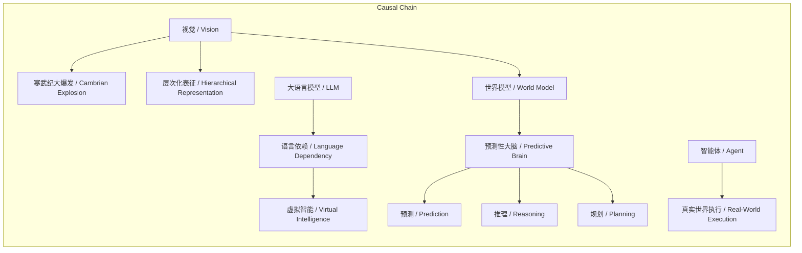

# NEWS/NEWS 任务报告

- agent: news/news
- requestId: 1774015352695-tlvg6c
- 生成时间(UTC): 2026-03-20T14:04:02.062Z

## 文本总结

# 视觉即智能：谢赛宁论智能体基石

## 整体结构化文档表达
### 文档卡片
- **主题**：视觉与智能体的关系 / Vision-Agent Equivalence
- **一句话摘要**：谢赛宁提出视觉与智能体存在深刻等价关系，视觉是构建智能体世界模型、实现物理世界理解的绝对基石。
- **目标读者**：人工智能研究者、认知科学家、机器人学专家、科技政策制定者
- **核心结论**：
  1. 视觉是生物智能演化的核心引擎，驱动了寒武纪大爆发。
  2. 视觉代表了处理真实物理世界的能力，是智能的本质总和。
  3. 当前基于LLM的智能体是虚拟智能，缺乏视觉基础无法成为真实行动者。

### 内容结构树
1. **背景与问题定义**：谢赛宁断言视觉与智能体等价，需从四个维度理解其关系。
2. **核心观点与关键证据**：
   - 进化视角：视觉导致寒武纪大爆发，眼睛是大脑的一部分。
   - 认知本质：视觉是处理真实物理世界高维信号的能力，需层次化表征。
   - 真实vs虚拟：LLM依赖低带宽语言，是虚拟智能；真实智能需物理执行。
   - 世界模型：视觉构建预测性大脑，实现自发预测、推理、规划。
3. **方法/机制/路径**：通过视觉传感器（高带宽）摄入信息，世界模型过滤噪音，形成表征用于决策。
4. **风险与边界条件**：未提及明确风险，但隐含LLM路径无法适应物理世界。
5. **结论与行动建议**：视觉是智能体基石，必须发展基于视觉的世界模型以实现真实智能。

### 结构化元数据（JSON）
```json
{
  "title": "视觉即智能：谢赛宁论智能体基石",
  "topic_zh": "视觉与智能体的关系",
  "topic_en": "Vision-Agent Equivalence",
  "audience": "人工智能研究者、认知科学家、机器人学专家、科技政策制定者",
  "claims": [
    "视觉是生物智能演化的核心引擎，驱动了寒武纪大爆发。",
    "视觉代表了处理真实物理世界的能力，是智能的本质总和。",
    "当前基于LLM的智能体是虚拟智能，缺乏视觉基础无法成为真实行动者。"
  ],
  "evidence": [
    "寒武纪之前生物在深海生存，视觉诞生后引发军备竞赛，导致物种和智能大爆发。",
    "眼睛是大脑的一部分，且是唯一暴露在真实物理世界中的大脑部分。",
    "语言是高度压缩、脱水的交流工具，带宽极低，依赖语言如同拄拐杖。",
    "真实智能体（如机器人）必须能执行物理动作，需要处理视觉流和空间认知。",
    "世界模型作为预测性大脑，通过视觉传感器（每秒10亿比特）摄入信息，过滤噪音。"
  ],
  "risks": [
    "未提及明确风险，但过度依赖语言模型可能导致智能体无法适应物理世界。"
  ],
  "actions": [
    "致力于构建基于视觉的世界模型，使智能体能自发预测、推理和规划。",
    "发展高带宽视觉传感器和并行处理能力，以掌握因果和物理规律。"
  ]
}
```

## 处理流程
1. **输入识别**：来源为用户提供的谢赛宁访谈文本，主题为视觉与智能体关系。
2. **信息抽取**：实体（谢赛宁、视觉、智能体、LLM、世界模型）、概念（等价关系、层次化表征）、问题（如何理解视觉与智能体关系）、事实（寒武纪时间、眼睛结构）、观点（视觉即智能）。
3. **结构化归纳**：定义视觉与智能体等价；分类四个维度；比较真实与虚拟智能；因果分析视觉驱动进化；科学方法论通过世界模型构建。
4. **关系建模**：概念间因果与影响关系，如视觉→智能进化、视觉→层次化表征、LLM→虚拟智能。
5. **可视化表达**：使用Mermaid绘制概念结构图与逻辑因果图。

## 概念清单（中英文）
- 视觉 / Vision
- 智能体 / Agent
- 等价关系 / Equivalence
- 寒武纪大爆发 / Cambrian Explosion
- 大脑 / Brain
- 层次化表征 / Hierarchical Representation
- 大语言模型 / Large Language Model (LLM)
- 数字空间 / Digital Space
- 虚拟智能 / Virtual Intelligence
- 通用机器人 / Robotics
- 物理世界 / Physical World
- 世界模型 / World Model
- 预测性大脑 / Predictive Brain
- 传感器 / Sensor
- 噪音 / Noise
- 决策 / Decision
- 表征 / Representation
- 预测 / Prediction
- 推理 / Reasoning
- 规划 / Planning
- 进化 / Evolution
- 认知 / Cognition
- 带宽 / Bandwidth
- 并行化处理 / Parallel Processing
- 因果 / Causality
- 物理规律 / Physical Laws

## 概念定义（中英文）
- **视觉**：生物或机器感知光线并形成图像的能力，是处理真实物理世界连续高维信号的核心。  
  / **Vision**: The ability of organisms or machines to perceive light and form images, core for processing continuous high-dimensional signals of the real physical world.
- **智能体**：具有感知、决策和行动能力的实体，可存在于数字或物理空间。  
  / **Agent**: An entity with perception, decision-making, and action capabilities, existing in digital or physical spaces.
- **等价关系**：视觉与智能体在本质和功能上相互蕴含，解决视觉即解决智能。  
  / **Equivalence**: Vision and Agent are mutually implicative in essence and function; solving vision solves intelligence.
- **寒武纪大爆发**：约5.3亿年前生物多样性快速增加的事件，视觉出现引发进化军备竞赛。  
  / **Cambrian Explosion**: Rapid increase in biodiversity ~530 million years ago, triggered by visual evolution arms race.
- **大脑**：生物神经中枢，眼睛是其暴露于物理世界的部分。  
  / **Brain**: Biological neural center, with eyes as its part exposed to the physical world.
- **层次化表征**：通过多层抽象逐步理解世界的过程，是视觉和智能的核心机制。  
  / **Hierarchical Representation**: Process of understanding the world through multi-level abstraction, core to vision and intelligence.
- **大语言模型**：基于文本数据的深度学习模型，处理离散语言Token。  
  / **Large Language Model**: Deep learning model based on text data, processing discrete language tokens.
- **数字空间**：由计算机系统构成的虚拟环境，LLM智能体存在于其中。  
  / **Digital Space**: Virtual environment composed of computer systems, where LLM agents exist.
- **虚拟智能**：依赖语言模型、缺乏物理世界交互能力的智能体。  
  / **Virtual Intelligence**: Agents relying on language models, lacking physical world interaction.
- **通用机器人**：能在物理世界执行多样化任务的机器系统。  
  / **Robotics**: Machine systems capable of performing diverse tasks in the physical world.
- **物理世界**：客观存在的物质环境，具有连续、高维、有噪音的特性。  
  / **Physical World**: Objective material environment, characterized by continuous, high-dimensional, noisy signals.
- **世界模型**：智能体内部对物理世界的预测性模拟，用于过滤信息并指导行动。  
  / **World Model**: Internal predictive simulation of the physical world, filtering information and guiding actions.
- **预测性大脑**：通过世界模型实现对未来状态预测、推理和规划的能力。  
  / **Predictive Brain**: Ability to predict future states, reason, and plan via world models.
- **传感器**：检测环境信号的设备，视觉传感器提供高带宽输入。  
  / **Sensor**: Device detecting environmental signals; visual sensors provide high-bandwidth input.
- **噪音**：物理信号中的无关或干扰信息，需由世界模型过滤。  
  / **Noise**: Irrelevant or interfering information in physical signals, filtered by world models.
- **决策**：基于表征选择行动的过程。  
  / **Decision**: Process of selecting actions based on representations.
- **表征**：对输入信息的抽象编码，用于后续处理。  
  / **Representation**: Abstract encoding of input information for further processing.
- **预测**：对未来状态或事件的估计。  
  / **Prediction**: Estimation of future states or events.
- **推理**：基于证据和规则推导结论的过程。  
  / **Reasoning**: Process of deriving conclusions based on evidence and rules.
- **规划**：制定行动序列以实现目标。  
  / **Planning**: Formulating action sequences to achieve goals.
- **进化**：生物种群随时间的遗传变化，视觉驱动智能进化。  
  / **Evolution**: Genetic change in biological populations over time; vision drives intelligence evolution.
- **认知**：获取和应用知识的过程，视觉是其基础。  
  / **Cognition**: Process of acquiring and applying knowledge; vision is its foundation.
- **带宽**：信息传输速率，语言带宽极低，视觉带宽极高。  
  / **Bandwidth**: Information transmission rate; language has extremely low bandwidth, vision has high bandwidth.
- **并行化处理**：同时处理多个信息流，大脑皮层用于掌握物理规律。  
  / **Parallel Processing**: Simultaneous handling of multiple information streams; cortex used to grasp physical laws.
- **因果**：事件之间的引起与被引起关系，需通过视觉学习。  
  / **Causality**: Cause-and-effect relationship between events, learned through vision.
- **物理规律**：描述物质世界行为的规则，如力学定律。  
  / **Physical Laws**: Rules describing material world behavior, e.g., laws of mechanics.

## 概念关联与逻辑关系（中英文）
1. **视觉（Vision）驱动智能体（Agent）的进化（Evolution）**：Vision → Agent_Evolution  
   / 视觉的出现引发生物军备竞赛，导致寒武纪大爆发和智能提升。
2. **视觉（Vision）要求层次化表征（Hierarchical Representation）**：Vision → Hierarchical_Representation  
   / 处理高维物理信号需通过多层抽象建立表征，这是智能的核心。
3. **大语言模型（LLM）依赖语言（Language）导致虚拟智能（Virtual Intelligence）**：LLM ∧ Language → Virtual_Intelligence  
   / LLM以低带宽语言为基础，使智能体局限于数字空间，无法物理执行。
4. **世界模型（World Model）基于视觉（Vision）实现物理世界理解（Physical World Understanding）**：Vision ∧ World_Model → Physical_World_Understanding  
   / 视觉提供高带宽输入，世界模型过滤噪音，使智能体理解物理世界。
5. **预测性大脑（Predictive Brain）由世界模型（World Model）支持，实现预测（Prediction）、推理（Reasoning）、规划（Planning）**：World_Model → Predictive_Brain → (Prediction ∧ Reasoning ∧ Planning)  
   / 世界模型构建预测性大脑，使智能体自发进行预测、推理和规划。

## COT逻辑梳理（定义/分类/比较/因果/科学方法论）
- **Step 1: 定义**：明确视觉与智能体的等价关系——解决视觉即解决智能本身，视觉是智能的本质总和。
- **Step 2: 分类**：从四个维度分类理解：进化起源、认知本质、真实与虚拟智能对比、世界模型基石。
- **Step 3: 比较**：比较真实智能（需物理执行、高带宽视觉）与虚拟智能（依赖语言、低带宽、数字空间）。
- **Step 4: 因果**：分析视觉导致寒武纪大爆发的进化因果；视觉能力决定智能水平；LLM路径无法产生真实智能。
- **Step 5: 科学方法论**：提出通过构建基于视觉的世界模型（预测性大脑），使智能体从感知到行动，实现物理世界理解与自发规划。

## 事实与看法（病毒）
### 事实
- 寒武纪发生在约5.3亿年前，视觉诞生后生物为捕食和躲避天敌展开军备竞赛。
- 眼睛是大脑的一部分，且是唯一暴露在真实物理世界中的大脑部分。
- 视觉传感器每秒可摄入高达10亿比特信息。
- 语言是高度压缩、脱水的交流工具，带宽极低。
- 当前大语言模型（LLM）基于离散语言Token处理信息。
### 看法
- 视觉与智能体存在极其深刻的等价关系。
- 视觉是智能演化的核心引擎。
- 计算机视觉是智能的本质总和和一种“视角”。
- LLM智能体是存在于数字空间中的“虚拟智能”，依赖语言如同“拄着拐杖”走路。
- 世界模型的本质是为智能体打造“预测性大脑”。
- 视觉是智能体从“虚拟对话框”走向“真实行动者”的绝对基石。

## FAQ（原文问题整理）
- 未发现明确提问。原文为陈述性观点，未包含直接问题。

## Visualization
### Mermaid 图 1（概念结构图）

### Mermaid 图 2（逻辑/因果图）


## 文章中的类比
- “军备竞赛”：视觉出现后生物在捕食和躲避天敌方面的竞争。
- “拄着拐杖走路”：智能体过度依赖语言模型如同依赖拐杖，无法在物理世界奔跑。

## 10个金句
1. “解决视觉不是要解决视觉本身，而是要解决智能本身。”
2. “视觉驱动了智能的大爆发。”
3. “眼睛其实是大脑的一部分，而且是唯一暴露在真实物理世界中的大脑部分。”
4. “计算机视觉不应仅仅被视为一个具体的领域，而是一种‘视角’和智能的本质总和。”
5. “真实的物理世界充满了连续的、高维度的、有噪音的信号。”
6. “视觉要求智能体建立‘层次化表征’。”
7. “如果智能体过度依赖语言模型作为底座，它就如同‘拄着拐杖’走路。”
8. “真正的智能体（如通用机器人）必须能够走进物理世界执行。”
9. “世界模型的本质就是为智能体打造一个‘预测性大脑’。”
10. “视觉是构建智能体底层‘世界模型’、使其从数字空间的‘虚拟对话框’走向物理世界‘真实行动者’的绝对基石。”
