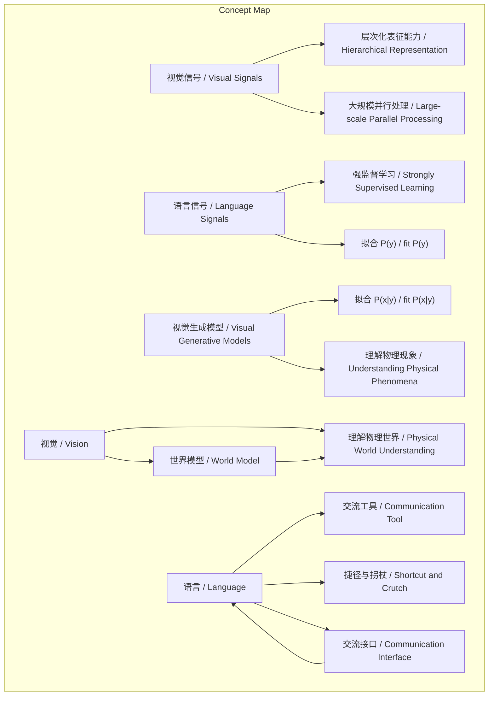

# NEWS/NEWS 任务报告

- agent: news/news
- requestId: 1774016109613-2lrsag
- 生成时间(UTC): 2026-03-20T14:17:11.330Z

## 文本总结

# 视觉与语言：智能系统中的根本分歧

## 整体结构化文档表达
### 文档卡片
- 主题（中文/English）：计算机视觉与语言的本质差异 / Fundamental Differences between Computer Vision and Language
- 一句话摘要：谢赛宁指出视觉处理连续高维物理信号，是构建世界模型的基石；语言作为离散压缩的交流工具，在智能系统中仅应充当接口。
- 目标读者：人工智能研究者、多模态学习开发者、认知科学爱好者
- 核心结论（3条）：
  1. 视觉信号连续高维嘈杂，需层次化表征；语言信号离散压缩，属强监督学习。
  2. 视觉旨在理解物理世界，语言仅为交流工具，牺牲物理细节。
  3. 视觉是 world model 的底座，语言是捷径/拐杖，未来应退化为交流接口。

### 内容结构树
1. 背景与问题定义：谢赛宁视角下视觉与语言在智能系统中的根本区别。
2. 核心观点与关键证据：分四个维度：信号本质、核心功能、建模维度、世界模型定位。
3. 方法/机制/路径：通过对比分析，揭示视觉的物理建模本质与语言的交流工具属性。
4. 风险与边界条件：过度依赖语言处理视觉信号会污染视觉智能；语言模型在物理连续信号上无能为力。
5. 结论与行动建议：未来智能体设计中，视觉世界模型承担物理理解，语言模型退化为交流接口。

### 结构化元数据（JSON）
```json
{
  "title": "视觉与语言：智能系统中的根本分歧",
  "topic_zh": "计算机视觉与语言的本质差异",
  "topic_en": "Fundamental Differences between Computer Vision and Language",
  "audience": "人工智能研究者、多模态学习开发者、认知科学爱好者",
  "claims": [
    "视觉信号连续高维嘈杂，需层次化表征；语言信号离散压缩，属强监督学习。",
    "视觉旨在理解物理世界，语言仅为交流工具，牺牲物理细节。",
    "视觉是 world model 的底座，语言是捷径/拐杖，未来应退化为交流接口。"
  ],
  "evidence": [
    "视觉处理的是连续空间的、高维度的、且充满噪音的物理信号。",
    "语言是人类文明经过几千年演化、处理并高度凝练的抽象符号。",
    "互联网上的语言数据本质上是已经被人类“打好标签”的知识。",
    "训练大语言模型其实是一个强监督学习的过程。",
    "视觉智能需要解决真实世界中的问题，如机器人控制、空间感知。",
    "语言本质上是一种“交流的工具”，不是思考或决策的底层工具。",
    "为了沟通的效率，语言会牺牲掉大量物理世界的细节。",
    "语言模型更擅长在虚拟/数字化空间中处理事实性知识，但在处理连续物理信号时无能为力。",
    "语言模型主要停留在语义或标签空间中进行建模，拟合概率分布 P(y)。",
    "视觉生成模型需要拟合 P(x|y)，直接对高维数据建模。",
    "视觉是构建世界模型的底座。",
    "语言是一种“捷径”和“拐杖”。",
    "语言作为一个无损压缩的知识接口。",
    "过度依赖语言（如把视频每一帧强行拉平成一长串 Token 喂给语言模型）会违背物理世界的空间规律，变成“对视觉智能的污染”。",
    "在未来的终极智能体中，语言模型将会逐渐退化为一个简单的“交流接口”，而“脏活累活”将由底层的视觉世界模型来承担。"
  ],
  "risks": [
    "过度依赖语言处理视觉信号会污染视觉智能。",
    "语言模型在物理连续信号上无能为力。"
  ],
  "actions": [
    "未来智能体设计中，让视觉世界模型承担物理理解和因果推理。",
    "语言模型仅作为交流接口，不用于处理原始物理信号。"
  ]
}
```

## 处理流程
未提及

## 概念清单（中英文）
- 计算机视觉 / Computer Vision
- 语言 / Language
- 信号的本质 / Nature of Signals
- 连续 / Continuous
- 高维 / High-dimensional
- 嘈杂 / Noisy
- 离散 / Discrete
- 高度压缩 / Highly Compressed
- 强监督 / Strongly Supervised
- 层次化的表征能力 / Hierarchical Representation
- 大规模并行处理 / Large-scale Parallel Processing
- 物理世界 / Physical World
- 交流工具 / Communication Tool
- 数字空间 / Digital Space
- P(x|y) / P(x|y)
- P(y) / P(y)
- 世界模型 / World Model
- 捷径 / Shortcut
- 拐杖 / Crutch
- 交流接口 / Communication Interface
- 智能体 / Agent
- 因果推理 / Causal Reasoning
- 物理定律 / Physical Laws
- 动力学规律 / Dynamics

## 概念定义（中英文）
- 计算机视觉 / Computer Vision：处理连续、高维、嘈杂的物理信号，旨在理解真实物理世界的智能系统分支。
- 语言 / Language：人类文明演化出的离散、高度压缩的抽象符号系统，本质是交流工具。
- 信号的本质 / Nature of Signals：指视觉和语言所处理的数据的物理和抽象特性，如连续性、维度、噪音水平等。
- 连续 / Continuous：视觉信号在时间和空间上连续变化，无离散跳跃。
- 高维 / High-dimensional：视觉信号具有极高的维度，如像素矩阵。
- 嘈杂 / Noisy：视觉信号包含大量无关信息和干扰。
- 离散 / Discrete：语言信号由离散的符号（如单词、字符）组成。
- 高度压缩 / Highly Compressed：语言符号高度凝练，承载大量抽象信息。
- 强监督 / Strongly Supervised：语言数据已由人类标注，提供明确的学习目标。
- 层次化的表征能力 / Hierarchical Representation：从低级特征到高级语义的逐层抽象能力。
- 大规模并行处理 / Large-scale Parallel Processing：同时处理海量数据单元的能力。
- 物理世界 / Physical World：客观存在的物质世界，遵循物理定律和动力学规律。
- 交流工具 / Communication Tool：用于信息传递和共享的手段，非思考本身。
- 数字空间 / Digital Space：虚拟的、离散的数字化环境，如互联网文本。
- P(x|y) / P(x|y)：条件概率分布，表示给定标签y生成数据x的概率，视觉生成模型需拟合此分布。
- P(y) / P(y)：概率分布，表示标签y的先验概率，语言模型主要拟合此分布。
- 世界模型 / World Model：能够理解、预测和规划物理世界的内部模型。
- 捷径 / Shortcut：指语言作为快速获取知识的便捷途径，但可能绕过直接物理体验。
- 拐杖 / Crutch：比喻语言对智能系统的辅助作用，但过度依赖会削弱根本能力。
- 交流接口 / Communication Interface：智能系统与人类或其他系统交互的通道。
- 智能体 / Agent：具有感知、决策和行动能力的自主系统。
- 因果推理 / Causal Reasoning：理解事件间因果关系的能力。
- 物理定律 / Physical Laws：描述物理世界基本规律的定律，如牛顿定律。
- 动力学规律 / Dynamics：描述物体运动变化的规律。

## 概念关联与逻辑关系（中英文）
1. 视觉信号（连续, 高维, 嘈杂） / Visual Signals (Continuous, High-dimensional, Noisy) 与 物理世界复杂性 / Complexity of Physical World 共同决定 需要层次化表征能力 / Need for Hierarchical Representation 和 大规模并行处理 / Large-scale Parallel Processing。
2. 语言信号（离散, 高度压缩, 强监督） / Language Signals (Discrete, Highly Compressed, Strongly Supervised) 导致 语言模型拟合 P(y) / Language Models fit P(y)，并使其 更擅长数字空间 / More adept in Digital Space。
3. 视觉生成模型 / Visual Generative Models 拟合 P(x|y) / fit P(x|y)，这要求 对物理现象的深刻认知 / Deep Understanding of Physical Phenomena，从而 成为世界模型的底座 / become the foundation of World Model。

## COT逻辑梳理（定义/分类/比较/因果/科学方法论）
Step 1: 定义。视觉信号是连续高维嘈杂的物理信号；语言信号是离散高度压缩的抽象符号。
Step 2: 分类。基于信号特性，智能任务分为物理世界理解类（需视觉）和交流知识处理类（可用语言）。
Step 3: 比较。比较视觉与语言在核心功能（理解物理世界 vs 交流工具）、建模维度（P(x|y) vs P(y)）、世界模型定位（基石 vs 接口拐杖）上的差异。
Step 4: 因果。因果链：信号特性（连续/离散等） → 处理方式（层次化表征/强监督学习） → 建模域（P(x|y)/P(y)） → 系统角色（世界模型底座/交流接口）。
Step 5: 科学方法论。通过观察视觉和语言的实际应用，提出假设：视觉是 world model 基础，语言是辅助；设计对比实验（如用语言模型处理视频帧），验证过度依赖语言会污染视觉智能，从而支持假设。

## 事实与看法（病毒）
### 事实
- 视觉处理的是连续空间的、高维度的、且充满噪音的物理信号。
- 语言是人类文明经过几千年演化、处理并高度凝练的抽象符号。
- 互联网上的语言数据本质上是已经被人类“打好标签”的知识。
- 训练大语言模型其实是一个强监督学习的过程。
- 视觉智能需要解决真实世界中的问题，如机器人控制、空间感知。
- 语言本质上是一种“交流的工具”，不是思考或决策的底层工具。
- 为了沟通的效率，语言会牺牲掉大量物理世界的细节。
- 语言模型更擅长在虚拟/数字化空间中处理事实性知识，但在处理连续物理信号时无能为力。
- 语言模型主要停留在语义或标签空间中进行建模，拟合概率分布 P(y)。
- 视觉生成模型需要拟合 P(x|y)，直接对高维数据建模。
- 视觉是构建世界模型的底座。
- 语言是一种“捷径”和“拐杖”。
- 语言作为一个无损压缩的知识接口。
- 过度依赖语言（如把视频每一帧强行拉平成一长串 Token 喂给语言模型）会违背物理世界的空间规律，变成“对视觉智能的污染”。
- 在未来的终极智能体中，语言模型将会逐渐退化为一个简单的“交流接口”，而“脏活累活”将由底层的视觉世界模型来承担。

### 看法
- 视觉需要具备层次化的表征能力和大规模并行处理的能力。
- 视觉系统需要关注物体掉落的轨迹、受力以及破碎的物理动态。
- 语言模型更擅长在虚拟/数字化空间中处理事实性知识（这是基于表现的判断）。
- 视觉生成模型必须理解“为什么在物理世界中四条腿的狗比三条腿的狗更常见”（这是对模型能力的要求）。
- 真正的世界模型必须能够理解物理世界、过滤海量的感官噪音，并基于物理环境进行预测和规划。
- 过度依赖语言会污染视觉智能。
- 语言模型在未来的终极智能体中将会退化为交流接口。

## FAQ（原文问题整理）
未发现明确提问

## Visualization
### Mermaid 图 1（概念结构图）


### Mermaid 图 2（逻辑/因果图）
```mermaid
flowchart LR
  subgraph "Causal Chain"
    NS["信号特性 / Signal Nature"] --> PW["处理方式 / Processing Way"]
    PW --> MD["建模域 / Modeling Domain"]
    MD --> SR["系统角色 / System Role"]
    NS -->|视觉：连续高维嘈杂| PW
    NS -->|语言：离散高度压缩| PW
    PW -->|视觉：层次化表征| MD
    PW -->|语言：强监督学习| MD
    MD -->|视觉：P(x|y)| SR
    MD -->|语言：P(y)| SR
    SR -->|视觉：世界模型底座| SR
    SR -->|语言：交流接口| SR
  end
```

## 文章中的类比
- 语言作为“交流的工具”
- 语言作为“捷径”和“拐杖”
- 语言作为“无损压缩的知识接口”
- 视觉作为“底座”
- “脏活累活”比喻物理理解和因果推理任务

## 10个金句
1. 视觉处理的是连续空间的、高维度的、且充满噪音的物理信号。
2. 语言是人类文明经过几千年演化、处理并高度凝练的抽象符号。
3. 互联网上的语言数据本质上是已经被人类“打好标签”的知识。
4. 训练大语言模型其实是一个强监督学习的过程。
5. 视觉是对物理世界的建模。
6. 语言本质上是一种“交流的工具”。
7. 为了沟通的效率，语言会牺牲掉大量物理世界的细节。
8. 语言模型更擅长在虚拟/数字化空间中处理事实性知识，但在处理连续物理信号时无能为力。
9. 视觉是构建世界模型的底座。
10. 语言是一种“捷径”和“拐杖”。
