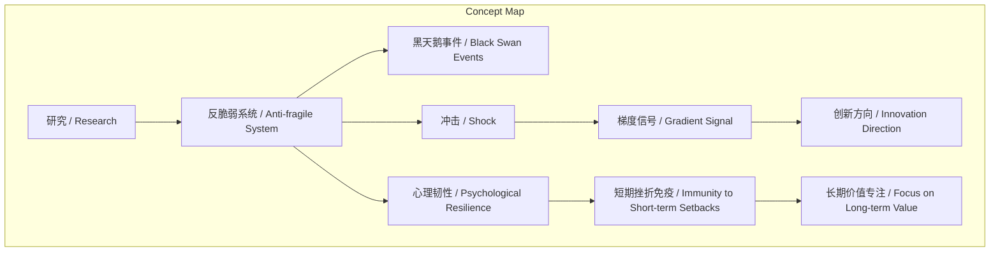
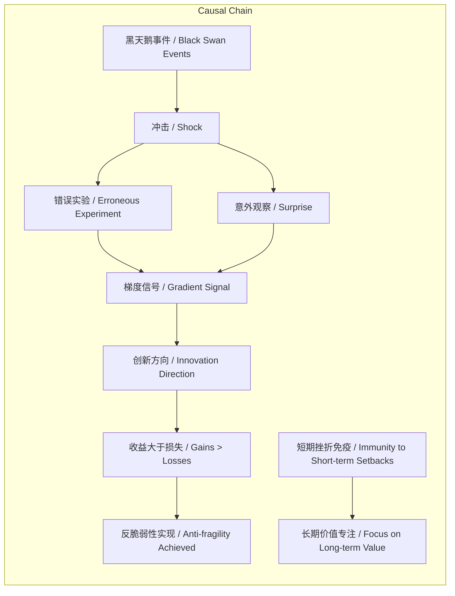

# NEWS/NEWS 任务报告

- agent: news/news
- requestId: 1774021796171-fbysyv
- 生成时间(UTC): 2026-03-20T15:50:50.768Z

## 文本总结

# 科研系统必须反脆弱

## 整体结构化文档表达
### 文档卡片
- 主题（中文/English）：科研系统反脆弱性 / Anti-fragility in Research Systems
- 一句话摘要：研究需构建反脆弱系统，从随机冲击与失败中获取大于损失的收益，以应对高度不确定性。
- 目标读者：科研工作者、学术管理者、政策制定者
- 核心结论（3条）：
  1. 科研环境充满随机“黑天鹅事件”与冲击，脆弱系统会被击倒。
  2. 反脆弱的核心是使从冲击中获得的收益大于损失，失败提供高信息量“梯度信号”。
  3. 对短期挫折免疫，放下对论文录用等短期结果的执念，专注长期研究价值。

### 内容结构树
1. 背景与问题定义：科研本质充满高度不确定性与随机挫折，需系统能从中获益。
2. 核心观点与关键证据：研究必须是“反脆弱”系统；证据包括被拒稿案例、失败提供信号、心理韧性建立。
3. 方法/机制/路径：未提及
4. 风险与边界条件：未提及
5. 结论与行动建议：研究者应免疫短期挫折，专注长期价值。

### 结构化元数据（JSON）
```json
{
  "title": "科研系统必须反脆弱",
  "topic_zh": "科研系统反脆弱性",
  "topic_en": "Anti-fragility in Research Systems",
  "audience": "科研工作者、学术管理者、政策制定者",
  "claims": [
    "科研环境充满随机冲击，脆弱系统易被击倒",
    "反脆弱要求从冲击中收益大于损失，失败提供梯度信号",
    "对短期挫折免疫，专注长期价值"
  ],
  "evidence": [
    "谢赛宁的DiT模型与Flow Matching工作曾因算法设计“过于简单”被顶会拒稿",
    "性能大跌的错误实验或意外观察能提供极大信息量的梯度信号",
    "多次被拒稿后，谢赛宁对挫折产生免疫，意识到不应在乎短期成败"
  ],
  "risks": [],
  "actions": [
    "建立从失败和意外中攫取价值的能力",
    "放下对短期声望或论文录用的执念",
    "将精力专注于研究本身的长期价值"
  ]
}
```

## 处理流程
1. 输入识别：用户提供关于科研反脆弱性的论述文本。
2. 信息抽取：实体（谢赛宁、DiT模型、Flow Matching、塔勒布）；概念（反脆弱、黑天鹅事件、冲击、梯度信号）；问题（科研如何应对不确定性）；事实（被拒稿经历）；观点（研究必须反脆弱）。
3. 结构化归纳：定义“反脆弱”；分类科研冲击类型（黑天鹅事件）；比较脆弱与反脆弱系统；因果分析冲击如何转化为收益。
4. 关系建模：黑天鹅事件 → 冲击 → 梯度信号 → 创新方向；收益 > 损失 ↔ 反脆弱；短期挫折免疫 → 长期价值专注。
5. 可视化表达：使用Mermaid绘制概念与因果图。

## 概念清单（中英文）
- 研究 / Research
- 反脆弱 / Anti-fragile
- 纳西姆·塔勒布 / Nassim Taleb
- 黑天鹅事件 / Black Swan Events
- 冲击 / Shock
- 谢赛宁 / Saiyin Xie
- DiT模型 / DiT Model
- Flow Matching / Flow Matching
- 顶会 / Top Conference
- 算法设计 / Algorithm Design
- 性能大跌 / Performance Drop
- 错误实验 / Erroneous Experiment
- 意外观察 / Surprise
- 梯度信号 / Gradient Signal
- 创新方向 / Innovation Direction
- 心理韧性 / Psychological Resilience
- 短期挫折 / Short-term Setbacks
- 长期价值 / Long-term Value
- 论文录用 / Paper Acceptance
- 短期声望 / Short-term Reputation

## 概念定义（中英文）
- 研究 / Research：系统性探索未知、创造新知识的过程。
- 反脆弱 / Anti-fragile：面对随机事件或冲击时，系统能获得的收益大于损失的性质。
- 黑天鹅事件 / Black Swan Events：意料之外、影响巨大的罕见事件。
- 冲击 / Shock：科研过程中突如其来的负面事件（如拒稿）。
- 梯度信号 / Gradient Signal：从失败或意外中提取的、能指导后续研究的高信息量反馈。
- 心理韧性 / Psychological Resilience：从挫折中恢复并成长的能力。
- 短期挫折 / Short-term Setbacks：如论文被拒、实验失败等即时负面结果。
- 长期价值 / Long-term Value：研究对知识体系或领域的根本性、持久贡献。

## 概念关联与逻辑关系（中英文）
1. 黑天鹅事件 / Black Swan Events 导致 冲击 / Shock，冲击在反脆弱系统中转化为 梯度信号 / Gradient Signal。
2. 反脆弱 / Anti-fragile 的核心定义是 收益 / Gains 大于 损失 / Losses。
3. 对 短期挫折 / Short-term Setbacks 免疫 促进 长期价值 / Long-term Value 专注。

## COT逻辑梳理（定义/分类/比较/因果/科学方法论）
- Step 1（定义）：明确“反脆弱”概念（塔勒布提出），指系统从波动、错误、不确定性中获益，而非仅抵抗或承受。
- Step 2（分类）：将科研中的冲击分为“黑天鹅事件”（极端罕见）与常规挫折（如拒稿），二者均需系统能转化。
- Step 3（比较）：对比“脆弱”系统（冲击导致净损失）、“强韧”系统（抵抗冲击）与“反脆弱”系统（从冲击中获益），突出科研需后者。
- Step 4（因果）：冲击（如拒稿）→ 引发失败或意外 → 提供梯度信号（揭示问题或新方向）→ 指引创新 → 实现收益大于损失。
- Step 5（科学方法论）：通过迭代实验与反馈（梯度信号），将随机性纳入研究设计，形成“尝试-失败-学习”的增强循环，符合反脆弱系统构建原则。

## 事实与看法（病毒）
### 事实
- 谢赛宁在发表DiT模型和Flow Matching工作期间，曾因算法设计“过于简单”被顶会拒稿。
- 论文录用与否在很大程度上是一个巨大的随机过程。
- 谢赛宁经历多次拒稿后，对挫折产生了“免疫”。
### 看法
- 研究必须是一个“反脆弱”的系统。
- 科研的本质充满了高度的不确定性和随机的挫折。
- 从意外的打击中获益是研究者的必备能力。
- 最糟糕的情况不是实验失败，而是停留在“不好不差”的无信号状态。
- 一个导致性能大跌的错误实验或令人惊讶的意外观察，能提供极大信息量的梯度信号。
- 研究者不应该在乎某一个时间点上的成败，而应从冲击中获得成长。
- 应彻底放下对短期声望或论文录用与否的执念，将精力专注于研究本身的长期价值。

## FAQ（原文问题整理）
- Q：为什么研究必须是一个反脆弱的系统？
  A：因为科研本质充满高度不确定性与随机挫折，反脆弱系统能确保从冲击中获得的收益大于损失。
- Q：如何理解科研中的“黑天鹅事件”？
  A：指意料之外的重大冲击，如因“算法过于简单”被顶会拒稿，脆弱系统会被击倒。
- Q：失败或意外如何为研究提供价值？
  A：性能大跌的错误实验或意外观察能提供高信息量的“梯度信号”，指引创新方向。
- Q：研究者应如何对待短期挫折？
  A：应对其免疫，不执念于短期成败（如论文录用），专注长期研究价值。

## Visualization
### Mermaid 图 1（概念结构图）


### Mermaid 图 2（逻辑/因果图）


## 文章中的类比
- 未发现明确类比

## 10个金句
1. 研究必须是一个“反脆弱（Anti-fragile）”的系统。
2. 科研的本质充满了高度的不确定性和随机的挫折。
3. 研究者必须学会从意外的打击中获益。
4. 如果一个研究者或组织是“脆弱”的，就会立刻被这种突如其来的冲击击倒。
5. 所谓“反脆弱”，就是指在面对随机事件或意外冲击时，你的收益要比你的损失更大。
6. 一个导致性能大跌的错误实验，反而能给研究者提供极大信息量的“梯度信号”。
7. 这种从失败和意外中攫取巨大价值的能力，正是反脆弱的体现。
8. 论文的中与不中，在很大程度上是一个巨大的随机过程。
9. 他意识到研究者不应该在乎某一个时间点上的成败，而是要从这种冲击中获得成长。
10. 彻底放下对短期声望或论文录用与否的执念，从而将精力完全专注于研究本身的长期价值。
