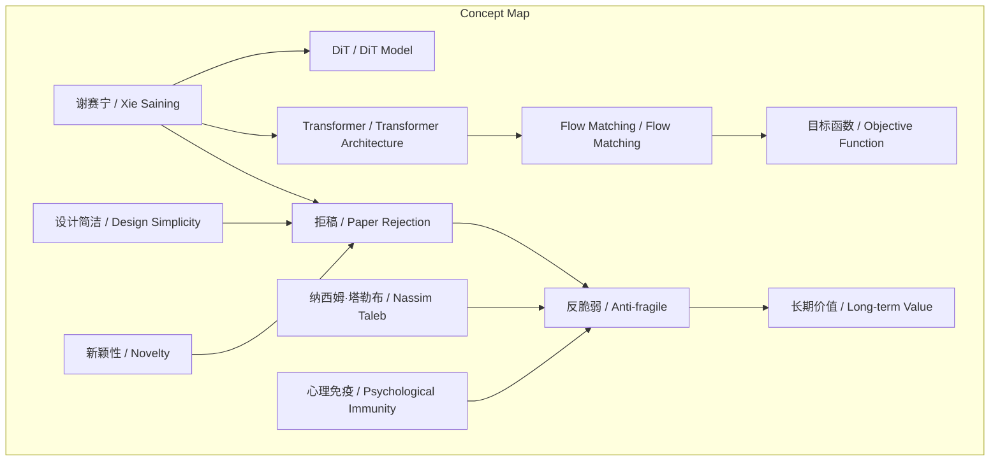
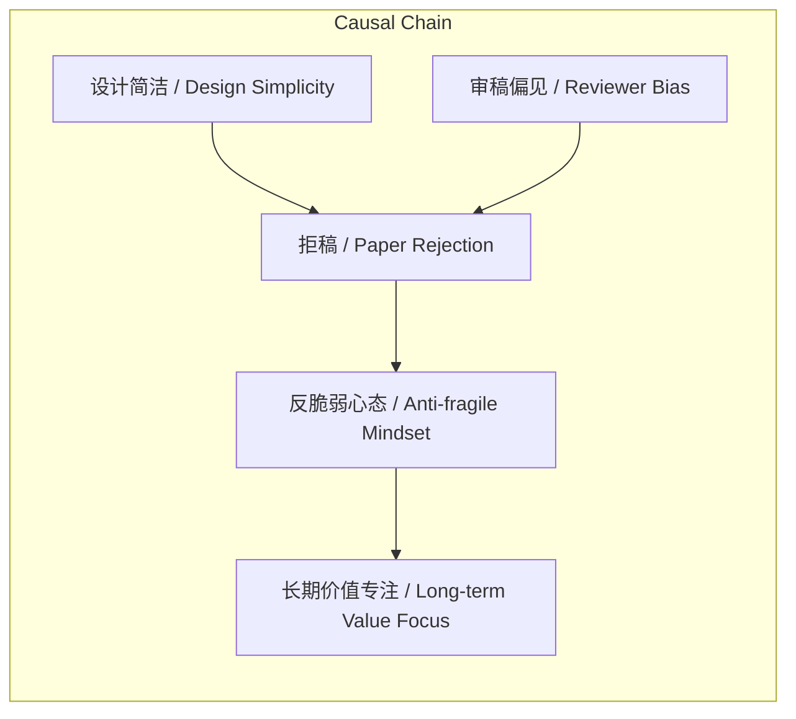

# NEWS/NEWS 任务报告

- agent: news/news
- requestId: 1774021945998-knuhjj
- 生成时间(UTC): 2026-03-20T15:53:18.682Z

## 文本总结

# 谢赛宁的“反脆弱”科研哲学

## 整体结构化文档表达
### 文档卡片
- 主题（中文/English）：科研心态与论文发表 / Research Mindset and Publication
- 一句话摘要：谢赛宁在将Flow Matching引入Transformer的工作再次被拒后，以塔勒布“反脆弱”概念诠释经历，强调从挫折中获益并专注长期研究价值。
- 目标读者：科研工作者、学术研究者、对科研文化感兴趣的人群
- 核心结论（3条）：
  1. 设计过于简洁、缺乏复杂公式堆砌易被审稿人误判为缺乏新颖性。
  2. 反复拒稿经历可转化为心理“免疫”，形成“反脆弱”心态。
  3. 优秀科研系统或研究者应追求“反脆弱”，从冲击中获得大于损失的收益，放下短期得失，专注长期价值。

### 内容结构树
1. 背景与问题定义：谢赛宁在完成DiT后，将Flow Matching目标函数引入Transformer架构，但论文因设计简洁被拒。
2. 核心观点与关键证据：核心观点是科研需“反脆弱”；证据包括两次拒稿的相同原因、对拒稿“免疫”的态度、引用塔勒布概念。
3. 方法/机制/路径：通过将拒稿挫折转化为心态收益（更坚韧、更纯粹坚持本质），实践“反脆弱”。
4. 风险与边界条件：风险是简洁设计可能被误解；边界是需长期坚持以凸显价值。
5. 结论与行动建议：结论是“反脆弱”是应对科研不确定性的哲学；行动建议是放下短期录用得失，专注研究长期价值。

### 结构化元数据（JSON）
```json
{
  "title": "谢赛宁的“反脆弱”科研哲学",
  "topic_zh": "科研心态与论文发表",
  "topic_en": "Research Mindset and Publication",
  "audience": "科研工作者、学术研究者、对科研文化感兴趣的人群",
  "claims": [
    "设计过于简洁、缺乏复杂公式堆砌易被审稿人误判为缺乏新颖性",
    "反复拒稿经历可转化为心理“免疫”，形成“反脆弱”心态",
    "优秀科研系统或研究者应追求“反脆弱”，从冲击中获得大于损失的收益，放下短期得失，专注长期价值"
  ],
  "evidence": [
    "谢赛宁在完成DiT后，将Flow Matching引入Transformer",
    "论文因设计简洁被拒，原因与DiT拒稿相同",
    "谢赛宁表示对拒稿“基本免疫”，借用塔勒布“反脆弱”概念",
    "经历让其放下短期得失，更专注长期价值"
  ],
  "risks": [
    "设计过于简洁可能被审稿人认为缺乏新颖性",
    "过度专注长期价值可能忽略短期发表压力"
  ],
  "actions": [
    "将拒稿挫折转化为心态收益",
    "坚持研究本质，减少对短期录用的得失心",
    "系统性地构建“反脆弱”科研心态"
  ]
}
```

## 处理流程
1. 输入识别：用户提供访谈摘录文本，描述谢赛宁科研经历与哲学。
2. 信息抽取：实体包括谢赛宁、DiT、Transformer、Flow Matching、纳西姆·塔勒布；概念包括反脆弱、拒稿、目标函数、设计简洁、新颖性、短期论文录用、长期价值；问题是如何应对拒稿；事实是两次拒稿经历；观点是“反脆弱”心态的价值。
3. 结构化归纳：定义“反脆弱”为从冲击中获益；分类拒稿原因为设计简洁被误判；比较两次拒稿的相同模式；因果是拒稿导致心态免疫；方法论是通过经历验证哲学。
4. 关系建模：设计简洁 ∧ 审稿偏见 → 拒稿；拒稿经历 → 反脆弱心态；反脆弱心态 → 长期价值专注。
5. 可视化表达：使用Mermaid绘制概念结构与因果链图。

## 概念清单（中英文）
- 谢赛宁 / Xie Saining
- DiT / DiT Model
- Transformer / Transformer Architecture
- Flow Matching / Flow Matching
- 目标函数 / Objective Function
- 拒稿 / Paper Rejection
- 反脆弱 / Anti-fragile
- 纳西姆·塔勒布 / Nassim Taleb
- 设计简洁 / Design Simplicity
- 新颖性 / Novelty
- 短期论文录用 / Short-term Paper Acceptance
- 长期价值 / Long-term Value
- 心理免疫 / Psychological Immunity
- 科研系统 / Research System

## 概念定义（中英文）
- 谢赛宁 / Xie Saining：研究者，DiT模型作者，在访谈中分享拒稿经历与“反脆弱”心态。
- DiT / DiT Model：谢赛宁等人完成的著名 Diffusion Transformer 模型。
- Transformer / Transformer Architecture：一种神经网络架构，被用于扩展新目标函数。
- Flow Matching / Flow Matching：一种新的目标函数，被引入Transformer架构。
- 目标函数 / Objective Function：机器学习中用于优化模型性能的数学函数。
- 拒稿 / Paper Rejection：学术论文被期刊或会议拒绝发表。
- 反脆弱 / Anti-fragile：从不确定性、冲击或挫折中获得收益或变得更好的系统特性，引用自纳西姆·塔勒布。
- 纳西姆·塔勒布 / Nassim Taleb：学者，提出“反脆弱”概念的作者。
- 设计简洁 / Design Simplicity：模型或论文设计不复杂、公式堆砌少。
- 新颖性 / Novelty：研究中被认为创新或独特的程度。
- 短期论文录用 / Short-term Paper Acceptance：论文被期刊或会议接受的即时结果。
- 长期价值 / Long-term Value：研究对领域或知识体系的持久贡献。
- 心理免疫 / Psychological Immunity：对挫折（如拒稿）产生抵抗力，不感到沮丧的状态。
- 科研系统 / Research System：研究者、方法、环境等构成的整体科研生态。

## 概念关联与逻辑关系（中英文）
1. 设计简洁（Design Simplicity） ∧ 审稿偏见（Reviewer Bias） → 拒稿（Paper Rejection）
2. 拒稿经历（Paper Rejection Experience） → 反脆弱心态（Anti-fragile Mindset）
3. 反脆弱心态（Anti-fragile Mindset） → 长期价值专注（Long-term Value Focus）

## COT逻辑梳理（定义/分类/比较/因果/科学方法论）
- Step 1（定义）：界定“反脆弱”为从冲击（如拒稿）中获得大于损失收益的特性，区别于“坚韧”（仅抵抗冲击）。
- Step 2（分类）：将拒稿原因分类为“设计简洁被误判缺乏新颖性”与“其他原因”，本文聚焦前者。
- Step 3（比较）：比较两次拒稿事件，发现相同原因（设计简洁）与相同结果（拒稿），凸显模式重复性。
- Step 4（因果）：建立因果链：设计简洁 + 审稿偏见 → 拒稿 → 心态免疫 → 反脆弱心态 → 专注长期价值。
- Step 5（科学方法论）：通过实证经历（两次拒稿）验证“反脆弱”哲学，采用归纳法从具体事件推导普遍原则。

## 事实与看法（病毒）
### 事实
- 谢赛宁完成了DiT模型。
- 谢赛宁将Flow Matching目标函数引入Transformer架构。
- 该工作论文投稿后被拒。
- 拒稿原因与DiT拒稿相同：设计过于简洁，没有复杂公式堆砌，被认为缺乏新颖性。
- 谢赛宁在访谈中分享了这段经历。
- 谢赛宁借用纳西姆·塔勒布的“反脆弱”概念描述经历。
### 看法
- 谢赛宁对拒稿“基本免疫”了。
- 一个优秀的科研系统或研究者必须是反脆弱的。
- 从拒稿冲击中获得比损失更大的收益（如更坚韧的心态、对事物本质更纯粹的坚持）。
- 经历让他彻底放下了对短期论文录用与否的得失心。
- 更专注于研究本身的长期价值。

## FAQ（原文问题整理）
- 未发现明确提问（原文为陈述性访谈摘录，未包含直接问题）。

## Visualization
### Mermaid 图 1（概念结构图）

### Mermaid 图 2（逻辑/因果图）


## 文章中的类比
- 未发现明确类比（文本为概念引用与经历陈述，无比喻或类比句式）。

## 10个金句
1. “反脆弱”心态。
2. 将新目标函数引入 Transformer。
3. 戏剧性的重演：再次遭到拒稿。
4. 因为设计过于简洁，没有复杂的公式堆砌，被认为缺乏所谓的新颖性。
5. 对拒稿“基本免疫”了。
6. 一个优秀的科研系统或者研究者必须是反脆弱的。
7. 从这种冲击中获得比损失更大的收益。
8. 彻底放下了对短期论文录用与否的得失心。
9. 更专注于研究本身的长期价值。
10. 原文未提供。
