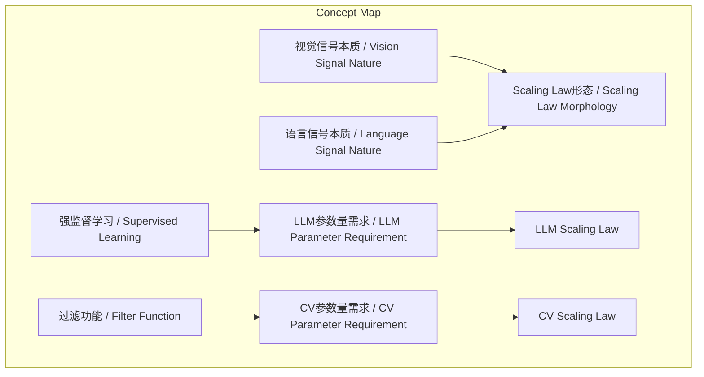
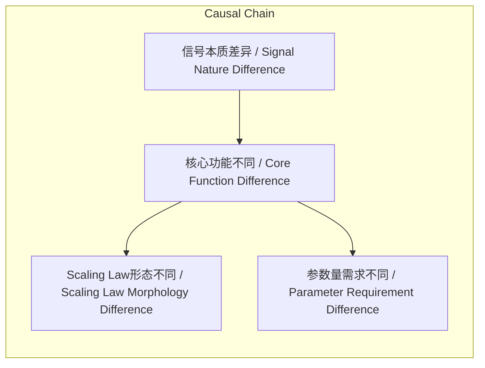

# NEWS/NEWS 任务报告

- agent: news/news
- requestId: 1774051782112-gu6dnw
- 生成时间(UTC): 2026-03-21T00:10:31.317Z

## 文本总结

# 视觉与语言模型Scaling Law本质差异论

## 整体结构化文档表达
### 文档卡片
- 主题：计算机视觉规模法则 / Computer Vision Scaling Law
- 一句话摘要：谢赛宁认为CV与LLM的Scaling Law不同源于视觉与语言处理信号本质差异，视觉核心是过滤信息而非记忆知识。
- 目标读者：人工智能研究者、技术决策者、对AI基础理论感兴趣的人群
- 核心结论（3条）：
  1. LLM的Scaling Law本质是强监督知识记忆，需巨大参数量。
  2. CV面对物理世界原始信号，无需死记硬背细节，核心是过滤信息。
  3. CV会有自己的Scaling Law，但参数量需求不同于LLM。

### 内容结构树
1. 背景与问题定义：CV是否需要类似LLM的Scaling Law？谢赛宁提出否定观点。
2. 核心观点与关键证据：三个原因（信号本质不同、记忆需求不同、核心功能不同）。
3. 方法/机制/路径：视觉智能的核心是过滤（filter），构建预测性世界模型。
4. 风险与边界条件：未提及具体风险，但暗示CV的Scaling Law形态和斜率不同。
5. 结论与行动建议：CV有独特Scaling Law，未来视觉模型参数量不需无限大。

### 结构化元数据（JSON）
```json
{
  "title": "视觉与语言模型Scaling Law本质差异论",
  "topic_zh": "计算机视觉规模法则",
  "topic_en": "Computer Vision Scaling Law",
  "audience": "人工智能研究者、技术决策者、对AI基础理论感兴趣的人群",
  "claims": [
    "LLM的Scaling Law本质是强监督知识记忆，需巨大参数量",
    "CV面对物理世界原始信号，无需死记硬背细节，核心是过滤信息",
    "CV会有自己的Scaling Law，但参数量需求不同于LLM"
  ],
  "evidence": [
    "训练LLM是强监督学习，互联网文本是高度凝练的知识集合",
    "视觉面对连续、高维度、充满噪音的原始信号，无需记住每个细节",
    "视觉智能核心功能是过滤，从噪音中提炼有价值信息"
  ],
  "risks": [],
  "actions": ["探索视觉专属Scaling Law，优化参数量配置"]
}
```

## 处理流程
1. 输入识别：来源为用户提供的关于谢赛宁观点的文本。
2. 信息抽取：抽取实体（谢赛宁、CV、LLM）、概念（Scaling Law、强监督学习、过滤）、观点（CV不需要LLM式Scaling Law）、事实（互联网文本特性等）。
3. 结构化归纳：将内容归纳为背景、观点、机制、风险、结论五部分。
4. 关系建模：建立概念间关系，如信号本质差异导致Scaling Law不同。
5. 可视化表达：设计Mermaid图展示概念结构和因果链。

## 概念清单（中英文）
- 谢赛宁 / Xie Saining
- 计算机视觉 / Computer Vision (CV)
- 大语言模型 / Large Language Model (LLM)
- Scaling Law / 规模法则
- 视觉 / Vision
- 语言 / Language
- 强监督学习 / Supervised Learning
- 互联网文本 / Internet Text
- 知识集合 / Knowledge Corpus
- 事实性知识 / Factual Knowledge
- 维基百科 / Wikipedia
- 物理世界 / Physical World
- 原始信号 / Raw Signal
- 噪音 / Noise
- 世界模型 / World Model
- 过滤 / Filter
- 决策 / Decision Making
- 参数量 / Training Parameters

## 概念定义（中英文）
- 谢赛宁 / Xie Saining：提出CV与LLM Scaling Law差异观点的研究者。
- 计算机视觉 / Computer Vision (CV)：使机器“看懂”图像和视频的技术领域。
- 大语言模型 / Large Language Model (LLM)：基于海量文本数据训练的大规模神经网络模型。
- Scaling Law / 规模法则：模型性能随规模（如参数量、数据量）扩大而提升的规律。
- 视觉 / Vision：通过光学信号感知和理解物理世界的感官能力。
- 语言 / Language：人类用于交流的符号系统。
- 强监督学习 / Supervised Learning：使用带标签数据训练模型的学习范式。
- 互联网文本 / Internet Text：来源于互联网的书面语言数据。
- 知识集合 / Knowledge Corpus：结构化或非结构化的知识存储。
- 事实性知识 / Factual Knowledge：关于客观事实的信息。
- 维基百科 / Wikipedia：在线多语言百科全书项目。
- 物理世界 / Physical World：客观存在的物质世界。
- 原始信号 / Raw Signal：未经处理的感官输入数据。
- 噪音 / Noise：信号中无用的随机变异部分。
- 世界模型 / World Model：智能体对环境的内部表示和预测能力。
- 过滤 / Filter：从输入中选择相关信息、抑制无关信息的过程。
- 决策 / Decision Making：基于信息选择行动方案的过程。
- 参数量 / Training Parameters：模型训练过程中可学习的权重总数。

## 概念关联与逻辑关系（中英文）
1. 视觉信号本质 / Vision Signal Nature 与 语言信号本质 / Language Signal Nature 不同 导致 Scaling Law形态差异 / Scaling Law Morphology Difference。
   形式化：VisionSignalNature ≠ LanguageSignalNature → ScalingLawMorphologyDiff
2. 强监督学习 / Supervised Learning 与 事实性知识记忆 / Factual Knowledge Memorization 共同影响 LLM参数量需求 / LLM Parameter Requirement。
   形式化：SupervisedLearning ∧ FactualKnowledgeMemorization → LargeLLMParameters
3. 过滤功能 / Filter Function 是 视觉智能核心 / Core of Visual Intelligence 的关键机制，从而降低对参数量 / Parameter Quantity 的依赖。
   形式化：FilterFunction → ReducedParameterDependency

## COT逻辑梳理（定义/分类/比较/因果/科学方法论）
Step 1: 定义问题。Scaling Law指模型性能与规模的关系。LLM表现出明显Scaling Law，CV是否类似？
Step 2: 分类信号类型。语言信号是高度压缩的语义符号（如文本），视觉信号是连续高维原始数据（如图像像素）。
Step 3: 比较处理方式。LLM通过强监督学习记忆事实性知识，需大参数量；CV通过过滤提取有用信息，无需记忆细节。
Step 4: 因果分析。信号本质不同导致核心功能不同（记忆 vs 过滤），进而导致Scaling Law形态不同。
Step 5: 科学方法论。基于信号处理理论和认知科学，视觉智能更接近预测性世界模型，参数量需求有理论上限。

## 事实与看法（病毒）
### 事实
- 谢赛宁提出了CV与LLM Scaling Law差异的观点。
- 训练LLM是强监督学习过程。
- 互联网文本是人类文明高度凝练的知识集合。
- 视觉面对的是物理世界的连续、高维度、充满噪音的原始信号。
- 视觉智能的核心功能是过滤。
- 未来的视觉世界模型参数量不需要像LLM那样无限巨大。

### 看法
- LLM的Scaling Law带有“水分”，本质是强监督知识记忆。
- CV不需要“死记硬背”物理世界的无限细节。
- 视觉构建的世界模型不需要精细刻画或背诵物理世界的每一个细微细节。
- CV会有自己独特的Scaling Law，配比、形态和斜率与LLM完全不同。

## FAQ（原文问题整理）
未发现明确提问。

## Visualization
### Mermaid 图 1（概念结构图）


### Mermaid 图 2（逻辑/因果图）


## 文章中的类比
未发现明确类比。

## 10个金句
1. 计算机视觉之所以不需要像大语言模型那样传统的Scaling Law，根本原因在于视觉和语言所关注的核心问题以及处理的信号本质完全不同。
2. 语言模型的Scaling Law带有“水分”，本质是强监督的知识记忆。
3. 训练大语言模型其实是一个“强监督学习”的过程。
4. 互联网上的语言文本是人类文明经过几千年演化、高度凝练并已经“打好标签”的知识集合。
5. LLM的Scaling Law很大程度上是基于对这些事实性知识的记忆和表征。
6. 为了“死记硬背”并准确检索出这些人类知识，语言模型必然需要极其庞大的参数量。
7. 视觉面对的是真实物理世界中连续的、高维度的、充满噪音的原始信号。
8. 视觉构建的世界模型不需要去精细刻画或背诵物理世界里的每一个细微细节。
9. 真正的视觉智能底座（预测性世界模型）的核心功能是“过滤”。
10. 未来的视觉世界模型的参数量并不需要像大语言模型那样做到无限巨大。
