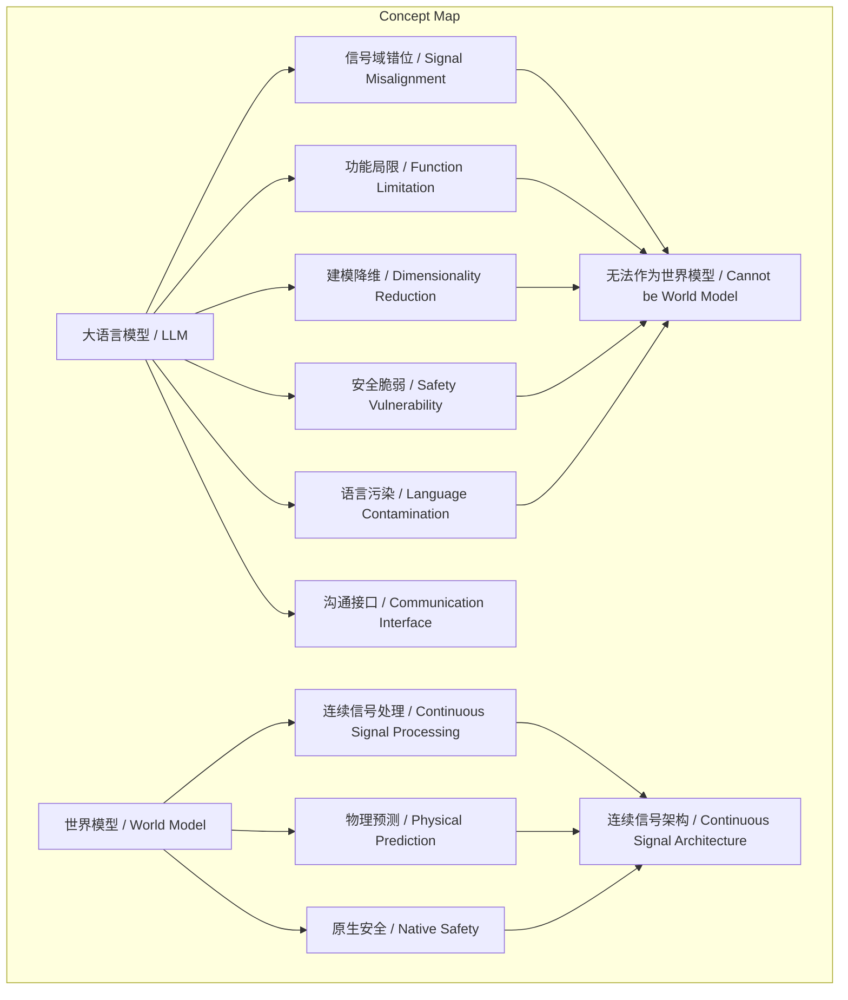
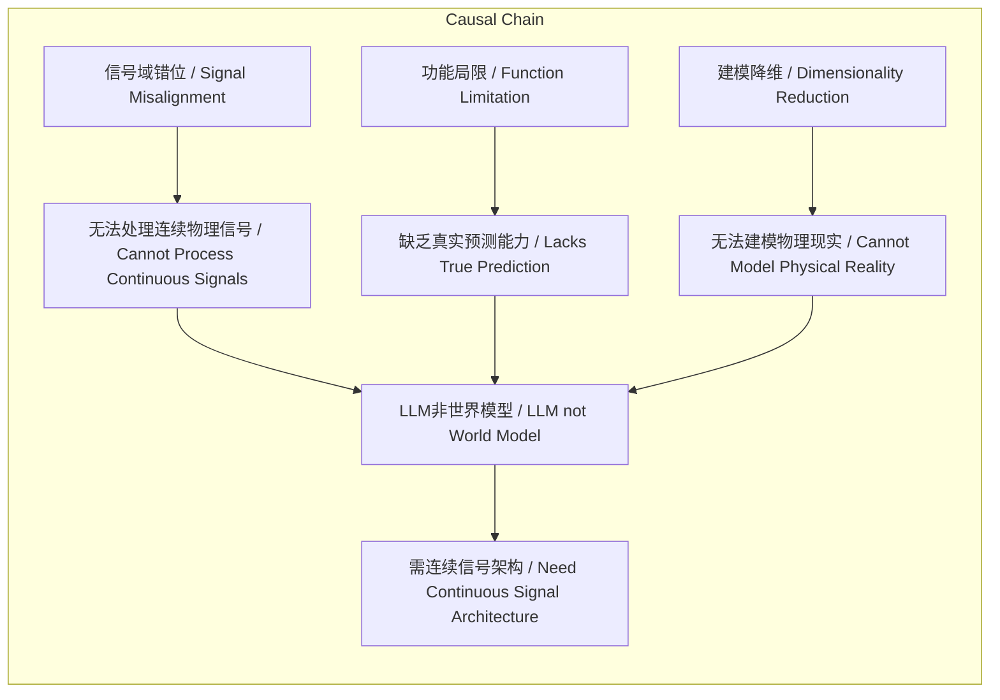

# NEWS/NEWS 任务报告

- agent: news/news
- requestId: 1774052013977-kyx6lm
- 生成时间(UTC): 2026-03-21T00:14:41.852Z

## 文本总结

# 谢赛宁：LLM非世界模型，需连续信号架构

## 整体结构化文档表达
### 文档卡片
- **主题**：世界模型 / World Model  
- **一句话摘要**：谢赛宁指出大语言模型因信号域错位、功能局限等五大缺陷，无法成为真正的世界模型，应退化为沟通接口，由基于连续信号的预测性架构承担物理世界建模。  
- **目标读者**：AI研究者、技术决策者、对通用人工智能（AGI）感兴趣的公众  
- **核心结论（3条）**：
  1. LLM本质是数字虚拟空间中的交流工具，缺乏对真实物理世界的底层感知和预测能力。
  2. LLM的五大缺陷（信号域错位、核心功能局限、建模维度降维、安全机制脆弱、语言依赖污染）使其无法充当世界模型。
  3. 未来智能系统需基于连续信号的通用认知架构作为世界模型，LLM仅作为沟通接口。

### 内容结构树
1. **背景与问题定义**：LLM被寄予世界模型厚望，但谢赛宁提出其存在根本缺陷。
2. **核心观点与关键证据**：从五个维度论证LLM无法作为世界模型。
3. **方法/机制/路径**：真正的世界模型需基于连续信号处理、物理动力学建模和原生安全预测。
4. **风险与边界条件**：LLM安全依赖事后对齐，语言依赖会污染物理智能发展。
5. **结论与行动建议**：LLM退化为沟通接口，开发连续信号预测性世界模型。

### 结构化元数据（JSON）
```json
{
  "title": "谢赛宁：LLM非世界模型，需连续信号架构",
  "topic_zh": "世界模型",
  "topic_en": "World Model",
  "audience": "AI研究者、技术决策者",
  "claims": [
    "LLM本质是交流工具，缺乏物理世界感知",
    "LLM存在信号域错位等五大缺陷",
    "未来需连续信号架构作为世界模型"
  ],
  "evidence": [
    "LLM处理离散符号，物理世界是连续高维信号",
    "语言过滤物理细节，LLM无真实预测能力",
    "LLM拟合低维标签P(y)，世界模型需拟合高维P(x|y)",
    "LLM安全依赖事后对齐，世界模型原生预测后果",
    "语言依赖污染物理智能"
  ],
  "risks": [
    "LLM安全机制脆弱",
    "过度依赖LLM导致物理智能发展受阻"
  ],
  "actions": [
    "将LLM退化为沟通接口",
    "开发基于连续信号的预测性世界模型"
  ]
}
```

## 处理流程
1. **输入识别**：识别文本为谢赛宁关于LLM与世界模型的批判性论述。
2. **信息抽取**：抽取关键概念（LLM、世界模型、信号域等）、问题（LLM能否作为世界模型）、事实（LLM处理离散符号）、观点（LLM是交流工具）。
3. **结构化归纳**：将内容归纳为背景、核心观点（五大缺陷）、方法建议、风险、结论。
4. **关系建模**：建立概念间逻辑关系，如“信号域错位导致LLM无法处理物理信号”。
5. **可视化表达**：设计Mermaid图展示概念结构和因果链。

## 概念清单（中英文）
- 大语言模型 / Large Language Model (LLM)
- 世界模型 / World Model
- 数字虚拟空间 / Digital Virtual Space
- 智能 / Intelligence
- 交流工具 / Communication Tool
- 物理世界 / Physical World
- 底层感知 / Low-level Perception
- 理解 / Understanding
- 预测能力 / Predictive Ability
- 信号域 / Signal Domain
- 离散符号 / Discrete Symbols
- 连续高维 / Continuous High-dimensional
- 物理信号 / Physical Signals
- Token / Token
- 注意力 / Attention
- 物理空间全局状态 / Global State of Physical Space
- 语言 / Language
- 沟通捷径 / Communication Shortcut
- 物理规律预测机 / Physical Law Predictor
- 物理动力学 / Physical Dynamics
- 杯子 / Cup
- 轨迹 / Trajectory
- 受力 / Force
- 碎裂 / Shattering
- 真实预测能力 / True Predictive Ability
- Action / Action
- State / State
- 高级搜索引擎 / Advanced Search Engine
- 问答 / Question-Answering
- 知识 / Knowledge
- 规划 / Planning
- 强监督学习 / Supervised Learning
- 互联网数据 / Internet Data
- 人类大脑 / Human Brain
- 标签 / Labels
- 低维语义标签空间 / Low-dimensional Semantic Label Space
- P(y) / P(y)
- 高维原始物理数据 / High-dimensional Raw Physical Data
- P(x|y) / P(x|y)
- 常识 / Common Sense
- 猫 / Cat
- 安全控制机制 / Safety Control Mechanism
- 微调 / Fine-tuning
- 对齐 / Alignment
- 决策层面 / Decision Level
- 机器人 / Robot
- 挥刀 / Swinging Knife
- 沟通接口 / Communication Interface
- 连续信号 / Continuous Signals
- 通用认知架构 / General Cognitive Architecture
- 预测性世界模型 / Predictive World Model

## 概念定义（中英文）
- **大语言模型 / Large Language Model (LLM)**：一种存在于数字虚拟空间中的智能，作为高度压缩的交流工具，处理人类文明的离散符号（Token），缺乏对真实物理世界的底层感知和预测能力。
- **世界模型 / World Model**：能够对真实物理世界进行底层感知、理解和预测的模型，类似于人类或动物的大脑，能基于物理环境预测行动后果，处理连续高维信号。
- **数字虚拟空间 / Digital Virtual Space**：LLM存在的环境，基于离散符号的抽象空间，与真实物理世界隔离。
- **交流工具 / Communication Tool**：LLM的核心定位，用于高效人际沟通，主动过滤物理细节。
- **物理世界 / Physical World**：真实的连续、高维、充满噪音的环境，需要底层感知和动力学建模。
- **信号域 / Signal Domain**：信号所属的领域，LLM处理离散符号域，物理世界属于连续高维域。
- **离散符号 / Discrete Symbols**：人类文明高度凝练的抽象单位（如Token），LLM处理的基本元素。
- **连续高维 / Continuous High-dimensional**：物理信号的特性，如视觉流，具有连续变化和高维度。
- **Token / Token**：LLM中的离散符号单元，用于切分和表示文本。
- **注意力 / Attention**：LLM中对Token分配权重的机制，原文批评其忽略物理空间全局状态。
- **物理空间全局状态 / Global State of Physical Space**：物理环境的整体状态，LLM处理方式忽略此状态。
- **语言 / Language**：为沟通效率设计的系统，主动牺牲物理世界细节。
- **沟通捷径 / Communication Shortcut**：语言作为高效但简化的交流方式，非物理规律预测工具。
- **物理动力学 / Physical Dynamics**：物理对象运动的规律，如杯子掉落轨迹、受力、碎裂过程。
- **Action / Action**：智能体执行的动作，世界模型需预测其后果。
- **State / State**：环境状态，世界模型预测动作后的状态变化。
- **强监督学习 / Supervised Learning**：LLM训练方式，使用互联网上人类打好标签的数据。
- **低维语义标签空间 / Low-dimensional Semantic Label Space**：LLM拟合的概率空间P(y)，对应语言标签。
- **P(y) / P(y)**：LLM拟合的低维标签概率分布。
- **高维原始物理数据 / High-dimensional Raw Physical Data**：物理世界的原始信号，如连续视觉流。
- **P(x|y) / P(x|y)**：世界模型需拟合的条件概率，从标签y生成高维物理数据x。
- **安全控制机制 / Safety Control Mechanism**：确保智能体行动安全的机制，世界模型原生具备，LLM依赖事后对齐。
- **微调 / Fine-tuning**：LLM安全的事后调整方法，喂给模型安全数据。
- **对齐 / Alignment**：使LLM输出符合人类价值观的事后过程。
- **沟通接口 / Communication Interface**：LLM未来角色，仅负责信息交换。
- **连续信号 / Continuous Signals**：物理世界的原始信号形式，如视觉、听觉流。
- **通用认知架构 / General Cognitive Architecture**：基于连续信号处理物理世界的底层系统。
- **预测性世界模型 / Predictive World Model**：能预测行动后果的世界模型，具备原生安全。
- **其他概念**（如杯子、猫、机器人等）为示例性名词，未在原文中定义，故不提供定义。

## 概念关联与逻辑关系（中英文）
1. **信号域错位 / Signal Domain Misalignment** 与 **核心功能局限 / Core Function Limitation** 共同导致 **LLM / LLM** 无法作为 **世界模型 / World Model**。  
   （形式化：SignalMisalignment ∧ FunctionLimitation → ¬(LLM as WorldModel)）
2. **建模维度降维打击 / Dimensionality Reduction** 使得 **LLM / LLM** 仅拟合 **P(y) / P(y)**，而无法建模 **P(x|y) / P(x|y)**，从而缺乏 **物理常识 / Physical Common Sense**。  
   （形式化：DimensionalityReduction → (LLM fits P(y) only) ∧ ¬(LLM models P(x|y)) → ¬PhysicalCommonSense）
3. **语言作为拐杖 / Language as Crutch** 污染 **物理智能 / Physical Intelligence**，导致系统无法发展真实物理能力。  
   （形式化：LanguageAsCrutch → Contaminates(PhysicalIntelligence) → ¬(DevelopPhysicalAbility)）

## COT逻辑梳理（定义/分类/比较/因果/科学方法论）
- **Step 1: 定义关键概念**  
  世界模型需处理连续高维物理信号、预测行动后果（State变化）、原生安全；LLM是离散符号交流工具，拟合低维标签。
- **Step 2: 分类缺陷**  
  谢赛宁将LLM缺陷分为五类：信号域（离散vs连续）、功能（沟通vs预测）、建模（P(y) vs P(x|y)）、安全（外在vs原生）、语言依赖（捷径vs污染）。
- **Step 3: 比较分析**  
  对比LLM与世界模型：信号类型（离散/连续）、目标（沟通/预测）、建模维度（低维标签/高维数据）、安全机制（事后对齐/原生预测）、智能路径（语言依赖/物理锻炼）。
- **Step 4: 因果推理**  
  LLM架构（如注意力对Token）源于语言沟通设计，无法处理连续物理信号（如转头视觉流），导致缺乏物理动力学建模和真实预测能力；安全依赖外部对齐，无行动后果预测。
- **Step 5: 科学方法论建议**  
  发展世界模型应：基于连续信号输入、直接建模高维物理数据（P(x|y)）、集成物理动力学推理、设计原生安全预测机制，避免语言接口污染。

## 事实与看法（病毒）
### 事实
- LLM处理离散符号（Token）。
- 物理世界信号是连续高维的。
- 语言过滤物理细节，如杯子碎裂只报告结果。
- LLM训练使用互联网数据，属于强监督学习。
- LLM安全依赖微调和对齐。
- 转头产生数百帧连续画面，LLM需切碎为Token处理。
- 世界模型能预测动作对环境的后果（State变化）。
- LLM拟合低维语义标签空间P(y），世界模型需拟合高维P(x|y）。
- 四条腿猫比三条腿常见，体现物理常识。
- 拿着刀的机器人，世界模型能预判挥刀伤人。

### 看法
- LLM本质是数字虚拟空间中的交流工具。
- LLM无法充当世界模型。
- 语言是“沟通捷径”而非“物理规律预测机”。
- LLM的“智能展现”源于死记硬背或检索。
- 语言作为“拐杖”或“鸦片”污染物理智能。
- 过度依赖LLM会导致系统“拄着拐杖走路”的残疾体。
- LLM未来退化为简单“沟通接口”。
- 真正的世界模型是“预测性世界模型”，负责物理世界理解。

## FAQ（原文问题整理）
- 未发现明确提问。

## Visualization
### Mermaid 图 1（概念结构图）


### Mermaid 图 2（逻辑/因果图）


## 文章中的类比
- 语言作为“沟通捷径”甚至“鸦片”。
- LLM依赖导致系统“拄着拐杖走路”的残疾体。
- 语言对视觉与物理智能的“污染”。
- LLM作为“高级搜索引擎”。
- 世界模型类似“人类或动物的大脑”。

## 10个金句
1. 大语言模型本质上是一种存在于数字虚拟空间中的智能。
2. 它只是一种高度压缩的“交流工具”。
3. 缺乏对真实物理世界的底层感知、理解和预测能力。
4. 信号域的严重错位：离散符号 vs. 连续高维的物理世界。
5. 语言是“沟通捷径”而非“物理规律预测机”。
6. LLM 只是在低维的语义标签空间中进行概率拟合。
7. 真正的世界模型能够预测自身动作会对环境造成什么后果。
8. 现有 LLM 的安全性是极其脆弱和外在的。
9. 如果过度依赖 LLM 作为智能底座，系统就会变成一个只会“拄着拐杖走路”的残疾体。
10. 未来真正负责理解物理世界、过滤海量感官噪音、执行因果推理和行动规划的“脏活累活”，必须交由一套基于连续信号的通用认知架构。
