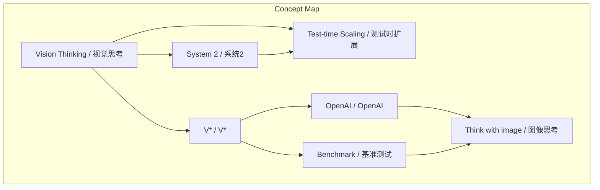
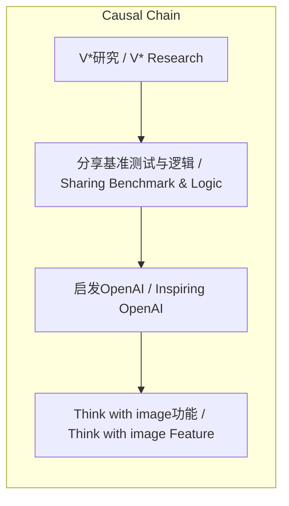

# NEWS/NEWS 任务报告

- agent: news/news
- requestId: 1774055798585-yfmbpg
- 生成时间(UTC): 2026-03-21T01:18:07.046Z

## 文本总结

# Vision Thinking：AI视觉推理的先行探索

## 整体结构化文档表达

### 文档卡片
- **主题（中文/English）**：视觉思考 / Vision Thinking
- **一句话摘要**：谢赛宁团队提出Vision Thinking，在多模态AI中引入System 2机制实现测试时视觉推理，并直接启发OpenAI产品。
- **目标读者**：人工智能研究者、多模态系统开发者、科技产品经理
- **核心结论（3条）**：
  1. Vision Thinking通过模拟人类视觉搜索和定位过程，使AI能在测试阶段进行推理。
  2. 其Test-time Scaling理念早于行业主流认知，具有前瞻性。
  3. V*研究的基准和逻辑直接启发了OpenAI的Think with image功能。

### 内容结构树
1. **背景与问题定义**：传统语言模型（LLM）直接输出答案，缺乏类似人类的视觉推理过程。
2. **核心观点与关键证据**：提出Vision Thinking，包含三个层面：模拟人类视觉推理、Test-time Scaling、启发工业界。
3. **方法/机制/路径**：在多模态系统中引入System 2机制，实现测试时计算扩展和视觉推理。
4. **风险与边界条件**：未提及。
5. **结论与行动建议**：学术研究具有前瞻性，对工业界产品开发产生直接影响。

### 结构化元数据（JSON）
```json
{
  "title": "Vision Thinking：AI视觉推理的先行探索",
  "topic_zh": "视觉思考",
  "topic_en": "Vision Thinking",
  "audience": "人工智能研究者、多模态系统开发者、科技产品经理",
  "claims": [
    "Vision Thinking通过模拟人类视觉搜索和定位过程，使AI能在测试阶段进行推理。",
    "其Test-time Scaling理念早于行业主流认知，具有前瞻性。",
    "V*研究的基准和逻辑直接启发了OpenAI的Think with image功能。"
  ],
  "evidence": [
    "V*研究在多模态系统中引入System 2机制",
    "人类视觉推理类比：被问垃圾桶颜色时先思考位置、转头观察、定位、确认",
    "谢赛宁将V*基准测试和逻辑分享给OpenAI研究员Alex Kirillov和程博文",
    "OpenAI的Think with image功能使用了V*论文的示例和基准测试"
  ],
  "risks": [],
  "actions": []
}
```

## 概念清单（中英文）
- 视觉思考 / Vision Thinking
- 系统2（慢思考） / System 2
- 多模态系统 / Multimodal System
- 测试阶段 / Test-time
- 计算扩展 / Scaling
- 视觉推理 / Visual Reasoning
- 语言模型 / Language Model (LLM)
- 物理世界 / Physical World
- 视觉搜索 / Visual Search
- 定位 / Localization
- 测试时扩展 / Test-time Scaling
- OpenAI / OpenAI
- o1模型 / o1 Model
- 图像思考 / Think with image
- V* / V*
- 基准测试 / Benchmark
- 谢赛宁 / Xie Saining
- 纽约大学 / New York University (NYU)
- Alex Kirillov / Alex Kirillov
- 程博文 / Cheng Bowen

## 概念定义（中英文）
- **视觉思考 / Vision Thinking**：谢赛宁团队提出的在多模态人工智能系统中引入System 2机制，以模拟人类视觉推理过程，实现测试阶段计算扩展和视觉推理的研究工作。
- **系统2（慢思考） / System 2**：一种认知机制，允许人工智能在推理阶段进行更多计算和思考，类似于人类的慢思考系统。
- **多模态系统 / Multimodal System**：能够处理多种模态数据（如图像、文本）的人工智能系统。
- **测试阶段 / Test-time**：人工智能模型在部署后处理新输入时的推理阶段。
- **计算扩展 / Scaling**：在推理过程中增加计算资源或步骤以提升性能。
- **视觉推理 / Visual Reasoning**：基于视觉信息进行逻辑推理的能力。
- **语言模型 / Language Model (LLM)**：以文本为主要输入输出的人工智能模型，传统模式是直接回答问题。
- **物理世界 / Physical World**：人类存在的现实环境，涉及空间和物体。
- **视觉搜索 / Visual Search**：在视觉场景中主动寻找目标物体的过程。
- **定位 / Localization**：确定物体在空间中的具体位置。
- **测试时扩展 / Test-time Scaling**：在测试阶段通过增加计算来提升模型推理能力的理念。
- **OpenAI / OpenAI**：一家人工智能研究公司，发布了o1模型和Think with image功能。
- **o1模型 / o1 Model**：OpenAI发布的强调慢思考和复杂推理的模型。
- **图像思考 / Think with image**：OpenAI的产品功能，允许用户与图像进行思考交互。
- **V* / V***：谢赛宁团队在纽约大学主导的研究项目，实现了Vision Thinking。
- **基准测试 / Benchmark**：用于评估人工智能模型性能的标准测试集。
- **谢赛宁 / Xie Saining**：研究人员，在纽约大学主导V*研究。
- **纽约大学 / New York University (NYU)**：谢赛宁进行V*研究的机构。
- **Alex Kirillov / Alex Kirillov**：OpenAI研究员，受V*启发推进Think with image项目。
- **程博文 / Cheng Bowen**：OpenAI研究员，受V*启发推进Think with image项目。

## 概念关联与逻辑关系（中英文）
- Vision Thinking（视觉思考）引入 System 2（系统2）以支持 Test-time Scaling（测试时扩展）。
- V*（V*）研究的基准测试和逻辑直接导致 OpenAI（OpenAI）开发 Think with image（图像思考）功能。
- 人类视觉推理行为（Human visual reasoning）包含 视觉搜索（Visual Search）和 定位（Localization）过程。

## COT逻辑梳理（定义/分类/比较/因果/科学方法论）
- **Step 1（定义问题）**：传统语言模型（LLM）在回答问题时代价直接输出答案，缺乏类似人类在物理世界中的视觉推理过程，即先搜索、定位再确认。
- **Step 2（分类解决方案）**：谢赛宁团队提出Vision Thinking，将其分为三个层面：模拟人类视觉推理、Test-time Scaling、工业界启发。
- **Step 3（比较分析）**：对比传统LLM模式与Vision Thinking模式：前者是即时响应，后者是测试时计算扩展，更接近人类慢思考。
- **Step 4（因果关系）**：V*研究（因）实现了Vision Thinking，其基准和逻辑（因）被分享给OpenAI研究员，导致Think with image功能（果）的开发。
- **Step 5（科学方法论）**：采用实证研究方法：通过设计V*系统，在测试阶段增加计算和视觉推理步骤，验证其在多模态任务上的性能，并开源基准测试促进社区复现和工业应用。

## 事实与看法
### 事实
- 谢赛宁在纽约大学（NYU）期间主导了名为V*的研究工作。
- V*工作的核心是在多模态系统中引入了System 2机制。
- Vision Thinking模拟人类视觉推理过程，包括视觉搜索和定位。
- Test-time Scaling在V*研究时还不是行业流行词。
- 谢赛宁将V*的基准测试和视觉思考逻辑分享给了OpenAI的研究员Alex Kirillov和程博文。
- OpenAI随后开发了“Think with image”项目，并使用了V*论文的示例和基准测试。
- OpenAI发布了o1模型，主打慢思考和复杂推理。

### 看法
- Vision Thinking是极具前瞻性的研究。
- 在Test-time Scaling成为流行词之前，谢赛宁团队已经率先尝试。
- V*工作对工业界产生了直接影响。

## FAQ（原文问题整理）
未发现明确提问。

## Visualization
### Mermaid 图 1（概念结构图）


### Mermaid 图 2（逻辑/因果图）


## 文章中的类比
- 人类视觉推理类比：当人被问到“旁边的垃圾桶是什么颜色”时，不会立刻凭空给出答案，而是先想一想垃圾桶可能在哪里（例如可能在冰箱旁边），然后转头去观察、在空间中定位（localize）那个物体，确认之后才会说出颜色。

## 10个金句
1. “Vision Thinking主要是指他在纽约大学（NYU）期间主导的一项名为 V* 的重要研究工作。”
2. “这项工作的核心是在多模态系统中引入了‘System 2（系统2/慢思考）’的机制。”
3. “让人工智能能够在测试阶段（Test-time）进行计算扩展（Scaling）和视觉推理。”
4. “Vision Thinking 模仿了人类在物理世界中的视觉反应行为。”
5. “当一个人被问到‘旁边的垃圾桶是什么颜色’时，他不会立刻凭空给出一个答案，而是会先想一想垃圾桶可能在哪里（例如可能在冰箱旁边），然后转头去观察、在空间中定位（localize）那个物体，确认之后才会说出颜色。”
6. “这种在给出答案前先进行视觉搜索、定位和推理的行为，就是 Visual Thinking 的实质。”
7. “极具前瞻性的 Test-time Scaling（测试时慢思考）”
8. “这项工作的开展时间远远早于 OpenAI 后来发布的主打‘慢思考’和复杂推理的 o1 模型。”
9. “直接启发了 OpenAI 的‘Think with image’（图像思考）产品功能”
10. “其内部使用的许多示例和基准测试，正是来源于谢赛宁团队的 V* 论文。”
