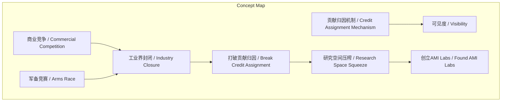
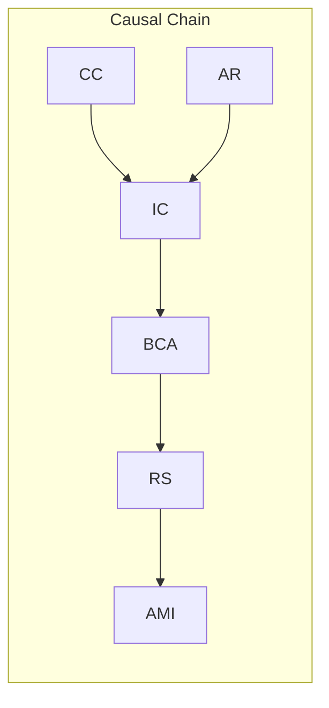

# NEWS/NEWS 任务报告

- agent: news/news
- requestId: 1774056690234-b96dcf
- 生成时间(UTC): 2026-03-21T01:32:36.196Z

## 文本总结

# 学术贡献归因机制在LLM时代被商业竞争打破

## 整体结构化文档表达
### 文档卡片
- 主题（中文/English）：学术贡献归因机制与商业竞争 / Academic Credit Assignment Mechanism and Commercial Competition
- 一句话摘要：谢赛宁指出学术界依赖“贡献归因”机制驱动研究，但大模型时代工业界封闭与军备竞赛打破了该机制，导致研究者可见度下降。
- 目标读者：未提及
- 核心结论（3条）：
  1. 贡献归因（Credit Assignment）是学术界发展的核心驱动力，通过论文署名赋予研究者可见度。
  2. 大模型时代工业界实验室变得极度封闭，从鼓励发表论文到笼统署名，打破传统贡献归因机制。
  3. 商业竞争（军备竞赛、保密需求）是导致机制打破的主因，促使谢赛宁创立AMI Labs以重建对研究员友好的环境。

### 内容结构树
1. 背景与问题定义：谢赛宁访谈探讨学术界核心机制及其在大模型时代被商业竞争打破的现象。
2. 核心观点与关键证据：核心机制是贡献归因；证据包括论文署名赋予可见度、工业界封闭行为、军备竞赛、LLM组织结构变化。
3. 方法/机制/路径：贡献归因机制通过论文署名实现；工业界通过不署名、团队笼统署名、保密政策实施封闭。
4. 风险与边界条件：风险是纯粹研究空间被压榨；边界条件是商业保密和防止人才流失。
5. 结论与行动建议：谢赛宁离开大厂创立AMI Labs，旨在找回对研究员友好的环境。

### 结构化元数据（JSON）
```json
{
  "title": "学术贡献归因机制在LLM时代被商业竞争打破",
  "topic_zh": "学术贡献归因机制与商业竞争",
  "topic_en": "Academic Credit Assignment Mechanism and Commercial Competition",
  "audience": "未提及",
  "claims": [
    "贡献归因是学术界发展的核心驱动力",
    "工业界封闭与军备竞赛打破了贡献归因机制",
    "创立AMI Labs旨在重建对研究员友好的环境"
  ],
  "evidence": [
    "论文署名明确贡献归属，赋予研究者可见度",
    "工业界实验室从发论文到不署名或笼统署名为团队",
    "大模型赛道陷入关乎生死的商业军备竞赛",
    "公司为商业保密和防止人才流失，不分享功劳归属"
  ],
  "risks": [
    "纯粹、自下而上的研究空间被严重压榨"
  ],
  "actions": [
    "谢赛宁离开大厂，联合创立AMI Labs"
  ]
}
```

## 处理流程
1. 输入识别：来源为用户提供的谢赛宁访谈文本，内容涉及学术机制与商业竞争。
2. 信息抽取：实体包括谢赛宁、学术界、工业界、LLM、FAIR、OpenAI team、Gemini team、AMI Labs；概念包括Credit Assignment、贡献归因、可见度、商业竞争、军备竞赛；问题为机制为何被打破；事实包括论文署名、工业界封闭行为；观点包括“为爱发电”、机制是最大驱动力。
3. 结构化归纳：定义贡献归因机制；分类学术（开放署名）与工业界（封闭不署名）行为；比较过去（FAIR发论文署名）与现在（不署名）；因果分析商业竞争导致机制打破；科学方法论基于访谈观察。
4. 关系建模：贡献归因与可见度正相关；商业竞争导致工业界封闭；工业界封闭与军备竞赛共同打破贡献归因。
5. 可视化表达：使用Mermaid绘制概念结构图和因果链图。

## 概念清单（中英文）
- 谢赛宁 / Xie Saining
- 学术界 / Academic Community
- 核心机制 / Core Mechanism
- Credit Assignment / 贡献归因
- 论文 / Paper
- 署名 / Authorship
- 可见度 / Visibility
- 研究人员 / Researchers
- 大语言模型 / Large Language Models (LLM)
- 工业界 / Industry
- FAIR / FAIR (Facebook AI Research)
- OpenAI team / OpenAI team
- Gemini team / Gemini team
- 军备竞赛 / Arms Race
- 大厂 / Large Tech Companies
- AMI Labs / AMI Labs
- researcher friendly / 对研究员友好的环境

## 概念定义（中英文）
- 谢赛宁 / Xie Saining：访谈中的学者，曾任大厂研究员，现为AMI Labs联合创始人。
- 学术界 / Academic Community：以发表论文、共享知识为基础的研究群体。
- 核心机制 / Core Mechanism：支撑学术界发展的根本性运作方式。
- Credit Assignment / 贡献归因：通过论文署名明确研究者具体贡献，以赋予可见度和认可的机制。
- 论文 / Paper：学术研究成果的正式发表载体。
- 署名 / Authorship：在论文上列出研究者名字以标明贡献的行为。
- 可见度 / Visibility：研究者因署名而获得的学术声誉、认可和影响力。
- 研究人员 / Researchers：从事学术或工业研究工作的个体。
- 大语言模型 / Large Language Models (LLM)：基于大规模数据训练的深度学习模型，如GPT系列。
- 工业界 / Industry：以商业盈利为目的的企业研发部门。
- FAIR / FAIR (Facebook AI Research)：早期鼓励公开发表论文和署名的大厂实验室。
- OpenAI team / OpenAI team：笼统署名，不列具体研究员名字的团队称谓。
- Gemini team / Gemini team：笼统署名，不列具体研究员名字的团队称谓。
- 军备竞赛 / Arms Race：在高度竞争赛道上，各方为领先而投入大量资源的恶性竞争。
- 大厂 / Large Tech Companies：规模庞大的科技公司，如开发LLM的企业。
- AMI Labs / AMI Labs：谢赛宁创立的实验室，旨在营造对研究员友好的环境。
- researcher friendly / 对研究员友好的环境：重视个人贡献、提供可见度、支持纯粹研究的工作氛围。

## 概念关联与逻辑关系（中英文）
1. 贡献归因机制 / Credit Assignment Mechanism 与 可见度 / Visibility 正相关：贡献归因通过署名直接提升研究者可见度。
2. 商业竞争 / Commercial Competition 导致 工业界封闭 / Industry Closure：为应对竞争，工业界实验室变得不公开、不署名。
3. 工业界封闭 / Industry Closure 与 军备竞赛 / Arms Race 共同打破 贡献归因机制 / Credit Assignment Mechanism：封闭行为（如不署名）和竞争压力使传统署名机制失效。

## COT逻辑梳理（定义/分类/比较/因果/科学方法论）
- Step 1（定义）：明确“贡献归因”为通过论文署名归属学术贡献的机制，是学术界可见度来源。
- Step 2（分类）：将行为分为学术界（坚持署名、开放交流）和工业界（从开放到封闭、笼统署名）。
- Step 3（比较）：对比过去工业界（如FAIR鼓励发论文署名）与现在（不发论文、团队署名），突出变化。
- Step 4（因果）：商业竞争（军备竞赛、保密需求）→ 工业界封闭（不署名）→ 打破贡献归因 → 研究空间压榨。
- Step 5（科学方法论）：基于访谈的质性观察，归纳现象（封闭、不署名），推断商业竞争为根本原因，提出行动方案（创立AMI Labs）。

## 事实与看法（病毒）
### 事实
- 过去学术界通过论文署名明确贡献归属。
- 工业界实验室（如早期FAIR）鼓励公开发表论文和署名。
- 近年来工业界实验室变得极度封闭，不发论文或不署具体研究员名字。
- 团队发布技术博客时笼统署名为“OpenAI team”或“Gemini team”。
- 大模型赛道陷入高度竞争的“军备竞赛”。
- LLM的组织结构导致公司为商业保密和防止人才流失，不分享功劳归属。
- 谢赛宁离开大厂并联合创立AMI Labs。
### 看法
- 做纯粹的学术研究本质上是“为爱发电”的过程。
- 贡献归因是对研究人员个人创新的最大认可和驱动力。
- 学术界与工业界的良性交流机制被商业竞争打破。
- 核心模型训练团队的唯一目标是“走到最前面”，关乎生死。
- 纯粹的、自下而上的研究空间被严重压榨。
- 创立AMI Labs是为了找回“researcher friendly”的环境，让年轻人获得个人光环。

## FAQ（原文问题整理）
未发现明确提问（原文为谢赛宁的陈述性解释，未包含直接提问）。

## Visualization
### Mermaid 图 1（概念结构图）

### Mermaid 图 2（逻辑/因果图）


## 文章中的类比
未发现明确类比。

## 10个金句
1. 做纯粹的学术研究在本质上是一个“为爱发电”的过程。
2. 研究者探究问题往往不是为了产品交付或金钱回报。
3. 支撑学术界不断向前发展的核心机制是“Credit Assignment（贡献归因）”。
4. 通过在论文上明确署名，让全世界知道到底是谁做了什么具体的工作。
5. 这种机制赋予了研究人员可见度（visibility），是对他们个人创新的最大认可和驱动力。
6. 工业界实验室变得极度封闭（Closed）。
7. 他们一开始是不发论文，后来连发布技术博客也不再允许署上具体研究员的名字。
8. 这已经变成了一场关乎生死的商业“军备竞赛”。
9. 公司为了商业保密和防止人才流失，不再对外分享具体的功劳归属。
10. 他希望能在这种强商业竞争的硅谷叙事之外，重新找回一个“researcher friendly（对研究员友好）的环境”。
