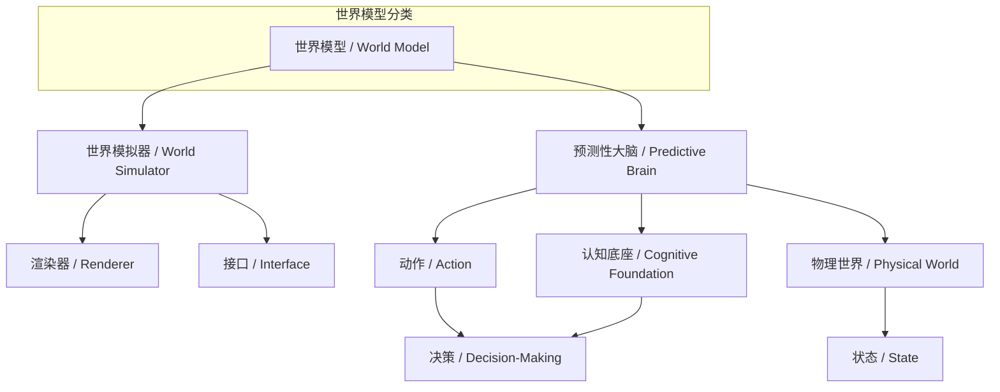
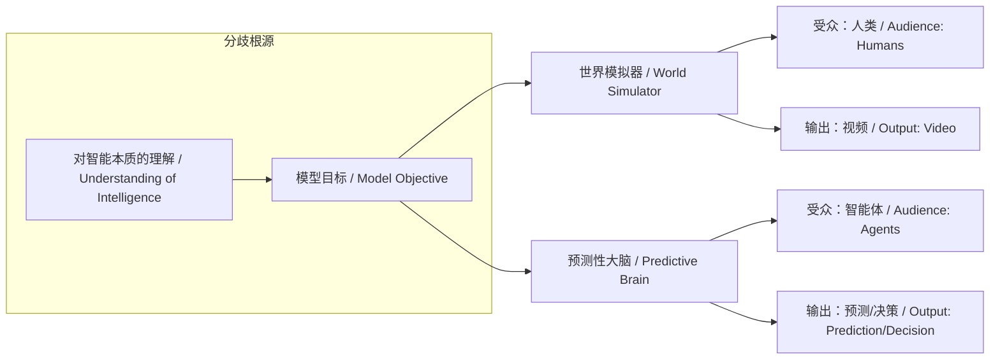

# NEWS/NEWS 任务报告

- agent: news/news
- requestId: 1774058360412-hcy262
- 生成时间(UTC): 2026-03-21T02:00:14.214Z

## 文本总结

# 世界模拟器与预测性大脑：智能本质的分歧

## 整体结构化文档表达
### 文档卡片
- 主题（中文/English）：世界模型架构分歧 / World Model Architecture Divergence
- 一句话摘要：谢赛宁指出Sora代表的“世界模拟器”与“预测性大脑”在核心目标、受众及智能本质上存在根本区别，前者服务于人类视觉，后者构建机器智能认知底座。
- 目标读者：人工智能研究者、技术决策者、AGI领域关注者
- 核心结论（3条）：
  1. Sora类模拟器本质是面向人类的视觉渲染接口，追求内容美观与一致性。
  2. 预测性大脑是面向机器智能体的认知底座，关注物理规律预测与决策。
  3. 两者路径分歧反映了对“智能”本质的不同理解：生成表现 vs. 内在决策。

### 内容结构树
1. 背景与问题定义：当前生成模型（如Sora）被视作世界模拟器，但谢赛宁提出其与真正世界模型有根本区别。
2. 核心观点与关键证据：对比两种模型的目标、受众、本质；证据包括Sora的渲染特性与预测性大脑的物理预测特性。
3. 方法/机制/路径：预测性大脑通过自发学习底层表征，预测物理世界状态与动作后果；世界模拟器通过生成视频内容提供视觉接口。
4. 风险与边界条件：未提及
5. 结论与行动建议：构建预测性大脑是提升机器智能的关键，视频生成能力非核心。

### 结构化元数据（JSON）
```json
{
  "title": "世界模拟器与预测性大脑：智能本质的分歧",
  "topic_zh": "世界模型架构分歧",
  "topic_en": "World Model Architecture Divergence",
  "audience": "人工智能研究者、技术决策者、AGI领域关注者",
  "claims": [
    "Sora类模拟器的核心目标是渲染视觉内容，服务于人类观看",
    "预测性大脑的核心目标是构建机器智能的底层决策能力",
    "两者在受众和智能本质理解上存在根本分歧"
  ],
  "evidence": [
    "Sora生成视频注重美观、一致性与长度，允许用户控制",
    "预测性大脑关注物理规律预测、状态理解与动作后果推理",
    "预测性大脑的输出是给系统看的，不刻意渲染视频"
  ],
  "risks": [],
  "actions": [
    "优先发展预测性大脑以提升机器智能",
    "区分视觉生成与认知建模的不同目标"
  ]
}
```

## 概念清单（中英文）
- 预测性大脑 / Predictive Brain
- 世界模型 / World Model
- Sora
- 世界模拟器 / World Simulator
- 渲染器 / Renderer
- 接口 / Interface
- 物理世界 / Physical World
- 决策 / Decision-Making
- 认知底座 / Cognitive Foundation
- 智能体 / Agent
- 状态 / State
- 动作 / Action

## 概念定义（中英文）
- 预测性大脑 / Predictive Brain：谢赛宁及AMI Labs致力于构建的模型，核心在于自发学习底层表征，对物理世界进行预测、推理和规划，以提升机器智能本身。
- 世界模型 / World Model：对物理世界的内部表示，能够预测状态变化和动作后果，是智能体决策的基础。
- Sora：OpenAI开发的多模态生成模型，代表当前“世界模拟器”方向，擅长生成高质量视频。
- 世界模拟器 / World Simulator：以生成逼真、一致、可控的视觉内容为目标的模型，本质是面向人类的渲染接口。
- 渲染器 / Renderer：将模型输出转换为视觉内容的组件，强调美观与表现力。
- 接口 / Interface：模型与用户（人类）交互的层面，世界模拟器通过视频作为接口。
- 物理世界 / Physical World：机器所作用的真实环境，包含物理规律和动态变化。
- 决策 / Decision-Making：智能体基于预测选择动作的过程，是预测性大脑的核心应用。
- 认知底座 / Cognitive Foundation：支撑智能体理解和适应物理世界的底层认知结构，预测性大脑即为此底座。
- 智能体 / Agent：具有感知、决策和行动能力的实体，预测性大脑服务于智能体。
- 状态 / State：物理世界在某一时刻的配置，预测性大脑需要理解状态。
- 动作 / Action：智能体施加于环境的影响，预测性大脑预测动作后果。

## 概念关联与逻辑关系（中英文）
1. 预测性大脑 / Predictive Brain 与 世界模型 / World Model 是等同关系：预测性大脑即真正的世界模型。
2. 世界模拟器 / World Simulator 与 渲染器 / Renderer 是功能关系：世界模拟器通过渲染器实现视觉输出。
3. 预测性大脑 / Predictive Brain 与 认知底座 / Cognitive Foundation 是组成关系：预测性大脑构成智能体的认知底座。
4. 物理世界 / Physical World 与 状态 / State 是包含关系：状态是物理世界的具体表现。
5. 动作 / Action 与 决策 / Decision-Making 是输入输出关系：决策产生动作，动作影响状态。

至少三条可形式化关系：
- 预测性大脑的目标 = 提升智能本身 ≠ 渲染视觉内容 = 世界模拟器的目标
- 预测性大脑的受众 = 智能体/系统；世界模拟器的受众 = 人类
- 预测性大脑的输出 = 预测/推理/规划；世界模拟器的输出 = 视频内容

## COT逻辑梳理（定义/分类/比较/因果/科学方法论）
Step 1: 定义核心概念。世界模型是对物理世界的内部表示，用于预测和决策。根据目标不同，分为两类：以视觉生成为目标的世界模拟器，和以智能提升为目标的预测性大脑。
Step 2: 分类。基于核心目标，将当前模型分为“世界模拟器”（如Sora）和“预测性大脑”（如AMI Labs研究）两类。
Step 3: 比较。比较两者在核心目标（渲染视频 vs. 学习表征）、受众（人类 vs. 机器系统）、本质（视觉接口 vs. 认知底座）上的差异。
Step 4: 因果分析。因果链：对智能本质的理解不同（因）→ 导致模型设计目标不同（果）→ 进而导致受众和输出形式不同（进一步果）。具体：若认为智能体现在生成能力，则发展模拟器；若认为智能体现在决策，则发展预测性大脑。
Step 5: 科学方法论。构建预测性大脑需遵循：a) 从连续高维物理世界中学习；b) 过滤噪音，理解状态；c) 预测动作后果；d) 基于预测进行规划。这涉及表征学习、动力学建模和强化学习。

## 事实与看法（病毒）
### 事实
- 谢赛宁认为Sora代表“世界模拟器”方向。
- Sora等模型生成视频注重美观、一致性和长度。
- 用户可对生成内容施加控制（如游戏中的前后移动）。
- 预测性大脑的核心是学习底层表征并进行物理预测。
- 预测性大脑的输出是给系统看的，不刻意渲染视频。
- 预测性大脑关注机器在物理世界中过滤噪音、理解状态、预测动作后果。
### 看法
- 两种模型在核心目标、受众面、智能本质理解上存在“根本的区别”。
- 世界模拟器造出的视频本质上是“给人看的”。
- 生成酷炫视频对预测性大脑而言“无关紧要”。
- 世界模拟器是“渲染器”与“接口”，预测性大脑是“认知底座”。

## FAQ（原文问题整理）
原文未直接提问，但隐含核心问题：Sora类模型与预测性大脑有何区别？
回答：区别在于：1) 目标：渲染视频 vs. 提升智能；2) 受众：人类 vs. 机器系统；3) 本质：视觉接口 vs. 认知底座。

## Visualization
### Mermaid 图 1（概念结构图）


### Mermaid 图 2（逻辑/因果图）


## 文章中的类比
- Sora的“世界模拟器”被比喻为追求极致视觉表现的“渲染器”与“接口”。
- “预测性大脑”被比喻为智能体在真实物理世界中生存和决策的“认知底座”。

## 10个金句
1. 构建“预测性大脑”（真正的世界模型）与Sora所代表的“世界模拟器”在核心目标、受众面以及对智能本质的理解上存在着根本的区别。
2. Sora的“世界模拟器”：渲染给“人”看的视觉接口。
3. 它们的重点在于渲染出足够好看、具备某种一致性、内容足够长的视频。
4. 这种模拟器造出来的视频或游戏，本质上是“给人看的”。
5. 生成酷炫的视频只是向人类展示的一种表现形式，或者说是世界模型的一个“接口”。
6. 谢赛宁及AMI Labs致力于打造的“预测性大脑”，是为了从根本上构建和提升机器的“智能本身”。
7. 真正的预测性大脑（世界模型）核心不在于生成逼真的像素，而在于自发地学到更好的底层表征。
8. 它所捕捉和预测的物理规律是“给系统看、给世界看”的。
9. 它关注的是机器在连续、高维的物理世界中如何过滤噪音、理解环境状态以及预测自身动作会带来什么后果。
10. 能不能生成一段酷炫的视频对它而言其实是无关紧要的。
