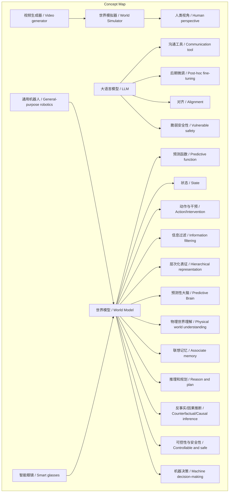
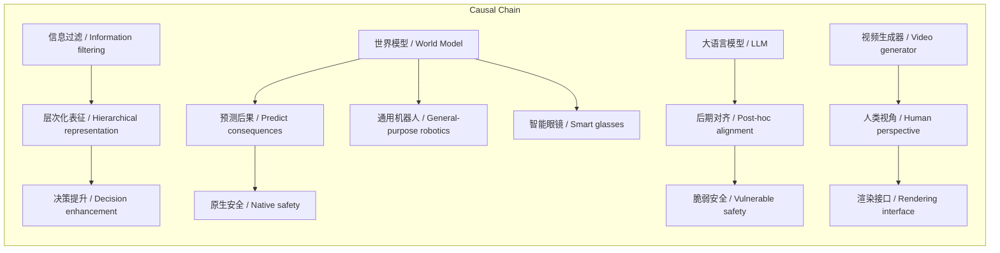

# NEWS/NEWS 任务报告

- agent: news/news
- requestId: 1774058639449-7wgh7w
- 生成时间(UTC): 2026-03-21T02:05:01.221Z

## 文本总结

# 世界模型：智能体的预测性大脑

## 整体结构化文档表达
### 文档卡片
- 主题（中文/English）：世界模型 / World Model
- 一句话摘要：世界模型是通过预测环境状态指导决策的底层架构，具备物理理解、联想记忆、推理规划等五大核心特征，与大语言模型和视频生成器存在本质区别。
- 目标读者：AI研究者、技术决策者、科技爱好者
- 核心结论（3条）：
  1. 世界模型的核心是信息过滤与层次化表征，形成对世界的抽象理解以指导决策。
  2. 世界模型提供原生安全性，区别于依赖后期对齐的大语言模型。
  3. 世界模型定位为智能体地基，视频生成器仅作为人类视角的渲染接口。

### 内容结构树
1. 背景与问题定义：世界模型的定义及其历史起源（Craik, 1943；谢赛宁构想）。
2. 核心观点与关键证据：五大核心特征；运作机制（信息过滤、层次化表征）；与LLM和视频生成器的本质区别。
3. 方法/机制/路径：通过学习预测函数，从状态和动作预测下一状态，提取核心信息建立抽象表征。
4. 风险与边界条件：未提及具体风险，但强调原生安全性是核心优势。
5. 结论与行动建议：未来作为通用机器人和“永远在线”穿戴设备的核心底座。

### 结构化元数据（JSON）
```json
{
  "title": "世界模型：智能体的预测性大脑",
  "topic_zh": "世界模型",
  "topic_en": "World Model",
  "audience": "AI研究者、技术决策者、科技爱好者",
  "claims": [
    "世界模型的核心是信息过滤与层次化表征，形成对世界的抽象理解",
    "世界模型提供原生安全性，区别于依赖后期对齐的大语言模型",
    "世界模型定位为智能体地基，视频生成器仅作为人类视角的接口"
  ],
  "evidence": [
    "世界模型定义：基于状态和动作预测下一状态的底层架构",
    "五大核心特征：物理世界理解、联想记忆、推理规划、反事实推理、可控安全",
    "LLM是交流工具，缺乏真实世界感知；安全性依赖后期微调和对齐",
    "视频生成器构建世界模拟器给人类看，世界模型给机器决策用"
  ],
  "risks": ["未提及明确风险"],
  "actions": ["未提供具体行动建议"]
}
```

## 处理流程
1. 输入识别（来源：用户输入文本）
2. 信息抽取（实体、概念、问题、事实、观点）
3. 结构化归纳（定义/分类/比较/因果/方法论）
4. 关系建模（概念关系、等式/方程/逻辑链）
5. 可视化表达（Mermaid）

## 概念清单（中英文）
- 世界模型 / World Model
- 状态 / State
- 动作与干预 / Action/Intervention
- 预测函数 / Predictive function
- Kenneth Craik
- 谢赛宁
- AMI Labs
- 预测性大脑 / Predictive Brain
- 物理世界理解 / Physical world understanding
- 联想记忆 / Associate memory
- 推理和规划 / Reason and plan
- 反事实推理 / Counterfactual inference
- 因果推断 / Causal inference
- 可控性与安全性 / Controllable and safe
- 信息过滤 / Information filtering
- 层次化表征 / Hierarchical representation
- 大语言模型 / Large Language Model (LLM)
- 沟通工具 / Communication tool
- 后期微调 / Post-hoc fine-tuning
- 对齐 / Alignment
- 原生安全底座 / Native safety foundation
- 视频生成器 / Video generator
- Sora
- Genie
- 世界模拟器 / World Simulator
- 人类视角 / Human perspective
- 机器决策 / Machine decision-making
- 通用机器人 / General-purpose robotics
- 智能眼镜 / Smart glasses
- 永远在线 / Always on
- 实时感知 / Real-time perception
- 人类健康与行为 / Human health and behavior

## 概念定义（中英文）
- 世界模型：基于当前系统或环境状态和施加的动作与干预，通过学习预测函数来预测系统下一个状态的底层架构。
- 状态：系统或环境的当前情况。
- 动作与干预：施加于系统的行为或改变。
- 预测函数：用于预测下一状态的学习函数。
- Kenneth Craik：1943年提出大脑存在预知动作后果模型的英国生理学家。
- 谢赛宁：AMI Labs负责人，提出世界模型构想以打造通用智能体的“预测性大脑”。
- AMI Labs：谢赛宁所在的实验室。
- 预测性大脑：世界模型的目标，为通用智能体提供预测能力以提升真实智能。
- 物理世界理解：理解真实物理世界的特性和规律。
- 联想记忆：庞大的记忆系统，能够关联和存储信息。
- 推理和规划：基于现有信息进行推理和制定计划的能力。
- 反事实推理：考虑假设情况（“如果...会怎样”）的推理能力。
- 因果推断：推断因果关系的能力。
- 可控性与安全性：系统原生具备的可控制和保证安全的能力。
- 信息过滤：剔除海量冗余细节，提取对决策有价值的核心信息的过程。
- 层次化表征：建立对世界的多层次、抽象表示。
- 大语言模型：在符号语义空间运作的交流工具，缺乏对真实世界的底层感知。
- 沟通工具：用于信息交流的工具。
- 后期微调：训练后通过数据调整模型行为的方法。
- 对齐：通过数据使模型输出符合人类价值观的过程。
- 原生安全底座：安全性内置于系统设计，而非后期添加。
- 视频生成器：生成视频的模型，如Sora、Genie。
- Sora：视频生成模型示例。
- Genie：视频生成模型示例。
- 世界模拟器：模拟世界以生成逼真视频的系统。
- 人类视角：从人类观察和欣赏角度出发。
- 机器决策：机器自主进行决策的过程。
- 通用机器人：能执行多种任务的机器人。
- 智能眼镜：穿戴式AI设备，可实时感知环境。
- 永远在线：持续运行、不间断工作。
- 实时感知：即时感知环境变化的能力。
- 人类健康与行为：监测人类的健康状态和行为模式。

## 概念关联与逻辑关系（中英文）
- 世界模型 / World Model 依赖 预测函数 / Predictive function 实现状态预测。
- 世界模型 / World Model 通过 信息过滤 / Information filtering 和 层次化表征 / Hierarchical representation 形成抽象理解。
- 大语言模型 / LLM 作为 沟通工具 / Communication tool，其 安全性 / Safety 依赖 后期微调 / Post-hoc fine-tuning 和 对齐 / Alignment，而 世界模型 / World Model 的 安全性 / Safety 是 原生 / Native 的，源于 预测后果 / Predict consequences 能力。
- 视频生成器 / Video generator 构建 世界模拟器 / World Simulator 服务于 人类视角 / Human perspective，而 世界模型 / World Model 服务于 机器决策 / Machine decision-making。

## COT逻辑梳理（定义/分类/比较/因果/科学方法论）
Step 1: **定义** - 世界模型是基于状态和动作预测下一状态的底层架构，旨在为智能体提供“预测性大脑”。
Step 2: **分类** - 核心特征分为五类：物理世界理解、联想记忆、推理与规划、反事实/因果推断、可控安全。
Step 3: **比较** - 与大语言模型比较：LLM是符号空间的交流工具，缺乏真实感知；世界模型是物理世界的预测底座。与视频生成器比较：视频生成器渲染给人类看，世界模型指导机器决策。
Step 4: **因果** - 世界模型因能预测动作后果，故安全性原生；LLM因无此能力，安全性依赖后期对齐，故脆弱。
Step 5: **科学方法论** - 构建世界模型需学习预测函数，从高维感官信号中过滤噪音，提取状态，建立层次化抽象表征，最终用于规划和反事实推理。

## 事实与看法（病毒）
### 事实
- 世界模型定义：基于状态和动作预测下一状态的底层架构。
- 历史起源：1943年Kenneth Craik提出大脑存在此类模型；谢赛宁团队（AMI Labs）构想用于通用智能体。
- 五大核心特征：物理世界理解、联想记忆、推理规划、反事实/因果推断、可控安全。
- 运作机制：作为信息过滤系统，剔除冗余细节，提取核心信息建立抽象表征。
- LLM是交流工具，安全性依赖后期微调和对齐。
- 视频生成器（如Sora、Genie）构建世界模拟器，聚焦人类视角的视觉渲染。
- 未来应用：通用机器人和智能穿戴设备的核心底座。

### 看法
- 谢赛宁认为世界模型是智能体的“预测性大脑”。
- LLM是“有缺陷的”世界模型。
- 世界模型的安全性是“原生的”，LLM安全性是“脆弱的”。
- 世界模型是智能体的“地基”，LLM退化为“沟通接口”。
- 世界模型“不需要刻意生成视频”，其预测规律“给智能系统自己看”。

## FAQ（原文问题整理）
- 未发现明确提问。

## Visualization
### Mermaid 图 1（概念结构图）


### Mermaid 图 2（逻辑/因果图）


## 文章中的类比
- 预测性大脑（世界模型作为智能体的“大脑”）
- 沟通工具（大语言模型作为交流工具）
- 世界模拟器（视频生成器构建模拟环境）
- 地基与沟通接口（世界模型是地基，LLM是接口）
- 降维打击（安全维度的比较）

## 10个金句
1. 世界模型的本质就是一个极其强大的信息过滤系统。
2. 它不需要去“死记硬背”物理世界里诸如光照、细微纹理等无限的冗余细节。
3. 大语言模型只是在符号语义空间中运作的“交流工具”。
4. 它缺乏对真实世界的底层感知和预测后果的能力。
5. LLM的安全性是脆弱的，完全依赖于后期的微调和对齐。
6. 世界模型的安全性是原生的，因为它能在后台预测动作的后果。
7. 在未来的终极智能体架构中，真正的世界模型是地基。
8. 语言模型最终只会退化为智能体的一个“沟通接口”。
9. 像Sora或Genie这样大火的视频生成模型，目前主要聚焦于构建一个“世界模拟器”。
10. 真正的世界模型不需要刻意生成视频，它所捕捉和预测的物理规律是“给智能系统自己看”的。
