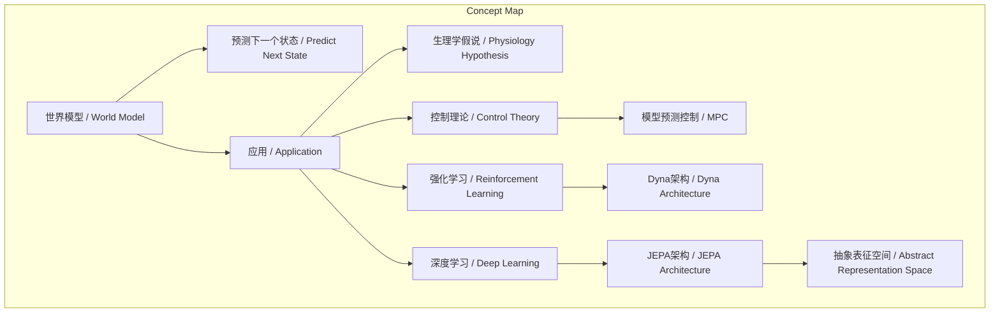
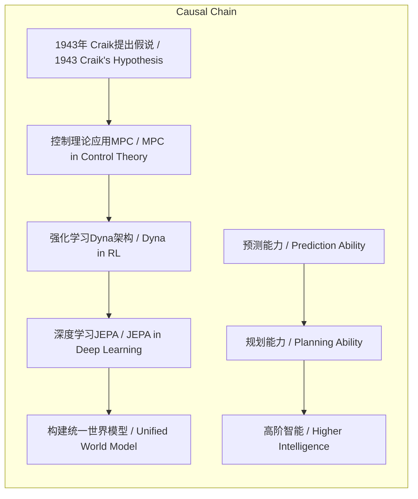

# NEWS/NEWS 任务报告

- agent: news/news
- requestId: 1774058788850-qzkm5c
- 生成时间(UTC): 2026-03-21T02:07:13.564Z

## 文本总结

# 世界模型：从生理假想到AI终局的演进史

## 整体结构化文档表达
### 文档卡片
- 主题（中文/English）：世界模型 / World Model
- 一句话摘要：访谈追溯“世界模型”概念自1943年Craik提出后，在生理学、控制理论、强化学习及深度学习中的跨学科演进，强调其作为AI长期核心目标的持续性。
- 目标读者：人工智能研究者、科技政策制定者、科技爱好者
- 核心结论（3条）：
  1. “世界模型”是历史悠久的跨学科概念，并非生成式AI爆火后的新产物。
  2. 其核心本质始终是“基于当前状态和动作预测下一个状态”，形态随技术演进而变化。
  3. 当代大模型、视频生成、机器人研究均指向构建统一的世界模型，是AI的“目的”与“终局”。

### 内容结构树
1. 背景与问题定义：澄清世界模型的历史渊源，反驳其作为新概念的流行误解。
2. 核心观点与关键证据：分四个历史阶段（生理学起源、控制理论应用、强化学习升华、深度学习复兴）论证概念的延续性。
3. 方法/机制/路径：模型预测控制（MPC）的rollout推演、Dyna架构的反应式与基于模型策略、JEPA的抽象表征预测。
4. 风险与边界条件：未提及
5. 结论与行动建议：研究者应沿着历史轨迹，持续探索统一的世界模型架构。

### 结构化元数据（JSON）
```json
{
  "title": "世界模型：从生理假想到AI终局的演进史",
  "topic_zh": "世界模型",
  "topic_en": "World Model",
  "audience": "人工智能研究者、科技政策制定者、科技爱好者",
  "claims": [
    "世界模型概念历史悠久，非生成式AI时代产物",
    "世界模型核心是预测状态变化，形态随技术演进",
    "当代AI研究殊途同归，均指向构建世界模型"
  ],
  "evidence": [
    "1943年Kenneth Craik首次提出生理学假说",
    "20世纪60-70年代控制理论应用MPC算法",
    "Richard Sutton提出Dyna架构区分策略类型",
    "Yann LeCun提出JEPA架构强调抽象表征预测"
  ],
  "risks": [],
  "actions": [
    "继续探索统一的世界模型架构",
    "在抽象表征空间进行预测而非像素重建"
  ]
}
```

## 处理流程
1. 输入识别：来源为用户提供的谢赛宁访谈文本，主题为世界模型的历史演进。
2. 信息抽取：抽取实体（Kenneth Craik、Richard Sutton、Yann LeCun）、概念（世界模型、MPC、Dyna、JEPA）、时间点（1943年、60-70年代、2022年）、核心观点（预测本质、抽象表征）。
3. 结构化归纳：按时间线定义概念发展阶段，分类为生理假说、工程应用、理论升华、架构复兴。
4. 关系建模：建立“世界模型”与各阶段技术（MPC、Dyna、JEPA）的继承与发展关系；建立“预测”与“规划”的因果链。
5. 可视化表达：使用Mermaid绘制概念演进图与因果链图。

## 概念清单（中英文）
- 世界模型 / World Model
- 生成式AI / Generative AI
- 生理学 / Physiology
- 控制理论 / Control Theory
- 强化学习 / Reinforcement Learning
- 人工智能 / Artificial Intelligence
- Kenneth Craik
- 模型预测控制 / Model Predictive Control (MPC)
- rollout
- 反应式策略 / Reactive Policy
- 基于模型的策略 / Model-based Policy
- Dyna架构 / Dyna Architecture
- Richard Sutton
- 杨立昆 / Yann LeCun
- JEPA / Joint Embedding Predictive Architecture
- 联合嵌入预测架构 / Joint Embedding Predictive Architecture
- 抽象表征空间 / Abstract Representation Space
- 大语言模型 / Large Language Model
- 视频生成模型 / Video Generation Model
- 通用机器人 / General-Purpose Robot

## 概念定义（中英文）
- 世界模型 / World Model：大脑或AI内部用于基于当前状态和动作预测未来状态的模型，核心功能是预知动作后果以指导决策。
- 生成式AI / Generative AI：以生成新内容为特征的AI技术，如大语言模型、视频生成模型。
- 生理学 / Physiology：研究生物体功能的科学，Craik在此领域提出世界模型假说。
- 控制理论 / Control Theory：工程学科，研究如何使系统按预期行为运行，MPC是其应用。
- 强化学习 / Reinforcement Learning：AI范式，智能体通过与环境交互学习最优策略，分为基于模型与反应式。
- 人工智能 / Artificial Intelligence：使机器模拟人类智能的学科与技术领域。
- Kenneth Craik：苏格兰生理学家和哲学家，1943年首次提出世界模型概念。
- 模型预测控制 / Model Predictive Control (MPC)：控制理论算法，通过内部模型rollout动作序列并选择最优动作。
- rollout：在MPC或规划中，指使用模型推演未来状态序列的过程。
- 反应式策略 / Reactive Policy：无需模型推演，依赖直接映射（如肌肉记忆）的快速决策策略。
- 基于模型的策略 / Model-based Policy：依赖世界模型进行规划与预测的决策策略。
- Dyna架构 / Dyna Architecture：Richard Sutton提出的强化学习架构，整合学习、规划与世界模型。
- Richard Sutton：强化学习之父，提出Dyna架构。
- 杨立昆 / Yann LeCun：图灵奖得主，世界模型倡导者，提出JEPA架构。
- JEPA / Joint Embedding Predictive Architecture：联合嵌入预测架构，在抽象表征空间进行预测的世界模型实现。
- 联合嵌入预测架构 / Joint Embedding Predictive Architecture：同JEPA，强调非像素级重建的抽象预测。
- 抽象表征空间 / Abstract Representation Space：数据的高层次、压缩特征空间，JEPA在此进行预测。
- 大语言模型 / Large Language Model：基于海量文本训练的生成式AI模型。
- 视频生成模型 / Video Generation Model：生成视频序列的生成式AI模型。
- 通用机器人 / General-Purpose Robot：能执行多种物理任务的机器人系统。

## 概念关联与逻辑关系（中英文）
1. 世界模型 / World Model 的核心功能是预测下一个状态 / Predict Next State：f(s_t, a_t) → s_{t+1}，其中s为状态，a为动作。
2. 模型预测控制 / MPC 依赖 世界模型 / World Model 进行 rollout 推演以选择最优动作：MPC(World Model) → Optimal Action。
3. Dyna架构 / Dyna Architecture 整合了 反应式策略 / Reactive Policy 与 基于模型的策略 / Model-based Policy，后者依赖 世界模型 / World Model 进行规划：Dyna = Reactive Policy ⊕ Model-based Policy(World Model)。

## COT逻辑梳理（定义/分类/比较/因果/科学方法论）
- Step 1（定义）：世界模型被定义为一种内部机制，用于根据当前状态和动作预测未来状态，以指导决策（源自Craik的生理学假说）。
- Step 2（分类）：在强化学习中，决策策略分为反应式（快思考、无模型）与基于模型（慢思考、需规划），后者直接依赖世界模型。
- Step 3（比较）：反应式策略效率高但能力有限；基于模型策略能进行长期规划，实现更高阶智能，但计算成本高。
- Step 4（因果）：世界模型的存在使能规划能力，进而使智能体能够执行复杂、目标导向的任务（如送探测器上月球、自主机器人操作）。
- Step 5（科学方法论）：从假说（Craik）到工程验证（MPC）再到理论框架（Dyna）和现代架构（JEPA），体现了科学方法论中“提出概念-应用验证-理论升华-技术复兴”的演进路径。

## 事实与看法（病毒）
### 事实
- 1943年，Kenneth Craik首次提出世界模型概念。
- 20世纪60-70年代，控制理论在工程问题中应用世界模型思想，发展出MPC算法。
- Richard Sutton发表论文《Dyna》，提出反应式与基于模型策略的区分。
- 2022年，Yann LeCun发表论文《通向自主机器智能之路》，提出JEPA架构。
- JEPA的核心是在抽象表征空间进行预测，而非重建像素细节。
### 看法
- 谢赛宁认为世界模型从来不是单一算法，而是AI领域的“目的”与“终局”。
- 谢赛宁认为Yann LeCun多年前就持续倡导世界模型，非因近期流行。
- 谢赛宁认为当前大模型、视频生成、机器人研究都在殊途同归地构建世界模型。

## FAQ（原文问题整理）
- 未发现原文中明确提出的提问。访谈内容为陈述性论述，未包含直接问题。

## Visualization
### Mermaid 图 1（概念结构图）


### Mermaid 图 2（逻辑/因果图）


## 文章中的类比
- 未发现明确类比。

## 10个金句
1. “世界模型”并不是在最近生成式AI爆火后才诞生的新概念。
2. 它的历史渊源极其深厚，贯穿了生理学、控制理论、强化学习以及当代人工智能的发展脉络。
3. 人的大脑中天然存在着这样一个“世界模型”，它的作用是让人们能够预知自身动作带来的后果。
4. 这奠定了世界模型“基于当前状态和动作来预测下一个状态”的核心本质。
5. 机器需要不断地推演（rollout）接下来的动作序列，并用内部的“模型”去预测每一个动作会导致的系统状态。
6. 反应式策略类似于人类开车熟练后的肌肉记忆或“快思考”。
7. 基于模型的策略需要依赖一个足够强大的“世界模型”来进行规划，这也是机器实现更高阶智能的关键。
8. 真正的世界模型不应该去死记硬背或重建物理世界中庞杂的像素细节，而是必须在一个抽象的表征空间里面去做预测。
9. 世界模型在历史长河中虽然变幻了不同的形态，但它从来都不是一种单一的算法或技术路线。
10. 研究者们实际上都在殊途同归地沿着历史的轨迹，向着构建一个真正能够理解、推理并预测物理世界的“世界模型”进发。
