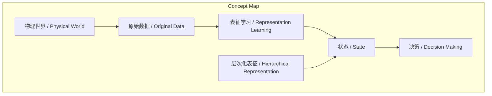
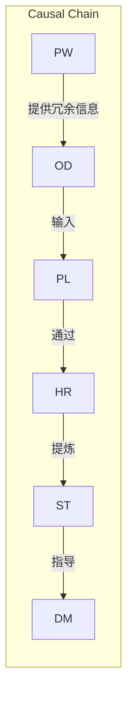

# NEWS/NEWS 任务报告

- agent: news/news
- requestId: 1774058896338-8ofpc2
- 生成时间(UTC): 2026-03-21T02:09:15.844Z

## 文本总结

# 状态与表征学习的内在联系

## 整体结构化文档表达
### 文档卡片
- 主题（中文/English）：状态与表征学习的关系 / Relationship between State and Representation Learning
- 一句话摘要：状态是决策所需的最小有效信息集合，而表征学习是从物理世界中提取该状态的底层方法，通过层次化表征实现抽象过滤。
- 目标读者：人工智能研究者、机器学习工程师、认知科学学者
- 核心结论（3条）：
  1. 状态是服务于决策的提纯信息集合。
  2. 表征学习是获取状态的根本途径。
  3. 层次化表征是实现从原始数据到状态抽象跨越的关键机制。

### 内容结构树
1. 背景与问题定义：在构建世界模型时，需定义状态以描述环境，但物理世界信息冗余，如何提取有效状态是核心问题。
2. 核心观点与关键证据：状态本质是最小有效信息；表征学习是提取状态的映射机制；层次化表征实现抽象过滤。
3. 方法/机制/路径：通过构建层次化表征，逐层过滤噪音，最终提炼状态。
4. 风险与边界条件：未提及
5. 结论与行动建议：状态是预测规划所需提纯信息，表征学习是凝练状态的根本方法。

### 结构化元数据（JSON）
```json
{
  "title": "状态与表征学习的内在联系",
  "topic_zh": "状态与表征学习的关系",
  "topic_en": "Relationship between State and Representation Learning",
  "audience": "人工智能研究者、机器学习工程师、认知科学学者",
  "claims": [
    "状态是服务于决策的提纯信息集合",
    "表征学习是获取状态的根本途径",
    "层次化表征是实现抽象跨越的关键机制"
  ],
  "evidence": [
    "状态被定义为能够描述系统且包含最小必要信息的信息源",
    "表征学习学习映射机制，将原始数据转化为反映状态的结构化信息",
    "通过层次化表征，系统像过滤器一样迭代提纯信息"
  ],
  "risks": [],
  "actions": []
}
```

## 处理流程
1. 输入识别：识别出谢赛宁关于状态与表征学习关系的论述文本。
2. 信息抽取：抽取核心概念（状态、表征学习、层次化表征等）、问题（从冗余物理世界提取状态）、观点（两者存在内在联系）。
3. 结构化归纳：将内容归纳为状态定义、表征学习作用、机制路径等模块。
4. 关系建模：建立表征学习→状态、层次化表征→状态、状态→决策的逻辑关系。
5. 可视化表达：设计Mermaid图展示概念结构与因果链。

## 概念清单（中英文）
- 状态 / State
- 表征学习 / Representation Learning
- 世界模型 / World Model
- 智能体 / Agent
- 决策 / Decision Making
- 层次化表征 / Hierarchical Representation
- 物理世界 / Physical World

## 概念定义（中英文）
- 状态 / State：在构建世界模型的语境下，指能够描述一个系统或环境、且包含足够多（或最小）必要信息的信息源，是被高度提纯的、仅保留对当前决策真正有用信息的核心刻画。
- 表征学习 / Representation Learning：学习一种映射机制，将极其复杂的原始数据转化为能够直接反映系统“状态”的结构化信息的过程。
- 世界模型 / World Model：输入中提及为构建状态的语境，但未提供独立定义。
- 智能体 / Agent：执行特定任务的实体（基于输入上下文推断）。
- 决策 / Decision Making：智能体基于状态信息选择行动的过程（基于输入上下文推断）。
- 层次化表征 / Hierarchical Representation：通过构建层次化表征，一层一层地对海量信息进行迭代和提纯，使表征越来越抽象、泛化，最终提炼出状态。
- 物理世界 / Physical World：包含极其庞杂细节（如纹理、光照、分子碰撞）的现实环境。

## 概念关联与逻辑关系（中英文）
- 表征学习 / Representation Learning 与 层次化表征 / Hierarchical Representation 共同影响 状态 / State 的提取。
- 状态 / State 直接服务于 决策 / Decision Making。
- 物理世界 / Physical World 通过提供冗余原始数据，促使 表征学习 / Representation Learning 进行过滤与抽象。

## COT逻辑梳理（定义/分类/比较/因果/科学方法论）
Step 1: 定义状态 - 输入明确状态是服务于决策的“最小有效信息集合”，属于信息抽象范畴。
Step 2: 定义表征学习 - 输入明确其是学习映射机制的过程，属于方法技术范畴。
Step 3: 分类与比较 - 状态是目标（提纯信息），表征学习是手段（映射机制），二者分属不同类别但紧密关联。
Step 4: 因果分析 - 因物理世界冗余，果需表征学习提取状态；表征学习通过层次化表征实现因果链。
Step 5: 科学方法论 - 采用层次化抽象（逐层过滤）作为科学方法，从原始数据到状态进行可验证的转化。

## 事实与看法（病毒）
### 事实
- 状态被定义为能够描述系统且包含最小必要信息的信息源。
- 表征学习的核心目的是学习映射机制，将复杂原始数据转化为结构化信息。
- 层次化表征通过多层迭代提纯信息，使表征更抽象、泛化。
- 状态是智能体进行预测和规划所必须掌握的提纯信息。
- 表征学习是系统过滤物理噪音、凝练状态的根本方法。

### 看法
- 状态与表征学习之间存在直接且深刻的内在联系。
- 状态是“被高度提纯的、仅保留对当前决策真正有用信息的核心刻画”。
- 表征学习通过构建层次化表征完成从原始数据到抽象状态的转化。

## FAQ（原文问题整理）
未发现明确提问。

## Visualization
### Mermaid 图 1（概念结构图）

### Mermaid 图 2（逻辑/因果图）


## 文章中的类比
未发现明确类比。

## 10个金句
1. “状态（State）的本质：服务于决策的‘最小有效信息集合’”
2. “状态”是一个被高度提纯的、仅保留对当前决策真正有用信息的核心刻画。
3. 表征学习的核心目的，就是学习一种映射机制，将极其复杂的原始数据，转化为能够直接反映系统“状态”的结构化信息。
4. 表征学习是获取“状态”的底层途径。
5. 表征学习通过构建“层次化的表征（Hierarchical representation）”来完成从原始数据到抽象状态的转化。
6. 在这个过程中，系统像过滤器一样，一层一层地对海量信息进行迭代和提纯。
7. 表征变得越来越抽象、越来越具备泛化能力。
8. 最终提炼出对智能体的行动决策（decision making）最具有指导意义和价值的“状态”。
9. “状态”是智能体为了在物理世界中进行预测和规划所必须掌握的提纯信息。
10. “表征学习”则是系统过滤海量物理噪音、完成抽象跨越并最终凝练出这一“状态”的根本方法。
