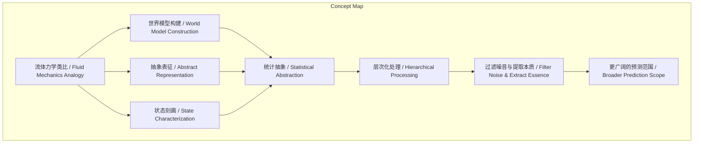
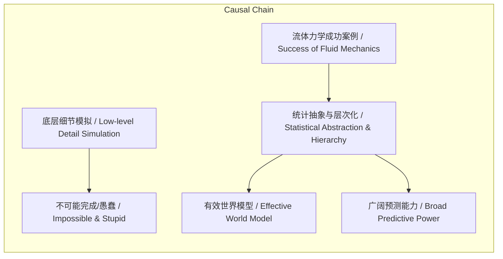

# NEWS/NEWS 任务报告

- agent: news/news
- requestId: 1774076074449-mxcma9
- 生成时间(UTC): 2026-03-21T06:55:22.792Z

## 文本总结

# 流体力学类比揭示AI世界模型抽象本质

## 整体结构化文档表达
### 文档卡片
- 主题（中文/English）：人工智能世界模型构建方法论 / AI World Model Construction Methodology
- 一句话摘要：谢赛宁通过流体力学类比，阐述构建有效人工智能世界模型的核心在于统计意义上的高度抽象与层次化提炼，而非对物理细节的无限模拟。
- 目标读者：人工智能研究者、工程师、科技政策制定者及对AI哲学与基础理论感兴趣的人群。
- 核心结论（3条）：
    1.  避免陷入底层细节的模拟是构建有效物理模型（及AI世界模型）的前提。
    2.  在统计意义上进行高度抽象，是刻画宏观系统规律、实现有效预测的关键。
    3.  模型的抽象层次越高，其能够有效刻画和预测的世界范围就越广阔。

### 内容结构树
1.  **背景与问题定义**：如何构建真正的人工智能“世界模型”？是模拟无限细节还是进行有效抽象？
2.  **核心观点与关键证据**：以流体力学为类比，提出三层核心意义：拒绝底层细节泥潭、依赖统计抽象、抽象带来更广阔预测。
3.  **方法/机制/路径**：通过层次化的方式，从底层信息逐层向上提取有用特征，过滤噪音，最终形成对物理规律的高度抽象表征。
4.  **风险与边界条件**：未提及明确风险与边界条件。
5.  **结论与行动建议**：真正的智能体（世界模型）应具备在宏观、统计意义上对物理规律进行高度抽象与提炼的能力，而非死记硬背细节。

### 结构化元数据（JSON）
```json
{
  "title": "流体力学类比揭示AI世界模型抽象本质",
  "topic_zh": "人工智能世界模型构建方法论",
  "topic_en": "AI World Model Construction Methodology",
  "audience": "人工智能研究者、工程师、科技政策制定者及对AI哲学与基础理论感兴趣的人群",
  "claims": [
    "避免陷入底层细节的模拟是构建有效物理模型（及AI世界模型）的前提。",
    "在统计意义上进行高度抽象，是刻画宏观系统规律、实现有效预测的关键。",
    "模型的抽象层次越高，其能够有效刻画和预测的世界范围就越广阔。"
  ],
  "evidence": [
    "以飞机引擎建模为例，从分子碰撞底层模拟是‘完全愚蠢的方法’与不可能完成的任务。",
    "流体力学及Navier-Stokes方程诞生于对分子运动的统计抽象，而非死记硬背轨迹。",
    "抽象过程对应‘表征学习’核心目的：过滤噪音与提取本质，使系统能刻画更广阔世界。"
  ],
  "risks": [],
  "actions": []
}
```

## 处理流程
1.  **输入识别**：来源为用户提供的关于谢赛宁访谈中“流体力学”类比的文本描述。
2.  **信息抽取**：抽取实体（谢赛宁、流体力学、Navier-Stokes方程、飞机引擎）、概念（世界模型、抽象表征、状态刻画、统计抽象、表征学习）、观点（拒绝细节泥潭、越抽象越广阔）及事实（类比使用、具体例子）。
3.  **结构化归纳**：将类比意义归纳为“拒绝细节”、“统计抽象”、“抽象广度”三个层次，并关联至AI世界模型构建的核心方法论。
4.  **关系建模**：建立“流体力学类比”与“AI世界模型抽象必要性”之间的解释关系；“统计抽象”与“预测范围广阔”之间的正相关关系。
5.  **可视化表达**：使用Mermaid绘制概念关联图与逻辑因果链。

## 概念清单（中英文）
- 谢赛宁 / (姓氏，原文未提供英文名)
- 流体力学 / Fluid Mechanics
- 人工智能 / Artificial Intelligence
- 世界模型 / World Model
- 抽象表征 / Abstract Representation
- 状态刻画 / State Characterization
- 飞机引擎建模 / Aircraft Engine Modeling
- 分子碰撞 / Molecular Collision
- 统计意义 / Statistical Sense
- Navier-Stokes方程 / Navier-Stokes Equations
- 表征学习 / Representation Learning
- 噪音过滤 / Noise Filtering
- 本质提取 / Essence Extraction
- 层次化 / Hierarchical
- 宏观 / Macroscopic
- 物理规律 / Physical Laws

## 概念定义（中英文）
- **流体力学 / Fluid Mechanics**：文中指通过统计抽象方法研究流体宏观运动规律的物理学分支，是类比的核心来源。
- **世界模型 / World Model**：文中指人工智能系统内部对物理世界进行表示和预测的模型，其核心能力在于抽象与预测。
- **抽象表征 / Abstract Representation**：文中指从具体、高维的底层信息中提炼出简洁、本质的、可用于推理和预测的中间层表示。
- **状态刻画 / State Characterization**：文中指对系统（如物理世界）当前状况的描述，是世界模型需要完成的基础任务之一。
- **统计意义 / Statistical Sense**：文中指不关注个体微观事件（如单个分子碰撞），而关注整体系统在概率和平均意义上的行为与规律。
- **Navier-Stokes方程 / Navier-Stokes Equations**：文中指流体力学中描述流体运动的核心偏微分方程，是统计抽象成果的典范。
- **表征学习 / Representation Learning**：文中指深度学习中层自动学习有用数据表示的过程，其目的被类比为“过滤噪音与提取本质”。
- **层次化 / Hierarchical**：文中指信息处理过程中，从低级到高级、从具体到抽象逐层递进的组织方式。

## 概念关联与逻辑关系（中英文）
1.  **流体力学类比 / Fluid Mechanics Analogy** 用于 **说明 / Illustrate** **世界模型构建的核心 / Core of World Model Construction**，即 **抽象表征 / Abstract Representation** 与 **状态刻画 / State Characterization** 的 **重要性 / Importance**。
2.  **统计抽象 / Statistical Abstraction** 是 **实现 / Achieving** **宏观规律刻画 / Macroscopic Law Characterization** 的 **方法 / Method**，并 **导致 / Leads to** **更广阔的预测范围 / Broader Prediction Scope**。
3.  **层次化抽象过程 / Hierarchical Abstraction Process** **对应 / Corresponds to** **表征学习 / Representation Learning** 的 **核心目的 / Core Purpose**，即 **过滤噪音 / Filtering Noise** 与 **提取本质 / Extracting Essence**。

## COT逻辑梳理（定义/分类/比较/因果/科学方法论）
- **Step 1 (定义问题)**：构建真正人工智能“世界模型”的根本挑战是什么？是追求物理细节的无限复现，还是获取可泛化的规律性认知？
- **Step 2 (提出类比)**：谢赛宁引入 **流体力学 / Fluid Mechanics** 作为跨领域类比，因其在物理学中成功解决了类似问题。
- **Step 3 (分析类比，分类意义)**：类比意义分为三层：① **方法论拒绝**：反对底层细节模拟（如分子碰撞）；② **核心机制**：依赖 **统计意义 / Statistical Sense** 上的抽象（如Navier-Stokes方程）；③ **效果比较**：抽象层次越高，模型 **预测范围 / Prediction Scope** 越广阔。
- **Step 4 (归纳与因果)**：通过类比比较，得出 **因果 / Causality**：**层次化统计抽象 / Hierarchical Statistical Abstraction** 是 **世界模型有效性的关键原因 / Key Cause for World Model Efficacy**，而死记硬背细节是无效的。
- **Step 5 (科学方法论)**：这体现了 **科学建模的普遍方法论 / General Methodology of Scientific Modeling**——从复杂系统中剥离无关细节，抓住支配宏观行为的少数关键变量与规律。

## 事实与看法（病毒）
### 事实
- 谢赛宁在访谈中使用了“流体力学”作为类比。
- 类比用于解释构建人工智能“世界模型”时“抽象表征”与“状态刻画”的意义。
- 以飞机引擎建模为例，指出从分子碰撞底层模拟是“不可能完成的”和“完全愚蠢的方法”。
- 流体力学和Navier-Stokes方程是建立在统计抽象基础上。
- 文中将类比过程与深度学习中的“表征学习”目的相联系。
### 看法
- 从底层模拟是“完全愚蠢的方法（totally stupid way）”。
- “越抽象，能刻画的世界越广阔”。
- 一个强大的世界模型“必须像流体力学抽象分子运动一样”工作。
- 智能体“不应是对物理世界无限细节的死记硬背，而应该是……高度抽象与提炼的能力”。

## FAQ（原文问题整理）
- **问题：构建真正的人工智能世界模型，应该从何处着手？是模拟细节还是进行抽象？**
    - **回答**：应进行抽象。谢赛宁以流体力学类比说明，应拒绝陷入底层细节（如模拟每个分子），转而追求在统计意义上的高度抽象与层次化提炼，这样才能有效刻画和预测广阔的世界。

## Visualization
### Mermaid 图 1（概念结构图）


### Mermaid 图 2（逻辑/因果图）


## 文章中的类比
- 流体力学 / Fluid Mechanics：用于类比人工智能世界模型的构建方法，强调统计抽象与层次化提炼优于细节模拟。

## 10个金句
1.  拒绝陷入底层细节的泥潭。
2.  如果从最底层的视角出发，去模拟空气中10的十几次方个分子的每一次碰撞，这将是一个不可能完成的，也是一种“完全愚蠢的方法（totally stupid way）”。
3.  人类没有选择去死记硬背每一个分子的运动轨迹，而是选择在统计的意义上去研究和刻画整个系统。
4.  正是基于这种高维度的统计与抽象，才诞生了流体力学以及经典的Navier-Stokes方程。
5.  流体力学的演进过程完美对应了深度学习中“表征学习”的核心目的：过滤噪音与提取本质。
6.  一个真正强大的世界模型，不需要精细到去刻画物理世界里的每一个微小像素或分子。
7.  它必须像流体力学抽象分子运动一样，通过层次化的方式一层层向上提取有用的信息。
8.  系统变得越来越抽象之后，它能够有效刻画和预测的世界反而变得越来越广阔。
9.  真正的智能体（或世界模型）不应是对物理世界无限细节的死记硬背。
10. 应该是在宏观、统计意义上对物理规律进行高度抽象与提炼的能力。
