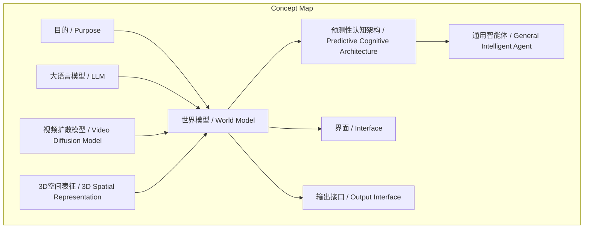
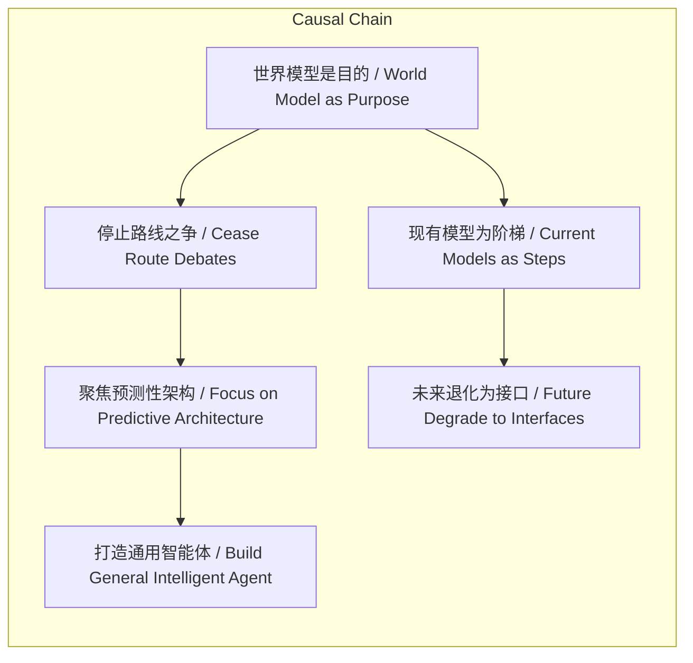

# NEWS/NEWS 任务报告

- agent: news/news
- requestId: 1774077047236-r36tmr
- 生成时间(UTC): 2026-03-21T07:12:25.465Z

## 文本总结

# 世界模型：AI发展的终极目的

## 整体结构化文档表达
### 文档卡片
- 主题（中文/English）：世界模型 / World Model
- 一句话摘要：谢赛宁提出世界模型是AI发展的终极目的而非具体算法，强调当前技术路线争论是暂时的，最终殊途同归，目标是打造预测性认知架构。
- 目标读者：AI研究者、科技政策制定者、科技爱好者
- 核心结论（3条）：
  1. 世界模型是人工智能发展的终极目标，而非某一具体算法或技术路线。
  2. 当前关于世界模型具体形态的争论是阶段性的，所有技术路径最终将殊途同归。
  3. 世界模型的实质是为通用智能体构建底层的预测性认知架构，具备理解、推理与规划能力。

### 内容结构树
1. 背景与问题定义：AI领域对世界模型的定义存在分歧，争论何种技术路线代表真正的世界模型。
2. 核心观点与关键证据：谢赛宁的核心观点是世界模型是“目的”而非“算法”。证据包括：所有AI研究（LLM、视频扩散、3D表征）都在通往此目标；现有模型是阶梯；目的是打造预测性大脑。
3. 方法/机制/路径：通过多样化的技术探索（如大语言模型、视频生成、3D建模）共同推进，最终融合为统一的预测性认知架构。
4. 风险与边界条件：未提及具体风险。边界条件：世界模型作为抽象目的，其具体实现形态尚未明确。
5. 结论与行动建议：结论：应超越技术路线之争，聚焦于构建底层预测性认知架构。行动建议：研发资源应投向通用智能体的基础认知能力，而非单一模型优化。

### 结构化元数据（JSON）
```json
{
  "title": "世界模型：AI发展的终极目的",
  "topic_zh": "世界模型",
  "topic_en": "World Model",
  "audience": "AI研究者、科技政策制定者、科技爱好者",
  "claims": [
    "世界模型是人工智能发展的终极目标，而非某一具体算法或技术路线。",
    "当前关于世界模型具体形态的争论是阶段性的，所有技术路径最终将殊途同归。",
    "世界模型的实质是为通用智能体构建底层的预测性认知架构，具备理解、推理与规划能力。"
  ],
  "evidence": [
    "谢赛宁明确指出世界模型不应该被定义为某一种具体的算法或特定的技术路线。",
    "所有AI研究者（LLM、视频扩散模型、3D空间表征）都在通往世界模型的道路上前进。",
    "现有模型（如视频生成模型）是通向终极目标的雏形或阶梯。",
    "世界模型的目的是打造底层的预测性大脑，需要理解物理世界、联想记忆、反事实推理、行为规划和安全可控。"
  ],
  "risks": ["未提及"],
  "actions": [
    "停止对具体技术路线的无谓争论，接受殊途同归的演进路径。",
    "将研发重点转向构建通用智能体的底层预测性认知架构。",
    "认识到当前大模型可能未来退化为世界模型的交互接口。"
  ]
}
```

## 处理流程
1. 输入识别：识别用户输入为谢赛宁关于“世界模型”的论述文本。
2. 信息抽取：抽取实体（世界模型、算法、目的等）、概念（预测性认知架构等）、问题（世界模型定义之争）、事实（谢赛宁观点、技术路线列举）、观点（最深刻、可能可笑等）。
3. 结构化归纳：将内容归纳为背景、核心观点、方法、风险、结论等维度。
4. 关系建模：建立“世界模型”作为“目的”与各技术路径、预测性架构等概念间的逻辑关系。
5. 可视化表达：基于概念和逻辑关系生成Mermaid图。

## 概念清单（中英文）
- 世界模型 / World Model
- 算法 / Algorithm
- 目的 / Purpose
- 人工智能 / Artificial Intelligence
- 大语言模型 / Large Language Model (LLM)
- 视频扩散模型 / Video Diffusion Model
- 3D空间表征 / 3D Spatial Representation
- 预测性认知架构 / Predictive Cognitive Architecture
- 通用智能体 / General Intelligent Agent
- 反事实推理 / Counterfactual Reasoning
- 行为规划 / Behavioral Planning
- 安全可控 / Safety and Controllability
- 底层表征 / Underlying Representation
- 通用认知基座 / General Cognitive Foundation
- 界面 / Interface
- 输出接口 / Output Interface

## 概念定义（中英文）
- 世界模型 / World Model：在文中指人工智能发展的终极目标，是一个能理解真实世界、进行预测和推理的完整认知系统，而非具体算法。
- 算法 / Algorithm：文中与“目的”相对，指具体的技术实现方法或路线。
- 目的 / Purpose：文中指人工智能领域共同追求的终极目标或方向。
- 人工智能 / Artificial Intelligence：文中指研发智能机器的领域。
- 大语言模型 / Large Language Model (LLM)：一种基于语言数据的AI模型，文中作为通往世界模型的一条路径。
- 视频扩散模型 / Video Diffusion Model：一种生成视频的AI模型（如Sora、Seedance），文中作为比LLM更进一步的路径。
- 3D空间表征 / 3D Spatial Representation：对三维空间的建模方法（如Gaussian Splatting），文中作为探索路径之一。
- 预测性认知架构 / Predictive Cognitive Architecture：世界模型的实质，为通用智能体打造的底层大脑，具备预测、理解、推理等能力。
- 通用智能体 / General Intelligent Agent：能执行广泛任务的智能体，世界模型旨在为其提供认知基础。
- 反事实推理 / Counterfactual Reasoning：对未发生情况的推理能力，世界模型需要具备。
- 行为规划 / Behavioral Planning：规划行动的能力，世界模型需要具备。
- 安全可控 / Safety and Controllability：在决策层面原生具备的能力，世界模型需要具备。
- 底层表征 / Underlying Representation：世界模型作为通用认知基座的基础表示。
- 通用认知基座 / General Cognitive Foundation：世界模型抵达后形成的统一底层架构。
- 界面 / Interface：世界模型与人类交互的前端。
- 输出接口 / Output Interface：世界模型输出信息给人类的通道。

## 概念关联与逻辑关系（中英文）
- 世界模型 / World Model 是 目的 / Purpose，而非 算法 / Algorithm。
- 大语言模型 / LLM、视频扩散模型 / Video Diffusion Model、3D空间表征 / 3D Spatial Representation 都是通往 世界模型 / World Model 的路径。
- 世界模型 / World Model 的实质是 预测性认知架构 / Predictive Cognitive Architecture，旨在支持 通用智能体 / General Intelligent Agent。

形式化关系：
1. World Model ≡ Purpose (世界模型 ≡ 目的)
2. ∀path ∈ {LLM, Video Diffusion, 3D Representation} : path → World Model (所有路径指向世界模型)
3. World Model → Predictive Cognitive Architecture (世界模型蕴含预测性认知架构)

## COT逻辑梳理（定义/分类/比较/因果/科学方法论）
Step 1: 定义核心概念。谢赛宁定义“世界模型”为AI发展的“目的”，而非“算法”，这重构了讨论框架。
Step 2: 分类当前技术路线。将LLM、视频扩散模型、3D表征等分类为不同的探索路径。
Step 3: 比较这些路径。指出它们虽不同，但都服务于同一目的，因此争论是暂时的。
Step 4: 建立因果关系。因为世界模型是目的，所以当前路线之争无意义；因为要打造预测性大脑，所以需要底层架构。
Step 5: 科学方法论。通过实证研究不同路径，逐步逼近世界模型，最终收敛到统一架构，体现科学探索的累积性和收敛性。

## 事实与看法（病毒）
### 事实
- 谢赛宁提出“世界模型不是一个算法，它是一个目的”。
- 当前AI研究包括大语言模型、视频扩散模型（如Sora、Seedance）、3D空间表征（如Gaussian Splatting）。
- 视频生成模型比大语言模型更进一部，开始对高维像素和物理现象建模。
- 世界模型的目的是打造底层的预测性大脑，需要理解物理世界、联想记忆、反事实推理、行为规划和安全可控。
- 未来大语言模型或视频生成模型可能退化为世界模型的界面或输出接口。

### 看法
- “这句话突破了技术圈对概念的狭隘定义”。
- “其核心内涵可以从以下几个维度来深入理解”。
- “世界模型是AI发展的终局”。
- “当前业内关于‘到底什么才是真正的世界模型’的激烈争论在未来一两年后可能会显得有些可笑”。
- “大家其实都清楚构建一个能理解真实世界的智能体是正确的演进方向”。
- “现有的各种模型都只是通向这一终极目标的雏形或阶梯”。
- “世界模型并非为了渲染出给人类看的酷炫视频”。
- “我们正在经历一场通向智能本质的求索”。
- “将诞生一个基于强大底层表征的通用认知基座”。

## FAQ（原文问题整理）
原文未直接提问，但隐含问题：
1. 问题：世界模型是什么？
   回答：世界模型是AI发展的终极目的，是一个能理解真实世界的预测性认知架构。
2. 问题：当前关于世界模型的争论是否有意义？
   回答：争论是阶段性的，未来可能可笑，因为所有技术路径最终殊途同归。
3. 问题：世界模型的实质目标是什么？
   回答：为通用智能体打造底层的预测性大脑，具备理解、推理、规划和安全能力。
4. 问题：现有模型（如LLM、视频模型）在世界模型中的角色？
   回答：它们是通向终极目标的雏形或阶梯，未来可能退化为交互接口。

## Visualization
### Mermaid 图 1（概念结构图）


### Mermaid 图 2（逻辑/因果图）


## 文章中的类比
未发现明确类比。

## 10个金句
1. “世界模型不是一个算法，它是一个目的。”
2. “世界模型是AI发展的终局而非单一的技术路线。”
3. “当前业内关于‘到底什么才是真正的世界模型’的激烈争论在未来一两年后可能会显得有些可笑。”
4. “大家其实都清楚构建一个能理解真实世界的智能体是正确的演进方向。”
5. “现有的各种模型都只是通向这一终极目标的雏形或阶梯。”
6. “视频生成模型确实比大语言模型往前推演了一步。”
7. “世界模型并非为了渲染出给人类看的酷炫视频。”
8. “要为通用智能体打造一套底层的‘预测性大脑’。”
9. “这个大脑需要真正理解复杂的物理世界，拥有庞大的联想记忆，能够进行反事实推理与行为规划，并在决策层面上原生具备安全可控的能力。”
10. “今天的大语言模型或视频生成模型，最终可能都会退化、融合为这个‘真正的世界模型’用来与人类交流的界面或输出接口。”
