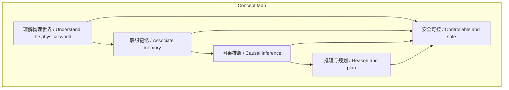
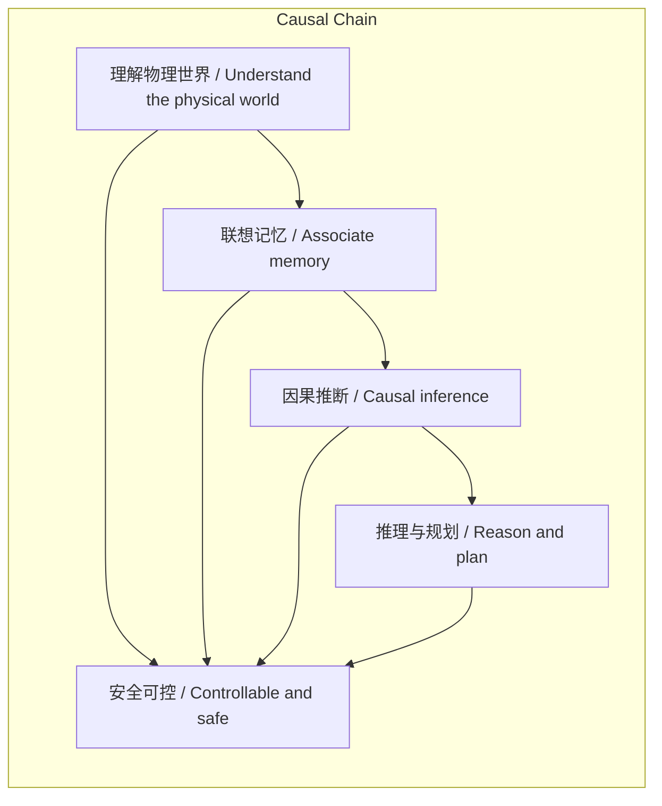

# NEWS/NEWS 任务报告

- agent: news/news
- requestId: 1774077304753-kjkg1c
- 生成时间(UTC): 2026-03-21T07:16:57.106Z

## 文本总结

# 世界模型五特征协同机制解析

## 整体结构化文档表达
- **主题（中文/English）**：世界模型 / World Model
- **一句话摘要**：谢赛宁基于Yann LeCun观点，提出世界模型需具备理解物理世界、联想记忆、推理与规划、因果推断、安全可控五大特征，并作为统一认知架构协同运作，形成内生安全的闭环预测系统。
- **目标读者**：人工智能研究者、科技政策制定者、对AI安全感兴趣的公众
- **核心结论（3条）**：
  1. 世界模型由五大特征构成统一认知架构，非孤立特征堆砌。
  2. 五大特征通过“基础底座-因果引擎-闭环预测”机制协同，实现预测性大脑。
  3. 安全可控是世界模型内生属性，源于因果推断与规划能力，无需后期对齐。

### 内容结构树
1. **背景与问题定义**：世界模型应具备哪些核心特征？特征间如何相互作用？
2. **核心观点与关键证据**：五大特征定义及协同机制，源自谢赛宁阐述与LeCun观点。
3. **方法/机制/路径**：以状态预测和控制理论为核心，特征作为认知架构分层协同。
4. **风险与边界条件**：未提及
5. **结论与行动建议**：未提及

### 结构化元数据（JSON）
```json
{
  "title": "世界模型五特征协同机制解析",
  "topic_zh": "世界模型",
  "topic_en": "World Model",
  "audience": "人工智能研究者、科技政策制定者、对AI安全感兴趣的公众",
  "claims": [
    "世界模型由理解物理世界、联想记忆、推理与规划、因果推断、安全可控五大特征构成统一认知架构",
    "五大特征通过基础底座、引擎驱动、闭环预测的机制协同运作",
    "安全可控是内生属性，不依赖后期微调"
  ],
  "evidence": [
    "谢赛宁阐述五大特征源自图灵奖得主Yann LeCun",
    "理解物理世界处理连续高维物理信号并抽象状态，联想记忆存储表征提供上下文",
    "因果推断驱动推理与规划，通过rollout预测动作序列后果",
    "机器人拿刀切菜例子：通过物理预测避免伤人，体现内生安全"
  ],
  "risks": [],
  "actions": []
}
```

## 处理流程
1. 输入识别（来源：用户输入文本）
2. 信息抽取（实体、概念、问题、事实、观点）
3. 结构化归纳（定义/分类/比较/因果/方法论）
4. 关系建模（概念关系、等式/方程/逻辑链）
5. 可视化表达（Mermaid）

## 概念清单（中英文）
- 世界模型 / World Model
- 理解物理世界 / Understand the physical world
- 联想记忆 / Associate memory
- 推理与规划 / Reason and plan
- 因果推断 / Causal inference
- 安全可控 / Controllable and safe
- Yann LeCun / Yann LeCun
- 状态 / State
- 预测 / Prediction
- 控制理论 / Control theory
- 大语言模型 / Large Language Model (LLM)
- 微调 / Fine-tuning
- 对齐 / Alignment
- 认知架构 / Cognitive architecture

## 概念定义（中英文）
- 世界模型 / World Model：未提及
- 理解物理世界 / Understand the physical world：处理连续、高维、充满噪音的真实物理信号，抽象出核心物理状态的能力。
- 联想记忆 / Associate memory：存储和关联提纯后的表征，为预测提供上下文与常识基础的机制。
- 推理与规划 / Reason and plan：基于因果推断在抽象表征空间预见未来状态，实现动作序列规划的能力。
- 因果推断 / Causal inference：掌握因果规律，进行反事实推演，预测动作后果的机制。
- 安全可控 / Controllable and safe：系统在物理世界中运作时，能自发避免危险行为，确保安全的内生属性。
- Yann LeCun / Yann LeCun：图灵奖得主，五大特征的来源之一。
- 状态 / State：物理世界的核心抽象表征，用于预测下一个状态。
- 预测 / Prediction：基于当前状态和动作预测下一个状态的过程。
- 控制理论 / Control theory：未提及
- 大语言模型 / Large Language Model (LLM)：未提及
- 微调 / Fine-tuning：未提及
- 对齐 / Alignment：未提及
- 认知架构 / Cognitive architecture：未提及

## 概念关联与逻辑关系（中英文）
1. 理解物理世界 / Understand the physical world 与 联想记忆 / Associate memory 共同构成认知基础底座，为因果推断提供土壤。
2. 因果推断 / Causal inference 驱动 推理与规划 / Reason and plan，使智能体能进行rollout预测。
3. 理解物理世界 / Understand the physical world、联想记忆 / Associate memory、因果推断 / Causal inference、推理与规划 / Reason and plan 四者有机结合，原生决定 安全可控 / Controllable and safe。

**形式化关系**：
- 基础底座 = 理解物理世界 ∧ 联想记忆
- 推理与规划 = f(因果推断, 状态预测)
- 安全可控 = g(理解物理世界, 联想记忆, 因果推断, 推理与规划)

## COT逻辑梳理（定义/分类/比较/因果/科学方法论）
- **Step 1 (定义)**：世界模型是具备五大特征（理解物理世界、联想记忆、推理与规划、因果推断、安全可控）的统一认知架构，源自Yann LeCun。
- **Step 2 (分类)**：特征功能分层——理解物理世界与联想记忆为底层基础（信号处理与记忆）；因果推断为推理引擎；推理与规划为高阶能力；安全可控为结果属性。
- **Step 3 (比较)**：对比大语言模型（LLM）——LLM安全依赖后期微调对齐，世界模型安全可控内生，源于物理预测与因果推断。
- **Step 4 (因果)**：因果链：理解物理世界抽象状态 → 联想记忆存储表征 → 因果推断掌握规律 → 推理与规划预测动作后果 → 安全可控自发避免危险。
- **Step 5 (科学方法论)**：通过状态预测和控制理论，五大特征在认知架构中协同，形成闭环预测系统，实现从感知到安全行动的端到端推理。

## 事实与看法（病毒）
### 事实
- 谢赛宁阐述了世界模型的五个核心特征。
- 五个特征源自图灵奖得主Yann LeCun。
- 理解物理世界处理连续、高维、充满噪音的真实物理信号。
- 联想记忆作为系统中间一环，存储和关联表征。
- 世界模型核心机制是基于当前状态和动作预测下一个状态。
- 机器人拿刀切菜时，通过物理预测避免伤人。
### 看法
- 五大特征作为统一认知架构协同运作。
- 因果推断是驱动推理与规划的引擎。
- 安全可控是内生的，不依赖后期微调。
- 五大特征相互作用构成闭环预测性大脑。

## FAQ（原文问题整理）
未发现明确提问。

## Visualization
### Mermaid 图 1（概念结构图）

### Mermaid 图 2（逻辑/因果图）


## 文章中的类比
未发现明确类比。

## 10个金句
1. 真正的大脑或世界模型需要具备五个核心特征。
2. 理解物理世界与联想记忆构成了认知的基础底座。
3. 记忆负责承载这些提纯后的表征，为系统的下一步预测提供必需的上下文与常识基础。
4. 因果推断是驱动推理与规划的引擎。
5. 世界模型的核心运作机制就是“基于当前状态和施加的动作，预测下一个状态”。
6. 因为掌握了因果规律，智能体可以在脑海中不断地向前推演不同的动作序列。
7. 前四者的有机结合原生决定了系统的安全可控。
8. 与大语言模型需要依赖海量数据投喂和后期微调来被动实现对齐不同，世界模型的安全可控属性是内生的。
9. 当机器人拿着刀切菜时，它不需要通过死记硬背文本规则来知道不能伤人。
10. 这五个特征的相互作用构成了一个闭环的“预测性大脑”。
