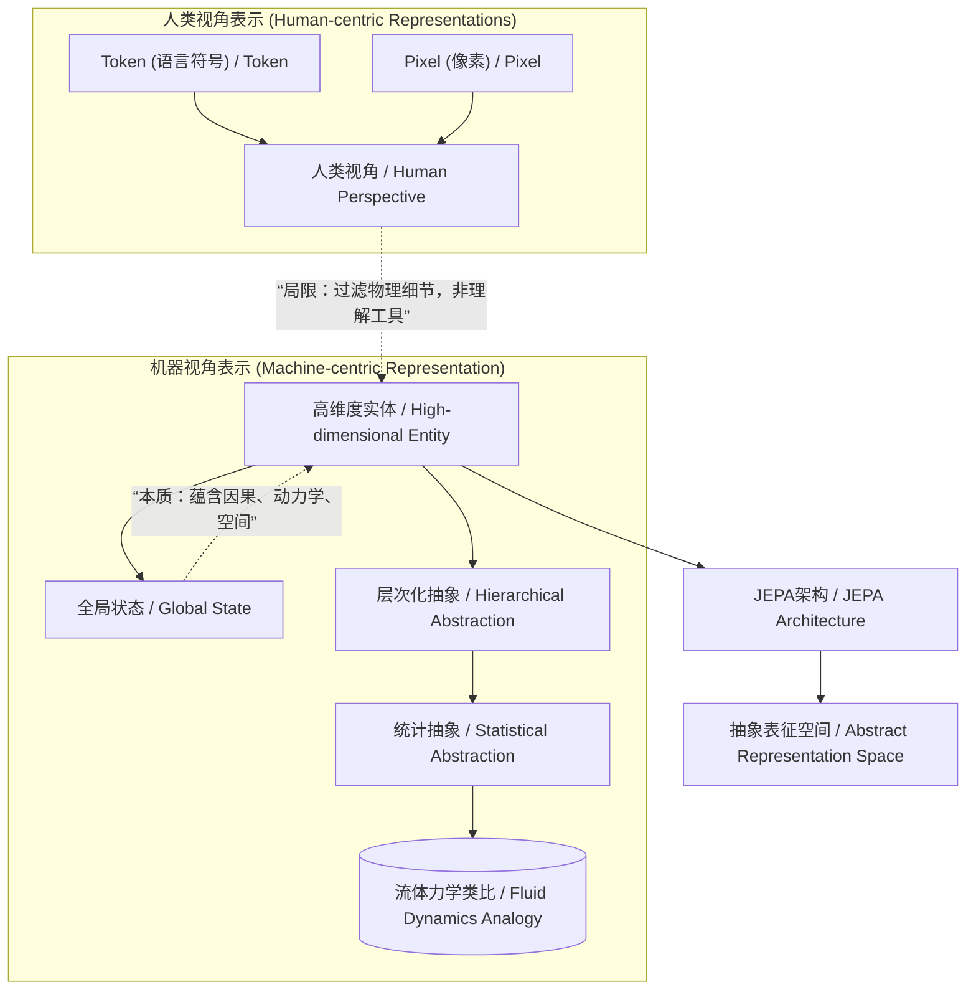
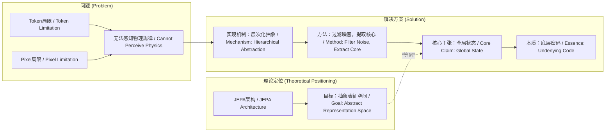

# NEWS/NEWS 任务报告

- agent: news/news
- requestId: 1774077599300-1s20d1
- 生成时间(UTC): 2026-03-21T07:21:05.297Z

## 文本总结

# 智能体高维表征：超越Token与像素的物理世界密码

## 整体结构化文档表达
### 文档卡片
- 主题（中文/English）：高维抽象表征理论 / High-dimensional Abstract Representation Theory
- 一句话摘要：谢赛宁提出，智能体内部存在一个超越人类视角的Token与像素的高维实体，它是物理世界的全局状态，通过层次化抽象形成，是机器理解世界本质的认知密码。
- 目标读者：人工智能研究者、认知科学学者、具身智能开发人员
- 核心结论（3条）：
    1.  基于Token（语言符号）或Pixel（像素）的模型本质是人类视角的交流或视觉接口工具，无法直接感知物理规律。
    2.  智能体内部的高维实体本质是物理世界的“全局状态（Global State）”，蕴含因果、动力学与空间结构。
    3.  该实体通过“层次化抽象（Hierarchical Abstraction）”机制提取，过滤噪音，保留对决策核心的抽象概念与常识。

### 内容结构树
1.  **背景与问题定义**：当前主流AI模型（LLM、视觉模型）依赖Token或Pixel，这些是人类定义的离散/规则化表示，存在固有局限。
2.  **核心观点与关键证据**：
    *   观点：高维实体非Token/Pixel。证据：Token是“高度压缩包”，过滤物理细节；Pixel是“视觉接口”，旨在讨好人类眼球。
    *   观点：高维实体是“全局状态”。证据：它超越线性时间轴的画面，刻画环境状态，蕴含底层密码。
    *   观点：存在形式为“层次化抽象”。证据：类比流体力学忽略分子细节；过滤杯子碎裂等微观噪音。
3.  **方法/机制/路径**：通过层次化抽象（Hierarchical Abstraction）从连续信号中提取统计性、宏观的抽象表征，构建“机器特有的认知密码”。
4.  **风险与边界条件**：未提及
5.  **结论与行动建议**：该理论指向杨立昆（Yann LeCun）JEPA架构追求的“抽象表征空间”，是智能体为自身理解、推理与规划而构建的内部表示。未发现明确行动建议。

### 结构化元数据（JSON）
```json
{
  "title": "智能体高维表征：超越Token与像素的物理世界密码",
  "topic_zh": "高维抽象表征理论",
  "topic_en": "High-dimensional Abstract Representation Theory",
  "audience": "人工智能研究者、认知科学学者、具身智能开发人员",
  "claims": [
    "基于Token或Pixel的模型是 human-centric 的工具，无法直接感知物理规律。",
    "智能体内部的高维实体是物理世界的‘全局状态’，蕴含因果与空间结构。",
    "该实体通过‘层次化抽象’机制提取，过滤噪音，保留核心决策信息。"
  ],
  "evidence": [
    "Token是离散语义空间中的‘高度压缩包’，过滤了真实世界的连续物理细节。",
    "Pixel是人为定义的规则网格‘视觉接口’，生成精确像素是‘讨好人类眼球’的世界模拟器。",
    "全局状态是系统刻画物理环境的‘状态’，是驱动物理世界演变的底层密码。",
    "层次化抽象类比于流体力学忽略分子碰撞细节，提取宏观统计规律。",
    "世界模型无需记住杯子碎裂的微观细节或桌面的光影纹理。"
  ],
  "risks": [],
  "actions": []
}
```

## 处理流程
1.  **输入识别**：来源为用户提供的关于谢赛宁高维表征理论的论述文本。
2.  **信息抽取**：抽取实体（Token, Pixel, 全局状态, 抽象表征空间, JEPA）、概念（层次化抽象, 统计抽象）、观点（Token/Pixel的局限性，高维实体的本质与形式）、事实（定义与类比）。
3.  **结构化归纳**：将内容归纳为“问题定义（Token/Pixel局限）-> 核心主张（全局状态）-> 实现机制（层次化抽象）”的逻辑链。
4.  **关系建模**：建立“Token/Pixel（人类视角表示）”与“高维实体（机器视角表示）”的对立关系；“层次化抽象”是生成“高维实体”的方法；“全局状态”是“高维实体”的本质。
5.  **可视化表达**：使用Mermaid绘制概念关系与因果链。

## 概念清单（中英文）
-  Token（语言符号） / Token (Linguistic Symbol)
-  Pixel（像素） / Pixel
-  高维度实体 / High-dimensional Entity
-  潜在表征（Latent Representation） / Latent Representation
-  抽象表征空间（Abstract Representation Space） / Abstract Representation Space
-  物理世界 / Physical World
-  智能体 / Agent
-  全局状态（Global State） / Global State
-  层次化抽象（Hierarchical Abstraction） / Hierarchical Abstraction
-  统计抽象 / Statistical Abstraction
-  流体力学 / Fluid Dynamics
-  JEPA架构 / JEPA Architecture
-  杨立昆（Yann LeCun） / Yann LeCun
-  世界模拟器（World Simulator） / World Simulator
-  因果关联 / Causal Correlation
-  动力学规律 / Dynamical Laws
-  三维空间的结构 / 3D Spatial Structure
-  信息过滤 / Information Filtering
-  机器特有的认知密码 / Machine-specific Cognitive Code

## 概念定义（中英文）
-  **Token（语言符号）**：存在于离散语义空间中，是人类为交流而发明的、对真实世界连续细节进行高度压缩的人造符号结构。中文定义：人类文明用于交流的离散符号包，过滤物理噪音。English: A discrete semantic symbol invented by human civilization for communication, compressing continuous physical details.
-  **Pixel（像素）**：人为定义的、给人看的规则网格接口，是视觉信息的底层显示单元。中文定义：服务于人类视觉的规则化网格表示。English: A human-defined, regular grid interface for visual display.
-  **高维度实体**：智能体大脑中用于表征物理世界的、超越Token与像素的连续高维空间结构。中文定义：机器内部构建的、非人类视角的物理世界表示。English: The continuous, high-dimensional internal representation of the physical world built by an agent.
-  **全局状态（Global State）**：系统用来刻画物理环境的状态，蕴含物体间因果关联、动力学规律及三维空间结构，是驱动世界演变的底层信息。中文定义：超越瞬时观测的、包含环境全部关键信息的整体状态。English: The holistic state of a physical system that encapsulates causal relations, dynamical laws, and spatial structure.
-  **层次化抽象（Hierarchical Abstraction）**：从连续、庞杂的原始信号中，通过逐层提取和过滤，形成从具体到抽象、从细节到核心的多级表征的过程。中文定义：逐层提炼信息、忽略噪音、保留决策相关抽象概念的机制。English: The process of forming multi-level representations by progressively extracting and filtering information from raw signals.
-  **JEPA架构**：由杨立昆提出，旨在学习“抽象表征空间”的预测式世界模型架构。中文定义：一种追求构建机器内部抽象表征的预测模型框架。English: A predictive world model architecture proposed by Yann LeCun aimed at learning an abstract representation space.
-  **世界模拟器（World Simulator）**：以生成精确像素（或逼真画面）为目标的模型，其目的是模拟人类视觉感知，而非理解世界本质。中文定义：专注于生成人类可接受视觉结果的模型，背离物理规律学习。English: A model focused on generating perceptually realistic pixels, diverging from learning underlying physical principles.

## 概念关联与逻辑关系（中英文）
1.  **对立关系**：`Token（人类语义压缩）` 与 `Pixel（人类视觉接口）` 均属于 **人类视角的表示**，而 `高维度实体（机器认知密码）` 属于 **机器视角的表示**。二者目的与本质不同。
2.  **实现关系**：`层次化抽象（Hierarchical Abstraction）` 是 **生成** `高维度实体（机器认知密码）` 的 **核心机制**。形式化：`高维度实体 = f_层次化抽象(连续信号)`。
3.  **本质关系**：`高维度实体（机器认知密码）` 的 **本质** 是 `全局状态（Global State）`。形式化：`高维度实体 ≡ 全局状态`。
4.  **目标关系**：`JEPA架构` 的 **设计目标** 是学习 `抽象表征空间（Abstract Representation Space）`，这与 `高维度实体` 是同一概念的不同表述。形式化：`JEPA的目标 = 抽象表征空间 = 高维度实体`。

## COT逻辑梳理（定义/分类/比较/因果/科学方法论）
*   **Step 1 (定义问题)**：定义当前AI模型的核心表示单元——`Token`（离散语义符号）和`Pixel`（规则网格像素），并指出其`人类视角`的局限性。
*   **Step 2 (分类与比较)**：将表示方式分为`人类视角表示`（Token/Pixel）与`机器视角表示`（待求的高维实体）。比较得出：前者是交流/显示工具，后者应是理解物理规律的内部模型。
*   **Step 3 (提出核心主张)**：主张该高维实体的本质是`全局状态`，它超越瞬时观测，包含驱动世界演变的`因果、动力学、空间结构`等底层信息。
*   **Step 4 (阐述实现机制)**：提出`层次化抽象`是实现该主张的科学方法论。通过类比`流体力学`（忽略分子细节，提取宏观规律）和`信息过滤`（忽略杯子碎裂的微观细节），说明如何从连续信号中提取核心决策信息。
*   **Step 5 (建立理论链接)**：将该理论与现有框架`JEPA`关联，确认其追求的就是同一`抽象表征空间`，从而完成从问题定义到理论定位的因果闭环。

## 事实与看法（病毒）
### 事实
-  Token存在于离散的语义空间中。
-  Token是人类为了交流而发明的精巧人造结构。
-  像素是人为定义的规则网格接口。
-  基于Token的语言模型（LLM）是一个交流工具。
-  致力于生成精确下一个像素的模型是一个“世界模拟器”。
-  全局状态蕴含物体的因果关联、动力学规律以及三维空间的结构。
-  模拟飞机动力学系统不应计算每一立方厘米内分子的精确碰撞。
-  世界模型不需要记住杯子掉在地上碎裂的每一个微观细节。
-  杨立昆（Yann LeCun）提出了JEPA架构。
-  JEPA架构追求“抽象表征空间”。

### 看法
-  Token“过滤掉了真实世界中连续的、充满物理噪音的细节”。
-  基于Token的LLM“不是一个直接感知物理规律的大脑”。
-  生成精确像素“背离了提取世界本质规律的初衷”。
-  全局状态是“真正驱动物理世界演变的底层密码”。
-  层次化抽象是“提取出统计意义上的宏观规律”。
-  世界模型在高维空间里进行“信息过滤”，提取“对智能体行动决策真正有用的抽象概念和常识”。
-  抽象表征空间是“智能系统专为了自己理解物理规律、进行因果推理和行为规划……而在内部自发构建出的一套‘机器特有的认知密码’”。

## FAQ（原文问题整理）
1.  **问：为什么这个高维度实体不能是Token或Pixel？**
    **答**：因为Token是人类视角的离散语义压缩包，过滤了物理细节，仅用于交流；Pixel是人类视角的视觉接口，追求逼真画面而非理解规律。二者均非直接感知物理世界的内部表示。
2.  **问：它到底是什么？**
    **答**：它是物理世界的“全局状态”，蕴含因果、动力学与空间结构，是驱动世界演变的底层密码。
3.  **问：它的存在形式是怎样的？**
    **答**：它以“层次化抽象”的形式存在，像流体力学忽略分子细节提取宏观规律一样，从连续信号中过滤噪音，提取对决策有用的核心抽象信息。

## Visualization
### Mermaid 图 1（概念结构图）


### Mermaid 图 2（逻辑/因果图）


## 文章中的类比
1.  **流体力学类比**：模拟飞机动力学不应计算每个分子的碰撞（愚蠢），而应像流体力学提取宏观统计规律。
2.  **杯子碎裂类比**：世界模型无需记住杯子碎裂的每一个微观细节。

## 10个金句
1.  Token是人类视角的“高度压缩包”。
2.  基于Token的语言模型只是一个交流工具，而不是直接感知物理规律的大脑。
3.  像素只是人类视角的“视觉接口”。
4.  致力于生成精确的下一个像素，本质上只是在造一个“讨好人类眼球”的世界模拟器。
5.  这个高维度的东西，就是系统用来刻画物理环境的“状态”。
6.  它蕴含了物体的因果关联、动力学规律以及三维空间的结构。
7.  是真正驱动物理世界演变的底层密码。
8.  要模拟飞机的动力学系统，绝不能去计算每一立方厘米里几百万个分子的精确碰撞。
9.  真正的世界模型不需要去记住杯子掉在地上碎裂的每一个微观细节。
10. 它是智能系统专为了自己理解物理规律、进行因果推理和行为规划，而在内部自发构建出的一套“机器特有的认知密码”。
