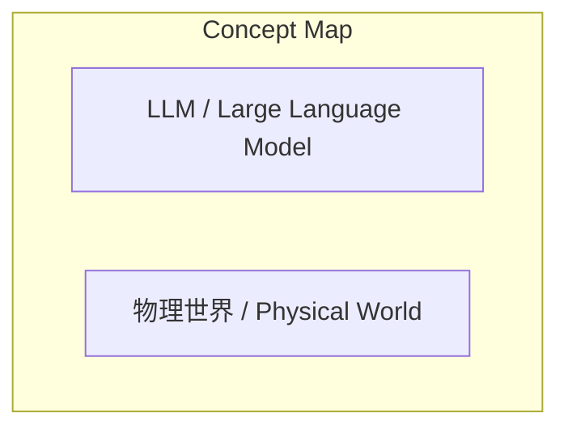
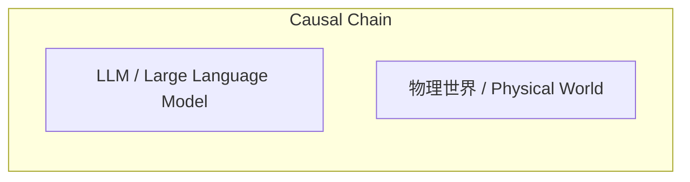

# NEWS/NEWS 任务报告

- agent: news/news
- requestId: 1774077941250-stfrdt
- 生成时间(UTC): 2026-03-21T07:28:10.000Z

## 文本总结

# 为什么说LLM在物理世界中会表现得很“傻”？

## 整体结构化文档表达
### 文档卡片
- 主题（中文/English）：未提及 / Not mentioned
- 一句话摘要：未提及
- 目标读者：未提及
- 核心结论（3条）：未发现明确结论

### 内容结构树
1. 背景与问题定义：未提及
2. 核心观点与关键证据：未提及
3. 方法/机制/路径：未提及
4. 风险与边界条件：未提及
5. 结论与行动建议：未提及

### 结构化元数据（JSON）
```json
{
  "title": "",
  "topic_zh": "",
  "topic_en": "",
  "audience": "",
  "claims": [],
  "evidence": [],
  "risks": [],
  "actions": []
}
```

## 处理流程
1. **输入识别**：用户输入为一个疑问句，核心询问LLM在物理世界表现“傻”的原因，来源为用户提问。
2. **信息抽取**：抽取实体“LLM”、“物理世界”；关键概念“傻”；问题类型为原因探究；未抽取到事实或观点。
3. **结构化归纳**：输入仅为问题，无结构化内容，无法进行定义、分类、比较、因果或方法论归纳。
4. **关系建模**：输入未提供概念间关系，无法建立等式、方程或逻辑链。
5. **可视化表达**：基于抽取的概念，生成概念结构图与逻辑因果图，但因无关系数据，图中仅显示概念节点，无连接边。

## 概念清单（中英文）
- LLM / Large Language Model
- 物理世界 / Physical World

## 概念定义（中英文）
- LLM / Large Language Model：输入未提供定义。
- 物理世界 / Physical World：输入未提供定义。

## 概念关联与逻辑关系（中英文）
- 未发现明确概念关联。

## COT逻辑梳理（定义/分类/比较/因果/科学方法论）
- 输入为疑问句，未包含定义、分类、比较、因果或科学方法论内容，无法进行链式推导。

## 事实与看法（病毒）
### 事实
- 未提及。
### 看法
- 未提及。

## FAQ（原文问题整理）
- 提问：为什么说LLM在物理世界中会表现得很“傻”？
  回答：原文未提供答案。

## Visualization
### Mermaid 图 1（概念结构图）

### Mermaid 图 2（逻辑/因果图）


## 文章中的类比
- 未发现明确类比。

## 10个金句
- 原文未提供。
