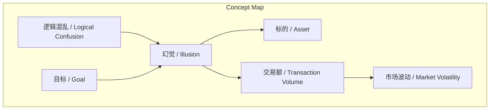
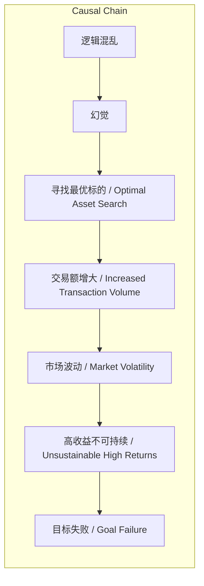

# NEWS/NEWS 任务报告

- agent: news/news
- requestId: 1774079774489-7pd5vf
- 生成时间(UTC): 2026-03-21T07:57:32.132Z

## 文本总结

# 投资幻觉：每日最优标的的致命陷阱

## 整体结构化文档表达
### 文档卡片
- **主题（中文/English）**：投资幻觉 / Investment Illusion
- **一句话摘要**：揭示投资者对“每日最优标的”的认知偏差，指出其复利计算忽略市场冲击，导致多数人陷入幻觉而无法达成目标。
- **目标读者**：投资者、金融学习者
- **核心结论（3条）**：
  1. 每日寻找涨幅最大标的是一种认知幻觉，源于逻辑混乱。
  2. 复利计算未考虑大额交易对市场造成的冲击，使高收益不可持续。
  3. 绝大多数人因活在幻觉中而难以实现重要目标。

### 内容结构树
1. **背景与问题定义**：投资者常被高收益标的吸引，产生“若有该标则收益更高”的幻觉。
2. **核心观点与关键证据**：以300天赚2.6万亿的假设说明计算脱离现实；大额交易会引发市场波动，破坏假设。
3. **方法/机制/路径**：未提及
4. **风险与边界条件**：高收益不可持续；市场冲击效应；逻辑混乱普遍存在。
5. **结论与行动建议**：需理性认知市场，避免陷入幻觉；但原文未提供具体行动建议。

### 结构化元数据（JSON）
```json
{
  "title": "投资幻觉：每日最优标的的致命陷阱",
  "topic_zh": "投资幻觉",
  "topic_en": "Investment Illusion",
  "audience": "投资者、金融学习者",
  "claims": [
    "每日寻找涨幅最大标的是一种认知幻觉，源于逻辑混乱。",
    "复利计算未考虑大额交易对市场造成的冲击，使高收益不可持续。",
    "绝大多数人因活在幻觉中而难以实现重要目标。"
  ],
  "evidence": [
    "假定每天找到涨10%的标的，300天后可赚2.6万亿。",
    "交易额变大直接引发市场波动。",
    "99%的人终身在重要事情上活在幻觉中。"
  ],
  "risks": [
    "高收益假设忽略市场冲击，不切实际。",
    "逻辑混乱导致决策失误。",
    "幻觉普遍存在，阻碍目标达成。"
  ],
  "actions": []
}
```

## 处理流程
1. **输入识别**：来源为用户提供的关于投资幻觉的文本。
2. **信息抽取**：实体包括标的、交易额、市场波动；概念包括幻觉、逻辑混乱；问题为高收益假设的可行性；事实为复利计算和市场影响；观点为幻觉普遍性。
3. **结构化归纳**：定义幻觉为认知偏差；比较复利计算与现实市场冲击；因果链为幻觉→行为→交易额→市场波动→目标失败。
4. **关系建模**：概念间存在驱动、引发、影响等关系，如幻觉驱动寻找标的行为，交易额引发市场波动。
5. **可视化表达**：使用Mermaid绘制概念结构与因果链图。

## 概念清单（中英文）
- 标的 / Asset
- 幻觉 / Illusion
- 交易额 / Transaction Volume
- 市场波动 / Market Volatility
- 逻辑混乱 / Logical Confusion
- 目标 / Goal

## 概念定义（中英文）
- **标的**：指投资中的具体资产或证券，如股票、基金等。
- **幻觉**：指投资者对市场收益的错误认知，误以为总能找到涨幅最大的投资标的。
- **交易额**：指投资交易的总金额，规模大小会影响市场。
- **市场波动**：指市场价格因交易活动而产生的剧烈变化。
- **逻辑混乱**：指在投资决策中思维不清晰，导致错误判断。
- **目标**：指投资者期望达成的财务或投资成果。

## 概念关联与逻辑关系（中英文）
1. **幻觉（Illusion）** 驱动投资者持续 **寻找最优标的（Optimal Asset Search）** 的行为。
2. **交易额（Transaction Volume）** 增大直接 **引发市场波动（Market Volatility）**。
3. **幻觉（Illusion）** 与 **逻辑混乱（Logical Confusion）** 共同 **导致目标失败（Goal Failure）**。

## COT逻辑梳理（定义/分类/比较/因果/科学方法论）
- **Step 1: 定义**：幻觉指对“每日涨幅最大标的”的错误信念，源于选择性关注高收益案例。
- **Step 2: 分类**：原文未明确分类，但可视为投资认知偏差的一种。
- **Step 3: 比较**：比较复利计算（假设每天涨10%，300天赚2.6万亿）与现实（大额交易引发市场波动，使高收益无法实现）。
- **Step 4: 因果**：幻觉 → 寻找最优标的 → 大额交易 → 市场波动 → 高收益不可持续 → 目标失败；逻辑混乱加剧幻觉。
- **Step 5: 科学方法论**：运用复利公式和市场微观结构理论检验假设，发现忽略市场冲击导致计算失效。

## 事实与看法（病毒）
### 事实
- 假定每天找到涨10%的标的，300天后可赚2.6万亿。
- 交易额变大直接引发市场波动。
### 看法
- 这是一个愚蠢的幻觉。
- 幻觉背后有好多堵不上窟窿。
- 99%脑子里终身在重要的事情上都活在幻觉之中，解释了绝大多数人都不能达成目标。

## FAQ（原文问题整理）
- 未发现明确提问。

## Visualization
### Mermaid 图 1（概念结构图）

### Mermaid 图 2（逻辑/因果图）


## 文章中的类比
- 未发现明确类比。

## 10个金句
1. 一个愚蠢的幻觉
2. 你每天都会发现总有一个标的比其他标的涨的多
3. 要是我有那个标的就好
4. 假定你每天都能找到那支涨10%的标的
5. 从一块钱开始，300天后你能赚2.6万亿
6. 而且随着你的交易额变大，你的交易直接会引发市场波动
7. 可见，幻觉背后有好多堵不上窟窿
8. 这来源于我们脑子里的逻辑混乱
9. 99%脑子里终身在重要的事情上都活在幻觉之中
10. 也是解释了绝大多数人都不能达成目标
