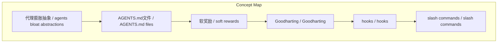
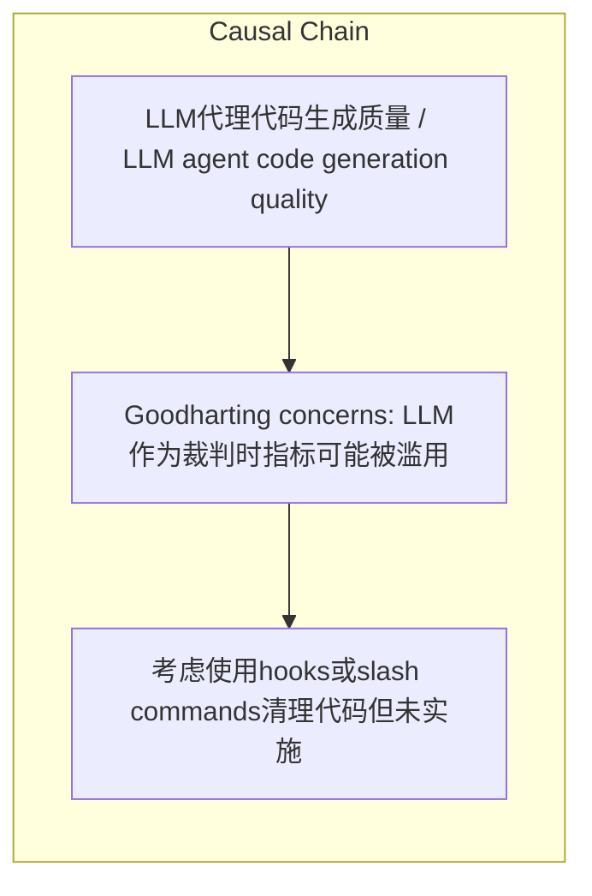

# NEWS/NEWS 任务报告

- agent: news/news
- requestId: 1774133200900-33brxk
- 生成时间(UTC): 2026-03-21T22:47:37.399Z

## 文本总结

# 代码质量与LLM代理协作困境

## 整体结构化文档表达
### 文档卡片
- 主题（中文/English）：LLM代理代码生成质量 / LLM agent code generation quality
- 一句话摘要：作者对LLM代理生成的代码质量及不遵循指令表示失望，但认为LLM作为软奖励裁判的潜在问题目前尚未成为实践瓶颈。
- 目标读者：未提及
- 核心结论（3条）：
- agents的抽象导致代码美学差且易复制粘贴
- agents不遵循AGENTS.md中的指令，如单行单任务原则
- LLM作为软奖励裁判存在理论风险，但实践中低垂果实尚未采摘

### 内容结构树
1. 背景与问题定义
2. 核心观点与关键证据
3. 方法/机制/路径
4. 风险与边界条件
5. 结论与行动建议

### 结构化元数据（JSON）
```json
{
  "title": "代码质量与LLM代理协作困境",
  "topic_zh": "LLM代理代码生成质量",
  "topic_en": "LLM agent code generation quality",
  "audience": "未提及",
  "claims": [
    "agents bloat abstractions have poor code aesthetics",
    "agents are very prone to copy pasting code blocks",
    "agents do not listen to instructions in AGENTS.md files",
    "LLM as a judge for soft rewards is problematic due to Goodharting concerns"
  ],
  "evidence": [
    "代码行调用两个函数并索引数组的复杂构造",
    "多次重复指令仍被忽略的实例"
  ],
  "risks": [
    "Goodharting concerns: LLM作为裁判时指标可能被滥用"
  ],
  "actions": [
    "考虑使用hooks或slash commands清理代码但未实施",
    "最终选择放弃并接受现状"
  ]
}
```

## 处理流程
1. 输入识别
2. 信息抽取（实体、概念、问题、事实、观点）
3. 结构化归纳（定义/分类/比较/因果/方法论）
4. 关系建模（概念关系、等式/方程/逻辑链）
5. 可视化表达（Mermaid）

## 概念清单（中英文）
- 代理膨胀抽象 / agents bloat abstractions
- AGENTS.md文件 / AGENTS.md files
- 软奖励 / soft rewards
- Goodharting / Goodharting
- hooks / hooks
- slash commands / slash commands

## 概念定义（中英文）
### 代理膨胀抽象 / agents bloat abstractions
- 中文定义：LLM代理引入的过度抽象导致代码臃肿和美学差
- English Definition: Over-abstraction introduced by LLM agents leading to bloated and aesthetically poor code

### AGENTS.md文件 / AGENTS.md files
- 中文定义：包含LLM代理指令的配置文件
- English Definition: Configuration files containing instructions for LLM agents

### 软奖励 / soft rewards
- 中文定义：基于LLM判断的非硬性奖励机制
- English Definition: Non-hard reward mechanisms based on LLM judgments

### Goodharting / Goodharting
- 中文定义：当指标成为目标时失效的现象
- English Definition: Phenomenon where a metric ceases to be a good measure when targeted

### hooks / hooks
- 中文定义：可能用于定制代理行为的代码钩子
- English Definition: Code hooks potentially used to customize agent behavior

### slash commands / slash commands
- 中文定义：用于控制代理的斜杠命令
- English Definition: Slash commands used to control agents


## 概念关联与逻辑关系（中英文）
- 代理膨胀抽象/agents bloat abstractions -> 代码美学差/poor code aesthetics | concept | 导致
- AGENTS.md指令/AGENTS.md instructions -> 复杂代码构造/complex code constructs | concept | 忽略导致
- LLM作为软奖励裁判/LLM as judge for soft rewards -> Goodharting风险/Goodharting concerns | concept | 存在理论风险

### 可形式化关系
- 代理膨胀抽象 → 代码美学差 ∧ 易复制粘贴
- ¬遵循AGENTS.md指令 → 复杂代码构造
- 理论Goodharting风险 ∧ 实践低垂果实未摘 → 无优先行动

## COT逻辑梳理（定义/分类/比较/因果/科学方法论）
- Step 1: 观察到agents生成的代码存在美学问题和易复制粘贴特性。
- Step 2: 尝试通过AGENTS.md文件中的指令（如单行单任务）改进，但agents持续忽略。
- Step 3: 评估LLM作为软奖励裁判的长期风险，认为当前实践中低垂果实尚未采摘，故不优先处理。

## 事实与看法（区分）
### 事实
- 未发现明确客观事实

### 看法
- 对代码质量不满意
- 认为agents不听从指令
- 认为LLM作为裁判的问题在实践尚未凸显

## FAQ（原文问题整理）
- 未发现明确 FAQ

## Visualization
### Mermaid 图 1（概念结构图）


### Mermaid 图 2（逻辑/因果图）


## 文章中的类比
- 未发现明确类比

## 10个金句
- 原文未提供

