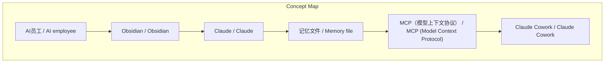
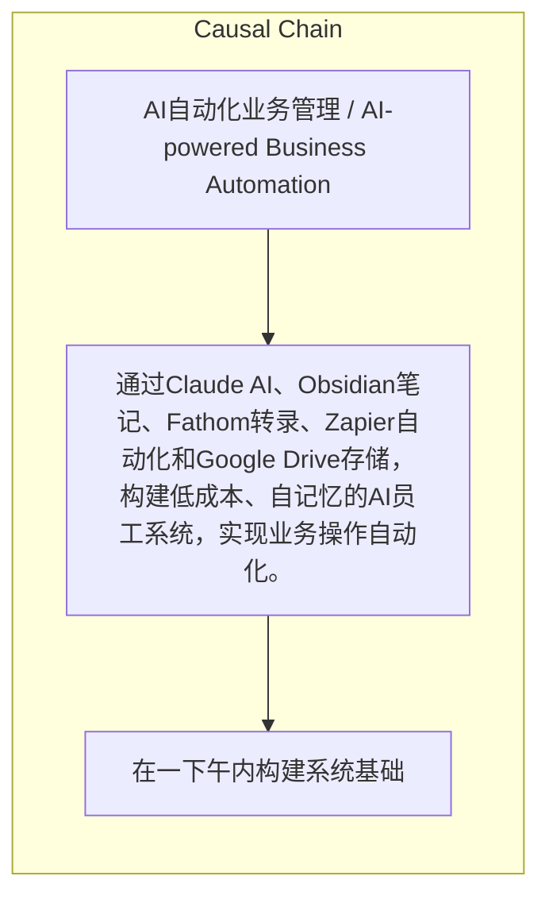

# NEWS/NEWS 任务报告

- agent: news/news
- requestId: 1774140701317-kzbjuw
- 生成时间(UTC): 2026-03-22T00:56:24.698Z

## 链接总结

- URL: https://x.com/sourfraser/status/2035454870204100810

# 基于Claude与Obsidian的AI员工系统构建方案

## 整体结构化文档表达
### 文档卡片
- 主题（中文/English）：AI自动化业务管理 / AI-powered Business Automation
- 一句话摘要：通过Claude AI、Obsidian笔记、Fathom转录、Zapier自动化和Google Drive存储，构建低成本、自记忆的AI员工系统，实现业务操作自动化。
- 目标读者：创始人、创业者、业务所有者及希望自动化工作流程者
- 核心结论（3条）：
- AI员工通过每日增长的vault实现自我onboarding，持续提升能力。
- 系统构建快速（约一下午），运行成本极低（主要工具免费）。
- AI员工能处理操作overhead、上下文切换和回忆会议内容，使人类专注于创造性工作。
- 该AI系统本质上是具有记忆和上下文感知的首席幕僚，而非简单聊天机器人。

### 内容结构树
1. 背景与问题定义
2. 核心观点与关键证据
3. 方法/机制/路径
4. 风险与边界条件
5. 结论与行动建议

### 结构化元数据（JSON）
```json
{
  "title": "基于Claude与Obsidian的AI员工系统构建方案",
  "topic_zh": "AI自动化业务管理",
  "topic_en": "AI-powered Business Automation",
  "audience": "创始人、创业者、业务所有者及希望自动化工作流程者",
  "claims": [
    "I gave AI a brain, and now it runs half my business.",
    "It took an afternoon to build. It costs almost nothing to run.",
    "It's the single biggest unlock I've found as a founder.",
    "Most people use AI like a temp worker with amnesia.",
    "That's not an AI employee. That's a search engine with a personality.",
    "An employee remembers what happened in the meeting. Even when you don't.",
    "That's not a chatbot. That's a chief of staff.",
    "系统使AI员工能够通过每日增长的vault实现自我onboarding，从而变得更聪明。"
  ],
  "evidence": [
    "There's a Memory file — think of it as an onboarding doc for an employee who never forgets.",
    "There's a Client Roster — every active client with their key details, health status, and who's responsible.",
    "There's an Action Tracker — every open task, who owns it, when it's due.",
    "There's a Library of frameworks — sales process, production workflow, org structure.",
    "There's a Templates folder — for call notes, follow-up emails, proposals, daily briefs.",
    "I use Fathom to record and transcribe my calls. Zapier watches my Fathom account and automatically drops every transcript into a folder in Google Drive.",
    "Claude Cowork has access to my Google Drive through MCP connectors.",
    "It reads the raw transcript. Extracts a summary of what was discussed. Pulls out every decision that was made. Identifies every action item — who owns it, what's the deadline. Then it writes all of that to the correct files in my Obsidian vault."
  ],
  "risks": [],
  "actions": [
    "在一下午内构建系统基础",
    "编写Memory文件，包含所有业务信息（脑暴）",
    "将通话转录自动化导入Google Drive",
    "通过MCP授权Claude访问必要工具",
    "设置Obsidian vault，包含Memory file、Home page和按跟踪内容（如客户、通话、行动、模板）组织的文件夹。",
    "将Obsidian vault创建在Google Drive文件夹中，以实现跨设备同步。"
  ]
}
```

## 处理流程
1. 输入识别
2. 信息抽取（实体、概念、问题、事实、观点）
3. 结构化归纳（定义/分类/比较/因果/方法论）
4. 关系建模（概念关系、等式/方程/逻辑链）
5. 可视化表达（Mermaid）

## 概念清单（中英文）
- AI员工 / AI employee
- Obsidian / Obsidian
- Claude / Claude
- 记忆文件 / Memory file
- MCP（模型上下文协议） / MCP (Model Context Protocol)
- Claude Cowork / Claude Cowork
- 知识图谱 / knowledge graph
- Fathom / Fathom
- Zapier / Zapier
- Google Drive / Google Drive
- MCP / MCP (Model Context Protocol)
- Custom Instructions / Custom Instructions

## 概念定义（中英文）
### AI员工 / AI employee
- 中文定义：具有记忆和上下文感知能力的AI系统，能执行业务任务
- English Definition: An AI system with memory and context awareness that can perform business tasks

### Obsidian / Obsidian
- 中文定义：免费笔记应用，存储为纯文本文件，用于构建业务操作系统
- English Definition: A free note-taking app that stores everything as plain text files, used to build a business operating system

### Claude / Claude
- 中文定义：由Anthropic开发的AI助手，通过MCP连接工具
- English Definition: An AI assistant developed by Anthropic that connects to tools via MCP

### 记忆文件 / Memory file
- 中文定义：包含个人和业务信息的onboarding文档，供AI参考
- English Definition: An onboarding document containing personal and business information for AI reference

### MCP（模型上下文协议） / MCP (Model Context Protocol)
- 中文定义：允许AI访问外部工具和数据的协议
- English Definition: A protocol that allows AI to access external tools and data

### Claude Cowork / Claude Cowork
- 中文定义：桌面应用，使Claude能访问本地工具
- English Definition: A desktop application that enables Claude to access local tools

### 知识图谱 / knowledge graph
- 中文定义：业务中所有相互链接的信息的图谱表示
- English Definition: A graph representation of all interlinked information in the business

### Fathom / Fathom
- 中文定义：用于记录和转录通话的工具
- English Definition: A tool for recording and transcribing calls

### Zapier / Zapier
- 中文定义：连接应用并自动触发动作的服务
- English Definition: A service that connects apps and automates triggers

### Google Drive / Google Drive
- 中文定义：云存储服务，用于存放转录文件
- English Definition: Cloud storage service used to store transcript files

### MCP / MCP (Model Context Protocol)
- 中文定义：一个开源服务器，允许Claude直接读写Obsidian vault。
- English Definition: An open-source server that gives Claude direct read and write access to the Obsidian vault.

### Custom Instructions / Custom Instructions
- 中文定义：Claude的设置字段，用于定义行为指令，如要求搜索vault。
- English Definition: A field in Claude where you write instructions, such as searching the vault before answering.


## 概念关联与逻辑关系（中英文）
- Obsidian/Obsidian -> 知识图谱/knowledge graph | concept | 存储为
- Claude Cowork/Claude Cowork -> MCP/MCP | concept | 使用
- MCP/MCP -> Google Drive/Google Drive | concept | 连接
- Fathom/Fathom -> Zapier/Zapier | concept | 提供转录数据
- Zapier/Zapier -> Google Drive/Google Drive | concept | 自动存储
- Obsidian MCP/Obsidian MCP -> Obsidian/Obsidian | concept | provides direct read and write access to
- Obsidian MCP/Obsidian MCP -> Claude/Claude | concept | enables integration with
- Custom Instructions/Custom Instructions -> Claude/Claude | concept | instructs to search the vault before responding
- Memory File/Memory File -> Claude/Claude | concept | provides initial context and routing rules to

### 可形式化关系
- Obsidian/Obsidian -> 知识图谱/knowledge graph: 存储为
- Claude Cowork/Claude Cowork -> MCP/MCP: 使用
- MCP/MCP -> Google Drive/Google Drive: 连接
- Fathom/Fathom -> Zapier/Zapier: 提供转录数据
- Zapier/Zapier -> Google Drive/Google Drive: 自动存储
- Obsidian MCP/Obsidian MCP -> Obsidian/Obsidian: provides direct read and write access to

## COT逻辑梳理（定义/分类/比较/因果/科学方法论）
- 未发现明确逻辑步骤

## 事实与看法（区分）
### 事实
- Obsidian is a free note-taking app that stores everything as plain text files on your computer.
- Fathom records and transcribes calls.
- Zapier watches my Fathom account and automatically drops every transcript into a folder in Google Drive.
- Claude Cowork runs on your desktop and connects to your actual tools through MCP.
- Obsidian is free.
- The MCP connectors are free.
- The only paid components are Claude and the transcription tool.
- The setup takes about an afternoon.
- The Memory file takes most of the setup time.

### 看法
- It's the single biggest unlock I've found as a founder.
- That's not a chatbot. That's a chief of staff.
- My 15 people are irreplaceable.
- The operational overhead, context switching, and recalling past agreements do not need to be handled by humans.
- The whole system becomes self-sustaining.

## FAQ（原文问题整理）
- 未发现明确 FAQ

## Visualization
### Mermaid 图 1（概念结构图）


### Mermaid 图 2（逻辑/因果图）


## 文章中的类比
- temp worker with amnesia
- search engine with a personality
- filing cabinet
- keys to your work environment

## 10个金句
- I gave AI a brain, and now it runs half my business.
- It took an afternoon to build. It costs almost nothing to run.
- It's the single biggest unlock I've found as a founder.
- Most people use AI like a temp worker with amnesia.
- That's not an AI employee. That's a search engine with a personality.
- An employee remembers what happened in the meeting. Even when you don't.
- That's not a chatbot. That's a chief of staff.
- Your AI employee onboards itself a little more every day.
- It's not getting smarter in the traditional sense. It's getting smarter because the knowledge base it reads keeps growing.
- The whole system becomes self-sustaining.

