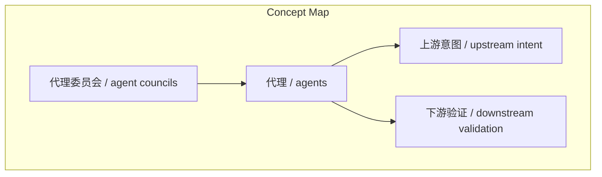
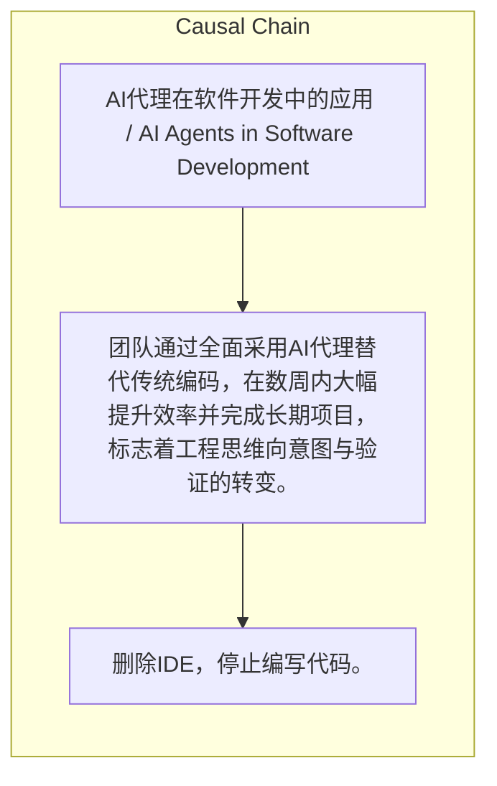

# NEWS/NEWS 任务报告

- agent: news/news
- requestId: 1774141437703-9v5t2p
- 生成时间(UTC): 2026-03-22T01:05:11.135Z

## 文本总结

# 代理驱动工程：用AI代理重塑开发流程

## 整体结构化文档表达
### 文档卡片
- 主题（中文/English）：AI代理在软件开发中的应用 / AI Agents in Software Development
- 一句话摘要：团队通过全面采用AI代理替代传统编码，在数周内大幅提升效率并完成长期项目，标志着工程思维向意图与验证的转变。
- 目标读者：工程团队与管理者
- 核心结论（3条）：
- 删除IDE并停止写代码，仅通过代理构建是可行的。
- 代理能快速构建工具、处理重复工作，加速项目交付。
- 工程的核心是意图与判断，代理已成为新的表达媒介。

### 内容结构树
1. 背景与问题定义
2. 核心观点与关键证据
3. 方法/机制/路径
4. 风险与边界条件
5. 结论与行动建议

### 结构化元数据（JSON）
```json
{
  "title": "代理驱动工程：用AI代理重塑开发流程",
  "topic_zh": "AI代理在软件开发中的应用",
  "topic_en": "AI Agents in Software Development",
  "audience": "工程团队与管理者",
  "claims": [
    "工程本质上是关于有意图和判断力的构建。",
    "代理已取代代码成为工程表达的新媒介。",
    "专注于上游意图和下游验证是最重要的事。"
  ],
  "evidence": [
    "在几周内构建了30个内部工具，提升工作效率10倍。",
    "创建了深度代理技能库，消除重复工作。",
    "形成“代理委员会”进行PR和应用性能审查。",
    "将多月份项目在约一天内完成。"
  ],
  "risks": [],
  "actions": [
    "删除IDE，停止编写代码。",
    "全面采用代理进行构建。",
    "建立代理技能库。",
    "组建代理委员会进行审查。"
  ]
}
```

## 处理流程
1. 输入识别
2. 信息抽取（实体、概念、问题、事实、观点）
3. 结构化归纳（定义/分类/比较/因果/方法论）
4. 关系建模（概念关系、等式/方程/逻辑链）
5. 可视化表达（Mermaid）

## 概念清单（中英文）
- 代理 / agents
- 上游意图 / upstream intent
- 下游验证 / downstream validation
- 代理委员会 / agent councils

## 概念定义（中英文）
### 代理 / agents
- 中文定义：用于自动化构建和任务执行的AI实体
- English Definition: AI entities for automated construction and task execution

### 上游意图 / upstream intent
- 中文定义：项目或任务构建前的初始目标和方向
- English Definition: Initial goals and direction before construction

### 下游验证 / downstream validation
- 中文定义：构建完成后对结果的测试和确认
- English Definition: Testing and confirmation of results after construction

### 代理委员会 / agent councils
- 中文定义：用于审查PR和应用性能的代理团队
- English Definition: Teams of agents for PR and app performance reviews


## 概念关联与逻辑关系（中英文）
- 代理/agents -> 上游意图/upstream intent | concept | 用于实现
- 代理/agents -> 下游验证/downstream validation | concept | 用于促进
- 代理委员会/agent councils -> 代理/agents | concept | 组成

### 可形式化关系
- agents替代code作为工程表达的新媒介
- agent技能库消除重复工作，提升效率
- agent councils执行PR和性能审查，确保质量

## COT逻辑梳理（定义/分类/比较/因果/科学方法论）
- Step 1: 决定思维转变，删除IDE并停止写代码，全面采用代理构建。
- Step 2: 实施代理基础设施，包括构建工具、创建技能库、成立代理委员会。
- Step 3: 通过代理快速交付项目，验证上游意图，实现下游验证。

## 事实与看法（区分）
### 事实
- 在几周内构建了30个内部工具。
- 创建了深度代理技能库。
- 形成了“代理委员会”。
- 多月份项目在约一天内完成。

### 看法
- 这是一种清晰的思维转变，专注于最重要的事。
- 工程始终是关于有意图和判断的构建。
- 现在代理是工程表达的新媒介。

## FAQ（原文问题整理）
- 未发现明确 FAQ

## Visualization
### Mermaid 图 1（概念结构图）


### Mermaid 图 2（逻辑/因果图）


## 文章中的类比
- 未发现明确类比

## 10个金句
- Delete your IDE
- Stop writing code
- Rip the bandaid off

